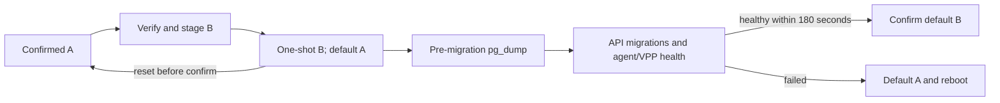

# A/B appliance image upgrades

`ngfw-upgrade` installs a signed image into the inactive writable ext4 root slot. It never copies PostgreSQL, logs or shared application state. A one-shot GRUB entry boots the new root; health confirmation changes the saved default. A reset before confirmation boots the previous root. This is appliance-only tooling, not a host installation script.

## CLI contract for F-backup-restore

The agent's existing reviewed privileged Action executor must use fixed argv. No new agent privilege, shell command, caller-controlled systemd instance or generic root execution endpoint is introduced here. The consumer must constrain the operation to this enum and uploaded bundles to direct regular files in `/data/updates/`.

| argv after `/usr/sbin/ngfw-upgrade` | Behavior |
| --- | --- |
| `status --json` | Return the JSON object below; does not change boot state |
| `stage /data/updates/ngfw-update-1.1.0.tar` | Verify signature, hashes, version compatibility and archive safety, then replace inactive root |
| `activate` | Set one-shot inactive boot; does not reboot |
| `confirm` | Make the currently running trial root default, after pre-migration backup |
| `rollback` | Set previous confirmed root default, clear one-shot; does not reboot |

Exit codes: `0` success; `1` verification, safety, state or execution refusal; `2` invalid argv. Failure diagnostics exclude subprocess stderr and secrets. `status` with or without `--json` emits one JSON object. Version strings are numeric `major.minor.patch`, without prerelease/build suffixes. Initial version is supplied during offline provisioning.

```json
{"format":1,"active_slot":"A","default_slot":"A","versions":{"A":"1.0.0","B":"1.1.0"},"pending_slot":null,"staged_slot":"B","confirmed":true,"next_entry":null,"migration_backup":null}
```

`active_slot` is derived from the actual mounted root device. `versions` records verified slot contents; an interrupted write leaves the inactive version null. `pending_slot` records the requested trial until confirm/rollback reconciles it. `next_entry` is the real GRUB environment value. `migration_backup` identifies the last pre-migration snapshot, not a promise that a database restore has run. The `/data` parent must be root-owned and not writable by group/other; the API writes only its separately owned updates/backups/support children. Shared `/data/ngfw` is root-owned and must already be bind-mounted on `/var/lib/ngfw`. This prevents an API writer from replacing root upgrade/shared state through a writable parent. State lives in root-owned mode-0700 `/data/ngfw-upgrade/` as mode-0600 `state.json`, with a process lock and atomic fsync/rename writes. `--root /offline/mount` exists for image tests; normal agent calls never supply it.

## Bundle format and signing

An uncompressed outer tar contains exactly three regular members: `manifest.json`, its raw 64-byte detached Ed25519 `manifest.sig`, and `rootfs.tar.zst`. The signature covers the exact manifest bytes. The manifest hashes every payload member; metadata cannot hash its own signature. Schema version 1:

```json
{"format":1,"version":"1.1.0","min_from_version":"1.0.0","migration_policy":"backward-compatible","sha256":{"rootfs.tar.zst":"<64 lowercase hexadecimal characters>"},"vpp_manifest_sha256":"<64 lowercase hexadecimal characters>"}
```

The embedded `usr/share/ngfw/vpp-manifest.json` must match the VPP digest. Upgrade versions must increase, and the current version must meet `min_from_version`. Only `backward-compatible` migrations are admitted: the release publisher must review the SQL and prove that the previous API binary can use the migrated schema. Destructive migrations need a separate explicitly reviewed recovery design; this format refuses their policy.

Verification uses a private snapshot, preventing a bundle replacement between verification and consumption. It bounds outer member sizes, zstd memory/output, tar member count and rootfs size. It rejects traversal, duplicate names, hard links, device nodes, escaping symlinks, files beneath symlinks, embedded persistent/runtime data and missing boot/upgrade assets before formatting the inactive root. Extraction drops setuid/setgid bits and does not restore file capabilities/xattrs; publish a root whose services work with the existing package privilege model. Runtime mountpoint directories are created separately.

Use a dedicated Ed25519 key outside the repository, for example `~/.config/ngfw/upgrade-signing/` with directory mode 0700 and private key mode 0600. Provision only the public key as root-owned `/etc/ngfw/upgrade-signing.pub`; neither bundles nor logs carry a private key. Root-owned metadata cannot be group/other writable.

Build from a sanitized offline P14 chroot with the product packages installed. Materialize `/boot/vmlinuz` and `/boot/initrd.img` as regular files containing the selected kernel and initramfs; materialize hard links before export. Install the verified VPP package manifest at `/usr/share/ngfw/vpp-manifest.json`.

```sh
deploy/upgrade/build-bundle --root /offline/chroot --version 1.1.0 \
  --min-from-version 1.0.0 --key /private/upgrade-signing/key.pem \
  --vpp-manifest /verified/vpp/manifest.json --output /release/ngfw-update-1.1.0.tar
```

The builder excludes shared state, runtime trees, machine identity, SSH host keys and per-device `/etc/ngfw` settings. Stage preserves `/etc/ngfw`, machine-id, hostname, crypttab (when present) and SSH host keys from the active root, then writes the new fstab and version marker. Update bundles are not a general air-gapped installation product (D-059).

## Offline boot provisioning

P14 supplies `ngfw-rootA` and `ngfw-rootB` (20 GiB each), shared EFI (1 GiB), log, PostgreSQL and data partitions. Existing P14 `/boot` is inside each root. An administrator must provision A/B support on an **offline mounted appliance image** using `deploy/upgrade/provision`; it always refuses `/`. It requires the P14 appliance marker, six distinct block devices, the correct mounted root/EFI/persistent devices, a vfat EFI filesystem, existing GRUB config and regular boot assets. Existing installations are not silently modified by a package postinst.

```sh
deploy/upgrade/provision --root /offline/rootA --version 1.0.0 \
  --key /private/upgrade-signing/public.pem \
  --kernel-args deploy/image/iso/common/kernel/cmdline \
  --root-a /dev/disk/by-partlabel/ngfw-rootA --root-b /dev/disk/by-partlabel/ngfw-rootB \
  --efi /dev/disk/by-partlabel/NGFW-EFI --log /dev/disk/by-partlabel/ngfw-log \
  --pg /dev/disk/by-partlabel/ngfw-pg --data /dev/disk/by-partlabel/ngfw-data
```

Use the corresponding already-open mapper devices for encrypted persistent filesystems. Roots must remain unencrypted ext4. The initramfs/crypttab must unlock shared volumes before services start; encrypted-volume VM acceptance remains required. The provisioner preserves P14 kernel arguments, initializes shared `/data/ngfw` from the initial `/var/lib/ngfw`, and adds its bind mount. Reboot the offline image before doing its first upgrade, so this shared bind mount is active.

The stable GRUB config and environment live on shared EFI under `EFI/ngfw/grub/`. Slot A's original `/boot/grub/grub.cfg` is preserved as `.pre-ab` and replaced by a trampoline locating EFI by UUID; every staged slot gets the same trampoline. The existing firmware-installed GRUB continues to load slot A's path and then the stable EFI config. Root slots are found by filesystem labels. Each trial uses `grub-reboot --boot-directory=<explicit image EFI/ngfw directory>`; every grub-editenv call names the explicit EFI environment file. GRUB clears and saves `next_entry` before loading the trial kernel. No firmware variable, grub-install or host update-grub command is invoked.

Do not run update-grub after provisioning without preserving the trampoline. Firmware/GRUB ability to save the shared FAT environment must be tested on the target VM/hardware before release. Offline provisioning is a maintenance operation: keep the original disk snapshot, and restore it if provisioning is interrupted.



## Health, migrations and recovery

`ngfw-upgrade-prepare.service` is required before firstboot and API startup. On the trial root it creates a mode-0600 PostgreSQL custom-format dump of database `ngfw` under `/data/ngfw-upgrade` before the existing API entrypoint runs migrations. Failure blocks API startup. Retries preserve the original snapshot. The health service waits up to 180 seconds; its Go probe uses the real agent Health RPC on `/run/ngfw/agent.sock` and verifies VPP connectivity, no degraded rollback and no active reconciliation. It also checks the local API's `GET /api/v1/health`. Success confirms the trial; failure restores the previous default and requests a reboot.

A reset before health confirmation falls back via consumed GRUB one-shot state. A software health timeout requests reboot. A kernel hang needs an independently configured hardware/firmware watchdog: no userspace service can reboot a hung kernel. Enable and test the platform watchdog under the platform's existing privilege policy; this package does not claim one exists.

Automatic root rollback relies on the migration's backward compatibility. It does **not** overwrite a live database from a dump. To recover a database explicitly, enter appliance maintenance mode, stop API/agent, preserve current data, inspect the recorded dump and restore with the administrator's PostgreSQL recovery procedure before restarting the previous version. Never use rollback to conceal a failed/destructive migration.

## Verification and remaining acceptance

`deploy/upgrade/tests/run.sh` covers valid, unsigned/tampered, version/policy/VPP provenance, archive safety, actual grubenv one-shot/confirm/rollback, and health-service decisions. `test/topology/ab-upgrade` invokes it and the Go gRPC/API health tests in unchanged quick CI. Hosted runner provisioning adds only grub2-common and zstd; missing tools are a hard failure.

With explicit `NGFW_INTEGRATION=1`, `deploy/upgrade/tests/loop_image.py` builds a sparse 96 GiB P14 GPT image, stages into B and verifies fstab/identity/manifest, slot-write refusal for invalid bundles, one-shot/confirm/failure rollback and host-unchanged evidence, then cleans every owned mount/device/image. It uses a tiny handmade root and ext4 EFI solely for non-firmware GRUB-file tests; it is not a real boot test.

Before GA, boot a disposable VMware clone of the provisioned P14 vfat-EFI image: confirm A, stage B, activate/reboot, observe backup preceding API migrations and confirm B; stage A with a deliberately failed probe and verify timed reboot/default B; power-reset during a trial and verify one-shot fallback; repeat upgrades in both directions, test persistence/SSH identity, encrypted shared-volume unlock, and hardware watchdog failure behavior where available. No VM boot, kernel watchdog or real production database acceptance is claimed by loop tests. Secure Boot, fleet rollout and the UI are outside this task.

The publisher must keep the private signing key outside the offline root. The
builder refuses both a key path within the root and any hardlink alias of that
key, before creating output. Operator `/root` and `/home` trees are omitted in
full, including SSH and GnuPG credentials; appliance releases must provision
operator accounts separately after installation.
