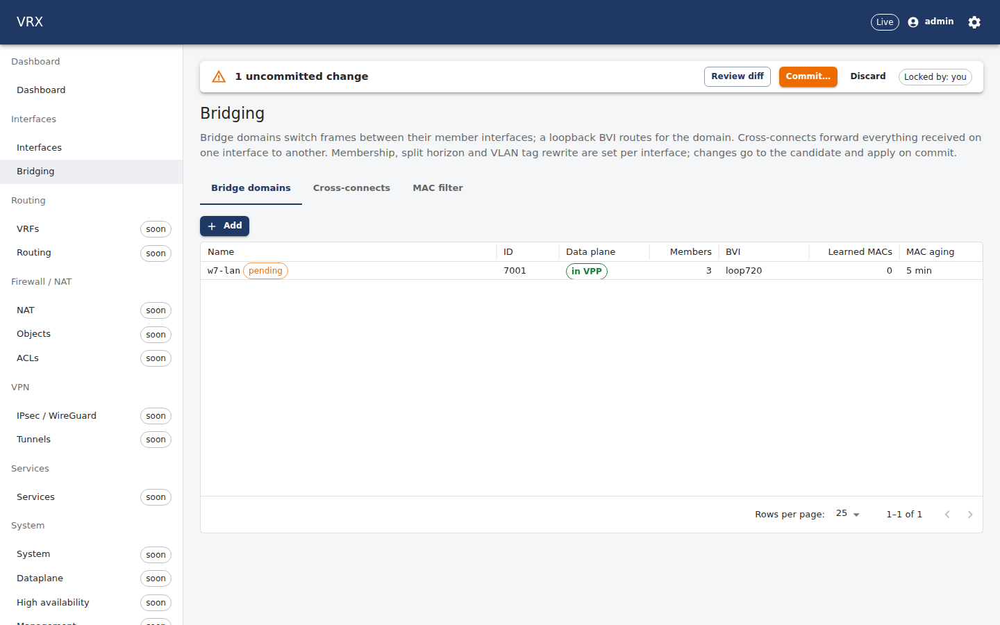
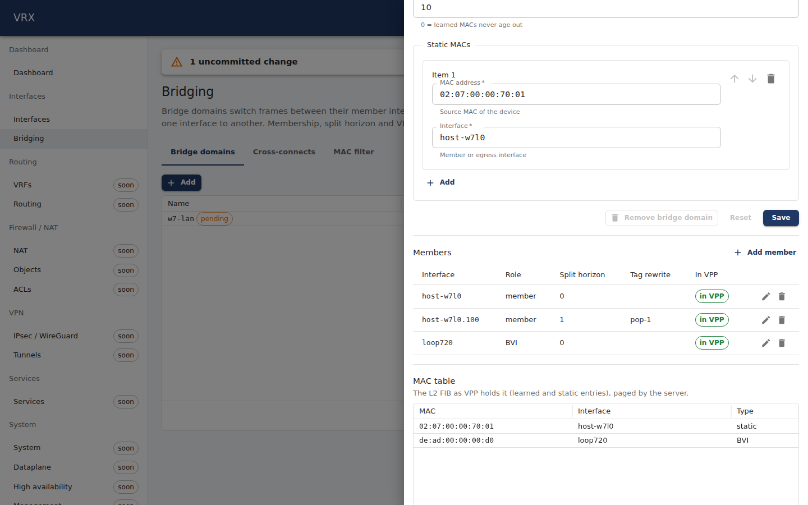

# F-bridge-l2 — bridge domains, L2XC/L3XC, split horizon, MAC aging, VLAN tag rewrite, time-range MAC filter

Branch `task/F-bridge-l2` (worktree `/root/ngfw-wt/F-bridge-l2`, slot 7, prefix `w7`), speculative base `task/W-seed`
(D-114/D-120; `task/W-seed` merged again at df67a8e for TD-5 + D-113 before any host run, manager's A1 note). Not merged
with main (P08 has not landed). Contract: `F-bridge-l2-contract.md`; questions: `F-bridge-l2-questions.md`.

## What was built

| layer | files | what |
|---|---|---|
| schema (contract) | `packages/schema/src/domains/ext/bridge-l2.ts`, `semantic/bridge-l2.ts` (+ test) | D-109 (c): per-port leaves `interfaces.<if>.l2` / `….subinterfaces.<id>.l2` (`bridgeDomain`, `shg`, `bvi`, `uuFwd`, `tagRewrite`, `macFilter`) and the container `routing.l2` (`bridgeDomains` by name with `id`, flags, `macAgeMin`, `staticMacs`; `xconnects` / `l3xc` by rx interface; `macFilters` by name). 12 semantic rules (`interfaces.bridge-l2-*`, `routing.bridge-l2-*`) |
| proto (contract) | `dataplane.proto` | `Interface.l2 = 14`, `Subinterface.l2 = 12`, `RoutingConfig.l2 = 20` (confirmed D-122), `BridgeL2*` messages, `rpc BridgeDomainState`, `rpc BridgeDomainMacs` (+ messages), proto.md §11 |
| agent — descriptors | `descriptors/mactime/**` (new), `descriptors/l2/bridge_domain.go` (+ model) | `mactime.range/<name>` (owner-prefixed VPP devices, delete+add updates, raw-stream dump) and `mactime.enable/<if>` (applied once per VPP boot, `feature_is_enabled` readback only with the record); DF-1 `l2.bridge-domain` keeps the record name in the tag `<owner>:<id>/<name>` (rename = recreate). No second l2/l3xc descriptor (D-104) |
| agent — projection | `desired/l2.go` (+ test), `subsystems/bridge_l2.go`, `agent/rpc_bridge_l2.go` (+ test), `coretest/bridge_l2.go` | builder + assembler onto DF-1's l2 / l3xc and the mactime descriptors (every reference `interface/<name>`, dependents before interfaces, D-095c); the two read-only RPCs (agent-side paging ≤ 1000); agent-level fake VPP model |
| API | `apps/api/src/features/bridge-l2/**`, `test/e2e/bridge-l2.e2e.test.ts` | `BridgeL2Controller`: `GET /api/v1/state/l2/bridge-domains` (live + running + pending), `GET /api/v1/state/l2/bridge-domains/{id}/macs?page&pageSize` (server-side paged; 404 for a foreign id, 400 for pageSize > 1000); fake RPCs in `fake.ts`; config through the generic pointer routes |
| web | `apps/web/src/domains/interfaces/bridge-l2/**`, `locales/{en,fa}/bridge-l2.json` | **Bridging** page (Interfaces nav group, `/interfaces/bridging`): bridge-domain list (ServerDataGrid, live status, pending mark), drawer with the schema form, member table (role, split horizon, tag rewrite, in-VPP status; add/edit/remove), paged MAC table (ServerDataGrid); cross-connect list (L2 + L3, schema-form dialogs); MAC-filter devices; en + fa |
| docs | `docs/user/interfaces/bridge-l2.md`, `docs/agent/descriptors/mactime.md`, `l2.md` (tag name), basics.md see-also, `vpp-code-track.md` V-new | user guide with examples + CLI; descriptor tables; VPP gaps of the mactime plugin |
| tests on the host | `test/topology/bridge-l2/**` (own Go module), `descriptors/mactime/integration_test.go` | the ONE host check through the real API + agent + VPP; screenshot run |

## Shared hunks (append-only, under the `wave-A: F-bridge-l2` anchors unless stated)

| id | file | hunk |
|---|---|---|
| A1 | `apps/agent/internal/subsystems/subsystems.go` | `Domains[Interfaces]`: 9 names (`bridgeL2Domain` … `bridgeL2MacEnable`, consts in `subsystems/bridge_l2.go`); `Register()`: `w.registerBridgeL2(r)` |
| A2 | `apps/agent/internal/agent/projection.go` | `project()`: `if in["interfaces"] { desired.BridgeL2(p, ds, vrfID) }`; `assemble()` (after `desired.Assemble`): `if in["interfaces"] { desired.AssembleBridgeL2(ds, kvs, stored, nameOf) }` |
| A6 | `apps/agent/internal/descriptors/core/coretest/fakevpp.go` | **outside the anchors (Q9):** one line in `New()` after `v.installIfExt()`: `v.installBridgeL2()` — the handlers are in the owned `coretest/bridge_l2.go`; without it every agent unit test fails once l2/l3xc/mactime are registered |
| A7 | `docs/vpp-code-track.md` | appended `### V-new (F-bridge-l2)` (mactime: dump reply pattern, stacking enable, clock only at start-up, unbounded learned devices) |
| C1 | `packages/schema/src/domains/interfaces.ts` | `l2: subinterfaceL2Field` / `l2: interfaceL2Field` under the two anchors; **plus one import line** after the last import (no import anchor exists, Q3), marked `// wave-A: F-bridge-l2` |
| C1 | `packages/schema/src/domains/routing.ts` | **self-seeded anchor (D-122: keep, list it)** `// wave-A: F-bridge-l2` + `l2: routingL2Field` inserted above F-neighbors-ra's anchor in `RoutingSchema`; one import line, marked |
| C2 | `packages/schema/src/semantic/index.ts` | `import { bridgeL2Validators } …`; `...bridgeL2Validators,` |
| C3 | `packages/schema/src/index.ts` | `export * from './domains/ext/bridge-l2.js';` |
| C5 | `packages/proto/vrx/v1/dataplane.proto` | service: the two RPCs; `Interface` 14; `Subinterface` 12; **self-seeded anchor** in `RoutingConfig` (above F-neighbors-ra's) + `BridgeL2Config l2 = 20`; messages in `// ----- F-bridge-l2 -----` |
| C6 | `docs/contracts/proto.md` | `### F-bridge-l2: BridgeDomainState, BridgeDomainMacs (…)` |
| C7 | generated | `apps/agent/gen/**`, `packages/proto/gen/ts/**`, `packages/api-client/src/generated/schema.d.ts`, `apps/cli/internal/api/operations_gen.go` — `pnpm gen && make -C apps/cli gen docs` (never hand-edited) |
| P1 | `apps/api/src/app.module.ts` | import `bridgeL2Feature`; `...bridgeL2Feature.controllers,`; `...bridgeL2Feature.providers,` |
| P4 | `apps/api/src/agent/agent.client.ts` | 3 type imports; `bridgeDomainState()`, `bridgeDomainMacs()` |
| P5 | `apps/api/src/testing/fake-agent.ts` | two `UNIMPLEMENTED` stub handlers (the working fake is installed by the e2e test from `features/bridge-l2/fake.ts`) |
| W1 | `apps/web/src/router.tsx` | lazy route `interfaces/bridging` |
| W2 | `apps/web/src/nav/nav.ts`, `nav.test.ts` | `groups.get('interfaces')!.push({ id: 'bridging', …, labelKey: 'bridge-l2:nav.bridging' })`; `'bridging'` in the expected list |
| W3 | `apps/web/src/i18n.ts` | 2 imports, `'bridge-l2'` in `NAMESPACES`, `en` and `fa` entries |
| D1 | `docs/user/interfaces/basics.md` | one see-also line at the end ("Not in this release" untouched) |
| — | `apps/web/src/domains/interfaces/model.ts` | **allowed by the prompt only if the drawer breaks — it did (Q10):** import `drawerSafeL2` + `interfaceItemSchema()` returns `drawerSafeL2(…)`, both marked; `l2` becomes an opaque JSON field in P08's drawer (excluding it would make the drawer's merge patch delete memberships) |

## Verification (pasted output)

### Host check — `test/topology/bridge-l2/run.sh -run TestBridgeL2OnHost` (slot 7, real API + agent + VPP 26.06; path: af_packet rig, no packets)

```
=== RUN   TestBridgeL2OnHost
    bridge_l2_test.go:102: systemctl show vpp -p NRestarts (before) = 1
    bridge_l2_test.go:121: rig VPP side handed to the agent: af_packet_delete host_if_name=w7l0 (sw_if_index 1, tag "") → ok
    bridge_l2_test.go:121: rig VPP side handed to the agent: af_packet_delete host_if_name=w7w0 (sw_if_index 2, tag "") → ok
    bridge_l2_test.go:131: commit rev1 (L3 only) → applied revision 1
=== RUN   TestBridgeL2OnHost/validation
    bridge_l2_test.go:138: commit of host-w7l0 as bridge member AND cross-connect rx → 400 content-type problem+json; body {"type":"https://vrx.dev/problems/validation","title":"Validation failed","status":400,"tier":"semantic","warnings":[],"detail":"semantic validation failed","instance":"/api/v1/config/commit","errors":[{"pointer":"/routing/l2/xconnects/host-w7l0","message":"host-w7l0 is already a member of bridge domain 'w7-lan' (/interfaces/host-w7l0/l2/bridgeDomain); an interface is in at most one bridge domain or cross-connect"}]}
=== RUN   TestBridgeL2OnHost/apply
    bridge_l2_test.go:157: commit rev2 (L2) → applied revision 2, 12 results
    bridge_l2_test.go:158: vppctl show bridge-domain 7001 detail:
          BD-ID   Index   BSN  Age(min)  Learning  U-Forwrd   UU-Flood   Flooding  ARP-Term  arp-ufwd Learn-co Learn-li   BVI-Intf
          7001      1      0      5         on        on       flood        on       off       off        0    16777216   loop720
          …
                   Interface           If-idx ISN  SHG  BVI  TxFlood        VLAN-Tag-Rewrite
                    loop720              4     1    0    *      *                 none
                   host-w7l0             5     1    0    -      *                 none
                 host-w7l0.100           7     1    1    -      *                 pop-1
          BD-Tag: w7:7001/w7-lan
    bridge_l2_test.go:158: vppctl show l2fib bd_id 7001:
            Mac-Address     BD-Idx If-Idx BSN-ISN Age(min) static filter bvi         Interface-Name
         02:07:00:00:70:01    1      5      0/0      no      *      -     -             host-w7l0
         de:ad:00:00:00:d0    1      4      0/0      no      *      -     *              loop720
    bridge_l2_test.go:158: vppctl show mode:
        l2 bridge host-w7l0 bd_id 7001 shg 0
        l2 bridge host-w7l0.100 bd_id 7001 shg 1
        l2 xconnect host-w7w0 host-w7w0.200
        l2 xconnect host-w7w0.200 host-w7w0
        l2 bridge loop720 bd_id 7001 bvi shg 0
    bridge_l2_test.go:158: vppctl show l2patch (l2patch is VPP's other cross-connect feature; the L2 xconnects show in `show mode`):
        no l2patch entries
    bridge_l2_test.go:158: vppctl show l3xc:
        l3xc:[0]: loop721
            path-list:[59] locks:1 flags:shared,no-uRPF, uRPF-list: None
              path:[65] pl-index:59 ip4 weight=1 pref=0 attached-nexthop:  oper-flags:resolved,
                10.7.21.254 loop721
    bridge_l2_test.go:158: vppctl show mactime:
        Device Name              Addresses         Status   AllowPkt   AllowByte       DropPkt
        w7:w7-kids       02:07:00:00:99:01   dynamic drop          0      0.000B             0
    bridge_l2_test.go:158: vppctl show interface features host-w7l0 (device-input):
        device-input:
          mactime
    bridge_l2_test.go:158: GET /state/l2/bridge-domains/7001/macs → {"page":1,"pageSize":10,"total":2,"items":[{"mac":"02:07:00:00:70:01","interface":"host-w7l0","swIfIndex":5,"static":true,"filter":false,"bvi":false},{"mac":"de:ad:00:00:00:d0","interface":"loop720","swIfIndex":4,"static":true,"filter":false,"bvi":true}]}
    bridge_l2_test.go:158: Retrieve routing.l2 = {"bridgeDomains":{"w7-lan":{"arpTerm":false,"flood":true,"forward":true,"id":7001,"learn":true,"macAgeMin":5,"staticMacs":[{"interface":"host-w7l0","mac":"02:07:00:00:70:01"}],"uuFlood":true}},"l3xc":{"loop721":{"ipv4Paths":[{"interface":"loop721","nextHop":"10.7.21.254","preference":0,"vrf":"default","weight":1}]}},"macFilters":{"w7-kids":{"action":"allow","mac":"02:0…
    bridge_l2_test.go:158: Retrieve interfaces host-w7l0 l2 = {"bridgeDomain":"w7-lan","bvi":false,"macFilter":true,"shg":0,"uuFwd":false}
    bridge_l2_test.go:158: Retrieve interfaces host-w7l0.100 l2 = {"bridgeDomain":"w7-lan","bvi":false,"macFilter":false,"shg":1,"tagRewrite":{"dot1ad":false,"op":"pop-1"},"uuFwd":false}
    bridge_l2_test.go:158: Retrieve interfaces host-w7w0.200 l2 = {"bvi":false,"macFilter":false,"shg":0,"tagRewrite":{"dot1ad":false,"op":"translate-1-1","tag1":300},"uuFwd":false}
    bridge_l2_test.go:158: Retrieve interfaces loop720 l2 = {"bridgeDomain":"w7-lan","bvi":true,"macFilter":false,"shg":0,"uuFwd":false}
    bridge_l2_test.go:158: Retrieve == desired for routing.l2 and the l2 leaves of host-w7l0, host-w7l0.100, host-w7w0.200, loop720
=== RUN   TestBridgeL2OnHost/restart-safety
    stack_test.go:200: stopped vrx-agent pid 2511814
    bridge_l2_test.go:170: simulated loss: mactime_enable_disable enable_disable=false host-w7l0 → ok
    bridge_l2_test.go:170: simulated loss: mactime_add_del_range is_add=false w7:w7-kids → ok
    bridge_l2_test.go:170: simulated loss: l2_interface_vlan_tag_rewrite vtr_op=0 host-w7l0.100 → ok
    bridge_l2_test.go:170: simulated loss: l2_interface_vlan_tag_rewrite vtr_op=0 host-w7w0.200 → ok
    bridge_l2_test.go:170: simulated loss: sw_interface_set_l2_bridge enable=false loop720 (bd 7001) → ok
    bridge_l2_test.go:170: simulated loss: sw_interface_set_l2_bridge enable=false host-w7l0 (bd 7001) → ok
    bridge_l2_test.go:170: simulated loss: sw_interface_set_l2_bridge enable=false host-w7l0.100 (bd 7001) → ok
    bridge_l2_test.go:170: simulated loss: sw_interface_set_l2_xconnect enable=false host-w7w0 → ok
    bridge_l2_test.go:170: simulated loss: sw_interface_set_l2_xconnect enable=false host-w7w0.200 → ok
    bridge_l2_test.go:170: simulated loss: l3xc_del loop721 → ok
    bridge_l2_test.go:170: simulated loss: bridge_domain_add_del_v2 is_add=false bd_id=7001 → ok
    bridge_l2_test.go:175: vppctl show bridge-domain (after the loss):
        no bridge-domains in use
    bridge_l2_test.go:193: agent log: {"time":"2026-09-24T19:20:49.830026676+03:30","level":"INFO","msg":"vrx-agent starting","version":"dev","pid":2513200,"owner":"w7",…}
    bridge_l2_test.go:198: agent log: {"time":"2026-09-24T19:20:49.85863515+03:30","level":"INFO","msg":"reconcile start","owner":"w7","txn_id":"","mode":"resync","domains":["interfaces","vrfs","routing"]}
    bridge_l2_test.go:198: agent log: {"time":"2026-09-24T19:20:49.929951105+03:30","level":"INFO","msg":"reconcile done","owner":"w7","txn_id":"","mode":"resync","domains":["interfaces","vrfs","routing"],"status":"APPLY_STATUS_APPLIED","summary":"created:12  unchanged:20","reapplied":0,"duration":71314659,"err":""}
    bridge_l2_test.go:196: agent log: {"time":"2026-09-24T19:20:49.92998916+03:30","level":"INFO","msg":"resync finished","owner":"w7","status":"APPLY_STATUS_APPLIED","summary":"created:12  unchanged:20"}
    bridge_l2_test.go:201: agent started at +0s; bridge domain, 3 members, cross-connects, l3xc and MAC filter back at +0.20s (no config API call)
    bridge_l2_test.go:206: reconcile after simulated loss: 2026-09-24T19:20:49.830026676+03:30 → 2026-09-24T19:20:49.92998916+03:30 = 0.100s (agent log timestamps)
    bridge_l2_test.go:208: Retrieve == desired for routing.l2 and the l2 leaves of host-w7l0, host-w7l0.100, host-w7w0.200, loop720
=== RUN   TestBridgeL2OnHost/rollback
    bridge_l2_test.go:217: POST /config/rollback/1 → status applied
    bridge_l2_test.go:242: vppctl show mode (after rollback):
        l3 host-w7l0
        l3 host-w7l0.100
        l3 host-w7w0
        l3 host-w7w0.200
        l3 loop720
    bridge_l2_test.go:243: vppctl show bridge-domain (after rollback):
        no bridge-domains in use
    bridge_l2_test.go:245: GET /state/l2/bridge-domains (after rollback) → {"retrievedAt":"2026-09-24T15:50:50.697Z","items":[]}
    bridge_l2_test.go:254: Retrieve routing.l2 = null
=== RUN   TestBridgeL2OnHost/cleanup-through-api
    bridge_l2_test.go:269: commit (interfaces deleted) → applied
    stack_test.go:507: pg-test drop w7: <nil>
        ok     nothing named vrx_w7 / vrx_w7 remains
    bridge_l2_test.go:105: systemctl show vpp -p NRestarts (after) = 1
--- PASS: TestBridgeL2OnHost (16.49s)
    --- PASS: TestBridgeL2OnHost/validation (0.22s)
    --- PASS: TestBridgeL2OnHost/apply (0.87s)
    --- PASS: TestBridgeL2OnHost/restart-safety (2.59s)
    --- PASS: TestBridgeL2OnHost/rollback (0.55s)
    --- PASS: TestBridgeL2OnHost/cleanup-through-api (0.49s)
PASS
ok  	ngfw/test/topology/bridge-l2	16.533s
```

Notes: `GET /state/drift` answered `"changes":[]` after apply, after the restart and after the rollback, but it ignores the
whole `/routing` domain (`agent.unsupported-field`: routing protocols are unimplemented), so the test also calls the agent's
Retrieve directly over its socket and compares `routing.l2` and every `l2` leaf with the running configuration (lines
"Retrieve == desired"). The rollback check also asserts (binapi dumps): no w7 bridge domain, no cross-connect on the rig
interfaces, no l3xc on loop721, no w7 mactime device, the mactime feature off on host-w7l0, vtr_op 0 on both
sub-interfaces. `show mactime` "dynamic drop" is the current status in VPP's mactime clock (UTC−5 default: outside the
16:00–20:00 allow window at that moment).

### Host check of the new descriptor — `VRX_INTEGRATION=1 go test -run TestMactimeOnHost ./internal/descriptors/mactime/`
```
    integration_test.go:53: feature_is_enabled(device-input, mactime, 1=loop730) on a fresh loopback = false
    integration_test.go:69: mactime.range/it-dev: Retrieve == desired
    integration_test.go:74: mactime.range/it-dev: Retrieve == desired        (after Update: delete + add, no appended ranges)
    integration_test.go:75: vppctl show mactime:
        w7:it-dev        02:07:00:00:99:01  dynamic allow          0      0.000B             0
    integration_test.go:88: mactime.enable/loop730: Retrieve == desired       (Create twice: the feature listed once)
    integration_test.go:109: vppctl show mactime (after delete): (header only)
--- PASS: TestMactimeOnHost (0.35s)
```

### API e2e (slot DB `vrx_w7`, fake agent) — `apps/api/test/e2e/bridge-l2.e2e.test.ts`
```
 ✓ test/e2e/bridge-l2.e2e.test.ts (5 tests) 43408ms
   an agent without the RPCs answers 501
   a second membership of one interface is a 400 problem+json with its pointer   (/routing/l2/xconnects/host-w7l0)
   commits a bridge domain and serves its live state merged with running and candidate
   pages the MAC table server-side and validates the page parameters             (404 foreign id, 400 pageSize 1001, 401 no token)
   rollback returns the members to L3 and removes the bridge domain
 Test Files  1 passed (1)
      Tests  5 passed (5)
```

### Unit tests
```
packages/schema   vitest: Test Files 38 passed (38) · Tests 1233 passed (1233)   (bridge-l2.test.ts: 19)
packages/proto    vitest: 2 files, 70 passed (fixture bridge-l2-full.json round-trips)
apps/agent        go test ./... → EXIT 0; contracttest drift guard: "919 scalar leaves and 203 messages compared, 4 accepted difference(s), 0 finding(s)"
  internal/agent        TestBridgeL2OnFake (apply → pointers, Retrieve == desired, idempotent re-apply, re-apply of the
                        retrieved doc = no-op, BridgeDomainState/Macs, restart simulation, rollback), TestBridgeL2Validation
  internal/descriptors/mactime  TestDevice, TestEnableAppliedOnce (fake models VPP's appending add, stacking enable, readback quirk)
  internal/descriptors/l2       TestBridgeDomainName + DF-1's suite unchanged
  internal/desired              TestMacFilterRoundTrip, TestTagRewriteMapping
apps/web          vitest: domains/interfaces 16 passed (P08's 7 incl. the drawer, BridgingPage 4, model 5), locales 12, nav 5, App 8
```

### UI — screenshots against the real endpoint (`TestBridgeL2Screenshots`)
Production build under `vite preview` on the slot web port, real API + agent + VPP. Playwright is not installed: a node
script with playwright-core from the npx cache and Chrome-for-Testing headless shell from the session scratch drives the
browser (P07a/P07b/P08 approach; nothing installed, the script is not committed).
```
    shots_test.go: screenshots:
        bridging-list-en.png  html dir/lang=ltr/en  h2="Bridging"  pageErrors=0
        bridging-drawer-en.png  html dir/lang=ltr/en  h2="Bridging"  pageErrors=0
        bridging-members-macs-en.png  html dir/lang=ltr/en  h2="Bridging"  pageErrors=0
        bridging-xconnects-en.png  html dir/lang=ltr/en  h2="Bridging"  pageErrors=0
        bridging-macfilter-en.png  html dir/lang=ltr/en  h2="Bridging"  pageErrors=0
        interfaces-drawer-l2-en.png  html dir/lang=ltr/en  h2="Interfaces"  pageErrors=0
        bridging-list-fa-dark-rtl.png  html dir/lang=rtl/fa  h2="پل‌زنی"  pageErrors=0
        bridging-drawer-fa-dark-rtl.png  html dir/lang=rtl/fa  h2="پل‌زنی"  pageErrors=0
        bridging-members-macs-fa-dark-rtl.png  html dir/lang=rtl/fa  h2="پل‌زنی"  pageErrors=0
        bridging-xconnects-fa-dark-rtl.png  html dir/lang=rtl/fa  h2="پل‌زنی"  pageErrors=0
        bridging-macfilter-fa-dark-rtl.png  html dir/lang=rtl/fa  h2="پل‌زنی"  pageErrors=0
--- PASS: TestBridgeL2Screenshots (52.39s)
```
Files: `docs/status/tasks/F-bridge-l2-screens/*.png` (list with live "in VPP" status and a pending mark; drawer with the
schema form; members incl. `pop-1` and split horizon 1, the paged MAC table with the static and the BVI entry; cross-connects;
MAC filter; the same in Persian RTL dark; P08's interface drawer with `l2` as an opaque field).




### CI — `TMPDIR=/tmp/g-w7 tools/ci.sh --base main`
Run at `93f7934` with this tree's `tools/ci.sh` plus main's D-127 fix only (a scratch copy; the contract-guard pipe
`git log | grep -q` under `pipefail` lost to SIGPIPE on every one of 5 runs here — this branch carries 75 commits since main;
`tools/ci.sh` itself is not mine to edit, Q11). The one-hunk difference:
```
330c330,332
<     if git log --format=%s "$mb..$TIP" | grep -qiE '^contract(\(|:|!)'; then
---
>     # D-127 (main 7edac8c): capture first, `git log | grep -q` loses to SIGPIPE under pipefail
>     local subjects; subjects=$(git log --format=%s "$mb..$TIP")
>     if grep -qiE '^contract(\(|:|!)' <<<"$subjects"; then
```
```
== VRX CI gate: quick ==
branch    task/F-bridge-l2 @ 93f7934   (base: main)
== contract guard: HEAD vs main ==
ok — contract commit(s) on the branch:
  0ae1a9c contract(api-client): regenerate for GET /state/l2/bridge-domains and /state/l2/bridge-domains/{id}/macs (pnpm gen; make -C apps/cli gen docs)
  401c0da contract(proto): F-bridge-l2 — Interface.l2 14, Subinterface.l2 12, RoutingConfig.l2 20 (BridgeL2* messages), BridgeDomainState/BridgeDomainMacs RPCs, fake-agent UNIMPLEMENTED stubs, proto.md §11
  72eb38b contract(schema): l2 — per-port interfaces.<if>.l2 leaves + routing.l2 container (bridge domains, xconnects, l3xc, MAC filter) and bridge-l2 semantic rules (D-109 c)
  … (P08 / W-seed contract commits of the speculative base)
WARN commit subject(s) not in Conventional Commits form (type(scope): subject):
      review(W-seed): verify          (W-seed's commit, not F-bridge-l2's)
== generate + generated-output gate ==
clean: packages/proto/gen apps/agent/gen packages/schema/dist packages/api-client/src/generated
== forbidden patterns (+ gitleaks) ==
ok: no shell/VPP/FFI access in apps/api/src apps/web/src packages/*/src
ok: no Dockerfile/compose files
ok: no kill-by-pattern in scripts
ok: no secret-shaped strings
ok: gitleaks — scanned ~1187652 bytes (1.19 MB) in 1.42s no leaks found
== lint · typecheck · unit tests · build (turbo) ==
Tasks:    30 successful, 30 total Cached:    24 cached, 30 total Time:    1m45.699s
== apps/agent: make lint test build ==
ok  	ngfw/agent/internal/agent	10.596s; ok  	ngfw/agent/internal/contracttest	2.467s; … (all packages ok)
== apps/cli: make lint test build ==
ok  	ngfw/cli/internal/api	1.579s; … (all ok)
== test/ Go modules, unit mode (test/integration/smoke test/topology/bridge-l2 test/topology/interfaces) ==
test/topology/bridge-l2: gofmt ok · go vet ok · ok  	ngfw/test/topology/bridge-l2	0.083s;
  mode quick · wall time 5m43s · logs /root/ngfw-wt/logs/ci/F-bridge-l2-20260924-194319-2889498
CI GATE PASSED
```
The first gate run (before `93f7934`) failed in `apps/agent: make lint` (ineffassign + staticcheck S1016 in two test
files); fixed in `93f7934`.

## Acceptance
- [x] `vppctl show bridge-domain 7001 detail` shows members, shg 1, BVI loop720 and mac-age 5 as committed; Retrieve == desired (pasted)
- [x] Agent-restart simulation → BD, members, xconnects, l3xc, tag rewrites and MAC filter back in 0.20 s; reconcile 0.100 s (agent log)
- [x] Rollback returns the members to L3 (`show mode`: l3) and deletes the BD (Retrieve `routing.l2` = null, dumps empty)
- [x] Second membership → 400 problem+json with the pointer `/routing/l2/xconnects/host-w7l0` (host run + e2e). "Two bridge
      domains" cannot be expressed with D-109 (c)'s single-valued leaf — Q2
- [x] UI screenshot against the real endpoint (above)
- [x] `tools/ci.sh --base main` green at `93f7934` (with main's D-127 guard fix, see the CI section)

## Decisions taken (options in the questions file)
- Container `routing.l2` (a/b/c: routing / services / dataplane) — D-122 confirmed `RoutingConfig.l2 = 20` (Q1)
- BD record name stored in the bd_tag `<owner>:<id>/<name>` vs keeping names only in the agent's stored state (Q7)
- mactime enable: `feature_is_enabled` readback gated by the D-076/D-080 record, instead of a pure write-only object
  (the readback exists in 26.06 but is unreliable alone — V23 a)
- MAC-filter UI shipped (Q5); sub-interfaces stay exact-match (Q6); `l2` opaque in P08's drawer (Q10)

## Out of scope (not built)
Loopback creation / BVI UX on the loopback screen, SPAN, VLAN sub-interface creation / QinQ UI, bonding, ARP termination
tables, VXLAN/GRE-L2 as members beyond referencing any interface, EVPN, per-member L2 feature flags (`l2.flags` has no leaf),
mactime quotas and time zone, packet-level tests (none listed for this task), a CLI `show` command for bridge state.

## Cleanup
Every process started by the tests was stopped by PID (agent, API, vite preview); lab lock held only during runs; the rig
(`tools/lab rig down w7`) removed; `vrx_w7` dropped by `pg-test.sh drop`; `dist/` and `apps/agent/bin` removed. Dump after the runs:
```
$ vppctl show bridge-domain
no bridge-domains in use
$ vppctl show mode | grep -i w7
(none)
$ vppctl show l3xc
$ vppctl show mactime
Device Name              Addresses         Status   AllowPkt   AllowByte       DropPkt
$ vppctl show interface | grep -E 'w7|loop7'
(none)
$ ip netns | grep w7; ip link | grep w7
(none)
$ psql … "select datname from pg_database where datname='vrx_w7'"
(empty = dropped)
NRestarts=1   (1 since the 18:41 crash of another slot — Q8; unchanged by every F-bridge-l2 run)
```
