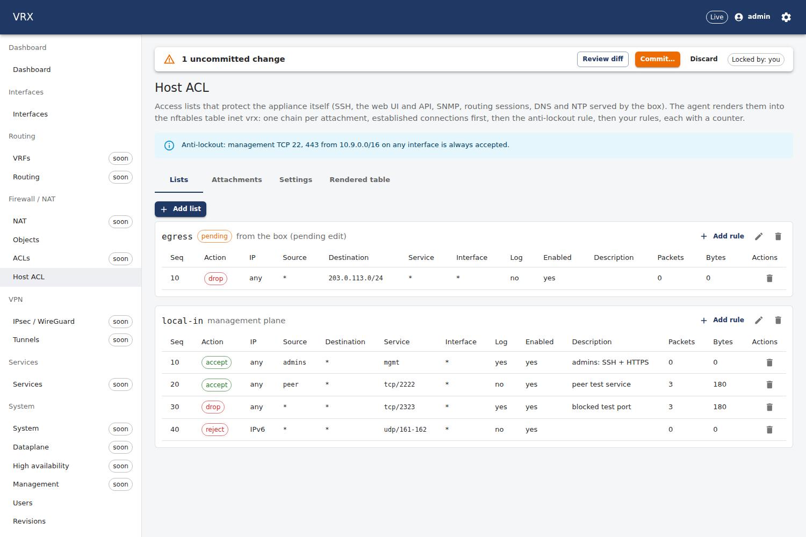
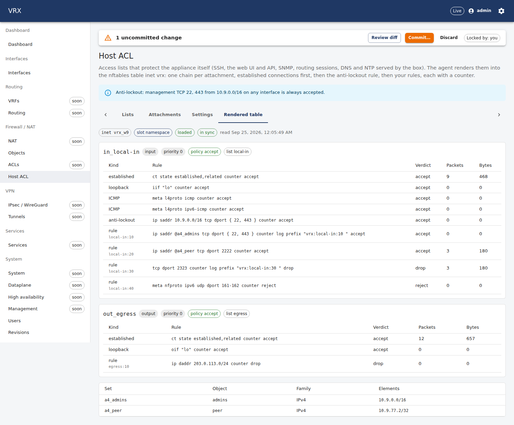
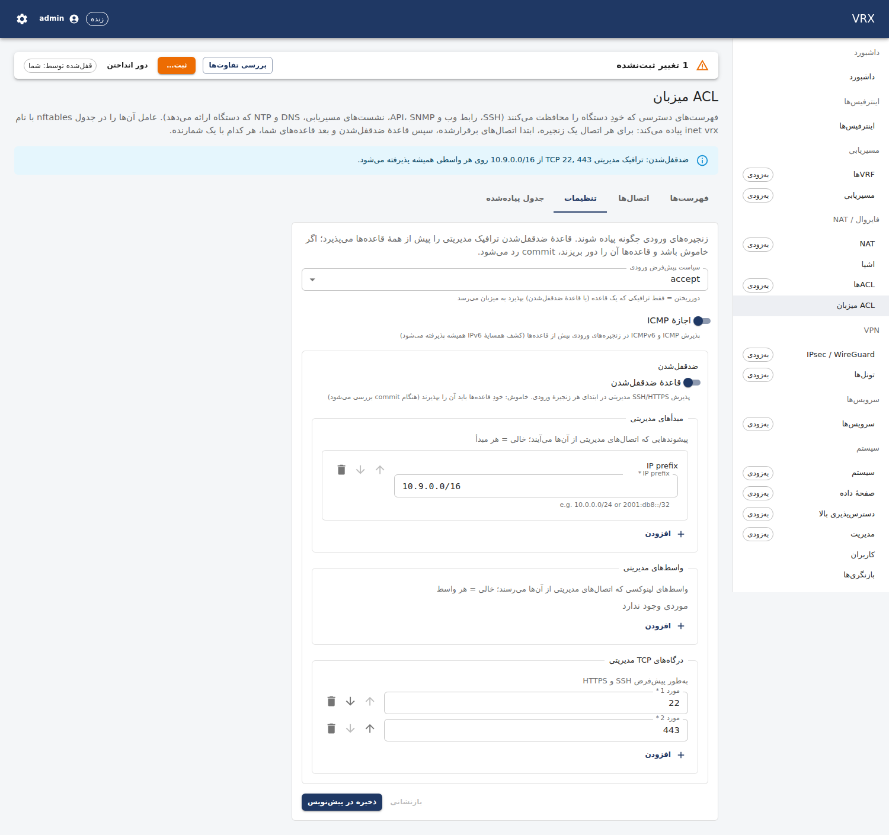
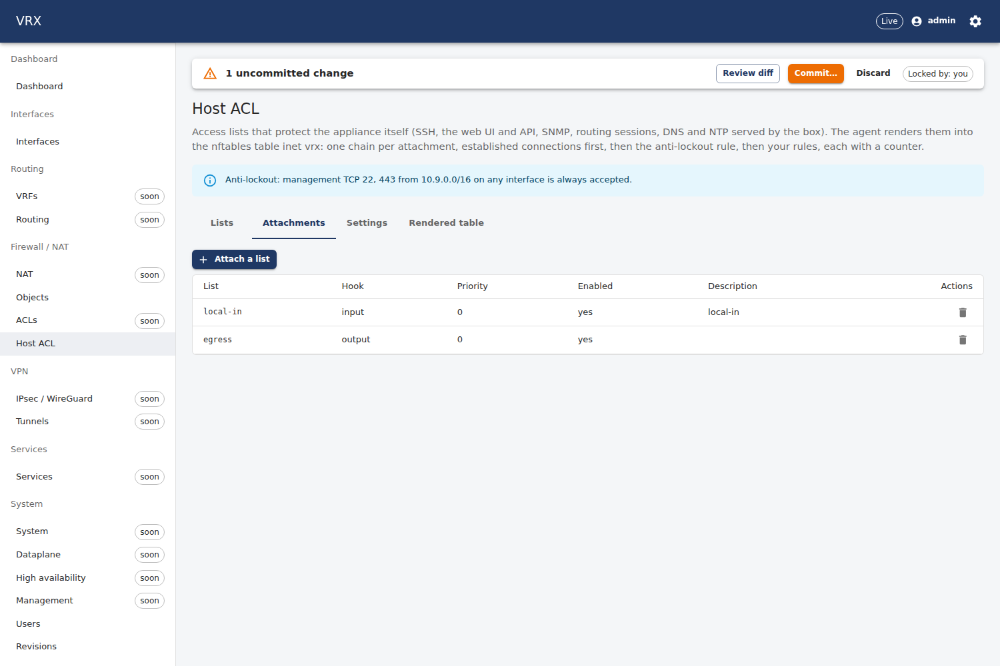

# F-host-acl-nftables — local-in / management-plane ACL + nftables host-policy renderer

Branch `task/F-host-acl-nftables` (worktree `/root/ngfw-wt/F-host-acl-nftables`, slot 9), base `task/F-object-model@31249d3`
(speculative, D-114; the merger rebases). WBS D5.3, D-057 (this renderer is the single owner of the host firewall;
F-hardening-lite consumes it). Contract: `docs/status/tasks/F-host-acl-nftables-contract.md`. Questions:
`docs/status/tasks/F-host-acl-nftables-questions.md`.

## What was built

| part | where |
|---|---|
| **Contract** (additive, `contract(proto): host acl state`): read-only RPC `HostAclState`; config gap `acl.hostSettings` (`defaultInput`, `allowIcmp`, `antiLockout{enabled, sources, interfaces, ports}`) = `AclConfig.host_settings = 8`; semantic rule `acl.host-settings` | `packages/proto`, `packages/schema/src/domains/ext/host-acl-nftables.ts`, `semantic/host-acl-nftables.ts` |
| **Renderer** `renderers/nftables`: ONE table `table inet vrx` (slots `vrx_<prefix>`); sets per address object, one base chain per enabled attachment, `ct state established,related accept` first, loopback, ICMP / IPv6 ND, the **anti-lockout** accept, user rules with counters and `log prefix "vrx:<list>:<seq> "`; `nft -c -f` on a staged copy; one `nft -f` transaction (`add table` + `delete table` + body); Retrieve = `nft -j list table` normalised; never `flush ruleset`, never another table | `apps/agent/internal/renderers/nftables/` (README), `docs/agent/renderers/nftables.md` (mapping table) |
| **Anti-lockout check** (DryRun error with pointer): management probes simulated through the input chains | `renderers/nftables/lockout.go` |
| **Agent wiring** (decision (a)): singleton descriptor `host-acl.nftables/vrx` under `Domains["acl"]`, builder/assembler, `HostAclState` | `subsystems/host_acl.go`, `desired/hostacl.go`, `agent/rpc_host_acl.go` |
| **Modes / isolation**: product owner → root netns (`apply`); a slot agent → `check` (nft -c only) or, with `VRX_HOST_ACL_NETNS`, `netns` (every nft call on a thread that `setns`-ed into the slot namespace; never `ip netns exec`); `apply` is refused for any owner but `vrx` | `renderers/nftables/paths.go`, `runner.go` |
| **API** `GET /api/v1/state/host-acl` (`HostAclNftablesController`), fake agent, e2e | `apps/api/src/features/host-acl-nftables/`, `apps/api/test/e2e/host-acl-nftables.e2e.test.ts` |
| **UI** *Firewall → Host ACL* (`/firewall/host-acl`): Lists (rules + live counters), Attachments, Settings, Rendered table; anti-lockout banner; en + fa | `apps/web/src/domains/firewall/host-acl-nftables/`, `apps/web/src/locales/{en,fa}/host-acl-nftables.json` |
| **Docs** | `docs/user/firewall/host-acl-nftables.md` (default policy, anti-lockout, "SSH only from 10.0.0.0/24" + CLI), `docs/agent/renderers/nftables.md` |
| **Tests** | unit (golden + `nft -c`, hostile input, anti-lockout matrix, real-`nft -j` round trip, descriptor, paths), agent service tests, netns integration test (`nftest` harness), topology stack test, opt-in screenshot run |

## Decisions (logged here and in the questions file; the manager records them in LOG.md)

1. **How the agent runs the renderer** (envelope "decision you must log"): (a) a singleton scheduler descriptor wrapping the
   renderer, registered under `Domains["acl"]`, no agent-core change — **taken**; (b) a renderer step in `service.go` that
   P11/P12 reuse — needs the read-only core (A5). (a) generalises: the value carries the applied configuration (agent-local
   store) plus the rendered model; Retrieve reads the daemon/kernel and pairs it with the store. P11/P12/F-kea/F-unbound can
   follow it wherever the actual state can be read back.
2. **Rule identity for Retrieve**: nft re-prints rules in its own form (drops implied `meta l4proto`, `meta nfproto`,
   rewrites `th dport` …), so comparing rule text is fragile. Each rule carries `comment "vrx:<id>/<n>:<sha256(text)[:8]>"`;
   Retrieve compares sets (elements normalised), chain headers and the ordered comments, and takes the annotations from the
   store. Options were (i) rule JSON prediction (fragile), (ii) comment hash (taken). Limitation: a hand edit of a rule body that
   keeps its comment is not seen (documented; the table is owned by the renderer).
3. **Anti-lockout semantics**: (i) render an accept for management SSH/HTTPS at the top of every input chain (pfSense style) and
   (ii) refuse a commit whose own rules would drop it when the rule is off. **Taken: both** — `antiLockout.enabled` (default on)
   renders the rule; off → the DryRun simulation must pass (`acl.host-anti-lockout`, 400 with the rule's pointer); on → a rule
   that would have dropped management traffic gets the warning `acl.host-anti-lockout-shadow`.
4. **Config gap** `acl.hostSettings` (optional, so existing documents parse unchanged) with field number **8** = the
   wave-A-hotspots §2 proposal (questions Q1).
5. **Management interfaces before D-026** (prompt open question): `antiLockout.interfaces`/`sources` empty = any (Q3).
   **reject**: nftables' default (`icmpx port-unreachable`, Q4).
6. **Test/product isolation**: slot agents default to `check`; `netns` needs `VRX_HOST_ACL_NETNS`; the product stack on this
   shared host should run with `VRX_HOST_ACL_MODE=check` (Q5, `tools/app` is the manager's).

## Late obligations (CONTINUE-quota "Also new", 2026-09-25)
- **TD-11b ownership guard**: `host-acl.nftables` declares `RecordsNoOwnership()` (its ownership is the owner-specific table
  name; the store is always a file), unit-tested (`TestDescriptorDeclaresOwnership`); structural, so it compiles before and after
  TD-11b lands.
- **D-132**: `/state/host-acl` polls every 30 s (was 5 s) and the page has a *Refresh* button (en + fa). The route reads nft only,
  never VPP. No `dropPhantomOptionals` call exists in this task's code. TD-8 seams: `Wiring.RequestResync` is used, not forked.

## Shared hunks (hotspots; each directly below the `wave-A: F-host-acl-nftables` anchor unless noted)

| file | hunk |
|---|---|
| `packages/proto/vrx/v1/dataplane.proto` (C5) | `rpc HostAclState` in `service Dataplane`; `HostAclSettings host_settings = 8;` in `AclConfig`; messages in the `// ----- F-host-acl-nftables -----` section |
| `packages/schema/src/domains/acl.ts` (C1) | one import + one key line `hostSettings` at the end of `AclSchema` (no anchor seeded in acl.ts) |
| `packages/schema/src/semantic/index.ts` (C2) | one import + one spread line |
| `packages/schema/src/index.ts` (C3) | one `export *` line |
| `docs/contracts/proto.md` (C6) | `### F-host-acl-nftables: HostAclState` |
| `apps/agent/internal/renderers/ALLOWLIST.md` | rows `/usr/sbin/nft` (nftables) and `/usr/bin/ip` (test-only, `nftables/nftest`), after the RF-4 keepalived row |
| `apps/agent/internal/subsystems/subsystems.go` (A1) | const `ACL = "acl"`; `Domains[ACL]: hostACLDescriptors()`; `registerHostACL(r)` in `Register()` — **shared with F-acl**: the second to merge keeps one constant and appends its descriptors to the entry |
| `apps/agent/internal/agent/projection.go` (A2) | `desired.HostACL(p, ds.GetAcl(), ds.GetObjects(), in["objects"])` in `project()`; `ds.Acl = desired.AssembleHostACL(kvs, ds.Acl)` in `assemble()` |
| `apps/agent/internal/agent/service_test.go` (not a hotspot; one word) | `TestRetrieveSubsystems` used `"acl"` as its example of an unimplemented subsystem; `acl` is implemented now → `"vpn"` (F-acl would hit the same line) |
| `apps/api/src/agent/agent.client.ts` (P4) | type import + `hostAclState()` |
| `apps/api/src/testing/fake-agent.ts` (P5) | stub → `features/host-acl-nftables/fake.js` |
| `apps/api/src/app.module.ts` (P1) | import + controllers spread + providers spread |
| `apps/web/src/router.tsx` (W1), `nav/nav.ts` + `nav.test.ts` (W2), `i18n.ts` (W3) | lazy route `firewall/host-acl`; firewall NavItem `host-acl`; namespace `host-acl-nftables` |
| generated (C7) | `apps/agent/gen/**`, `packages/proto/gen/ts/**`, `packages/api-client/src/generated/schema.d.ts`, `apps/cli/internal/api/operations_gen.go` (`docs/user/cli/reference.md` unchanged) |

## Evidence

### Root netns (shared host) — `nft list tables` before and after every host run: identical
Recorded by the harnesses (`nftest` and the topology test fail when it changes); from the topology run:
```
root netns `nft list tables` before:            root netns `nft list tables` after:
table ip filter                                  table ip filter
table ip nat                                     table ip nat
table ip mangle                                  table ip mangle
table ip6 filter                                 table ip6 filter
table ip6 nat                                    table ip6 nat
table ip6 mangle                                 table ip6 mangle
```
`nftables.service` stays inactive/disabled (never touched). Only `nft -c` and `nft list` ran in the root netns.

### Unit (`go test ./internal/renderers/nftables/ ./internal/agent/ -run …`)
```
--- PASS: TestKernelRoundTrip (0.04s)            real `nft -j` of two renderings, annotated = the value (Retrieve == desired)
--- PASS: TestKernelDriftIsVisible (0.02s)       element / comment / policy / priority edits are differences
--- PASS: TestParseKernelCountersAndElements (0.00s)
--- PASS: TestDescriptorLifecycle (0.06s)        argv (nft -c -f <staged>, nft -f <file>), 0600, failed load restores, lost table, restart, delete
--- PASS: TestDescriptorCheckMode (0.01s)
--- PASS: TestState (0.03s)
--- PASS: TestPathsFromEnv (0.00s)               apply refused for slot owners; product allowlist = nft only
--- PASS: TestGoldenBasic (0.14s)                golden + `nft -c`
--- PASS: TestGoldenFull (0.32s)                 sets, ranges, FQDN, tcp-udp/icmp/icmpv6/sctp/other, flags, sports, 3 hooks, ND-only, v4+v6 anti-lockout
--- PASS: TestGoldenEmptyAndRemoved (0.05s)
--- PASS: TestBuildIsDeterministicAndCarriesConfig (0.04s)
--- PASS: TestHostileInput (0.09s)               `"; rm -rf /`, \n, \r\n, NUL, ESC, U+2028, invalid UTF-8, `eth0" accept`, `x } ; flush ruleset`, `a # comment`, `} table ip filter { …` in descriptions (never rendered), list/object/interface names, anti-lockout interfaces, prefixes (refused at the pointer)
--- PASS: TestRenderRefusesHostileValues (0.03s) hand-made values (store tampering): names, types, elements, comments, rule texts with newline/;/#/quotes/braces
--- PASS: TestAntiLockout (0.01s)                14 cases (off/on, partial accepts, interfaces, families, default drop)
--- PASS: TestAntiLockoutAcrossChains (0.00s)
--- PASS: TestBuildErrors (0.27s)
--- PASS: TestGoldenDocsExample (0.10s)
ok  	ngfw/agent/internal/renderers/nftables	1.325s
--- PASS: TestHostACLDomainOnFake (0.21s)        service: Apply → Retrieve(acl) == desired, second Apply empty, HostAclState, DryRun lockout error, F-acl leaves warned, removal
--- PASS: TestHostACLSurvivesRestart (0.07s)
ok  	ngfw/agent/internal/agent	0.349s
```

### Integration in the slot netns (`VRX_INTEGRATION=1 go test -run TestIntegrationHostFirewallInSlotNetns ./internal/renderers/nftables/`)
```
=== RUN   TestIntegrationHostFirewallInSlotNetns
    apply: APPLIED summary={Created:1 …} in 118ms
    `nft list table inet vrx_w9` in ns-w9-hacl after apply:
        table inet vrx_w9 {
        	comment "vrx-agent host firewall"
        	set a4_peer {
        		type ipv4_addr
        		flags interval
        		elements = { 10.9.77.2 }
        	}
        	chain in_local-in {
        		type filter hook input priority filter; policy accept;
        		ct state established,related counter packets 0 bytes 0 accept comment "vrx:@established/0:c77fde03"
        		iif "lo" counter packets 0 bytes 0 accept comment "vrx:@loopback/0:ad72b3be"
        		meta l4proto icmp counter packets 0 bytes 0 accept comment "vrx:@icmp/0:36418210"
        		meta l4proto ipv6-icmp counter packets 0 bytes 0 accept comment "vrx:@icmp/1:455fde78"
        		ip saddr 10.9.77.2 tcp dport 22 counter packets 0 bytes 0 accept comment "vrx:@anti-lockout/0:f175bad4"
        		ip saddr @a4_peer tcp dport 2222 counter packets 0 bytes 0 accept comment "vrx:local-in:10/0:591e6c38"
        		tcp dport 2323 counter packets 0 bytes 0 log prefix "vrx:local-in:20 " drop comment "vrx:local-in:20/0:f020440d"
        	}
        }
    `nft list tables` in ns-w9-hacl:   table inet foreign / table inet vrx_w9
    port 2323 from 10.9.77.2: dial tcp 10.9.77.1:2323: i/o timeout (dropped)
    drop rule (sequence 20) counter: 0 → 2 packets; allowed rule (sequence 10): 1 packets
    apply: APPLIED summary={Updated:1 …}                    (update: + reject 2424)
    port 2424 after the update: dial tcp 10.9.77.1:2424: connect: connection refused (rejected)
    apply: APPLIED summary={Updated:1 …}                    (rollback: Retrieve == previous value, listing identical)
    apply: APPLIED summary={Updated:1 …}                    (fresh descriptor after the table was deleted)
    restart simulation: table re-rendered in 135ms; diff against the first listing (counters normalised): empty
    `nft list tables` in ns-w9-hacl after removal:  table inet foreign
--- PASS: TestIntegrationHostFirewallInSlotNetns (2.73s)
```

### Topology on slot 9 (`test/topology/host-acl-nftables/run.sh -run TestHostACLTopology`: real agent + API + slot DB)
```
    started vrx-agent pid 1570280 … started vrx-api pid 1570399
    `nft list table inet vrx_w9` in ns-w9-hacl after commit (revision 1):   (the table above)
    `nft list tables` in ns-w9-hacl: table inet foreign / table inet vrx_w9
    /state/drift: no change under /acl (Retrieve == running); /state/host-acl: present, inSync, mode netns, table vrx_w9
    retrieve acl (vrx-agentctl): map[host:map[local-in:… rules:[…sequence:10… …sequence:20…]] hostAttachments:[…input… priority:0]
      hostSettings:map[allowIcmp:true antiLockout:map[enabled:true ports:[22] sources:[10.9.77.2/32]] defaultInput:accept]]
    port 2323 from 10.9.77.2: dial tcp 10.9.77.1:2323: i/o timeout (dropped)
    GET /api/v1/state/host-acl rules[]: sequence 20 (drop 2323) packets=2, sequence 10 (accept 2222) packets=1
    validate with anti-lockout off and a drop of tcp/22 → 400 {"type":"https://vrx.dev/problems/validation","title":"Validation failed",
      "status":400,"tier":"agent",…,"errors":[{"pointer":"/acl/host/local-in/rules/0","message":"management TCP 22 from 10.9.77.2/32 on
      any interface would be dropped by this rule (drop, chain in_local-in): the anti-lockout rule is off
      (acl.hostSettings.antiLockout.enabled), so the rules must accept management traffic before any drop — add an accept rule in
      front, narrow this one, or turn the anti-lockout rule on","rule":"acl.host-anti-lockout"}]}
    (commit of the same candidate → 400; discard; the kernel table unchanged)
    rollback 2 → 1: status applied, revision map[… id:3 kind:rollback parentId:2 …]
    rollback: `nft list table inet vrx_w9` equals revision 1's (counters blanked); /state/drift clean for acl
    stopped vrx-agent pid 1570280
    simulated loss: `nft list tables` in ns-w9-hacl with the agent down:  table inet foreign
    started vrx-agent pid 1577073
    restart: table re-rendered identically after 236ms (diff empty); agent log:
      {"msg":"host firewall wired","owner":"w9","table":"inet vrx_w9","mode":"netns","netns":"ns-w9-hacl",…}
      {"msg":"host firewall rendered","owner":"w9","family":"host-acl","table":"vrx_w9","mode":"netns","chains":1,"sets":1}
      {"msg":"reconcile done","mode":"resync","domains":["interfaces","vrfs","routing","objects","acl"],"status":"APPLY_STATUS_APPLIED","summary":"updated:1 unchanged:1"}
    VPP NRestarts 1 → 1
    stopped vrx-api … stopped vrx-agent …   pg-test drop w9: ok nothing named vrx_w9 remains
--- PASS: TestHostACLTopology (15.78s)
```
This task creates no VPP object; the agent connects to the shared VPP only for its other domains (`NRestarts` unchanged).

### API e2e (fake agent; `vitest run -c vitest.e2e.config.ts test/e2e/host-acl-nftables.e2e.test.ts`, slot 9 DB)
5/5: 200 shape + per-rule aggregation; 501 when the agent does not implement `acl`; 400 at edit time
(`/acl/hostSettings/antiLockout/ports`), semantic tier (`/acl/hostSettings/antiLockout/ports/2`) and agent tier (rule pointer).

### Screenshots — `TestHostACLScreenshots` (production build under `vite preview`, real API + agent in the slot netns)
Headless Chrome-for-Testing + playwright-core 1.63 from the npx cache (nothing installed; the script is not committed; P07a/P07b/P08 approach):
```
host-acl-lists-en.png  html dir/lang=ltr/en  pageErrors=0          host-acl-lists-fa-rtl.png  html dir/lang=rtl/fa  pageErrors=0
host-acl-attachments-en.png  … pageErrors=0                        host-acl-attachments-fa-rtl.png  … pageErrors=0
host-acl-settings-en.png  … pageErrors=0                           host-acl-settings-fa-rtl.png  … pageErrors=0
host-acl-rendered-en.png  … pageErrors=0                           host-acl-rendered-fa-rtl.png  … pageErrors=0
--- PASS: TestHostACLScreenshots (68.48s)
```
| | |
|---|---|
|  Lists: counters, anti-lockout banner, pending edit |  Rendered table: chains, rules, counters, sets |
|  Settings, Persian RTL |  Attachments |

### CI
`TMPDIR=/tmp/g-w9 bash /tmp/g-w9/ci-trace-excl.sh --base main` on HEAD **942f292d** → **CI GATE PASSED** (quick, wall time 29m16s,
logs `/root/ngfw-wt/logs/ci/F-host-acl-nftables-20260925-034815-2320902`):
```
== summary (quick) ==
  contract guard: HEAD vs main                       0m00s
  tools (golangci-lint, gitleaks)                    0m04s
  install (pnpm --frozen-lockfile --prefer-offline)   0m01s
  generate + generated-output gate                   3m10s
  forbidden patterns (+ gitleaks)                    0m05s
  packet-trace ban on the shared VPP (D-128)         0m01s
  lint · typecheck · unit tests · build (turbo)   4m09s
  apps/agent: make lint test build                   1m46s
  apps/cli: make lint test build                     0m23s
  test/ Go modules, unit mode (… test/topology/host-acl-nftables …)   0m14s
  deploy/vpp: shellcheck + apply-startup fake-host harness  19m20s
  warnings:
    - uncommitted changes in the worktree: this status file, the questions and wip files (committed right after)
    - commit subject(s) not in Conventional Commits form: review(W-seed): verify   (inherited from the base)
    - apply-startup harness: scenario(s) 24 failed in the parallel run and passed on a serial rerun (host load?)
CI GATE PASSED
```
How the gate was run, and why (D-127 and one inherited finding):
1. The branch copy of `tools/ci.sh` (from the F-object-model base) failed its contract guard (SIGPIPE, D-127) → main's copy
   (`git show main:tools/ci.sh > /tmp/g-w9/ci.sh`), as the envelope says.
2. Main's copy then failed the **D-128 packet-trace ban** on `test/topology/interfaces/interfaces_test.go:291/297/302`
   (`vppctl trace add` / `show trace`) — P08's file as inherited from the base branch; main already replaced it
   (c5b69266 "replace packet trace with counters"), so the rebase onto main removes it. This task adds no trace call (the ban's
   grep over everything else is clean). For the run the only change was one pathspec exclusion of that inherited file in a
   temporary copy (`/tmp/g-w9/ci-trace-excl.sh`, diff: `':(exclude)test/topology/interfaces/interfaces_test.go'`); nothing in
   the repository was changed for it.
3. The first run of main's copy found 6 golangci-lint issues in this task's code (ACL naming, De Morgan, builtin shadowing, a
   tagged switch) → fixed in 942f292d together with the TD-11b declaration and D-132 (CONTINUE-quota "Also new").

## Fix round 1 (review 298263fa: APPROVE WITH CHANGES; time box 90 min)

| id | fix | commit | test that fails on the old code |
|---|---|---|---|
| H1 | An enabled **output** attachment at priority ≤ −200 (before `NF_IP_PRI_CONNTRACK`) is refused: Go `Build` → `acl.host-attachment` at `/acl/hostAttachments/<i>/priority`; schema tier-b rule `acl.host-output-priority` (400 at the same pointer, before the agent is asked). Docs corrected ("replies are not cut" now holds by construction) | 723c92cf (`contract(schema)`), a0e82b38 | `TestBuildErrors` "output before conntrack" (−300) / "output at conntrack" (−200): no issue on the old code; `TestOutputPriorityAfterConntrack` (−199, other hooks, disabled attachment stay fine); schema `acl.host-output-priority …` (5/5) |
| H2 | Mode `apply` requires the product owner **and** `Env.GlobalsOwner` (D-071: the root-netns firewall is a host-wide singleton): `ProductPaths`/`PathsFromEnv(stateDir, owner, globalsOwner)` fall back to `check`; `VRX_HOST_ACL_MODE=apply` is refused without it; `Paths.Validate` checks it too. `tools/app`: `VRX_HOST_ACL_MODE=check` added to the product agent's env line — that one line only (manager's Q5 answer); tools/app was not run | a0e82b38 | `TestPathsFromEnv` (owner vrx without globals → check; apply without globals → error; Validate): does not build on the old API, which had no globals input and returned apply for owner vrx |
| M1 | Retrieve pairs a kernel rule with its stored annotations only while (a) its verdict equals the stored one and (b) its body still hashes as right after the last `nft -f` (sha256 of the kernel's `expr` JSON, counter values stripped; stored as `kernel_hashes` after a read-back in Create/Update). (c) The table's `flags dormant` is parsed (`HostTable.dormant`). Unhooked chains were already visible and are now tested | 71e85fa7 | `TestKernelDriftIsVisible` + "verdict flip, comment kept", "port edit, comment kept", "dormant table", "chain not hooked" (the first three are invisible on the old `annotate`); `TestDescriptorLifecycle` (read-back after the load, hashes stored); round trip with and without stored hashes |
| M2 | The anti-lockout check is a pure function of the configuration: matches through FQDN-bearing objects count as *partial* whatever the resolver answers (an FQDN accept never protects management, an FQDN drop may hit it), and a rule whose FQDN object has no answer of a family yet takes part as a non-rendered ghost. A config accepted at commit therefore can never produce `acl.host-anti-lockout` at a resync, so the failure cannot reach the other domains. Scoping a runtime descriptor failure to one key (DEGRADED/FAILED for `host-acl.nftables/vrx` only) is scheduler semantics — every descriptor error rolls the transaction back today; with the check DNS-independent no such failure is left for this family (TD-13's validator would be the place for more) | b3439a64 | `TestAntiLockoutIgnoresFQDNAnswers`: the same findings with the FQDN objects resolved and unresolved; on the old code "fqdn accept (resolved)", "fqdn drop (resolved)", "fqdn drop (unresolved)" gave no error |
| M3 | `TestRetrieveSubsystems` takes its unimplemented example from the registry (first root key without a `subsystems.Domains` entry; skipped when none) | 32ad5184 | (test-only change) |
| M4 | the manager's (P10) — not touched | — | — |
| L1 | the error says to set `antiLockout.sources` when none are configured, and that FQDN matches never protect | b3439a64 | `TestAntiLockoutMessageWithoutSources` |
| L4 | user doc: use a confirmed commit (`commit confirm <sec>`) for host-ACL changes (other tables, a wrong `sources`) | 32ad5184 | — |
| L5 | stale "5 s poll" comment removed | 32ad5184 | — |
| L2, L3, L6 | not done (time box): an IPv4-only-sources warning, a log rate limit, deriving the UI's schema copies — tech-debt candidates | — | — |

Q8 (reconciliation with F-acl) is left to the merger, as instructed.

### Unit evidence
```
--- PASS: TestKernelRoundTrip (0.04s)
--- PASS: TestKernelDriftIsVisible (0.06s)
--- PASS: TestDescriptorLifecycle (0.08s)
--- PASS: TestPathsFromEnv (0.00s)
--- PASS: TestAntiLockout (0.01s)
--- PASS: TestBuildErrors (0.23s)
--- PASS: TestOutputPriorityAfterConntrack (0.00s)
--- PASS: TestAntiLockoutIgnoresFQDNAnswers (0.00s)
--- PASS: TestAntiLockoutMessageWithoutSources (0.00s)
ok  	ngfw/agent/internal/renderers/nftables	0.473s
--- PASS: TestHostACLDomainOnFake (0.15s)
--- PASS: TestHostACLSurvivesRestart (0.08s)
--- PASS: TestRetrieveSubsystems (0.02s)
ok  	ngfw/agent/internal/agent	0.298s
 ✓ src/semantic/host-acl-nftables.test.ts (5 tests) 265ms
      Tests  5 passed (5)
```

### Netns run on slot 9 (once, under `tools/lab lock shared`, slot netns only)
```
root netns `nft list tables` before = after (diff empty):
table ip filter / table ip nat / table ip mangle / table ip6 filter / table ip6 nat / table ip6 mangle
VPP NRestarts=2 before, NRestarts=2 after
    port 2323 from 10.9.77.2: dial tcp 10.9.77.1:2323: i/o timeout (dropped)
    drop rule (sequence 20) counter: 0 → 2 packets; allowed rule (sequence 10): 1 packets
    port 2424 after the update: dial tcp 10.9.77.1:2424: connect: connection refused (rejected)
    restart simulation: table re-rendered in 129.357802ms; diff against the first listing (counters normalised): empty
--- PASS: TestIntegrationHostFirewallInSlotNetns (2.67s)
```
No w9 namespace left afterwards.

### CI (fix round 1)
`TMPDIR=/tmp/g-hacl bash /tmp/g-hacl/ci.sh --base main` (main's copy) on 32ad5184 → failed only the D-128 packet-trace ban on
the inherited `test/topology/interfaces/interfaces_test.go:291/297/302` (base-branch file; main replaced it, the reviewer
confirmed in Q9 that the rebase removes it). Re-run with that one pathspec excluded in a temp copy (`/tmp/g-hacl/ci-trace-excl.sh`,
nothing changed in the repository) → **CI GATE PASSED** (quick, 7m38s, logs `/root/ngfw-wt/logs/ci/F-host-acl-nftables-20260925-045415-3827508`):
```
  contract guard: HEAD vs main                       0m00s
  tools (golangci-lint, gitleaks)                    0m02s
  generate + generated-output gate                   1m54s
  forbidden patterns (+ gitleaks)                    0m05s
  packet-trace ban on the shared VPP (D-128)         0m01s
  lint · typecheck · unit tests · build (turbo)   3m57s
  apps/agent: make lint test build                   1m04s
  apps/cli: make lint test build                     0m11s
  test/ Go modules, unit mode (… test/topology/host-acl-nftables …)   0m11s
  deploy/vpp: shellcheck + apply-startup fake-host harness   0m10s
  warnings: this status file uncommitted (committed right after); subjects `test(agent)+docs(host-acl): …`,
  `review(…)` not Conventional (the squash at merge replaces them)
CI GATE PASSED
```
Cleanup after the round: no w9 netns/links, no process of this task, lab lock released, root netns unchanged (above),
`apps/*/dist`, `packages/*/dist`, `apps/agent/bin` removed.

## Acceptance

- [x] Golden + hostile-input tests (quote/brace/newline injection in descriptions and interface names) green
- [x] In the slot netns: after apply `nft list table inet vrx_w9` shows the rules (pasted); a blocked port from a veth peer is
      dropped and the counter increments (0 → 2); an allowed port connects
- [x] Agent-restart simulation → table re-rendered identically (diff empty; 236 ms on the stack, 135 ms at renderer level)
- [x] Rollback → table content equals the previous revision (Retrieve / drift + listing, not assumption); other tables
      untouched (`nft list tables` in the namespace: the foreign table survives every step; root netns identical before/after)
- [x] A rule set that would drop the management SSH source → 400 problem+json with `pointer` `/acl/host/local-in/rules/0`
- [x] UI screenshot (en + fa/RTL) against the real endpoint
- [x] `tools/ci.sh --base main` green (main's copy, D-127; the inherited D-128 file excluded — see CI above)

## Out of scope (not built)
VPP data-plane ACLs (F-acl); objects CRUD (F-object-model); CIS/systemd hardening, package signing and shipping the static base
policy (F-hardening-lite, P10); punt/policer of control traffic inside VPP; NAT on the host; loading anything into the shared
host's root netns; a CLI `show` command for the rendered table (the CLI binds `GET /api/v1/state/host-acl` later); a custom
`host-interface-picker` widget (the form falls back to a text field); schedules on host rules (the schema has none).

## Open questions
Q1–Q6 in `docs/status/tasks/F-host-acl-nftables-questions.md` (field number 8; decision (a); management-interface default;
reject default; product mode on this shared host; FQDN re-render waits for the A5 resync hook).

## Cleanup
Verified after the last run (2026-09-25 ~04:20):
```
--- processes        none (agent, API and vite preview of every run were started and stopped by PID by the tests)
--- netns            no w9 namespaces, no w9 links (ns-w9-hacl / ns-w9-hpeer / ns-w9-probe deleted)
--- db               vrx_w9 database and role dropped (pg-test.sh drop: "nothing named vrx_w9 remains")
--- lab lock         no holder
--- root netns       table ip filter / ip nat / ip mangle / ip6 filter / ip6 nat / ip6 mangle  (= baseline, never changed)
                     nftables.service inactive, disabled
--- vpp              NRestarts=1 (unchanged by this task; the 18:41 crash predates it)
--- build outputs    apps/agent/bin, apps/*/dist, packages/*/dist removed
```
