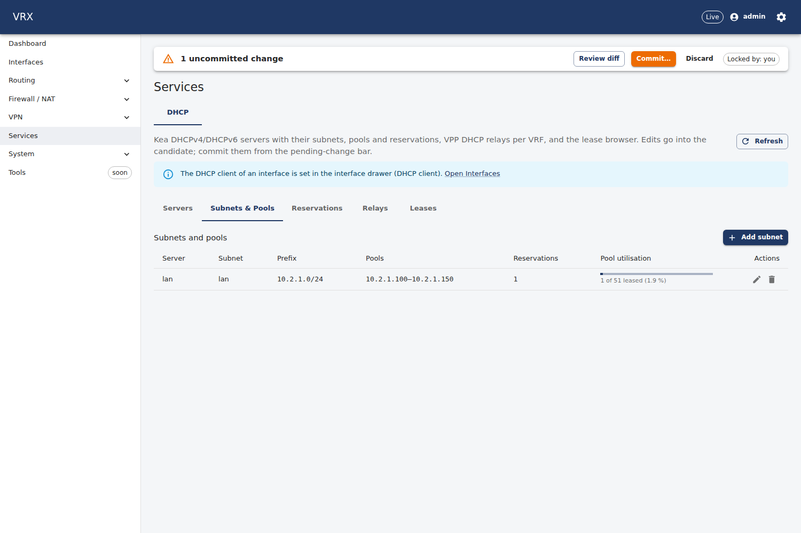
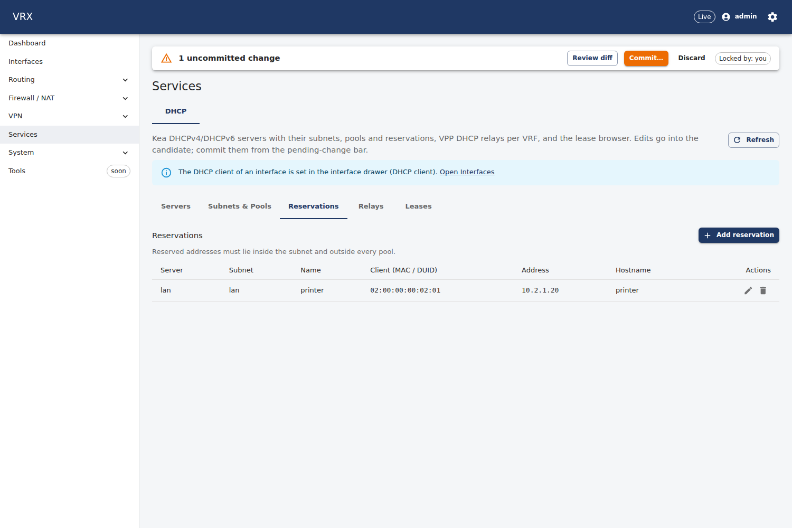
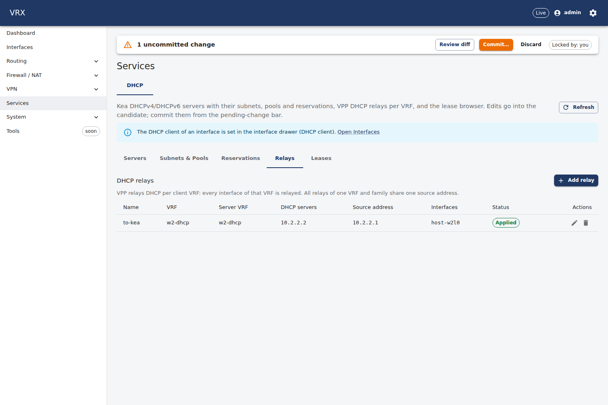
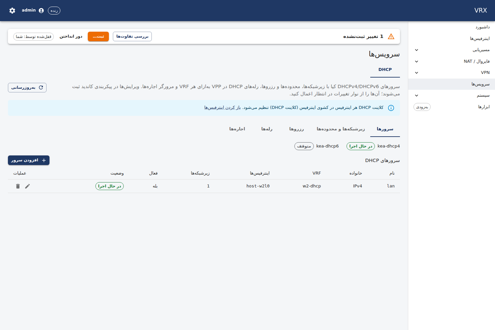
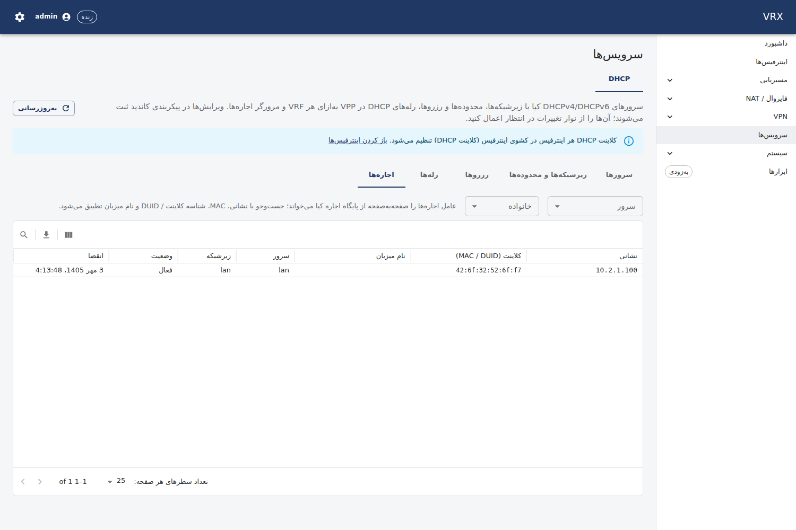

# F-kea-dhcp-relay — Kea DHCPv4/v6 server, VPP DHCP relay, DHCP client (WBS D7.1, D7.2)

Branch `task/F-kea-dhcp-relay` (worktree `/root/ngfw-wt/F-kea-dhcp-relay`), slot 2 (`w2`, table range 2000–2999),
daemon-owner: kea (slot-local test instance only; `kea-dhcp4-server`/`kea-dhcp6-server` stay disabled and stopped,
`/etc/kea` untouched, no kea-ctrl-agent).

## What was built

| layer | what |
|---|---|
| contract | `rpc DhcpLeases` + `DhcpLeasesRequest/Response`, `DhcpLease`, `DhcpSubnetUsage`, `DhcpServerStatus`, `DhcpClientLease` (F-kea-dhcp-relay proto section; DhcpRelay 9–10 unused); four semantic rules in `packages/schema/src/semantic/kea-dhcp-relay.ts` — see `F-kea-dhcp-relay-contract.md` |
| agent | `Domains["services"]`: `kea.dhcp4/vrx`, `kea.dhcp6/vrx` (RF-3's renderer as one singleton descriptor per daemon, D-109 d), `dhcp.proxy`, `dhcp.proxy-vss`, `dhcp.relay` (relay records); builders/assemblers `desired/kea.go`, `desired/dhcp_relay.go`; `subsystems/kea.go` (modes product/test/off, relay scope = the agent's id range (TD-8 seam), DHCP runtime); `agent/rpc_kea.go` (`DhcpLeases`); Kea `Status`/`LeasePage`; ownership declarations for the TD-11b guard; **TD-11b Q3**: `dhcp.client` claims before the VPP add |
| API | `GET /api/v1/state/dhcp/leases?server&family&page&pageSize&filter`, `GET /api/v1/state/dhcp/relays`, `GET /api/v1/state/interfaces/{name}/dhcp-client` (`features/kea-dhcp-relay`), fake `DhcpLeases`, e2e; OpenAPI → api-client, CLI operation table regenerated |
| UI | Services → DHCP tab (Servers / Subnets & Pools / Reservations / Relays / Leases), schema-driven edit dialogs, pool utilisation bars, server-paged lease grid, Refresh button (D-132), en + fa |
| docs | `docs/user/services/kea-dhcp-relay.md`, `docs/agent/renderers/kea.md`, `docs/agent/descriptors/dhcp.md`, `renderers/kea/README.md` |
| test | `test/topology/kea-dhcp-relay` (host VPP + Kea + dhclient), unit tests (renderer/descriptor/status, relay record, claim order, projection round trip, semantic rules), API e2e |

## Acceptance — evidence (host run on the merged tree, `test/topology/kea-dhcp-relay/run.sh`, slot 2, 2026-09-25 04:03)

Topology: `ns-w2-lan` (dhclient on `w2l1`) ↔ VPP `host-w2l0` 10.2.1.1/24 (VRF `w2-dhcp`, table 2001, the relay's client
side) · VPP `host-w2w0` 10.2.2.1/24 (VRF `w2-dhcp`) ↔ `ns-w2-wan` `w2w1` 10.2.2.2/24 running the agent's `kea-dhcp4`
(`/run/vrx-test/w2/kea`, own unix socket) · VPP `host-w2c0` (VRF `w2-cli`, table 2002) with VPP's DHCPv4 client. Agent
env: `VRX_KEA_MODE=test VRX_KEA_NETNS=ns-w2-wan VRX_KEA_IFMAP=host-w2l0=w2w1 VRX_VPP_TABLE_BASE=2000`. Path: af_packet.

```
systemctl show vpp -p NRestarts (before) = 1
commit kea-base → revision 1
commit kea-dhcp → status applied revision 2 txn e3206467-6ca2-40f9-bc28-54deb1b30112
GET /state/dhcp/leases (Kea not started) → servers=[{"actionRequired":"start","active":true,"error":"","family":"ipv4","reloadSec":0,"running":false,"subnets":[{"assigned":"0","declined":"0","prefix":"10.2.1.0/24","server":"lan","subnet":"lan","subnetId":1551922441,"total":"0"}]}]
/run/vrx-test/w2/kea/etc/kea-dhcp4.conf (rendered by the agent, 2547 bytes, mode -rw-r-----)
Kea config-get (own unix socket /run/vrx-test/w2/kea/run/kea4.sock, dir mode -rwxr-x---): subnet4=[10.2.1.0/24(id 1551922441)] user-context.vrx present=true
GET /state/dhcp/leases (Kea started) → servers=[{"actionRequired":"","active":true,…,"running":true,"subnets":[{…"prefix":"10.2.1.0/24","server":"lan","subnet":"lan",…,"total":"51"}]}]
GET /state/drift → {"subsystems":["interfaces","vrfs","routing","services"],"changes":[],"ignored":[… "/services/ipfix","/services/lldp","/services/ntp","/services/snmp" agent.unsupported-field …]}
GET /state/dhcp/relays → {"items":[{"name":"to-kea","config":{…"servers":["10.2.2.2"],"sourceAddress":"10.2.2.1"},"retrieved":{…},"state":"applied"}]}
```

**V19/V24 safety before any DHCP packet** (D-095, D-101; no packet trace anywhere, D-128):
```
V19 pre-flight (TD-3 vrx-vpp-preflight): V19 pre-flight ok: no classify binding or classify DPO points at a missing table (0 warning(s))
V19 guard: classify_table_by_interface host-w2l0 sw_if_index=1 l2=~0 ip4=~0 ip6=~0 · acl_interface_list_dump host-w2l0: 0 ACLs
V19 guard: classify_table_by_interface host-w2w0 sw_if_index=4 l2=~0 ip4=~0 ip6=~0 · acl_interface_list_dump host-w2w0: 0 ACLs
V19 guard: classify_table_by_interface host-w2c0 sw_if_index=10 l2=~0 ip4=~0 ip6=~0 · acl_interface_list_dump host-w2c0: 0 ACLs
V19 guard: ipsec_spd_interface_dump: no SPD on the rig interfaces; write-only classify tables of the three reset to ~0
```

- [x] **Kea test instance answers a dhclient request from `ns-w2-lan`; the lease is on the API lease page.**
```
vppctl show dhcp proxy:
    RX FIB       Src Address  Servers FIB,Address
     2001         10.2.2.1    2001,10.2.2.2
dhclient (ip netns exec ns-w2-lan dhclient -4 -1 -sf /bin/true -lf/-pf under /run/vrx-test/w2/kea-relay):
    DHCPOFFER of 10.2.1.100 from 10.2.1.1
    DHCPACK of 10.2.1.100 from 10.2.1.1 (xid=0x5d55302e)
    bound to 10.2.1.100 -- renewal in 262 seconds.
lease file: fixed-address 10.2.1.100; option relay-agent-information 1:4:0:0:0:1:5:4:a:2:1:1; option dhcp-server-identifier 10.2.2.2;
counters host-w2l0: ip4 (received) 0→3, tx packets 0→2
counters host-w2w0: ip4 (received) 0→2, tx packets 0→3
GET /api/v1/state/dhcp/leases?server=lan&filter=42:6f:32:52:6f:f7 → {"address":"10.2.1.100","hwAddress":"42:6f:32:52:6f:f7","server":"lan","subnet":"lan","state":"default","validLifetimeSec":600,"expiresAt":"2026-09-25T00:43:48.000Z",…}
GET /api/v1/state/dhcp/leases?page=1&pageSize=10 → total=1 truncated=false servers=[{…"running":true,"subnets":[{"assigned":"1",…,"total":"51"}]},{"family":"ipv6","running":false,…}]
```
(option 82 echoed by Kea: circuit id = sw_if_index 1 of `host-w2l0`, link selection 10.2.1.1 — Kea picked the subnet by it.)

- [x] **`vppctl show dhcp proxy` lists the relay with the slot's VRF; `vppctl show dhcp client` shows the client on a slot interface.**
```
vppctl show dhcp proxy:  2001  10.2.2.1  2001,10.2.2.2        (table 2001 = VRF w2-dhcp, "w2:w2-dhcp")
vppctl show dhcp client: [0] host-w2c0 state DHCP_DISCOVER installed 0 no address
GET /state/interfaces/host-w2c0/dhcp-client → {"interface":"host-w2c0","configured":true,"state":"DISCOVER","address":"","hostname":"w2-vppclient","mac":"02:fe:78:05:0d:78","config":{"hostname":"w2-vppclient","setBroadcastFlag":false}}
```
(The client stays in DISCOVER on purpose: no server on its link — see questions Q5.)

- [x] **Agent-restart simulation → Kea config re-applied, relay and client recreated within 30 s.**
```
stopped vrx-agent
simulated loss: dhcp_proxy_config rx_vrf=2001 server=10.2.2.2 is_add=0 → ok
simulated loss: dhcp_client_config sw_if_index=10 (host-w2c0) is_add=0 → ok
simulated loss: Kea config-set (idle configuration over its socket) → config-get subnet4=[]
agent started at +0s: relay back at +0.41s, DHCP client at +0.20s, Kea configuration at +0.41s (no config API call)
agent log: {"time":"2026-09-25T04:04:37.214752757+03:30","level":"INFO","msg":"kea wired","owner":"w2","mode":"test (netns ns-w2-wan, 1 mapped interfaces)","conf":"/run/vrx-test/w2/kea/etc","sockets":"/run/vrx-test/w2/kea/run"}
agent log: {"time":"2026-09-25T04:04:37.49665604+03:30","level":"INFO","msg":"reconcile done","mode":"resync","domains":["interfaces","vrfs","routing","services"],"status":"APPLY_STATUS_APPLIED","summary":"created:3 updated:1 unchanged:16",…}
agent log: {"time":"2026-09-25T04:04:37.496803258+03:30","level":"INFO","msg":"resync finished","why":"connect","status":"APPLY_STATUS_APPLIED","summary":"created:3 updated:1 unchanged:16"}
vppctl show dhcp proxy (after recovery): 2001  10.2.2.1  2001,10.2.2.2
vppctl show dhcp client (after recovery): [0] host-w2c0 state DHCP_DISCOVER installed 0 no address
lease after recovery: DHCPACK of 10.2.1.100 from 10.2.1.1 — bound (the whole path works again)
```
(created 3 = dhcp.proxy, dhcp.client, kea.dhcp4; updated 1 = the dhcp.relay record whose server VPP had lost.)

- [x] **Rollback removes relay + client (Retrieve) and the server's subnets (`config-get`).**
```
POST /config/rollback/1 → {"status":"applied",…,"kind":"rollback",…,"results":[{"key":"dhcp.relay/to-kea","op":"delete",…,"subsystem":"services","code":"ok"},{"key":"dhcp.proxy/2001/2001/10.2.2.2","op":"delete",…   (log line truncated by the test at 600 characters)
GET /state/dhcp/relays after rollback → {"items":[]}
vppctl show dhcp proxy (after rollback): (header only)      vppctl show dhcp client (after rollback): (empty)
Kea config-get after rollback: subnet4=[] user-context.vrx present=false
GET /state/interfaces/host-w2c0/dhcp-client after rollback → {"configured":false,…,"config":null}
```

- [x] **Pool outside its subnet → 400 problem+json with a pointer to the pool.**
```
PATCH /config/services with a pool outside its subnet → 400 {"type":"https://vrx.dev/problems/validation","title":"Validation failed","status":400,"detail":"the document does not match the schema","instance":"/api/v1/config/services","errors":[{"pointer":"/services/dhcp/servers/bad/subnets/lan/pools/0/end","message":"10.99.0.20 is outside 10.2.1.0/24"},{"pointer":"/services/dhcp/servers/bad/subnets/lan/pools/0/start","message":"10.99.0.10 is outside 10.2.1.0/24"}]}
```
The semantic tier is in the API e2e (`apps/api/test/e2e/kea-dhcp-relay.e2e.test.ts`): reservation inside a pool →
400 `…/reservations/inpool/ip` "lies inside pool 0"; DHCP client + static IPv4 → 400 `/interfaces/host-w1c0/ipv4`.

```
--- PASS: TestKeaDhcpRelay (68.33s)
    --- PASS: TestKeaDhcpRelay/commit (2.26s)
    --- PASS: TestKeaDhcpRelay/relay (51.02s)      (includes the screenshots)
    --- PASS: TestKeaDhcpRelay/restart-safety (3.67s)
    --- PASS: TestKeaDhcpRelay/rollback-and-validation (0.71s)
    --- PASS: TestKeaDhcpRelay/cleanup (0.36s)
ok  	ngfw/test/topology/kea-dhcp-relay	68.374s
systemctl show vpp -p NRestarts (after) = 1
```
Cleanup (through the API, veths down first, D-101): no `host-w2*` interface, no proxy of tables 2000–2999, no w2 FIB
table, no netns, no veth left; the Kea test daemon was stopped by its PID; `kea-dhcp4-server`/`kea-dhcp6-server` are
still disabled and inactive; `/etc/kea` untouched.

- [x] **`tools/ci.sh --base main` green** — `TMPDIR=/tmp/g-w2 tools/ci.sh --base main` on `16af8987` (after the merge of main):
```
== summary (quick) ==
  contract guard: HEAD vs main                       0m00s
  tools (golangci-lint, gitleaks)                    0m02s
  install (pnpm --frozen-lockfile --prefer-offline)   0m01s
  generate + generated-output gate                   2m08s
  forbidden patterns (+ gitleaks)                    0m07s
  packet-trace ban on the shared VPP (D-128)         0m01s
  lint · typecheck · unit tests · build (turbo)   1m57s
  apps/agent: make lint test build                   1m14s
  apps/cli: make lint test build                     0m20s
  test/ Go modules, unit mode (test/integration/smoke test/topology/interfaces test/topology/kea-dhcp-relay)   0m12s
  deploy/vpp: shellcheck + apply-startup fake-host harness   4m58s
  warnings:
    - commit subject(s) not in Conventional Commits form (type(scope): subject):
      review(W-seed): verify
  mode quick · wall time 11m02s · logs /root/ngfw-wt/logs/ci/F-kea-dhcp-relay-20260925-041336-3168047

CI GATE PASSED
```
(The first run failed on one gosec finding in a test fixture (`0o640` → `0o600`), fixed in `16af8987`. The Conventional-Commits
warning names W-seed's `review(W-seed): verify`, inherited from the base.)

## Screenshots (real stack: this tree's agent + API + `vite preview`, the lease from the run above, one pending edit)

| | |
|---|---|
|  Servers, daemon status |  Subnets & pools with utilisation |
|  Reservations |  Relays: running vs retrieved (applied) |
|  Leases (server-side paging) |  fa / RTL |
|  fa / RTL |  fa / RTL |

```
kea-dhcp-servers-en.png  html dir/lang=ltr/en  rows=2  pageErrors=0      kea-dhcp-servers-fa-rtl.png  html dir/lang=rtl/fa  rows=2  pageErrors=0
kea-dhcp-subnets-en.png  … pageErrors=0  kea-dhcp-reservations-en.png … pageErrors=0  kea-dhcp-relays-en.png … pageErrors=0
kea-dhcp-leases-en.png   … pageErrors=0  kea-dhcp-subnets-fa-rtl.png  … pageErrors=0  kea-dhcp-leases-fa-rtl.png … pageErrors=0
```
Script outside the repository (P07a/P07b pattern: Chrome-for-Testing headless shell + playwright-core from the npx cache,
nothing installed); `vite preview` on port 5200 stopped by PID.

## Obligations (envelope)

| obligation | how / evidence |
|---|---|
| D-079 Kea over its own unix sockets, root-only dir, no kea-ctrl-agent; start requests persist | `SocketController` only; socket dir `-rwxr-x---` (agent refuses group-writable/other); `actionRequired:"start"` reported on every read while the daemon is stopped (above), commit not failed |
| D-077 Q7 relay per VRF | `dhcp.proxy` per rx VRF (table 2001); `interfaces` of a relay is documentation (VPP relays the whole VRF) — user guide says so |
| D-063/D-076 dhcp6 client objects write-only | not projected (no schema leaf, questions Q4) |
| D-065/D-069 interface refs `interface/<name>` | Kea descriptor deps `interface/<name>` (optional); `dhcp.client` P08's |
| D-071 `dhcp.dhcp6-duid` only via RegisterGlobals | not registered (no leaf); `dhcp.Register` not called (it would register `dhcp.client` twice) |
| RF-3 L3 leases never in Retrieve | `LeasePage` only in `DhcpLeases`; Retrieve = embedded input verified by `ConfigDrift` |
| V19/V24 (D-095, D-101) | TD-3 pre-flight + per-interface guard before traffic; every af_packet delete with its veth down |
| D-128 no packet trace | counters + dhclient/Kea evidence only; no `trace`/`show trace` in the test |
| NRestarts before/after | 1 → 1 (every host run of this task) |
| TD-11b Q3 (addendum) | `dhcp.client` Create: `ClaimFirst` → add → `Undo` on failure; `client_claim_test.go` failed on the old order ("1 dhcp_client_config calls: VPP was written before the claim") and passes now; stale remark in `dhcp/ownership.go` removed |
| TD-11b O2 (addendum) | `RecordsNoOwnership()` on `kea.Descriptor` (×2), `dhcp.ProxyDescriptor`, `ProxyVSSDescriptor`, `RelayDescriptor`, each with a reason comment; the guard test on main passes |
| TD-8 seams | relay scope = `Wiring.IDRange()` (fail closed), no fork of the seam |
| D-132 | UI refetch ≥ 30 s, Refresh button |

## Decisions taken (with options) — for the manager's LOG

1. **Renderer in the agent = one singleton scheduler descriptor per Kea daemon** (`kea.dhcp4/vrx`, `kea.dhcp6/vrx`).
   Options: (a) singleton descriptor (D-109 d default), (b) shared renderer stage in `service.go` (A5, not mine),
   (c) one descriptor per server (one daemon serves all servers of a family → artificial). Chose (a).
2. **Kea Value and Retrieve**: the Value is the render input (`kea.Input`), embedded in the rendered config
   (`user-context.vrx.input`); Retrieve reads it back from `config-get` (or the file when stopped), re-renders and
   checks `ConfigDrift`. Options: (a) echo cached input (D-063 forbids), (b) reverse-map `config-get` to `DhcpServer`
   (lossy: server settings are pushed down to subnets), (c) normalised config JSON as the Value (needs the renderer inside
   the projection). Chose the embedded input: derived from the daemon, exact, drift-checked.
3. **Relay names/metadata**: agent-local `dhcp.relay` record (JSON file in the state dir) verified against
   `dhcp_proxy_dump`. Options: (a) no names (Retrieve can never equal running → permanent drift), (b) service-level stored
   document (A5, not mine), (c) record descriptor. Chose (c).
4. **One Kea VRF per family**: semantic rule (API 400) + renderer `ErrInvalid` at apply, not a projection error (keeps
   the P02c example projectable, questions Q3).
5. **Stopped Kea** = start request, not a failure; Retrieve then uses the file the daemon loads at start.
6. **Foreign Kea configs** (no embedded input; commented `/etc/kea` files) are never reported → never deleted/rewritten
   unless servers are configured.
7. **Relay scope** = the agent's id range (TD-8 `IDRange`, fail closed); no relay without a range.
8. **No option-82 / VSS configuration** (DhcpRelay 9–10 unused); `dhcp.proxy-vss` registered so leftovers in scope are
   cleaned.
9. **Reservation inside a pool = error** (the semantic registry has no warning severity).

## Shared hunks (anchor protocol; all directly below `wave-A: F-kea-dhcp-relay` unless noted)
- `apps/agent/internal/subsystems/subsystems.go`: `Services = "services"` (const), `Services: {kea.NameDhcp4, kea.NameDhcp6, dhcp.NameProxy, dhcp.NameProxyVSS, dhcp.NameRelay}` (Domains), `w.registerKea(r)` (Register); import `renderers/kea` (import block, no anchor)
- `apps/agent/internal/agent/projection.go`: `desired.DHCP(p, ds, vrfID)` in `project()`, `desired.AssembleDHCP(ds, kvs)` in `assemble()`
- `apps/agent/internal/agent/service_test.go` (no anchor): canonical doc gains `"services": {"dhcp": {}}`; the domain-list assertions compare with `implementedDomains()`
- `apps/agent/internal/descriptors/core/coretest/fakevpp.go` (no anchor): one `v.installKeaDHCPRelay()` line
- `packages/proto/vrx/v1/dataplane.proto`: `rpc DhcpLeases` + the messages in the `// ----- F-kea-dhcp-relay -----` section; `docs/contracts/proto.md` §11 section
- `packages/schema/src/semantic/index.ts`: one import, one spread
- `apps/api/src/app.module.ts` (import + controllers + providers), `apps/api/src/agent/agent.client.ts` (type imports + `dhcpLeases`), `apps/api/src/testing/fake-agent.ts` (`dhcpLeases: dhcpLeases(this)` + one import line, no anchor)
- `apps/web/src/domains/services/tabs.ts` (the `dhcp` tab + `lazy` import), `apps/web/src/nav/nav.ts` + `nav.test.ts` (`'services'`), `apps/web/src/i18n.ts` (namespace ×4)
- generated: `apps/agent/gen`, `packages/proto/gen/ts`, `packages/api-client/src/generated/schema.d.ts`, `apps/cli/internal/api/operations_gen.go` (regenerated after the merge of main)

## Out of scope (not built)
DNS/NTP, failover/HA, DDNS, SQL lease back ends, kea-ctrl-agent, RA/SLAAC, DHCPv6-PD downstream UI, DHCPv6 client
configuration (no leaf), option-82 policy, per-VRF Kea instances, a CLI `show dhcp …` command (REST + generated operation
ids only), interface addressing.

## Open questions
`docs/status/tasks/F-kea-dhcp-relay-questions.md` (Q1–Q11), notably Q3 (P02c example vs the new VRF rule), Q5 (P08/core:
a DHCP-leased address would be deleted by the interface-ip reconcile), Q6 (Kea needs linux-cp in the product), Q7
(test-mode `ip netns exec` trampoline in the product binary).

## Fix round 1 (review `bfedc2b8`, APPROVE WITH CHANGES; time box 90 min)

| finding | fix | commit | test that fails on the old code |
|---|---|---|---|
| **M1** packaged `/etc/kea` file shown as active + "start" + error | `Status` reports a config without the agent's embedded render input (no file, idle, foreign or commented) as **not configured**: only `running`; the UI shows a "Not configured" chip instead of Stopped/Start required | `50dcd8a7` | `TestStatusForeignConfigNotConfigured` (old: `Active:true ActionRequired:start Err:"kea: configuration: invalid character '/'…"`); `DhcpPage.test.tsx` ("Unable to find … Not configured" on the old chip) |
| **M2** every DhcpLeases call read up to 100 000 leases per family | per family one shared read in flight (singleflight) reused for `LeaseCacheTTL` = 10 s; an Apply drops the cache; errors not cached; each read still pages Kea with `LeasePageSize` (1000) per message | `00aa76d0` | `TestLeaseReadsSharedAndCached`: 8 concurrent calls → 3 `lease4-get-page` (one read), 5 calls in the TTL → 0, after the TTL / an Apply → one read each (it uses the new cache clock and TTL, so it cannot build against the old code; its request counts assert one shared read) |
| **M3** no tests for `subsystems/kea.go` | `kea_test.go`: `TestRegisterKeaRelayScope` (zero `IDs` → a relay in table 5000 or 0 is neither retrieved nor created, nothing written; slot range inside/outside; `All`), `TestRegisterKeaModes` (default/product/off/test, bad mode, bad map pair, over-long Linux name, bad netns), `TestKeaTestModeMapper` | `4263af96` | mutation: with `rng = nil` on the IDRange error the two fail-closed cases fail ("retrieved 1 relays of table 5000, owns=false") |
| **Q7** test mode reachable in the product binary | `VRX_KEA_MODE=test` refused when the owner is `vrx` or `IDs.All`; `ALLOWLIST.md` row for the lab-mode runner | `4263af96` | mutation: without the check the three refusal cases fail ("want error … refused for the product agent, got <nil>") |
| tools/app | `VRX_KEA_MODE=off` on the agent's env line (that one line; tools/app not run) | `f63ef731` | — |
| L1 | rule-file comment names what the agent re-checks | `3202aff2` (`contract(schema)`, comment only) | — |
| L3 | relay store: fsync of file and directory; an unreadable file is treated as empty (re-creatable metadata) instead of failing every `services` transaction | `74b57889` | `TestFileRelayStoreCorruptFile` (old: Load returned the unmarshal error) |
| L7 | user guide: known issue for a DHCP lease on a sub-interface / af_packet / loopback until the Q5 core row lands | `74b57889` | — |
| TD-13 gate | not added (manager: Kea becomes TD-13's first Validator adopter at its rebase) | — | — |
| Q5 | not here: a new core row (manager) | — | — |
| L2, L4, L5, L6, L8, L9 | not in this round: L2 needs a schema rule (contract), L4 changes the host test order (a host rerun), L5/L6 accepted/TD-9, L8 when a secret field arrives, L9 at the TD-23 rebase | — | — |

M1 does not change a host path for the agent's own configuration (a rendered file carries its input, so "start"
before Kea runs is reported as before); no host rerun (manager).

```
$ cd apps/agent && go test -race -count=1 ./internal/renderers/kea/... ./internal/descriptors/dhcp/... ./internal/subsystems/... ./internal/agent/... ./internal/desired/...
ok  	ngfw/agent/internal/renderers/kea	6.671s
ok  	ngfw/agent/internal/descriptors/dhcp	1.354s
ok  	ngfw/agent/internal/subsystems	7.296s
ok  	ngfw/agent/internal/agent	15.107s
ok  	ngfw/agent/internal/desired	1.295s
$ apps/web: vitest run            Tests  107 passed (107)
$ apps/api: vitest run (unit)     Tests  96 passed (96)
```

`TMPDIR=/tmp/g-w2 tools/ci.sh --base main` on `74b57889` (fix round 1):
```
  contract guard: HEAD vs main                       0m00s
  generate + generated-output gate                   2m06s
  forbidden patterns (+ gitleaks)                    0m06s
  packet-trace ban on the shared VPP (D-128)         0m01s
  lint · typecheck · unit tests · build (turbo)   4m06s
  apps/agent: make lint test build                   1m03s
  apps/cli: make lint test build                     0m09s
  test/ Go modules, unit mode (test/integration/smoke test/topology/interfaces test/topology/kea-dhcp-relay)   0m08s
  deploy/vpp: shellcheck + apply-startup fake-host harness   0m11s
  mode quick · wall time 7m55s · logs /root/ngfw-wt/logs/ci/F-kea-dhcp-relay-20260925-050626-4046120
CI GATE PASSED
```
