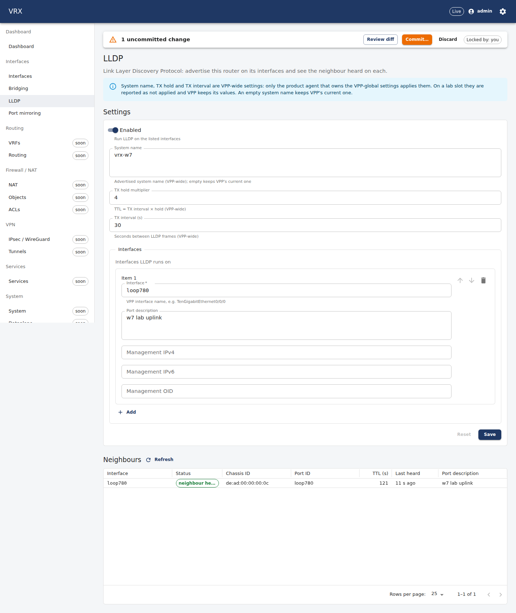
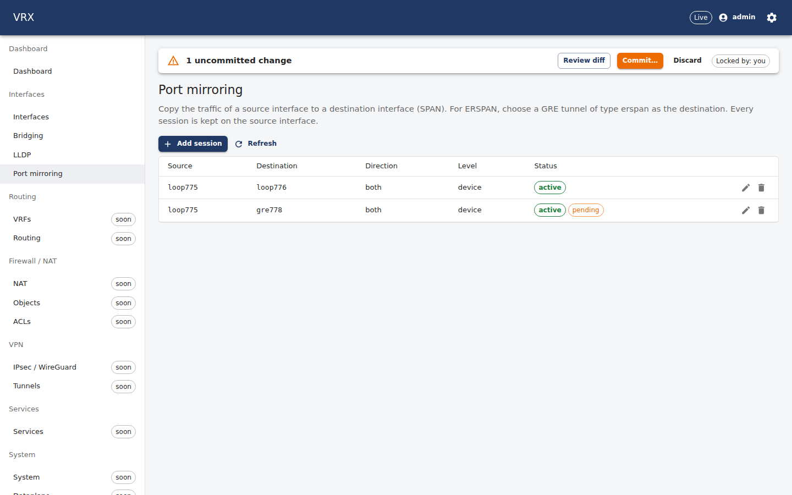
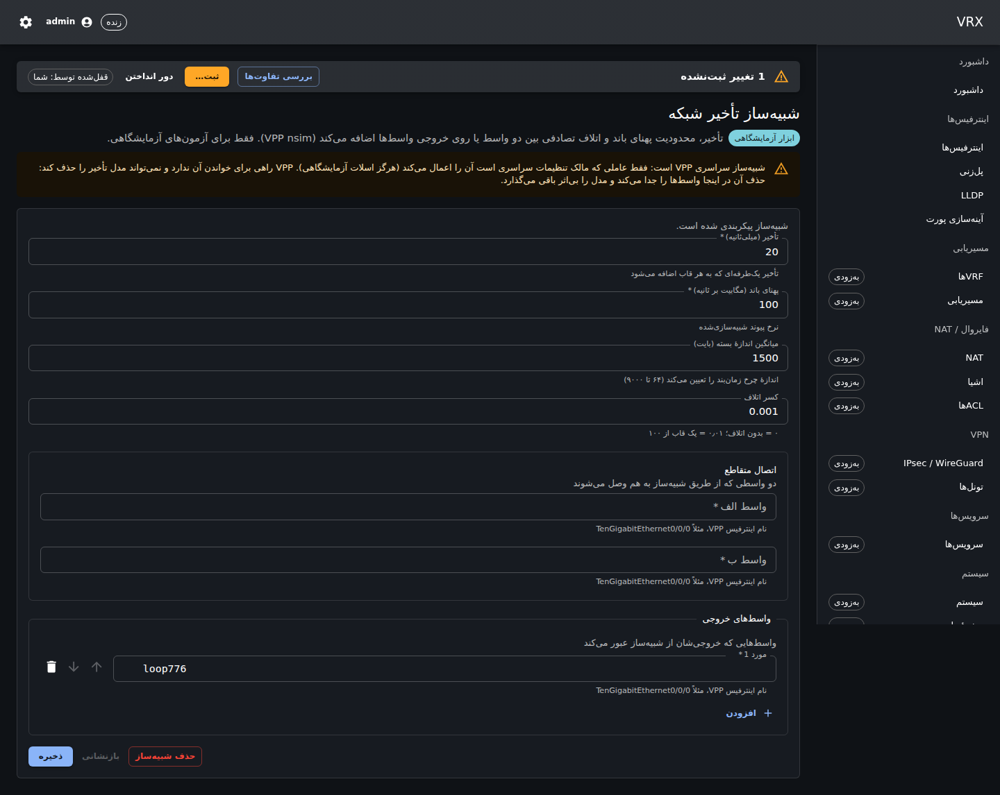
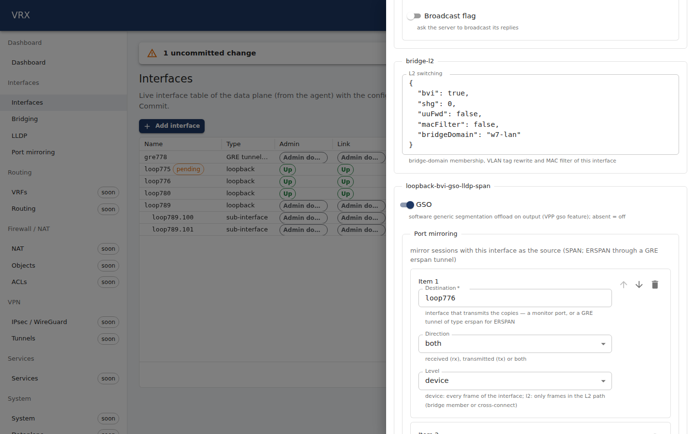

# F-loopback-bvi-gso-lldp-span — loopback/BVI, GSO, LLDP, SPAN/ERSPAN, nsim

Slot 7 (`w7`), branch `task/F-loopback-bvi-gso-lldp-span`, speculative base `task/F-bridge-l2@a735aa9` (D-114).
**Merge F-rpf-adl-pbr first** (manager 23:30, D-131: this branch reuses its `services` seam — see "Expected union at merge").

## What was built

| layer | what |
|---|---|
| contract (schema) | `packages/schema/src/domains/ext/loopback-bvi-gso-lldp-span.ts`: `interfaces.<if>.gso?`, `interfaces.<if>.mirror?[]{destination, direction rx\|tx\|both (both), level device\|l2 (device)}` (≤ 8), `services.nsim?{delayMs, bandwidthMbps, packetSize (1500), dropFraction (0), crossConnect?{a,b}, outputInterfaces[]}`; semantic rules `interfaces.loopback-bvi-gso-lldp-span-{reserved-loopback (D-105: loop16000–16383), gso-interface, mirror-destination, mirror-loop, mirror-duplicate}`, `services.loopback-bvi-gso-lldp-span-nsim-{range, interfaces}` |
| contract (proto) | `Interface.gso` 20, `Interface.mirror` 21 (`MirrorSession`), `ServicesConfig.nsim` 9 (`NsimService`), `rpc LldpNeighbors` (`LldpNeighborsRequest/Response`, `LldpNeighbor`); fake-agent stub; proto.md §11; details in `F-loopback-bvi-gso-lldp-span-contract.md` |
| agent descriptors | new `descriptors/gso` (`gso.interface`: applied once per VPP boot + `feature_is_enabled` read-back → readable, questions Q4), new `descriptors/nsim` (`nsim.config`, `nsim.cross-connect`, `nsim.output`: write-only, applied once per boot and value, globals owner only); DF-7 `lldp` / `span` wired (span: a vanished destination is cleared by Delete); TD-11b ownership declarations on all seven (`ownership.go`) |
| agent wiring | `desired/{gso,mirror,lldp,nsim}.go` + `gso_lldp_mirror_nsim.go` (entry points), `desired/lldp_services_seam.go` (merge seam — delete at the merge), `subsystems/loopback_bvi_gso_lldp_span.go` (registration, `services` names appended in init), `LldpNeighbors` RPC (`agent/rpc_loopback_bvi_gso_lldp_span.go`, owner-scoped, paged ≤ 1000, one walk at a time), coretest model `coretest/loopback_bvi_gso_lldp_span.go` |
| API | `GET /api/v1/state/lldp/neighbors?page&pageSize` (`LoopbackBviGsoLldpSpanController`, `apps/api/src/features/loopback-bvi-gso-lldp-span/`, fake in `fake.ts`); config through the generic pointer routes; GSO and mirror sessions appear in `/state/interfaces` `config` |
| UI | Interfaces → **LLDP** (settings form + live neighbour table, 30 s + Refresh), Interfaces → **Port mirroring** (all sessions, live status from `/state/interfaces`, pending mark, add/edit/remove as merge patches, 30 s + Refresh), Tools → **Delay simulator (lab)**; GSO and mirror in P08's generated drawer (no drawer code, no model.ts exclusion needed); en + fa (`loopback-bvi-gso-lldp-span` namespace) |
| docs | `docs/user/interfaces/loopback-bvi-gso-lldp-span.md` (loopback as BVI, GSO, SPAN/ERSPAN to a GRE tunnel, LLDP, nsim as a lab tool, CLI), `docs/agent/descriptors/{gso,nsim}.md` (new), `{lldp,span}.md` (wiring notes), see-also line in `basics.md`, `### V-new (F-loopback-bvi-gso-lldp-span)` in `docs/vpp-code-track.md` |

Loopbacks: nothing new — P08 creates `loop<N>`, F-bridge-l2 makes it the BVI; this task verifies and documents it (host check
below: `show bridge-domain 7750 detail` → `BVI-Intf loop775`, restart and rollback included).

## Shared hunks (all under `wave-A: F-loopback-bvi-gso-lldp-span` unless said otherwise)

| id | file | hunk |
|---|---|---|
| A1 | `apps/agent/internal/subsystems/subsystems.go` | `loopbackGso`, `loopbackSpanMirror` in `Domains[Interfaces]`; one comment line under the new-domain anchor (services names come from init in my file); `w.registerLoopbackBviGsoLldpSpan(r)` in `Register` |
| A2 | `apps/agent/internal/agent/projection.go` | one call in `project()`, one in `assemble()` |
| A6 | `apps/agent/internal/descriptors/core/coretest/fakevpp.go` | 2 lines after `sanitizetest.Clean` (comment + `v.installLoopbackBviGsoLldpSpan()`) — **no anchor** (as F-bridge-l2 Q9; D-134: becomes one TD-23 registration line) |
| A7 | `docs/vpp-code-track.md` | appended `### V-new (F-loopback-bvi-gso-lldp-span)` |
| C1 | `packages/schema/src/domains/interfaces.ts` | `gso`, `mirror` key lines; **one import line at the top (no import anchor)** |
| C1 | `packages/schema/src/domains/services.ts` | `nsim` key line; **one import line at the top (no import anchor)** |
| C2 | `packages/schema/src/semantic/index.ts` | one import, one spread |
| C3 | `packages/schema/src/index.ts` | one export |
| C5 | `packages/proto/vrx/v1/dataplane.proto` | RPC under the service anchor; `gso` 20, `mirror` 21 under the Interface anchor; `nsim` 9 under the ServicesConfig anchor; messages in `// ----- F-loopback-bvi-gso-lldp-span -----` |
| C6 | `docs/contracts/proto.md` | `### F-loopback-bvi-gso-lldp-span: LldpNeighbors` |
| C7 | generated | `pnpm gen && make -C apps/cli gen docs` (never hand-edited) |
| P1 | `apps/api/src/app.module.ts` | one import, one spread in controllers, one in providers |
| P4 | `apps/api/src/agent/agent.client.ts` | two type imports, `lldpNeighbors()` |
| P5 | `apps/api/src/testing/fake-agent.ts` | `lldpNeighbors` UNIMPLEMENTED stub |
| W1 | `apps/web/src/router.tsx` | routes `interfaces/lldp`, `interfaces/mirroring`, `tools/nsim` |
| W2 | `apps/web/src/nav/nav.ts` | one push of the two interfaces items, one push of the Tools item |
| W2 | `apps/web/src/nav/nav.test.ts` | `'lldp'`, `'mirroring'` under the anchor; **`'nsim'` after `'revisions'`** (the Tools group has no anchor) |
| W3 | `apps/web/src/i18n.ts` | two imports, the namespace, the en and fa entries |
| D1 | `docs/user/interfaces/basics.md` | one see-also line at the end ("Not in this release" untouched) |
| — | `apps/agent/internal/agent/{service_test,agent_integration_test}.go` (P08 tests, no anchor) | `"services": {}` in the canonical documents and the `implementedDomains()` subsystem assertions — **byte-identical to F-rpf-adl-pbr's hunks** (they merge cleanly) |
| — | `apps/agent/internal/agent/projection_test.go` (P08, no anchor) | one line: `withoutWriteOnly(pj.kvs)` in the round trip (write-only LLDP of the services example cannot round-trip; helper in my test file) |

## Expected union at merge (with F-rpf-adl-pbr on main first)

1. **Delete `apps/agent/internal/desired/lldp_services_seam.go`.** It is my copy of F-rpf-adl-pbr's `ServicesMembers`
   declaration and "unsupported member" loop; with it gone, `lldp.go`'s `init()` registers `lldp`/`nsim` in F-rpf-adl-pbr's
   map, `reportUnsupportedServices` stays nil and F-rpf-adl-pbr's `projectServices` reports the rest. (Go reports
   "ServicesMembers redeclared" until the file is deleted — that is the reminder.)
2. `subsystems.go`: nothing to union — my services names are appended to F-rpf-adl-pbr's `Services: {…}` entry from
   `init()` in `subsystems/loopback_bvi_gso_lldp_span.go` (`servicesDomain = "services"`, no second `Services` constant).
3. The P08 test hunks are identical to F-rpf-adl-pbr's; the `feature_is_enabled` allowance lines are theirs only.
4. Drift: my write-only notes use F-rpf-adl-pbr's `agent.write-only` rule; with its `COVERAGE_RULES` line on main the
   `/services/lldp` drift seen below on my branch disappears.
5. TD-11b: my `ownership.go` files use the structural `Persistent()` check; after the rebase they may call
   `dfkit.CheckClaims` / `dfkit.CheckBoot` (mechanical, questions Q6). TD-23 (D-134): the coretest hook line becomes one
   registration line in its registry.

## How it was verified

(CI and the final host run are pasted below; everything else was run on the host VPP 26.06, slot 7, no packets sent;
NRestarts 1 → 1 on every run.)

### Unit tests
Targeted runs at c97508f3 (the full suites ran in the CI gate below):
```
packages/schema   vitest src/semantic/loopback-bvi-gso-lldp-span.test.ts   24 passed (24)
packages/proto    vitest                                                  72 passed (72)   (round trip + drift corpus incl. the new fixture)
apps/web          vitest nav 5 passed; loopback-bvi-gso-lldp-span/pages.test.tsx 4 passed (LLDP table + Refresh, mirroring remove patch, nsim fa/RTL)
apps/agent        go test -run <feature tests>:
--- PASS: TestProjectSchemaExamples (0.13s)
--- PASS: TestLoopbackBviGsoLldpSpanSlotAgent (0.15s)
--- PASS: TestLoopbackBviGsoLldpSpanGlobalsOwner (0.07s)
--- PASS: TestLoopbackBviGsoLldpSpanValidation (0.01s)
--- PASS: TestLldpNeighbors (0.02s)
--- PASS: TestLldpIDFormat (0.00s)
--- PASS: TestApplyRetrieveIdempotent (0.03s)
ok  	ngfw/agent/internal/agent	0.491s
--- PASS: TestMirrorRoundTripKeepsDocumentOrder (0.01s)
--- PASS: TestMirrorAndGsoProjectionErrors (0.00s)
--- PASS: TestLldpProjection (0.00s)
--- PASS: TestNsimProjection (0.01s)
--- PASS: TestServicesMembers (0.00s)
ok  	ngfw/agent/internal/desired	0.044s
--- PASS: TestLoopbackBviGsoLldpSpanWiring (0.00s)
ok  	ngfw/agent/internal/subsystems	0.064s
--- PASS: TestGSOAppliedOnce (0.00s)
ok  	ngfw/agent/internal/descriptors/gso	0.029s
--- PASS: TestConfigAppliedOncePerValue (0.00s)
--- PASS: TestCrossConnectAndOutput (0.00s)
ok  	ngfw/agent/internal/descriptors/nsim	0.021s
--- PASS: TestMirror (0.00s)
--- PASS: TestMirrorNoAdopt (0.00s)
--- PASS: TestStaleDestinationCleared (0.00s)
ok  	ngfw/agent/internal/descriptors/span	0.030s
```
The agent-level tests (`internal/agent/rpc_loopback_bvi_gso_lldp_span_test.go`, coretest model) cover: slot agent (DryRun notes
`agent.write-only` /services/lldp, `agent.unsupported-field` for /services/lldp/{systemName,txHold,txIntervalSec}, /services/nsim,
/services/snmp), apply, idempotent re-apply (no mutating message), resync without loss (GSO not stacked: count 1), restart
simulation (dependents then loopbacks deleted behind the agent's back → a new agent recreates all), rollback (GSO/span/LLDP
gone, then the loopbacks), validation pointers, globals owner (lldp.global + nsim applied once per value; resyncs never
reconfigure; a changed model reconfigures once; rollback removes cross-connect and output), the LldpNeighbors RPC (paging,
foreign owner's interface not reported, limit 1001 → INVALID_ARGUMENT, disconnected → UNAVAILABLE).

### Host checks (descriptor level, `VRX_INTEGRATION=1`)
`VRX_INTEGRATION=1 go test -run 'TestERSPANOnHost|TestSpanOnHost|TestLLDPOnHost' ./internal/descriptors/{span,lldp}` and
`-run TestGSO ./internal/descriptors/gso` (03:52, NRestarts 1 → 1). ERSPAN uses DF-6's `gre.tunnel` descriptor directly; the
nsim host test is opt-in (`VRX_NSIM_HOST=1`, globals lock exclusive) and was **not** run (no manager window) — the default
gate's nsim evidence is the fake client.
```
=== RUN   TestERSPANOnHost
    erspan_integration_test.go:32: ERSPAN fixture gre778 created by DF-6's gre descriptor (key gre.tunnel/gre778, owner tag w7:gre778)
    erspan_integration_test.go:40: created loop745 sw_if_index 4 (tagged true, up true)
    erspan_integration_test.go:43: created span.mirror/loop745/gre778/device (meta {From:4 To:10})
    erspan_integration_test.go:45: span.mirror: re-apply plan for 1 desired object(s):
          (empty plan)
    erspan_integration_test.go:46: Retrieve == desired: span.mirror/loop745/gre778/device
    erspan_integration_test.go:48: vppctl show interface span:
        Source                           Destination                       Device       L2
        loop745                          gre778                           (  both) (  none)
=== RUN   TestERSPANOnHost/restart_simulation
=== NAME  TestERSPANOnHost
    erspan_integration_test.go:53: restart simulation (span.mirror): fresh connection, fresh descriptor
    erspan_integration_test.go:53: span.mirror: re-apply plan for 1 desired object(s):
          (empty plan)
    erspan_integration_test.go:53: span.mirror: plan after simulated loss of 1 object(s):
          create span.mirror/loop745/gre778/device
    erspan_integration_test.go:53: span.mirror: recreated 1 object(s)
    erspan_integration_test.go:53: span.mirror: re-apply plan for 1 desired object(s):
          (empty plan)
    erspan_integration_test.go:55: deleted span.mirror/loop745/gre778/device
    erspan_integration_test.go:57: span.mirror: Retrieve after delete: nothing of ours
--- PASS: TestERSPANOnHost (0.22s)
    --- PASS: TestERSPANOnHost/restart_simulation (0.05s)
=== RUN   TestSpanOnHost
    integration_test.go:16: created loop740 sw_if_index 10 (tagged true, up true)
    integration_test.go:17: created loop741 sw_if_index 4 (tagged true, up true)
    integration_test.go:18: created loop742 sw_if_index 9 (tagged true, up true)
    integration_test.go:26: created span.mirror/loop740/loop741/device (meta {From:10 To:4})
    integration_test.go:26: created span.mirror/loop740/loop742/device (meta {From:10 To:9})
    integration_test.go:26: created span.mirror/loop742/loop741/l2 (meta {From:9 To:4})
    integration_test.go:27: span.mirror: re-apply plan for 3 desired object(s):
          (empty plan)
=== RUN   TestSpanOnHost/update_state_in_place
=== NAME  TestSpanOnHost
    integration_test.go:34: span.mirror: re-apply plan for 3 desired object(s):
          (empty plan)
=== RUN   TestSpanOnHost/restart_simulation
=== NAME  TestSpanOnHost
    integration_test.go:38: restart simulation (span.mirror): fresh connection, fresh descriptor
    integration_test.go:38: span.mirror: re-apply plan for 3 desired object(s):
          (empty plan)
    integration_test.go:38: span.mirror: plan after simulated loss of 3 object(s):
          create span.mirror/loop740/loop741/device
          create span.mirror/loop740/loop742/device
          create span.mirror/loop742/loop741/l2
    integration_test.go:38: span.mirror: recreated 3 object(s)
    integration_test.go:38: span.mirror: re-apply plan for 3 desired object(s):
          (empty plan)
    integration_test.go:40: deleted span.mirror/loop742/loop741/l2
    integration_test.go:40: deleted span.mirror/loop740/loop742/device
    integration_test.go:40: deleted span.mirror/loop740/loop741/device
    integration_test.go:41: span.mirror: Retrieve after delete: nothing of ours
--- PASS: TestSpanOnHost (0.10s)
    --- PASS: TestSpanOnHost/update_state_in_place (0.00s)
    --- PASS: TestSpanOnHost/restart_simulation (0.02s)
PASS
ok  	ngfw/agent/internal/descriptors/span	0.528s
=== RUN   TestLLDPOnHost
=== RUN   TestLLDPOnHost/global_(write-only,_globals_owner_only)
    integration_test.go:23: skip: lldp.global is VPP-global — only the globals owner sets it (D-071); VRX_DF7_GLOBALS=1 to opt in
=== RUN   TestLLDPOnHost/interface_(write-only,_verified_via_lldp_dump)
=== NAME  TestLLDPOnHost
    integration_test.go:33: created loop750 sw_if_index 10 (tagged true, up true)
    integration_test.go:33: loop750: sw_if_index 10 hw_if_index 4 (found true)
    integration_test.go:33: created loop751 sw_if_index 4 (tagged true, up true)
    integration_test.go:33: loop751: sw_if_index 4 hw_if_index 3 (found true)
    integration_test.go:33: created loop752 sw_if_index 9 (tagged true, up true)
    integration_test.go:33: loop752: sw_if_index 9 hw_if_index 7 (found true)
    integration_test.go:33: created loop753 sw_if_index 3 (tagged true, up true)
    integration_test.go:33: loop753: sw_if_index 3 hw_if_index 8 (found true)
    integration_test.go:33: created loop754 sw_if_index 5 (tagged true, up true)
    integration_test.go:33: loop754: sw_if_index 5 hw_if_index 5 (found true)
    integration_test.go:39: created lldp.interface/loop754 (meta {SwIfIndex:5})
    integration_test.go:40: created lldp.interface/loop754 (meta {SwIfIndex:5})
    integration_test.go:52: deleted lldp.interface/loop754
=== NAME  TestLLDPOnHost/interface_(write-only,_verified_via_lldp_dump)
    integration_test.go:59: lldp_dump after delete: loop754 not listed
--- PASS: TestLLDPOnHost (0.06s)
    --- SKIP: TestLLDPOnHost/global_(write-only,_globals_owner_only) (0.00s)
    --- PASS: TestLLDPOnHost/interface_(write-only,_verified_via_lldp_dump) (0.04s)
PASS
ok  	ngfw/agent/internal/descriptors/lldp	0.097s
=== RUN   TestGSOAppliedOnce
--- PASS: TestGSOAppliedOnce (0.00s)
=== RUN   TestGSOOnHost
    integration_test.go:23: plugin gso loaded: 2 message(s) compatible
    integration_test.go:25: created loop760 sw_if_index 10 tag "w7:loop760"
    integration_test.go:48: Retrieve == desired: gso.interface/loop760 on loop760 (sw_if_index 10)
    integration_test.go:60: after Delete: feature_is_enabled(ip4-output, gso-ip4, 10) = false, Retrieve empty
--- PASS: TestGSOOnHost (0.04s)
=== RUN   TestGSONotInheritedOnHost
    integration_test.go:91: plugin gso loaded: 2 message(s) compatible
    integration_test.go:106: created loop767 sw_if_index 10 tag "w7:loop767"
    integration_test.go:114: GSO enabled on loop766 (sw_if_index 10), loopback deleted without disabling; loop767 reused the index: gso-ip4 off (feature arcs are cleared on delete)
--- PASS: TestGSONotInheritedOnHost (0.02s)
PASS
ok  	ngfw/agent/internal/descriptors/gso	0.109s
NRestarts=1
```

### The ONE host integration check through the real API + agent + VPP (`test/topology/loopback-bvi-gso-lldp-span`)
`eval "$(tools/lab env 7)"; test/topology/loopback-bvi-gso-lldp-span/run.sh -run TestLoopbackBviGsoLldpSpanOnHost` at c97508f3
(04:30; shared lab lock during the run only; the long `show interface features` / L2 feature lists are condensed — only
the arcs with a feature are kept). The agent runs as a slot agent (`VRX_GLOBALS_OWNER=0`). LLDP runs on `loop780`, a
loopback the test found with sw_if_index == hw_if_index (V20) and handed to the agent by its owner tag; the ERSPAN
fixture `gre778` is created with the same two messages DF-6's descriptor sends (`gre_tunnel_add_del_v2` + owner tag —
`apps/agent/internal/**` cannot be imported from a test module; the descriptor itself is the ERSPAN host check above).
The `/state/drift` entry for `/services/lldp` is the write-only leaf: it disappears with F-rpf-adl-pbr's
`agent.write-only` coverage rule (Expected union 4).
```
=== RUN   TestLoopbackBviGsoLldpSpanOnHost
    lbgs_test.go:101: systemctl show vpp -p NRestarts (before) = 2
    lbgs_test.go:113: ERSPAN fixture gre778 (sw_if_index 2, tag w7:gre778): gre_tunnel_add_del_v2 type=erspan p2p 10.7.78.1 → 10.7.78.2 session 7
    lbgs_test.go:114: LLDP probe loop780: sw_if_index 4 hw_if_index 4 (found true)
    lbgs_test.go:117: LLDP interface: loop780 (sw_if_index 4 == hw_if_index): created untagged, tagged w7:loop780 right before rev A names it (the agent adopts it by its tag)
    lbgs_test.go:122: create role vrx_w7
        create database vrx_w7 (owner vrx_w7)
        check  vrx_w7 as vrx_w7 · PostgreSQL 18.6 (Ubuntu 18.6-0ubuntu0.26.04.1) on x86_64-pc-linux-gnu
        ok     env /run/vrx-test/w7/pg.env (0600) · DSN postgres://vrx_w7:<redacted>@127.0.0.1:5432/vrx_w7
    lbgs_test.go:122: started vrx-agent pid 3554973 (log /run/vrx-test/w7/lbgs/agent.log)
    lbgs_test.go:122: started vrx-api pid 3555048 (log /run/vrx-test/w7/lbgs/api.log)
    lbgs_test.go:128: commit rev 0 (the ERSPAN fixture gre778 named, nothing else) → applied revision 1
=== RUN   TestLoopbackBviGsoLldpSpanOnHost/validation
    lbgs_test.go:134: commit of a mirror loop775 → loop775 → 400; body {"type":"https://vrx.dev/problems/validation","title":"Validation failed","status":400,"tier":"semantic","warnings":[],"detail":"semantic validation failed","instance":"/api/v1/config/commit","errors":[{"pointer":"/interfaces/loop775/mirror/0/destination","message":"a mirror session cannot copy loop775 to itself"}]}
=== RUN   TestLoopbackBviGsoLldpSpanOnHost/loopbacks
    lbgs_test.go:156: commit rev A (loopbacks + BVI) → applied revision 2
    lbgs_test.go:165: vppctl show interface:
                      Name               Idx    State  MTU (L3/IP4/IP6/MPLS)     Counter          Count
        loop775                           5      up          9000/0/0/0
        loop776                           6      up          9000/0/0/0
=== RUN   TestLoopbackBviGsoLldpSpanOnHost/features
    lbgs_test.go:179: candidate diff: {"baseRevision":2,"changes":[{"op":"add","pointer":"/interfaces/loop775/gso","to":true},{"op":"add","pointer":"/interfaces/loop775/mirror","to":[{"level":"device","direction":"both","destination":"loop776"},{"level":"device","direction":"rx","destination":"gre778"}]},{"op":"replace","pointer":"/services/lldp/enabled","from":false,"to":true},{"op":"replace","pointer":"/services/ll
    lbgs_test.go:181: commit rev B → applied revision 3, 4 results
    lbgs_test.go:185:   result create gso.interface/loop775 ok
    lbgs_test.go:185:   result create span.mirror/loop775/gre778/device ok
    lbgs_test.go:185:   result create span.mirror/loop775/loop776/device ok
    lbgs_test.go:185:   result create lldp.interface/loop780 ok
    lbgs_test.go:188: vppctl show interface span:
        Source                           Destination                       Device       L2
        loop775                          gre778                           (    rx) (  none)
                                         loop776                          (  both) (  none)
    lbgs_test.go:188: vppctl show lldp:
        Local interface           Peer chassis ID           Remote port ID               Last heard      Last sent      Status
        loop780                   de:ad:00:00:00:0c         loop780                       .1s ago         .1s ago       active
    lbgs_test.go:188: vppctl show interface loop775:
                      Name               Idx    State  MTU (L3/IP4/IP6/MPLS)     Counter          Count
        loop775                           5      up          9000/0/0/0
    lbgs_test.go:188: vppctl show bridge-domain 7750 detail:
          BD-ID   Index   BSN  Age(min)  Learning  U-Forwrd   UU-Flood   Flooding  ARP-Term  arp-ufwd Learn-co Learn-li   BVI-Intf
          7750      1      0     off        on        on       flood        on       off       off        0    16777216   loop775
                     … (L2 feature list elided)
                   Interface           If-idx ISN  SHG  BVI  TxFlood        VLAN-Tag-Rewrite
                    loop775              5     1    0    *      *                 none
          BD-Tag: w7:7750/w7-lan
    lbgs_test.go:188: vppctl show interface features loop775 (ip4-output):
        ip4-output:
          gso-ip4
        l2-output-ip6:
          gso-l2-ip6
        l2-output-ip4:
          gso-l2-ip4
        interface-output:
          span-output
        port-rx-eth:
          span-input
        device-input:
          span-input
        l2-input:
                      FWD (l2-fwd)
                 UU_FLOOD (l2-flood)
                    FLOOD (l2-flood)
        l2-output:
          OUTPUT_FEAT_ARC (l2-output-feat-arc)
                   OUTPUT (interface-output)
    lbgs_test.go:188: vppctl show nsim (VPP-global; a slot agent does not apply services.nsim):
        show nsim: Network simulator not configured
    lbgs_test.go:188: Retrieve == running for loop775: gso=true mirror=[{"destination":"loop776","direction":"both","level":"device"},{"destination":"gre778","direction":"rx","level":"device"}]
    lbgs_test.go:188: GET /state/interfaces item loop775 config.gso=true config.mirror=[{"destination":"loop776","direction":"both","level":"device"},{"destination":"gre778","direction":"rx","level":"device"}]
    lbgs_test.go:188: GET /state/lldp/neighbors → {"retrievedAt":"2026-09-25T01:00:20.940Z","page":1,"pageSize":100,"total":1,"items":[{"interface":"loop780","swIfIndex":4,"heard":true,"chassisId":"de:ad:00:00:00:0c","chassisIdSubtype":"mac-address","portId":"loop780","portIdSubtype":"interface-name","ttl":121,"lastHeardSecAgo":0.3918577522780424,"lastSentSecAgo":0.3919705991084186,"configured":true,"portDescription"
    lbgs_test.go:188: GET /state/drift → {"subsystems":["interfaces","vrfs","routing","services"],"changes":[{"op":"remove","pointer":"/services/lldp","from":{"enabled":true,"txHold":4,"txIntervalSec":30,"interfaces":[{"interface":"loop780","portDescription":"w7 lab uplink"}]}}],"ignored":[{"pointer":"/management","rule":"agent.unimplemented-domain"},{"pointer":"/nat","rule":"agent.unimplemented-domain"},{"pointer":"
=== RUN   TestLoopbackBviGsoLldpSpanOnHost/restart-safety
    stack_test.go:200: stopped vrx-agent pid 3554973
    lbgs_test.go:198: simulated loss: sw_interface_span_enable_disable 5→2 l2=false state=disabled → ok
    lbgs_test.go:198: simulated loss: sw_interface_span_enable_disable 5→6 l2=false state=disabled → ok
    lbgs_test.go:198: simulated loss: feature_gso_enable_disable loop775 (5) enable=false → ok
    lbgs_test.go:198: simulated loss: sw_interface_set_l2_bridge loop775 L3 + bridge_domain_add_del_v2 del 7750 → ok
    lbgs_test.go:198: simulated loss: delete_loopback loop775 (sw_if_index 5, tag "w7:loop775") → ok
    lbgs_test.go:198: simulated loss: delete_loopback loop776 (sw_if_index 6, tag "w7:loop776") → ok
    lbgs_test.go:202: simulated loss: sw_interface_set_lldp loop780 (4) enable=false → ok (the aligned loopback itself stays: V20)
    lbgs_test.go:208: vppctl show interface span (after the loss):
    lbgs_test.go:211: started vrx-agent pid 3559068 (log /run/vrx-test/w7/lbgs/agent.log)
    lbgs_test.go:230: agent log: {"time":"2026-09-25T04:30:23.2194281+03:30","level":"INFO","msg":"vrx-agent starting","version":"dev","pid":3559068,"owner":"w7","socket":"/run/vrx-test/w7/agent.sock","vpp_api":"/run/vpp/api.sock"}
    lbgs_test.go:235: agent log: {"time":"2026-09-25T04:30:23.220717596+03:30","level":"INFO","msg":"not the globals owner: lldp.global and nsim are not registered; services.lldp globals and services.nsim are reported as unsupported (D-071)","owner":"w7","component":"subsystems"}
    lbgs_test.go:235: agent log: {"time":"2026-09-25T04:30:23.285328025+03:30","level":"INFO","msg":"reconcile start","owner":"w7","txn_id":"","mode":"resync","domains":["interfaces","vrfs","routing","services"]}
    lbgs_test.go:235: agent log: {"time":"2026-09-25T04:30:23.647355319+03:30","level":"INFO","msg":"reconcile done","owner":"w7","txn_id":"","mode":"resync","domains":["interfaces","vrfs","routing","services"],"status":"APPLY_STATUS_APPLIED","summary":"created:13  unchanged:4","reapplied":0,"duration":362054284,"err":""}
    lbgs_test.go:233: agent log: {"time":"2026-09-25T04:30:23.647407853+03:30","level":"INFO","msg":"resync finished","owner":"w7","status":"APPLY_STATUS_APPLIED","summary":"created:13  unchanged:4"}
    lbgs_test.go:238: agent started at +0s; loopbacks, BVI, mirror sessions, GSO and LLDP back at +0.61s (no config API call)
    lbgs_test.go:243: reconcile after simulated loss: 2026-09-25T04:30:23.2194281+03:30 → 2026-09-25T04:30:23.647407853+03:30 = 0.428s (agent log timestamps)
    lbgs_test.go:245: vppctl show interface span:
        Source                           Destination                       Device       L2
        loop775                          gre778                           (    rx) (  none)
                                         loop776                          (  both) (  none)
    lbgs_test.go:245: vppctl show lldp:
        Local interface           Peer chassis ID           Remote port ID               Last heard      Last sent      Status
        loop780                   de:ad:00:00:00:0c         loop780                       .2s ago         .2s ago       active
    lbgs_test.go:245: vppctl show interface loop775:
                      Name               Idx    State  MTU (L3/IP4/IP6/MPLS)     Counter          Count
        loop775                           6      up          9000/0/0/0
    lbgs_test.go:245: vppctl show bridge-domain 7750 detail:
          BD-ID   Index   BSN  Age(min)  Learning  U-Forwrd   UU-Flood   Flooding  ARP-Term  arp-ufwd Learn-co Learn-li   BVI-Intf
          7750      1      1     off        on        on       flood        on       off       off        0    16777216   loop775
                     … (L2 feature list elided)
                   Interface           If-idx ISN  SHG  BVI  TxFlood        VLAN-Tag-Rewrite
                    loop775              6     1    0    *      *                 none
          BD-Tag: w7:7750/w7-lan
    lbgs_test.go:245: vppctl show interface features loop775 (ip4-output):
        ip4-output:
          gso-ip4
        l2-output-ip6:
          gso-l2-ip6
        l2-output-ip4:
          gso-l2-ip4
        interface-output:
          span-output
        port-rx-eth:
          span-input
        device-input:
          span-input
        l2-input:
                      FWD (l2-fwd)
                 UU_FLOOD (l2-flood)
                    FLOOD (l2-flood)
        l2-output:
          OUTPUT_FEAT_ARC (l2-output-feat-arc)
                   OUTPUT (interface-output)
    lbgs_test.go:245: vppctl show nsim (VPP-global; a slot agent does not apply services.nsim):
        show nsim: Network simulator not configured
    lbgs_test.go:245: Retrieve == running for loop775: gso=true mirror=[{"destination":"loop776","direction":"both","level":"device"},{"destination":"gre778","direction":"rx","level":"device"}]
    lbgs_test.go:245: GET /state/interfaces item loop775 config.gso=true config.mirror=[{"destination":"loop776","direction":"both","level":"device"},{"destination":"gre778","direction":"rx","level":"device"}]
    lbgs_test.go:245: GET /state/lldp/neighbors → {"retrievedAt":"2026-09-25T01:00:24.018Z","page":1,"pageSize":100,"total":1,"items":[{"interface":"loop780","swIfIndex":4,"heard":true,"chassisId":"de:ad:00:00:00:0c","chassisIdSubtype":"mac-address","portId":"loop780","portIdSubtype":"interface-name","ttl":121,"lastHeardSecAgo":0.43574159337629226,"lastSentSecAgo":0.4360645738089488,"configured":true,"portDescription
    lbgs_test.go:245: GET /state/drift → {"subsystems":["interfaces","vrfs","routing","services"],"changes":[{"op":"remove","pointer":"/services/lldp","from":{"enabled":true,"txHold":4,"txIntervalSec":30,"interfaces":[{"interface":"loop780","portDescription":"w7 lab uplink"}]}}],"ignored":[{"pointer":"/management","rule":"agent.unimplemented-domain"},{"pointer":"/nat","rule":"agent.unimplemented-domain"},{"pointer":"
=== RUN   TestLoopbackBviGsoLldpSpanOnHost/rollback
    lbgs_test.go:254: POST /config/rollback/2 (rev A: loopbacks only) → status applied
    lbgs_test.go:272: after the rollback to rev A: sw_interface_span_dump from loop775: none; feature_is_enabled(ip4-output, gso-ip4, 6) = false; lldp_dump lists loop780: false
    lbgs_test.go:273: vppctl show interface span (after rollback):
    lbgs_test.go:274: vppctl show lldp (after rollback):
        Local interface           Peer chassis ID           Remote port ID               Last heard      Last sent      Status
    lbgs_test.go:275: vppctl show interface features loop775 (ip4-output, after rollback):
        l2-input:
                      FWD (l2-fwd)
                 UU_FLOOD (l2-flood)
                    FLOOD (l2-flood)
        l2-output:
                   OUTPUT (interface-output)
    lbgs_test.go:281: Retrieve after rollback: loop775 gso=<nil> mirror=[]
    lbgs_test.go:284: POST /config/rollback/1 (first revision) → status applied
    lbgs_test.go:294: vppctl show interface (after the rollback to the first revision):
                      Name               Idx    State  MTU (L3/IP4/IP6/MPLS)     Counter          Count
        gre778                            2     down         8998/0/0/0
        local0                            0     down          0/0/0/0
        loop1053                          1      up          9000/0/0/0
        loop789                           3     down         9000/0/0/0
=== NAME  TestLoopbackBviGsoLldpSpanOnHost
    stack_test.go:200: stopped vrx-api pid 3555048
    stack_test.go:200: stopped vrx-agent pid 3559068
    stack_test.go:507: pg-test drop w7: <nil>
        drop   database vrx_w7
        drop   role vrx_w7
        ok     nothing named vrx_w7 / vrx_w7 remains
    vpp_test.go:275: fixture gre778 deleted
    lbgs_test.go:111: leftover check (loop775 loop776 gre778, loop780–loop789 and sub-interfaces, bridge domain 7750): []; all mirror sessions in VPP: []
    lbgs_test.go:104: systemctl show vpp -p NRestarts (after) = 2
--- PASS: TestLoopbackBviGsoLldpSpanOnHost (19.14s)
    --- PASS: TestLoopbackBviGsoLldpSpanOnHost/validation (0.14s)
    --- PASS: TestLoopbackBviGsoLldpSpanOnHost/loopbacks (0.60s)
    --- PASS: TestLoopbackBviGsoLldpSpanOnHost/features (0.86s)
    --- PASS: TestLoopbackBviGsoLldpSpanOnHost/restart-safety (3.09s)
    --- PASS: TestLoopbackBviGsoLldpSpanOnHost/rollback (0.97s)
PASS
ok  	ngfw/test/topology/loopback-bvi-gso-lldp-span	19.172s
```

### API e2e (host PostgreSQL + fake agent)
`cd apps/api && npx vitest run -c vitest.e2e.config.ts test/e2e/loopback-bvi-gso-lldp-span.e2e.test.ts` (04:30): 501 without
the RPC; mirror destination = source → 400 problem+json pointer `/interfaces/loop7101/mirror/0/destination`; D-105
`loop16001` → 400 `/interfaces/loop16001`; the nsim wheel bound → 400 `/services/nsim/delayMs`; commit of a loopback BVI with
GSO, mirroring, LLDP and nsim (running defaults, `/state/interfaces` config carries gso/mirror, LLDP table paging,
pageSize 1001 → 400, the API's own owner in the RPC); readonly cannot PATCH; rollback clears everything.
```
RUN  v3.2.7 /root/ngfw-wt/F-loopback-bvi-gso-lldp-span/apps/api
create role vrx_w7
create database vrx_w7 (owner vrx_w7)
check  vrx_w7 as vrx_w7 · PostgreSQL 18.6 (Ubuntu 18.6-0ubuntu0.26.04.1) on x86_64-pc-linux-gnu
ok     env /run/vrx-test/w7/pg.env (0600) · DSN postgres://vrx_w7:<redacted>@127.0.0.1:5432/vrx_w7
 ✓ test/e2e/loopback-bvi-gso-lldp-span.e2e.test.ts (5 tests) 5672ms
   ✓ loopback / GSO / LLDP / mirroring / nsim e2e (PostgreSQL + fake agent) > commits a loopback BVI with GSO, mirroring, LLDP and nsim; state shows them  647ms
   ✓ loopback / GSO / LLDP / mirroring / nsim e2e (PostgreSQL + fake agent) > the readonly role cannot change LLDP; rollback removes every leaf  329ms
 Test Files  1 passed (1)
      Tests  5 passed (5)
   Start at  04:30:29
   Duration  30.82s (transform 12.08s, setup 0ms, collect 21.93s, tests 5.67s, environment 1ms, prepare 488ms)
e2e teardown: deleted 7 Valkey keys vrx:w7:e2e:* in db 7
drop   database vrx_w7
drop   role vrx_w7
ok     nothing named vrx_w7 / vrx_w7 remains
```

### UI — screenshots against the real endpoint (`TestLoopbackBviGsoLldpSpanScreenshots`)
Production build under `vite preview` on the slot web port, real API + agent + VPP (loopbacks, the ERSPAN fixture, LLDP
on an index-aligned loopback, a pending mirror change). Playwright is not installed: a node script with playwright-core
from the npx cache and the Chrome-for-Testing headless shell from the session scratch drives the browser (P07a/P07b/P08
approach; nothing installed, the script is not committed).
```
    shots_test.go: screenshots:
        lldp-en.png  html dir/lang=ltr/en  h2="LLDP"  pageErrors=0
        mirroring-en.png  html dir/lang=ltr/en  h2="Port mirroring"  pageErrors=0
        mirroring-edit-en.png  html dir/lang=ltr/en  h2="Port mirroring|Edit mirror session"  pageErrors=0
        nsim-en.png  html dir/lang=ltr/en  h2="Network delay simulator"  pageErrors=0
        interfaces-drawer-gso-mirror-en.png  html dir/lang=ltr/en  h2="Interfaces"  pageErrors=0
        lldp-fa-dark-rtl.png  html dir/lang=rtl/fa  h2="LLDP"  pageErrors=0
        mirroring-fa-dark-rtl.png  html dir/lang=rtl/fa  h2="آینه‌سازی پورت"  pageErrors=0
        mirroring-edit-fa-dark-rtl.png  html dir/lang=rtl/fa  h2="آینه‌سازی پورت|ویرایش نشست آینه‌سازی"  pageErrors=0
        nsim-fa-dark-rtl.png  html dir/lang=rtl/fa  h2="شبیه‌ساز تأخیر شبکه"  pageErrors=0
    shots_test.go:96: rollback to 1 → applied
    shots_test.go:36: leftover check (loop775 loop776 gre778, loop780–loop789 and sub-interfaces, bridge domain 7750): []; all mirror sessions in VPP: []
--- PASS: TestLoopbackBviGsoLldpSpanScreenshots (57.64s)
```
Files: `docs/status/tasks/F-loopback-bvi-gso-lldp-span-screens/*.png` — LLDP settings + neighbour table (the loopback hears
its own LLDPDUs: chassis `de:ad:00:00:00:0c`, port `loop780`, TTL 121, "10 s ago"); Port mirroring (two live sessions incl.
the ERSPAN one to `gre778`, one pending change); the edit dialog; nsim under Tools with the "lab tool" mark; P08's
interface drawer with the GSO switch and the mirror sessions (generated from the schema); the same in Persian RTL dark.
The drawer's fieldset title is the raw group name `loopback-bvi-gso-lldp-span` (as `bridge-l2` for F-bridge-l2): the drawer
translates groups in the `interfaces` namespace, which is not mine (questions Q9).






### CI
`TMPDIR=/tmp/g-w7 tools/ci.sh --base main` at c97508f3. The branch's own copy failed its contract guard with the D-127
SIGPIPE flake (a run at 04:12, "CONTRACT FILES CHANGED WITHOUT A CONTRACT COMMIT" although the branch carries three
contract commits); main's copy (D-127 advice) fails on main's new trace-ban step (D-128) because of P08-r2's
`test/topology/interfaces/interfaces_test.go:291-302` in my base (fixed on main by TD-20, not my file). So the gate ran as
the branch's `tools/ci.sh` with exactly main's two guard fixes applied in a copy outside the tree (`/tmp/g-w7/ci-branch.sh`:
the D-127 capture-then-grep and D-128b test-file exclusion; `tools/ci.sh` itself untouched):
```
== summary (quick) ==
  contract guard: HEAD vs main                       0m00s
  tools (golangci-lint, gitleaks)                    0m02s
  install (pnpm --frozen-lockfile --prefer-offline)   0m01s
  generate + generated-output gate                   2m02s
  forbidden patterns (+ gitleaks)                    0m04s
  lint · typecheck · unit tests · build (turbo)   1m40s
  apps/agent: make lint test build                   1m11s
  apps/cli: make lint test build                     0m24s
  test/ Go modules, unit mode (test/integration/smoke test/topology/bridge-l2 test/topology/interfaces test/topology/loopback-bvi-gso-lldp-span)   0m15s
  warnings:
    - commit subject(s) not in Conventional Commits form (type(scope): subject):
      review(W-seed): verify
  mode quick · wall time 5m40s · logs /root/ngfw-wt/logs/ci/F-loopback-bvi-gso-lldp-span-20260925-042331-3465101

CI GATE PASSED
exit=0
```

## Acceptance
- [x] `vppctl show interface span`, `show lldp`, `show interface loop775` and `show bridge-domain 7750 detail` (BVI loop775)
  reflect the commit — host check above (VPP 26.06 names the span command `show interface span`)
- [x] Agent-restart simulation → loopbacks, BVI, mirror sessions, GSO and LLDP back at +0.61 s (reconcile 0.428 s, agent log);
  write-only types re-applied exactly once: LLDP enabled once on loop780 (lldp_dump), GSO applied once (after the rollback
  ONE disable leaves `feature_is_enabled` false; the unit tests count stacked enables = 1)
- [x] Rollback removes mirror/LLDP/GSO (Retrieve: `gso=<nil> mirror=[]`; binapi dumps; `show interface span` / `show lldp`
  empty; `show interface features` without gso/span) and then the loopbacks (`show interface`); nsim is not applied by a
  slot agent (reported unsupported, `show nsim` "not configured"); on the globals owner rollback removes cross-connect and
  output feature (fake-client test) — VPP cannot unconfigure the model itself
- [x] Mirror destination equal to its source → 400 problem+json, pointer `/interfaces/loop775/mirror/0/destination` (host) and
  `/interfaces/loop7101/mirror/0/destination` (e2e)
- [x] UI screenshots against the real endpoint (above)
- [x] CI gate green in the worktree (above; see the note on the guard copy)

## Out of scope (not built)
Bridge domains and BVI membership descriptors (F-bridge-l2), loopback creation (P08), GRE tunnel creation (F-tunnels — a
fixture tunnel is used), bonds, sub-interfaces, DPDK checksum/TSO offload flags (F-startup-gen), SNMP LLDP-MIB, packet
capture, the other `services.*` leaves (reported `agent.unsupported-field`), new lldp/span descriptors.

## Decisions taken (with options) and open questions
See `F-loopback-bvi-gso-lldp-span-questions.md`: Q2 examples in the proto fixture corpus; Q3 the services seam (merge
F-rpf-adl-pbr first); Q4 gso readable (read-back + boot record) vs write-only; Q5 LLDP system name not defaulted from
system.hostname in the agent; Q6 TD-11b declarations; Q7 D-132 / WEB-1; Q8 coretest hook (TD-23). Envelope open
questions: LLDP on slot agents — `lldp.global` is registered only on the globals owner; the host evidence shows
`/services/lldp/txHold|txIntervalSec` reported `agent.unsupported-field` and VPP keeps its timers (show lldp); nsim stays
in the product UI under Tools, marked "lab tool" (default kept; product owner to confirm).

## Cleanup (04:35)
```
$ vppctl show interface   # slot 7 names: loop7xx, loop7xxx, gre7xx, host-w7*
(nothing)
$ vppctl show interface span
(no mirror session at all)
$ vppctl show lldp
Local interface           Peer chassis ID           Remote port ID               Last heard      Last sent      Status  
$ vppctl show bridge-domain   # ids 7000-7999
(nothing)
$ systemctl show vpp -p NRestarts
NRestarts=2
```
Processes: every agent / API / vite preview started by the tests was stopped by PID (logs above); no process of slot 7 is
running; the lab lock is not held; database `vrx_w7` dropped by the harness ("nothing named vrx_w7 / vrx_w7 remains");
no rig was used; GSO / LLDP disabled on everything enabled (rollbacks + leftover check); `dist/` and `apps/agent/bin`
removed; the test work dir /run/vrx-test/w7/lbgs (logs, agent state) is left in the slot run dir. nsim was never applied
on the shared VPP (slot agent; opt-in host test not run).

## Fix round 1 (review 777f629f, APPROVE WITH CHANGES)

Commits: `439959c5` (M1, M2 agent), `f8decdf9` (gofmt), `03a60428` (M2 API), `31bb7302` (M3), `e6ae0f4e` (M6, M5 UI, M2
text), `9278c416` (L1 contract text), `4718b431` (docs: M5, M2, M3, L3, L1). The base is still `task/F-bridge-l2`, so
TD-11b's `Target.ClaimFirst`, TD-23's extension registry and WEB-1 are not in it; everything below is written so the
rebase round only swaps names.

| item | what changed | tests (all pass at HEAD) | on the old code |
|---|---|---|---|
| M1 wheel bound | `nsim.Config.WheelSlots()` (VPP's own formula: `floor(delay·bw/8 + 0.5) / packetSize + 1`) and `WheelSlotsMax = 2^20` (same as the schema's `NSIM_WHEEL_SLOTS_MAX`); `Validate` refuses a larger model with `dfkit.ErrSpec`, so `nsim_configure2` is never sent (VPP NULL-derefs a failed wheel mmap) | `nsim.TestConfigWheelBound` (schema maxima refused, largest model under the bound accepted) | probe `TestProbeOldWheelBound` fails: a >10^9-slot model reaches `nsim_configure2` |
| M2 (a) workers | `nsim.config` Create asks `show_threads` first; with worker threads and no `WithPollMainThread(true)` it returns `nsim.ErrWorkerThreads` before any nsim call (the main thread has no wheel). The operator asserts `nsim { poll-main-thread }` in startup.conf with `VRX_NSIM_POLL_MAIN_THREAD=1` | `nsim.TestConfigRefusesWorkerThreads` | probe `TestProbeOldWorkerThreads` fails: `nsim_configure2` sent on a 3-thread VPP |
| M2 (b) lab gate | agent: nsim descriptors are registered only on the globals owner **and** `VRX_NSIM=lab` (off by default; `LoopbackBviGsoLldpSpanEnv().Nsim`); otherwise `services.nsim` is reported `agent.unsupported-field` with the reason. API: `NsimGateInterceptor` (feature provider, `APP_INTERCEPTOR`) answers a commit or a rollback whose document carries `services.nsim` with 409 problem+json `nsim-disabled`, pointer `/services/nsim`, unless `VRX_NSIM=lab` (read per request) | `subsystems.TestNsimLabGate` (owner × env), `desired.TestNsimProjection` (owner without the gate), e2e `a commit carrying services.nsim is 409 … unless VRX_NSIM=lab` (409 + pointer, no Apply; accepted with lab; commit and rollback refused again with the gate off) | probe `TestProbeOldNsimLabGate` fails: nsim registered on the globals owner without the opt-in; the e2e 409 test fails by construction (no gate existed) |
| M2 (c) docs | user guide, `docs/agent/descriptors/nsim.md`, UI warning (en + fa): lab opt-in, 409, worker refusal, bound, and that configuring nsim leaves the `nsim-wheel` input node polling the main thread until VPP restarts | — | — |
| M3 claim first | gso, nsim (cross-connect, output), span and lldp Creates claim the untagged interface before the first VPP write; a failed write releases a claim they took; gso and nsim disable again when the boot record cannot be written (no enable without a record). lldp keeps the claim when the neighbour dump fails after the enable (V20: no disable), and releases it on `ErrIndexMismatch`. Local `claimFirst` helper in each package — replaced by `tg.ClaimFirst` at the rebase (mechanical) | `{gso,nsim,span}.TestCreateClaimsFirst`, `{gso,nsim}.TestCreateUndoesEnableWithoutRecord`, `span.TestCreateReleasesClaimOnFailure`, `lldp.TestInterfaceClaimsFirst`, `lldp.TestInterfaceMismatchReleasesClaim` | against the pre-M3 sources: `TestCreateClaimsFirst` fails in all four packages ("2 GSO calls before the claim", "2 nsim enables before the claim", "a mirror was written before the claim", "LLDP enabled before the claim"), `TestCreateUndoesEnableWithoutRecord` fails in gso and nsim ("GSO left enabled (1) without a record", "enables left without a record: cross 1 output map[4:1]") |
| M5 LLDP mismatch | a refusal before any VPP call is impossible (the binapi exposes no hw_if_index for an interface). The user guide, `lldp.md` and a warning on the LLDP page now say what happens: DF-7 enables LLDP first, then the agent reads the index back, reports `ErrIndexMismatch`, and the interface stays in drift until VPP's indexes line up | — (text) | — |
| M6 form submits | LLDP and nsim SchemaForms submitted in tests; the nsim cross-connect is its own switch (an absent optional object is no longer materialised; `withoutProps`), so a model without a pair is saved without one and switching it off sends `crossConnect: null` | `pages.test.tsx` › form submits: LLDP edit → `{lldp:{systemName:'vrx-lab'}}`; nsim delay → `{nsim:{delayMs:35}}`; cross-connect off → `{nsim:{crossConnect:null}}` | old pages (`NsimPage.tsx`, `LldpPage.tsx`, `model.ts` from 777f629f): both nsim tests fail ("expected undefined to deeply equal { nsim: { delayMs: 35 } }": the materialised empty cross-connect kept the form from saving; no switch to turn it off); the LLDP test passes (M6 was missing coverage there, not a bug) |
| L1 | schema help "Empty keeps VPP's current system name (VPP starts without one)" (`contract(schema)`, generation unchanged); lldp.go comment | — | — |
| L3 | guide quotes the evidence: +0.61 s, reconcile 0.428 s | — | — |
| M4 | **after TD-23** (not on main at 09:58: `git log main` head `1d3ccf31`, no TD-23 merge). At the rebase: merge main, drop the fakevpp.go hook hunk, `RegisterExtension("loopback-bvi-gso-lldp-span", …)` in `coretest/loopback_bvi_gso_lldp_span.go`, the `gso-ip4` answer through `RegisterFeatureIsEnabled`, the replicated mactime branch deleted; the core dispatcher untouched | — | — |
| L2, L4, L5 | L2 at the rebase (seam file, `reportUnsupportedServices`, `dfkit.CheckClaims/CheckBoot`); L4, L5 not done (L5's slug is Q9, not mine) | — | — |

No host run in this round (manager: af_packet creates wait for TD-25; nothing here needs VPP). A refused nsim commit is,
by Nest's interceptor order (reasoned, not tested), not written to the audit log: the feature's interceptor is registered
before the global `AuditInterceptor`, so it is the outer one. The 409 is visible to
the caller; if the audit should record refusals, the gate would move into the commit service (manager's call).

Old-code probes (`TestProbeOld*`, only pre-fix symbols; the review-round sources swapped in at 777f629f, restored after):
```
--- FAIL: TestProbeOldWheelBound       M1: a >1e9-slot wheel was not refused: err=<nil>, nsim_configure2 sent 1 times
--- FAIL: TestProbeOldWorkerThreads    M2(a): worker box without poll-main-thread: err=<nil>, nsim_configure2 sent 1 times
--- FAIL: TestProbeOldNsimLabGate      M2(b): nsim registered on the globals owner without VRX_NSIM=lab
HEAD: ok ngfw/agent/internal/descriptors/nsim · ok ngfw/agent/internal/subsystems (same probes)
web at 777f629f: 2 failed | 1 passed (form submits); at HEAD: 3 passed
```

### CI (fix round 1)
`TMPDIR=/tmp/g-w7 tools/ci.sh --base main` at `4718b431`. The branch's own copy failed again only on the D-127 SIGPIPE
contract-guard flake, so the gate ran as before through `/tmp/g-w7/ci-branch.sh` (the branch's `tools/ci.sh` plus main's
D-127 capture-then-grep and D-128b test-file exclusion; `tools/ci.sh` untouched). The guard listed the four contract
commits including `9278c416 contract(schema)`.
```
== summary (quick) ==
  contract guard: HEAD vs main                       0m00s
  tools (golangci-lint, gitleaks)                    0m03s
  install (pnpm --frozen-lockfile --prefer-offline)   0m04s
  generate + generated-output gate                   2m04s
  forbidden patterns (+ gitleaks)                    0m04s
  lint · typecheck · unit tests · build (turbo)   4m04s
  apps/agent: make lint test build                   0m53s
  apps/cli: make lint test build                     0m09s
  test/ Go modules, unit mode (test/integration/smoke test/topology/bridge-l2 test/topology/interfaces test/topology/loopback-bvi-gso-lldp-span)   0m13s
  warnings:
    - commit subject(s) not in Conventional Commits form (type(scope): subject):
      review(F-loopback-bvi-gso-lldp-span): APPROVE WITH CHANGES
      review(W-seed): verify
  mode quick · wall time 7m36s · logs /root/ngfw-wt/logs/ci/F-loopback-bvi-gso-lldp-span-20260925-094246-471669

CI GATE PASSED
exit=0
```
