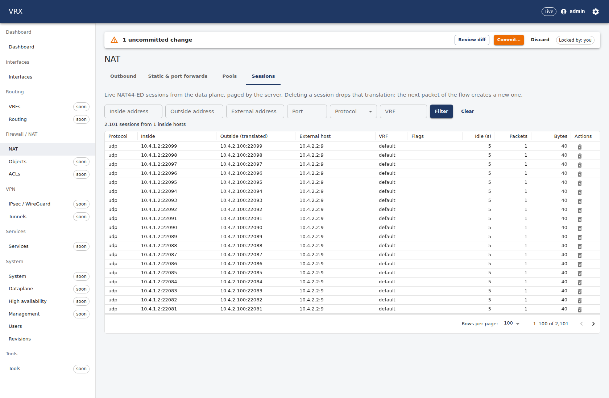
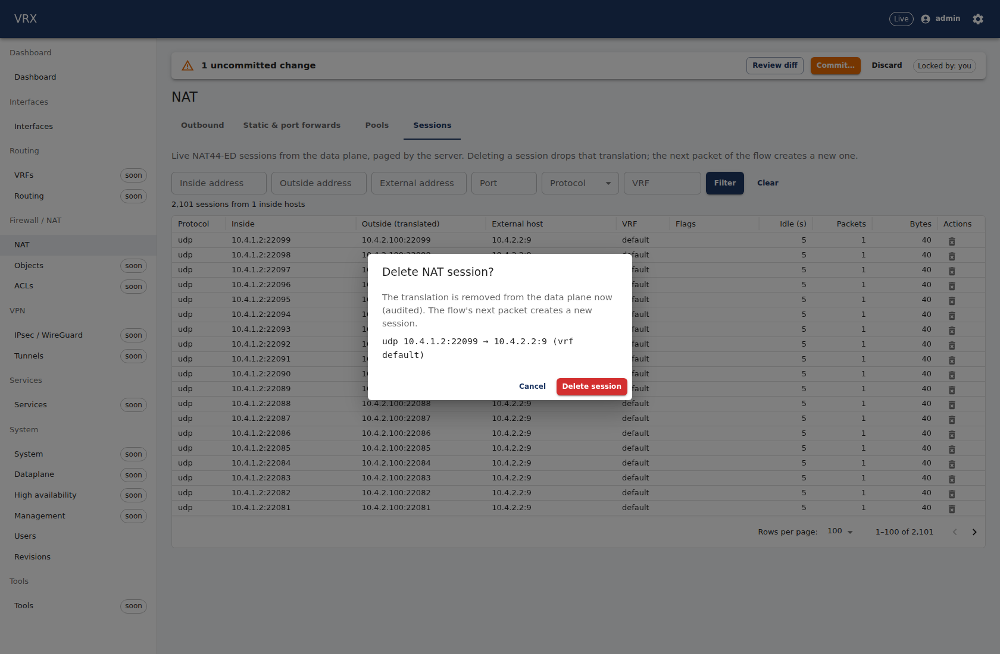
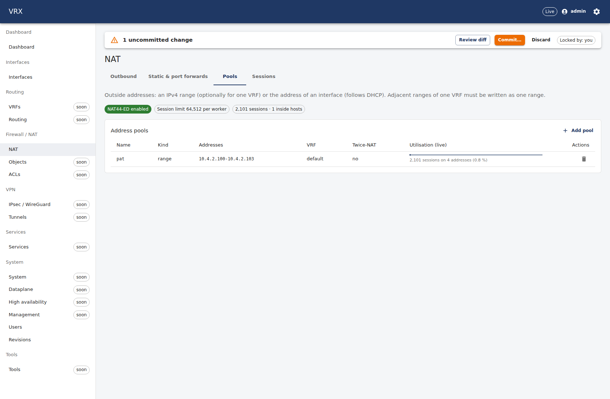
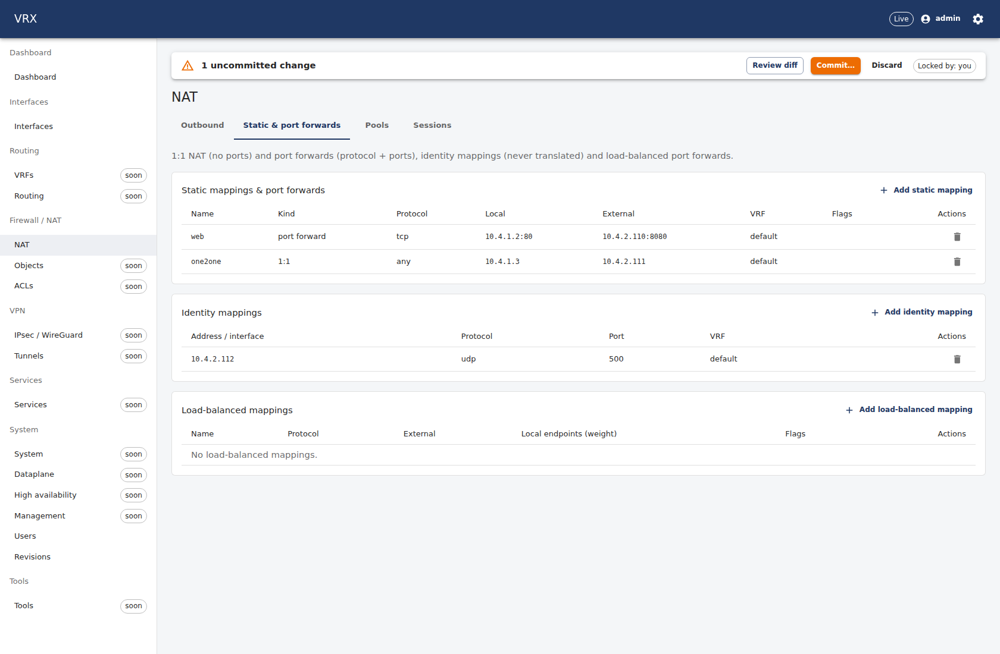
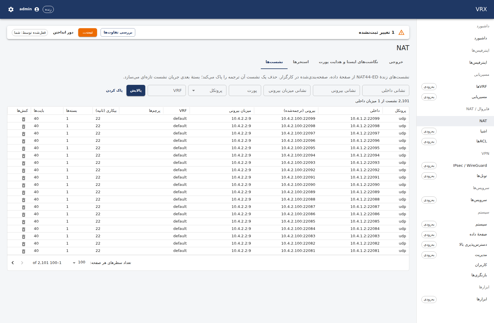
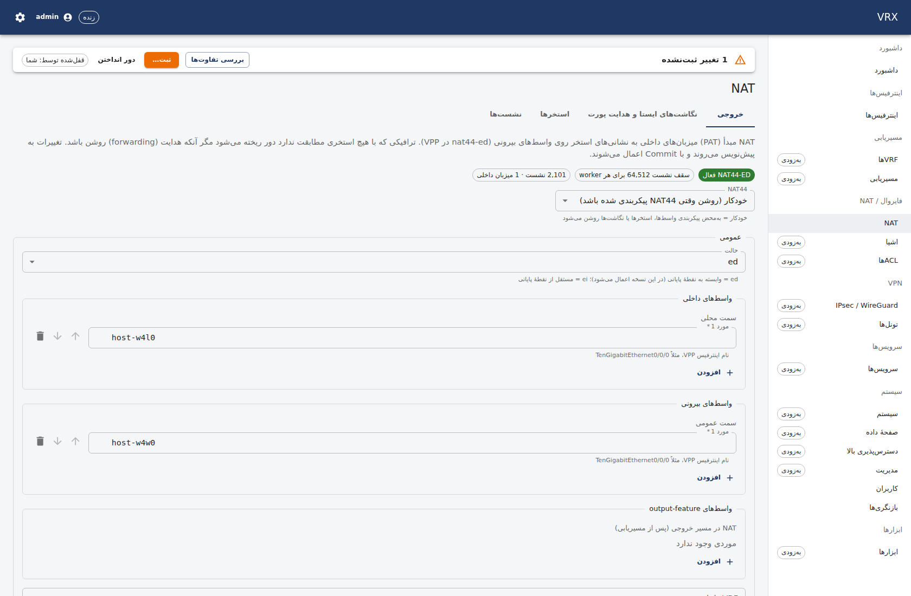

# F-nat44-ed-sessions — NAT44-ED (outbound PAT, 1:1, port forwards) + session browser

Branch `task/F-nat44-ed-sessions` (slot 4), base `task/W-seed@8b7558e` (speculative, D-114); `task/W-seed@df67a8e` merged
in (the manager's safety update: TD-5 + the D-113 rig fix) before any host run. Questions:
`F-nat44-ed-sessions-questions.md` (Q1–Q10); contract: `F-nat44-ed-sessions-contract.md`; WIP log:
`F-nat44-ed-sessions-wip.md`; screenshots: `F-nat44-ed-sessions-screens/`.

## What

| layer | built |
|---|---|
| contract | `contract(proto): nat sessions` — `rpc NatSessions` / `rpc NatSummary` (paged, `limit` ≤ 1000), `ActionRequest.nat_session_kill = 5` (§2 allocation), messages in the `// ----- F-nat44-ed-sessions -----` section; `contract(schema): nat adjacent pools` — `nat.nat44-ed-sessions-adjacent-pools` (reject, the prompt's default); `contract(api-client)` regenerated |
| agent: projection | `internal/desired/nat.go`: `nat` with `mode: "ed"` → the 10 DF-3 nat44-ed descriptors (enable / timeouts / forwarding as D-071 requirements on a slot; in/out features, output feature, range + interface pools, static / identity / LB mappings, `external.pool` resolved to the start address or the interface; every interface through `interface/<name>`, every VRF through `vrf/<id>`); `AssembleNat` back to the canonical `NatConfig`; the not-applied siblings in two anchored groups (EI: ei, nat64, nat66, nptv6 · CGNAT: det44, dslite, map, cnat + the pnat call site), ipfix outside both |
| agent: wiring | `subsystems/nat44_ed.go` (`registerNat44ED`: persisted `KeyedClaims("nat")`, `WithGlobalsOwner(env.GlobalsOwner)`), `Domains["nat"]` (with the EI / CGNAT anchors), projection hooks; `coretest/nat44ed.go` (stateful nat44-ed model, installed on every coretest model through a new `extensions` seam, Q2) |
| agent: sessions | `internal/actions/nat44-ed-sessions` (pure pager over `Plugin.Users` / `UserSessions`: whole users skipped by their counts, only the users of the page dumped; filtered scans capped at 200 000; summary per pool / protocol; kill parse + `DeleteSession`); `internal/agent/rpc_nat44_ed.go` (the two RPCs + the Action case) |
| API | `apps/api/src/features/nat44-ed-sessions` (`Nat44EdSessionsController`): `GET /api/v1/state/nat/sessions` (page/pageSize ≤ 1000 + inside/outside/external/port/protocol/vrf filters), `GET /api/v1/state/nat/summary` (joined with the running pool names), `POST /api/v1/actions/nat/sessions/kill` (operator, audited with the 5-tuple, 404 when gone); `fake.ts` for the fake agent; OpenAPI, `packages/api-client` and the CLI operation table regenerated |
| UI | `apps/web/src/domains/firewall/nat44-ed-sessions/` at `/firewall/nat`: tabs Outbound (SchemaForm of the NAT44 leaves + a three-way NAT44 on/auto/off control), Static & port forwards (static / identity / LB lists + SchemaForm dialogs), Pools (utilisation bar, applied/configured), Sessions (`ServerDataGrid`, server paging, filters, kill with confirm); `natTabs` registry with the two sibling anchors; en + fa (`nat44-ed-sessions.json`); 5 s live refresh |
| docs | `docs/user/firewall/nat44.md` (three scenarios, session browser, restart note, REST + CLI); `docs/contracts/proto.md` §11; `docs/vpp-code-track.md` `### V-new (F-nat44-ed-sessions)` |
| tests | schema (the rule + the existing ED-path rules), agent unit (builder, round trip on the model as owner and non-owner, the service end to end, gRPC sessions / summary / kill), API unit + e2e (PostgreSQL + fake agent), web (7 NAT tests), topology `test/topology/nat44-ed-sessions` (real host VPP through the af_packet rig) + the screenshot run |

## Acceptance

- [x] Packet test on the af_packet rig (path: **af_packet**): lan `10.4.1.2:40001` → wan `10.4.2.2:8000`; `tcpdump` in
      `ns-w4-wan` shows the pool address `10.4.2.100`, never `10.4.1.2`; `vppctl show nat44 sessions` and
      `GET /state/nat/sessions` show the same 5-tuple (below)
- [x] Port forward: wan → `10.4.2.110:8080` reaches the lan host on `:80` (tcpdump in the lan netns); run 5's `vppctl trace`
      of the SYN showed `nat44-ed-out2in` → `nat44-ed-out2in-slowpath`; since D-128 the test proves it with the static
      session in `vppctl show nat44 sessions` and the API instead (below)
- [x] 1:1 both directions (`10.4.1.3` ↔ `10.4.2.111`)
- [x] Kill through `POST /api/v1/actions/nat/sessions/kill` → gone from `vppctl show nat44 sessions`; audit entry shown
- [x] Agent-restart simulation (agent stopped, the slot's mappings / pools / features deleted via binapi, agent started)
      → NAT back in 0.22 s (reconcile 0.118 s by agent log, run 6); sessions lost (documented in the user page)
- [x] Rollback removes the interface features, pools and mappings (Retrieve + dumps); the plugin stays enabled (D-071)
- [x] Overlapping and adjacent pools → 400 problem+json with `pointer` `/nat/pools/1/range`
- [x] ≥ 2 000 sessions (2 105): `pageSize=100` returns 100 on every page; gRPC `limit=100` → 7 339 B, `limit=1000` →
      73 040 B (run 6), `limit=1001` → INVALID_ARGUMENT
- [ ] `tools/ci.sh --base main`: the gate stops at the contract guard because of a `tools/ci.sh` bug (Q9, reproduced);
      the whole gate without the guard (`tools/ci.sh quick`) is green (below); the contract commits are listed below

## How verified

### Topology: `test/topology/nat44-ed-sessions/run.sh -run TestNat44EdSessions` — run 6, the final host run (slot 4, 19:40, log `/root/ngfw-wt/logs/F-nat44-ed-sessions-topo-6.log`; review L6: pasted as logged, only the rig / database / process start-stop lines left out and lines over 330 characters cut with "…")
```
V19 pre-flight ok: no classify binding or classify DPO points at a missing table (0 warning(s))
=== RUN   TestNat44EdSessions
    nat_test.go:115: systemctl show vpp -p NRestarts (before) = 1
    nat_test.go:127: fixture: nat44-ed enabled for this test (VPP default session limit)
    nat_test.go:129: nat44-ed running config (fixture, was on=false): sessions/thread 64512 inside VRF 0 outside VRF 0 forwarding false timeouts {UDP:300 TCPEstablished:7440 TCPTransitory:240 ICMP:60}
    nat_test.go:137: rig up w4 (slot 4, path af_packet)
    nat_test.go:144: rig VPP side handed to the agent: sw_interface_add_del_address sw_if_index=1 (host-w4l0) del_all=true → ok
    nat_test.go:144: rig VPP side handed to the agent: af_packet_delete host_if_name=w4l0 (tag "") → ok
    nat_test.go:144: rig VPP side handed to the agent: sw_interface_add_del_address sw_if_index=2 (host-w4w0) del_all=true → ok
    nat_test.go:144: rig VPP side handed to the agent: af_packet_delete host_if_name=w4w0 (tag "") → ok
    nat_test.go:146: create role vrx_w4
=== RUN   TestNat44EdSessions/config
    nat_test.go:174: commit interfaces → applied revision 1
    nat_test.go:183: commit with pools pat=10.4.2.100-10.4.2.103 more=10.4.2.102-10.4.2.110 → 400 {"type":"https://vrx.dev/problems/validation","title":"Validation failed","status":400,"tier":"semantic","warnings":[],"detail":"semantic validation failed","instance":"/api/v1/config/commit","errors":[{"pointer":"/nat/pools/1/range…
    nat_test.go:183: commit with pools pat=10.4.2.100-10.4.2.103 more=10.4.2.104-10.4.2.110 → 400 {"type":"https://vrx.dev/problems/validation","title":"Validation failed","status":400,"tier":"semantic","warnings":[],"detail":"semantic validation failed","instance":"/api/v1/config/commit","errors":[{"pointer":"/nat/pools/1/range…
    nat_test.go:206: candidate diff: {"baseRevision":1,"changes":[{"op":"replace","pointer":"/nat/inside","from":[],"to":["host-w4l0"]},{"op":"replace","pointer":"/nat/outside","from":[],"to":["host-w4w0"]},{"op":"replace","pointer":"/nat/pools","from":[],"to":[{"name":"pat","range":"10.4.2.100-10.4.2.103","twiceNat":false,"desc…
    nat_test.go:208: commit NAT → applied revision 2 results [{"code":"ok","key":"nat44-ed.enable/global","message":"","op":"create","pointer":"/nat","subsystem":"nat"},{"code":"ok","key":"nat44-ed.interface-feature/host-w4l0/inside","message":"","op":"create","pointer":"/nat/inside/0","subsystem":"nat"},{"code":"ok","key":"nat4…
    nat_test.go:220: Retrieve(nat) = {
          "mode":  "ed",
          "inside":  [
            "host-w4l0"
          ],
          "outside":  [
            "host-w4w0"
          ],
          "pools":  [
            {
              "range":  "10.4.2.100-10.4.2.103",
              "twiceNat":  false
            }
          ],
          "staticMappings":  [
            {
              "name":  "one2one",
              "local":  {
                "ip":  "10.4.1.3"
              },
              "external":  {
                "ip":  "10.4.2.111"
              },
              "twiceNat":  false,
              "selfTwiceNat":  false,
              "out2inOnly":  false
            },
            {
              "name":  "web",
              "protocol":  "tcp",
              "local":  {
                "ip":  "10.4.1.2",
                "port":  80
              },
              "external":  {
                "ip":  "10.4.2.110",
                "port":  8080
              },
              "twiceNat":  false,
              "selfTwiceNat":  false,
              "out2inOnly":  false
            }
          ]
        }
    nat_test.go:226: vppctl show nat44 interfaces (ours):
         host-w4l0 in
         host-w4w0 out
    nat_test.go:227: vppctl show nat44 addresses (ours):
        10.4.2.100
        10.4.2.101
        10.4.2.102
        10.4.2.103
    nat_test.go:228: vppctl show nat44 static mappings (ours):
         local 10.4.1.3 external 10.4.2.111 vrf 0  
         TCP local 10.4.1.2:80 external 10.4.2.110:8080 vrf 0  
    nat_test.go:233: V19 guard: classify_table_by_interface host-w4l0 sw_if_index=2 l2=~0 ip4=~0 ip6=~0
    nat_test.go:237: vrx-vpp-preflight: <nil>
        V19 pre-flight ok: no classify binding or classify DPO points at a missing table (0 warning(s))
=== RUN   TestNat44EdSessions/packets
    nat_test.go:378: tcpdump -i w4w1 (netns ns-w4-wan) tcp port 8000:
        19:40:04.895064 IP 10.4.2.100.40001 > 10.4.2.2.8000: Flags [S], seq 3929439384, win 64240, options [mss 1460,sackOK,TS val 1401527513 ecr 0,nop,wscale 10], length 0
        19:40:04.895143 IP 10.4.2.2.8000 > 10.4.2.100.40001: Flags [S.], seq 2005428348, ack 3929439385, win 65160, options [mss 1460,sackOK,TS val 146541070 ecr 1401527513,nop,wscale 10], length 0
        19:40:04.895790 IP 10.4.2.100.40001 > 10.4.2.2.8000: Flags [.], ack 1, win 63, options [nop,nop,TS val 1401527515 ecr 146541070], length 0
        19:40:04.896040 IP 10.4.2.2.8000 > 10.4.2.100.40001: Flags [P.], seq 1:12, ack 1, win 64, options [nop,nop,TS val 146541071 ecr 1401527515], length 11
        19:40:04.896748 IP 10.4.2.100.40001 > 10.4.2.2.8000: Flags [.], ack 12, win 63, options [nop,nop,TS val 1401527516 ecr 146541071], length 0
    nat_test.go:393: outbound PAT: 10.4.1.2:40001 → seen on the wan side as 10.4.2.100:40001 (pool 10.4.2.100-10.4.2.103)
    nat_test.go:395: vppctl show nat44 sessions filter i2o saddr 10.4.1.2 filter i2o sport 40001:
        NAT44 ED sessions:
        -------- thread 0 vpp_main: 2 sessions --------
            i2o 10.4.1.2 proto TCP port 40001 fib 0
            o2i 10.4.2.100 proto TCP port 40001 fib 0
               external host 10.4.2.2:8000
               i2o flow: match: saddr 10.4.1.2 sport 40001 daddr 10.4.2.2 dport 8000 proto TCP fib_idx 0 rewrite: saddr 10.4.2.100 sport 40001 daddr 10.4.2.2 dport 8000 txfib 0 
               o2i flow: match: saddr 10.4.2.2 sport 8000 daddr 10.4.2.100 dport 40001 proto TCP fib_idx 0 rewrite: saddr 10.4.2.2 daddr 10.4.1.2 dport 40001 txfib 0 
               index 1
               last heard 3516.86
               timeout in 7438.23
               total pkts 5, total bytes 287
               dynamic translation
        Showed: 1, Filtered: 1 of total 2 sessions of thread 0
    nat_test.go:400: GET /state/nat/sessions?inside=10.4.1.2&port=40001&protocol=tcp → {"bytes":287,"externalAddress":"10.4.2.2","externalNatAddress":"0.0.0.0","externalNatPort":0,"externalPort":8000,"idleSeconds":1,"insideAddress":"10.4.1.2","insidePort":40001,"outsideAddress":"10.4.2.100","outsidePort":40001,"packets":5,"proto…
    nat_test.go:411: wan 10.4.2.2:41001 → 10.4.2.110:8080: <nil> vrx-nat-ok
    nat_test.go:416: tcpdump -i w4l1 (netns ns-w4-lan) tcp port 80:
        19:40:07.976684 IP 10.4.2.2.41001 > 10.4.1.2.80: Flags [S], seq 1904765615, win 64240, options [mss 1460,sackOK,TS val 3540768769 ecr 0,nop,wscale 10], length 0
        19:40:07.976788 IP 10.4.1.2.80 > 10.4.2.2.41001: Flags [S.], seq 1242479299, ack 1904765616, win 65160, options [mss 1460,sackOK,TS val 3803641645 ecr 3540768769,nop,wscale 10], length 0
        19:40:07.977656 IP 10.4.2.2.41001 > 10.4.1.2.80: Flags [.], ack 1, win 63, options [nop,nop,TS val 3540768771 ecr 3803641645], length 0
        19:40:07.978179 IP 10.4.1.2.80 > 10.4.2.2.41001: Flags [P.], seq 1:12, ack 1, win 64, options [nop,nop,TS val 3803641646 ecr 3540768771], length 11: HTTP
        19:40:07.979867 IP 10.4.2.2.41001 > 10.4.1.2.80: Flags [.], ack 12, win 63, options [nop,nop,TS val 3540768773 ecr 3803641646], length 0
        19:40:07.979903 IP 10.4.2.2.41001 > 10.4.1.2.80: Flags [F.], seq 1, ack 12, win 63, options [nop,nop,TS val 3540768773 ecr 3803641646], length 0
        19:40:07.980578 IP 10.4.1.2.80 > 10.4.2.2.41001: Flags [.], ack 2, win 64, options [nop,nop,TS val 3803641649 ecr 3540768773], length 0
    nat_test.go:422: vppctl show nat44 sessions filter i2o saddr 10.4.1.2 filter i2o sport 80:
        NAT44 ED sessions:
        -------- thread 0 vpp_main: 3 sessions --------
            i2o 10.4.1.2 proto TCP port 80 fib 0
            o2i 10.4.2.110 proto TCP port 8080 fib 0
               external host 10.4.2.2:41001
               i2o flow: match: saddr 10.4.1.2 sport 80 daddr 10.4.2.2 dport 41001 proto TCP fib_idx 0 rewrite: saddr 10.4.2.110 sport 8080 
               o2i flow: match: saddr 10.4.2.2 sport 41001 daddr 10.4.2.110 dport 8080 proto TCP fib_idx 0 rewrite: daddr 10.4.1.2 dport 80 txfib 0 
               index 2
               last heard 3519.95
               timeout in 239.62
               total pkts 7, total bytes 391
               static translation
        Showed: 1, Filtered: 2 of total 3 sessions of thread 0
    nat_test.go:428: GET /state/nat/sessions?inside=10.4.1.2&port=41001&protocol=tcp → {"bytes":391,"externalAddress":"10.4.2.2","externalNatAddress":"0.0.0.0","externalNatPort":0,"externalPort":41001,"idleSeconds":0,"insideAddress":"10.4.1.2","insidePort":80,"outsideAddress":"10.4.2.110","outsidePort":8080,"packets":7,"protocol…
    nat_test.go:440: 1:1 outbound 10.4.1.3:42001 → 10.4.2.2:8000; tcpdump on the wan side:
        19:40:09.192884 IP 10.4.2.111.42001 > 10.4.2.2.8000: Flags [S], seq 2545416956, win 64240, options [mss 1460,sackOK,TS val 1451758756 ecr 0,nop,wscale 10], length 0
        19:40:10.231809 IP 10.4.2.111.42001 > 10.4.2.2.8000: Flags [S], seq 2545416956, win 64240, options [mss 1460,sackOK,TS val 1451759796 ecr 0,nop,wscale 10], length 0
        19:40:10.232750 IP 10.4.2.111.42001 > 10.4.2.2.8000: Flags [.], ack 3065150811, win 63, options [nop,nop,TS val 1451759797 ecr 1223823856], length 0
        19:40:10.233753 IP 10.4.2.111.42001 > 10.4.2.2.8000: Flags [.], ack 12, win 63, options [nop,nop,TS val 1451759798 ecr 1223823857], length 0
        19:40:10.234773 IP 10.4.2.111.42001 > 10.4.2.2.8000: Flags [F.], seq 0, ack 12, win 63, options [nop,nop,TS val 1451759798 ecr 1223823857], length 0
    nat_test.go:447: 1:1 inbound 10.4.2.2:43001 → 10.4.2.111:9000 (lan 10.4.1.3:9000): <nil> vrx-nat-ok
    nat_test.go:458: udp flows: <nil> sent 2100
    nat_test.go:466: GET /state/nat/sessions?pageSize=100 → 100 items, total 2105, totalUsers 2, truncated false (32938 bytes)
    nat_test.go:473: GET /state/nat/sessions?pageSize=100&page=2 → 100 items (32922 bytes)
    nat_test.go:473: GET /state/nat/sessions?pageSize=100&page=21 → 100 items (32923 bytes)
    nat_test.go:485: gRPC NatSessions limit=100 → 100 sessions, total 2105, next 100, message 7339 bytes (grpc-go default max 4 MiB)
    nat_test.go:485: gRPC NatSessions limit=1000 → 1000 sessions, total 2105, next 1000, message 73040 bytes (grpc-go default max 4 MiB)
    nat_test.go:493: gRPC NatSessions limit=1001 → rpc error: code = InvalidArgument desc = limit 1001 > 1000
    nat_test.go:498: GET /state/nat/sessions?protocol=udp&external=10.4.2.2&pageSize=5 → total 2100, first {"bytes":108,"externalAddress":"10.4.2.2","externalNatAddress":"0.0.0.0","externalNatPort":0,"externalPort":9,"idleSeconds":0,"insideAddress":"10.4.1.2","insidePort":20000,"outsideAddress":"10.4.2.100","outsidePort":20000,"…
    nat_test.go:500: GET /state/nat/summary → {"enabled":true,"sessionLimit":64512,"totalUsers":2,"totalSessions":2105,"staticSessions":3,"truncated":false,"byProtocol":{"icmp":1,"tcp":4,"udp":2100},"pools":[{"name":"pat","kind":"range","range":"10.4.2.100-10.4.2.103","interface":null,"vrf":"default","twiceNat":false,"addresses"…
    nat_test.go:506: vppctl show nat44 sessions filter i2o saddr 10.4.1.2 filter i2o proto udp: 4200 i2o lines
    nat_test.go:511: POST /api/v1/actions/nat/sessions/kill {"externalAddress":"10.4.2.2","externalPort":8000,"insideAddress":"10.4.1.2","insidePort":40001,"protocol":"tcp"} → {"deleted":true,"summary":"session deleted: tcp 10.4.1.2:40001 -> 10.4.2.2:8000 (table 0)","stats":{"external_port":"8000","table_id":"0","protocol":"tcp"…
    nat_test.go:513: vppctl show nat44 sessions filter i2o saddr 10.4.1.2 filter i2o sport 40001 (after the kill):
        NAT44 ED sessions:
        -------- thread 0 vpp_main: 2104 sessions --------
        Showed: 0, Filtered: 2104 of total 2104 sessions of thread 0
    nat_test.go:518: second kill → 404 {"type":"https://vrx.dev/problems/not-found","title":"Not found","status":404,"detail":"agent: no such session: tcp 10.4.1.2:40001 -> 10.4.2.2:8000 (table 0)","instance":"/api/v1/actions/nat/sessions/kill"}
    nat_test.go:528: audit entry: action=POST /api/v1/actions/nat/sessions/kill resource=nat/sessions/tcp/10.4.1.2:40001/10.4.2.2:8000/default result=failure status=404 user=admin
    nat_test.go:528: audit entry: action=POST /api/v1/actions/nat/sessions/kill resource=nat/sessions/tcp/10.4.1.2:40001/10.4.2.2:8000/default result=success status=200 user=admin
=== RUN   TestNat44EdSessions/restart-safety
    nat_test.go:541: simulated loss: nat44_add_del_static_mapping_v2 is_add=0 tag=w4:one2one → ok
    nat_test.go:541: simulated loss: nat44_add_del_static_mapping_v2 is_add=0 tag=w4:web → ok
    nat_test.go:541: simulated loss: nat44_add_del_address_range is_add=0 10.4.2.100 vrf 0 → ok
    nat_test.go:541: simulated loss: nat44_add_del_address_range is_add=0 10.4.2.101 vrf 0 → ok
    nat_test.go:541: simulated loss: nat44_add_del_address_range is_add=0 10.4.2.102 vrf 0 → ok
    nat_test.go:541: simulated loss: nat44_add_del_address_range is_add=0 10.4.2.103 vrf 0 → ok
    nat_test.go:541: simulated loss: nat44_interface_add_del_feature is_add=0 host-w4l0 flags=32 → ok
    nat_test.go:541: simulated loss: nat44_interface_add_del_feature is_add=0 host-w4w0 flags=16 → ok
    nat_test.go:546: nat44-ed dumps after the loss: no feature, pool address or mapping of the slot
    nat_test.go:567: agent log: {"time":"2026-09-24T19:40:15.299308994+03:30","level":"INFO","msg":"vrx-agent starting","version":"dev","pid":2852069,"owner":"w4","socket":"/run/vrx-test/w4/agent.sock","vpp_api":"/run/vpp/api.sock"}
    nat_test.go:572: agent log: {"time":"2026-09-24T19:40:15.330120602+03:30","level":"INFO","msg":"reconcile start","owner":"w4","txn_id":"","mode":"resync","domains":["interfaces","vrfs","routing","nat"]}
    nat_test.go:572: agent log: {"time":"2026-09-24T19:40:15.380474569+03:30","level":"INFO","msg":"created","owner":"w4","component":"scheduler","key":"nat44-ed.enable/global"}
    nat_test.go:572: agent log: {"time":"2026-09-24T19:40:15.382884291+03:30","level":"INFO","msg":"created","owner":"w4","component":"scheduler","key":"nat44-ed.interface-feature/host-w4l0/inside"}
    nat_test.go:572: agent log: {"time":"2026-09-24T19:40:15.384322019+03:30","level":"INFO","msg":"created","owner":"w4","component":"scheduler","key":"nat44-ed.interface-feature/host-w4w0/outside"}
    nat_test.go:572: agent log: {"time":"2026-09-24T19:40:15.385632959+03:30","level":"INFO","msg":"created","owner":"w4","component":"scheduler","key":"nat44-ed.address-pool/10.4.2.100-10.4.2.103/0"}
    nat_test.go:572: agent log: {"time":"2026-09-24T19:40:15.386902587+03:30","level":"INFO","msg":"created","owner":"w4","component":"scheduler","key":"nat44-ed.static-mapping/one2one"}
    nat_test.go:572: agent log: {"time":"2026-09-24T19:40:15.388324471+03:30","level":"INFO","msg":"created","owner":"w4","component":"scheduler","key":"nat44-ed.static-mapping/web"}
    nat_test.go:572: agent log: {"time":"2026-09-24T19:40:15.417472482+03:30","level":"INFO","msg":"reconcile done","owner":"w4","txn_id":"","mode":"resync","domains":["interfaces","vrfs","routing","nat"],"status":"APPLY_STATUS_APPLIED","summary":"created:6  unchanged:8","reapplied":0,"duration":87214551,"err":""}
    nat_test.go:570: agent log: {"time":"2026-09-24T19:40:15.417563006+03:30","level":"INFO","msg":"resync finished","owner":"w4","status":"APPLY_STATUS_APPLIED","summary":"created:6  unchanged:8"}
    nat_test.go:575: NAT back in Retrieve 0.22s after the agent start (no config API call); reconcile 2026-09-24T19:40:15.299308994+03:30 → 2026-09-24T19:40:15.417563006+03:30 = 0.118s (agent log)
    nat_test.go:579: vppctl show nat44 interfaces (ours, after the restart):
         host-w4w0 out
         host-w4l0 in
    nat_test.go:580: vppctl show nat44 static mappings (ours, after the restart):
         TCP local 10.4.1.2:80 external 10.4.2.110:8080 vrf 0  
         local 10.4.1.3 external 10.4.2.111 vrf 0  
    nat_test.go:582: sessions of 10.4.1.2 after the loss + restart: vppctl prints 3 lines (the pools' sessions went with the pool addresses — documented)
=== RUN   TestNat44EdSessions/rollback
    nat_test.go:259: POST /config/rollback/1 → {"status":"applied","revision":{"id":3,"createdAt":"2026-09-24T16:10:15.668Z","authorId":1,"author":"admin","comment":"nat-rollback","parentId":2,"hash":"c604cbfcb839375d8d084b0d5691755b15f0bfe29151fb927176dd2d1eb66029","txnId":"b82beb48-351b-40d1-a7a2-3d0e0c0356f6","kind":"rollback…
    nat_test.go:264: Retrieve(nat) after rollback = <nil> (size 0)
    nat_test.go:269: slot objects left in nat44-ed after rollback: 0 []
    nat_test.go:274: nat44-ed still enabled after rollback (D-071: a slot never disables it): true (sessions/thread 64512)
    nat_test.go:278: vppctl show nat44 interfaces (ours, after rollback):
=== RUN   TestNat44EdSessions/cleanup-through-api
    nat_test.go:287: commit (interfaces deleted) → applied revision 4
=== NAME  TestNat44EdSessions
    rig_test.go:129: pg-test drop w4: <nil>
        drop   database vrx_w4
        drop   role vrx_w4
        ok     nothing named vrx_w4 / vrx_w4 remains
    nat_test.go:140: rig down: <nil>
    natvpp_test.go:216: fixture: nat44-ed disabled again under the exclusive fixture lock (previous state restored)
    nat_test.go:118: systemctl show vpp -p NRestarts (after) = 1
--- PASS: TestNat44EdSessions (25.72s)
    --- PASS: TestNat44EdSessions/config (1.60s)
    --- PASS: TestNat44EdSessions/packets (11.65s)
    --- PASS: TestNat44EdSessions/restart-safety (2.29s)
    --- PASS: TestNat44EdSessions/rollback (0.22s)
    --- PASS: TestNat44EdSessions/cleanup-through-api (0.34s)
```
NRestarts 1 → 1 (the 18:41:08 crash that moved it from 0 to 1 predates this task's first host run at 18:57, Q8).
Run 6 is the code after the D-128 change (no `vppctl trace`); run 5 (19:13, `…-topo-5.log`) was the same test with the
port-forward trace. Runs 1–4 before them found three test-side issues, all fixed in the test and recorded: the rig's netns tx checksum offload
breaks NATed TCP through af_packet (Q7, `### V-new`), DF-3's fixture enables the plugin with 1024 sessions per thread
(the ≥ 2 000 step needs VPP's default; my fixture enables with the default), and a cleanup gap on failure.

### Screenshots: `run.sh -run TestNat44EdScreenshots` (19:22, production build under `vite preview`, real API + agent + VPP, 2 101 live sessions; headless Chrome-for-Testing + playwright-core from the npx cache, nothing installed — Playwright is not on the host)
```
    shots_test.go:123: GET /state/nat/summary → {"enabled":true,"sessionLimit":64512,"totalUsers":1,"totalSessions":2101,"staticSessions":0,"truncated":false,"byProtocol":{"tcp":1,"udp":2100},"pools":[{"name":"pat",…,"sessions":2101,…}]}
    shots_test.go:140: screenshots:
        nat-sessions-en.png  html dir/lang=ltr/en  total="2,101 sessions from 1 inside hosts"  gridRows=28  pageErrors=0
        nat-sessions-kill-dialog-en.png  tuple="udp 10.4.1.2:22099 → 10.4.2.2:9 (vrf default)"  pageErrors=0
        nat-pools-en.png  html dir/lang=ltr/en  bar="1"  pageErrors=0
        nat-outbound-en.png  html dir/lang=ltr/en  status="NAT44-ED enabled Session limit 64,512 per worker 2,101 sessions · 1 inside hosts"  pageErrors=0
        nat-static-en.png  html dir/lang=ltr/en  status="-"  pageErrors=0
        nat-sessions-fa-rtl.png  html dir/lang=rtl/fa  total="2,101 نشست از 1 میزبان داخلی"  gridRows=28  pageErrors=0
        nat-pools-fa-rtl.png  html dir/lang=rtl/fa  bar="1"  pageErrors=0
        nat-outbound-fa-rtl.png  html dir/lang=rtl/fa  status="NAT44-ED فعال سقف نشست 64,512 برای هر worker 2,101 نشست · 1 میزبان داخلی"  pageErrors=0
        nat-static-fa-rtl.png  html dir/lang=rtl/fa  status="-"  pageErrors=0
--- PASS: TestNat44EdScreenshots (49.49s)
```







### Unit and e2e
```
$ go test -count=1 -v ./internal/desired/ ./internal/actions/...          (apps/agent)
--- PASS: TestNatBuilderKeysAndPointers · TestNatBuilderOffDefaultsAndSiblings · TestNatBuilderErrors
--- PASS: TestNatRoundTripNonOwner · TestNatRoundTripGlobalsOwner · TestAssembleNatEmptyAndDefaults · TestNat44EnabledMirrorsSchema
ok  	ngfw/agent/internal/desired	0.245s
--- PASS: TestListPagesByUserCounts · TestListOwnership · TestListFilters · TestParse · TestKill · TestSummarize
ok  	ngfw/agent/internal/actions/nat44-ed-sessions	0.180s
$ go test -count=1 -v -run TestNat ./internal/agent/
--- PASS: TestNatDomainOnFake (0.11s)
--- PASS: TestNatSessionsSummaryKillOverGRPC (0.08s)
ok  	ngfw/agent/internal/agent	0.271s
$ pnpm --filter @ngfw/schema test            Test Files 38 passed (38) · Tests 1223 passed (1223)   (+9: nat44-ed-sessions.test.ts)
$ pnpm --filter @ngfw/api test               Test Files 9 passed (9) · Tests 54 passed (54)
$ vitest -c vitest.e2e.config.ts test/e2e/nat44-ed-sessions.e2e.test.ts   (slot 4 database + fake agent)
 ✓ test/e2e/nat44-ed-sessions.e2e.test.ts (5 tests)
$ pnpm --filter @ngfw/web test               Test Files 15 passed (15) · Tests 102 passed (102)   (7 NAT tests)
$ make -C apps/agent lint                    0 issues.
```

### CI
`TMPDIR=/tmp/g-w4 tools/ci.sh --base main` stops in its first step, the contract guard, on a `tools/ci.sh` bug (Q9:
`git log | grep -q` under `pipefail` → SIGPIPE 141 once the branch's commit subjects since the merge base with main exceed
8 KiB — 8 383 bytes here, most of it P08's and W-seed's history):
```
== contract guard: HEAD vs main ==
contract files changed in HEAD since main: (… 13 files …)
CI GATE FAILED — CONTRACT FILES CHANGED WITHOUT A CONTRACT COMMIT. …
$ bash -c 'set -o pipefail; mb=$(git merge-base HEAD main); git log --format=%s "$mb..HEAD" | grep -qiE "^contract(\(|:|!)"; echo "rc=${PIPESTATUS[*]}"'
rc=141 0        (8/8 runs)
```
The guard with the W-seed base (my commits only) and the whole gate without the guard:
```
$ TMPDIR=/tmp/g-w4 tools/ci.sh check --base task/W-seed
ok — contract commit(s) on the branch:
  2b6b70d contract(api-client): nat44-ed-sessions routes (Nat44EdSessions_sessions/_summary/_kill), regenerated; CLI operation table
  a7d7469 contract(schema): nat adjacent pools
  bd4e9e3 contract(proto): nat sessions
ok: gitleaks — scanned ~527407 bytes (527.41 KB) in 1.81s no leaks found
check PASSED (0m05s)

$ TMPDIR=/tmp/g-w4 tools/ci.sh quick          (head b293f08; log /root/ngfw-wt/logs/ci/F-nat44-ed-sessions-20260924-193054-2687736)
== generate + generated-output gate ==
clean: packages/proto/gen apps/agent/gen packages/schema/dist packages/api-client/src/generated
== lint · typecheck · unit tests · build (turbo) ==
Tasks:    30 successful, 30 total Cached:    12 cached, 30 total Time:    3m26.433s
== apps/agent: make lint test build ==        (0 issues · 91 packages ok, 0 FAIL)
== apps/cli: make lint test build ==          (0 issues)
test/topology/nat44-ed-sessions: gofmt ok · go vet ok · ok  	ngfw/test/topology/nat44-ed-sessions	0.033s;
  mode quick · wall time 7m11s
CI GATE PASSED
```
The one change after that run (6f3fba8) touches only `test/topology/nat44-ed-sessions/*_test.go` (the D-128 trace
removal): `gofmt -l` empty, `go vet` ok, `go test` ok, and the host run 6 above passed on it.

## Shared hunks (append-only, under my anchors unless stated)

| id | file | hunk |
|---|---|---|
| A1 | `apps/agent/internal/subsystems/subsystems.go` | `Nat = "nat"` (const anchor); `Nat: natDomain(nat44EDDescriptors, // wave-A: F-nat44-ei-64-66-nptv6, // wave-BC: F-det44-map-dslite-cnat)` (new-domain anchor; the two sibling anchors are new, in my own entry); `registerNat44ED` call (Register anchor) |
| A2 | `apps/agent/internal/agent/projection.go` | `desired.Nat(p, ds.GetNat(), vrfID)` in `project()`; `desired.AssembleNat` in `assemble()` |
| A4 | `apps/agent/internal/agent/server.go` | the `NatSessionKill` case; **outside the anchor:** `_` → `stream` in the `Action` signature (Q2.4) |
| A6 | `apps/agent/internal/descriptors/core/coretest/fakevpp.go` | **outside any anchor:** the `extensions` seam in `New()` (Q2.2) |
| — | `apps/agent/internal/agent/service_test.go` | **not a hotspot:** 4 assertion lines adapted to a build that implements `nat` (Q2.1) |
| C2 | `packages/schema/src/semantic/index.ts` | one import + one spread |
| C5 | `packages/proto/vrx/v1/dataplane.proto` | the two RPCs (framed), `nat_session_kill = 5`, the messages in my section |
| C6 | `docs/contracts/proto.md` | `### F-nat44-ed-sessions: NatSessions` |
| C7 | generated | `apps/agent/gen/**`, `packages/proto/gen/ts/**`, `packages/api-client/src/generated/**`, `apps/cli/internal/api/operations_gen.go` (regenerated, never hand-edited) |
| P1 | `apps/api/src/app.module.ts` | import + controllers spread + providers spread |
| P4 | `apps/api/src/agent/agent.client.ts` | 6 type imports; `natSessions`, `natSummary`, `natSessionKill` |
| P5 | `apps/api/src/testing/fake-agent.ts` | `...nat44EdSessionsFake(this)`; **outside the anchor:** one import line (no import anchor) and the `action` handler's `destroy` → `emit('error')` fix (Q2.3) |
| W1 | `apps/web/src/router.tsx` | the `/firewall/nat` route |
| W2 | `apps/web/src/nav/nav.ts`, `nav.test.ts` | `'nat'` |
| W3 | `apps/web/src/i18n.ts` | 2 imports, namespace, en + fa entries |
| A7 | `docs/vpp-code-track.md` | `### V-new (F-nat44-ed-sessions)` appended |

## Decisions (for the LOG, with the options)

1. **Adjacent pools: reject** in the schema (`nat.nat44-ed-sessions-adjacent-pools`). Options: (a) reject (prompt default),
   (b) merge in the builder. (b) makes the applied state differ from the document, so Retrieve could never equal desired.
2. **A pool without `vrf` = tenant VRF 0** (the proto comment "unset = default"). Options: (a) table 0, (b) VPP's "any"
   (`~0`). (a) keeps the round trip exact, and VPP binds a pool address to the outside interface's subnet only when the
   pool's FIB equals that interface's FIB, which makes source selection deterministic on the shared host.
3. **Identity mappings get a derived id** `id-<16 hex of SHA-256(tuple)>` for the VPP tag (the schema has no name).
   Options: (a) content hash, (b) list index. (a) is stable under reordering; the assembler never reports it.
4. **1:1 = no ports**; a `protocol` on a portless static or identity mapping is a DryRun warning
   (`agent.unsupported-field`), not an error. Options: warning / error. The schema allows it; VPP ignores it.
5. **`nat` Retrieve is left unset when no NAT object exists** (instead of `{}`), so the other domains' canonical
   documents stay unchanged (existing agent tests). Options: unset / empty message.
6. **Session paging by offset**, users ordered by (table, address), whole users skipped by their counts; filtered scans
   capped at 200 000 sessions (`truncated`). Options: offset / opaque page token; cap / full scan.
7. **Kill requires the full ED 5-tuple** (`nat44_ed_del_session` looks up the flow hash with the external host) and an
   inside address in the owner's scope. Exit codes 0 / 1 (no such session → 404) / 2 (VPP error → 502).
8. **Summary pools come from the agent's own Retrieve** (the persisted claims decide what is owned), not from a second
   plugin instance; the API joins them with the running pool names by identity (Q3: drift of NAT lists stays as is).
9. **Test side:** tx checksum offload off in the rig namespaces (Q7); the plugin fixture enables with VPP's default
   session limit; a slot NAT gc test (`VRX_NAT_GC=1`).

## Out of scope / not done

- NAT44-EI, NAT64/66, NPTv6, DET44/CGNAT, DS-Lite, MAP, CNAT/PNAT, NAT IPFIX, HA session sync, `nat44-ed.vrf-table`,
  ALGs, ACL/object-model integration — DryRun warns `agent.unsupported-field` for the present subtrees.
- `/state/drift` for NAT lists (Q3), the interface-pool key gap (Q4), the fake agent's per-feature Action dispatch (Q5),
  the rig offload fix in `tools/lab` (Q7), the ci.sh guard fix (Q9): manager items.
- CLI `show nat sessions`: `apps/cli` is not in this task; the user page gives REST + `vrx set/merge nat`.
- The ServerDataGrid pager's "of" label is not localised in fa (packages/ui-kit, read-only).

## Cleanup

Every process this task started was stopped by PID inside the tests (agent, API, vite preview, python helpers, tcpdump);
the lab lock is held only during runs (`tools/lab lock shared`); the test database is created and dropped by the tests.
After the last run (19:45):
```
== processes of this task (slot 4 paths, vite on 5400, api on 3400)
(none)
(no listener on 3400/5400/9141)
== rig
rig: down
== database vrx_w4
0
== nat44-ed objects of w4 (dumps)
NAT44 interfaces:
(no 10.4.x pool address)
(no 10.4.x static/identity mapping)
(no w4 interface)
== locks
slot nat44 lock free
NRestarts=1
$ VRX_INTEGRATION=1 VRX_NAT_GC=1 VRX_NAT_GC_DISABLE_IF_EMPTY=1 … go test -run TestNat44EdGC .
    nat_test.go:313: before: []
    nat_test.go:320: no NAT44-ED object of the slot is left
    nat_test.go:329: plugin left as is: enabled=false empty=true vrf tables=""
--- PASS: TestNat44EdGC (0.04s)
```
nat44-ed is disabled, as the fixture found it before this task's first run (18:57). Two aborted runs (1 and 2, before the
cleanup-on-failure fix) had left the slot's pool addresses and mappings behind for ~10 min; `TestNat44EdGC` removed them
at 19:08 and restored "disabled". `apps/*/dist`, `packages/*/dist` and `apps/agent/bin` are removed after the final
commit.
