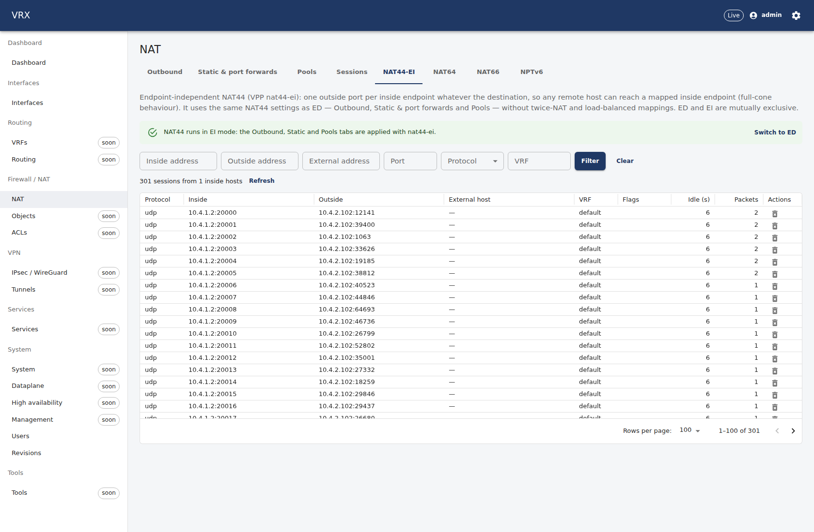
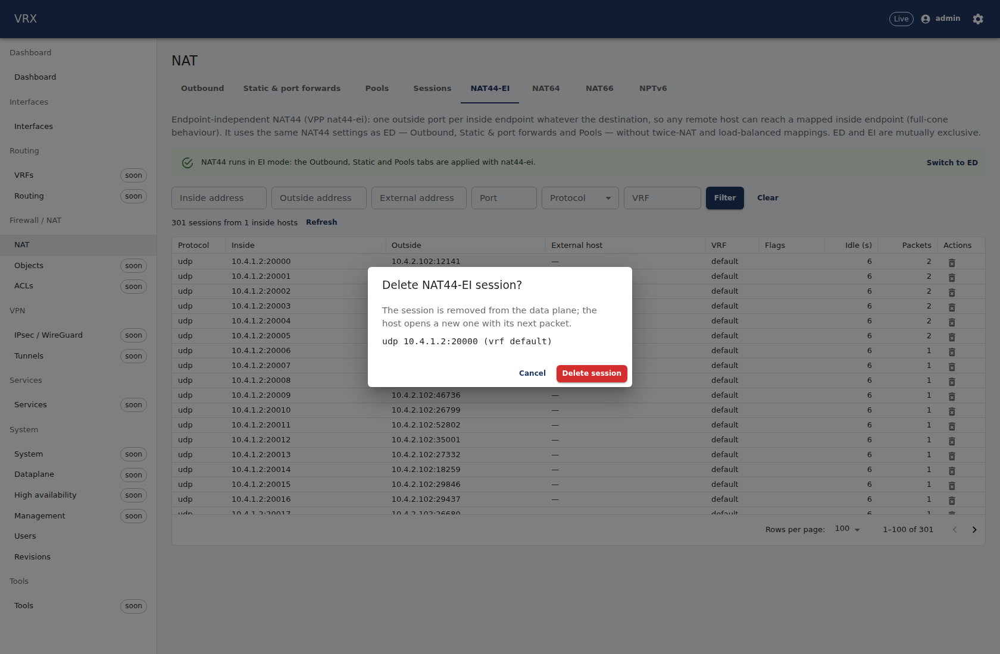
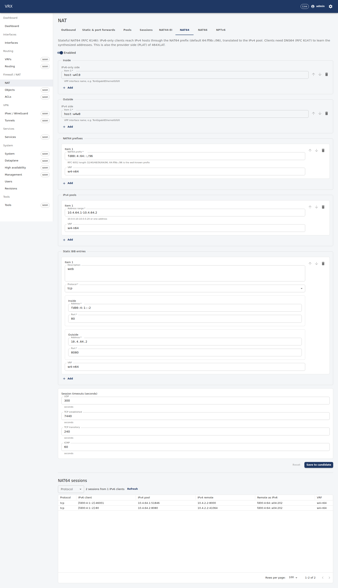
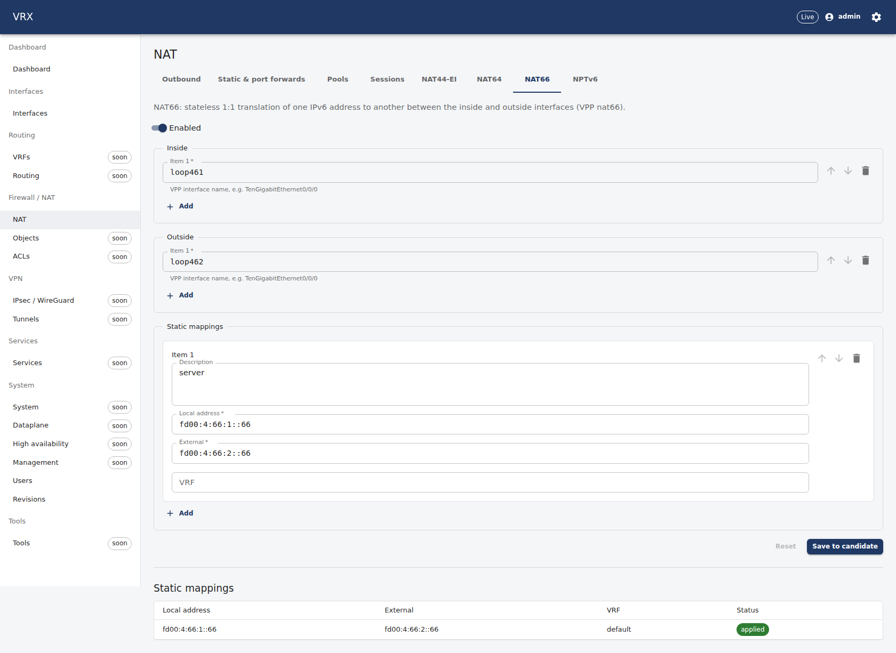
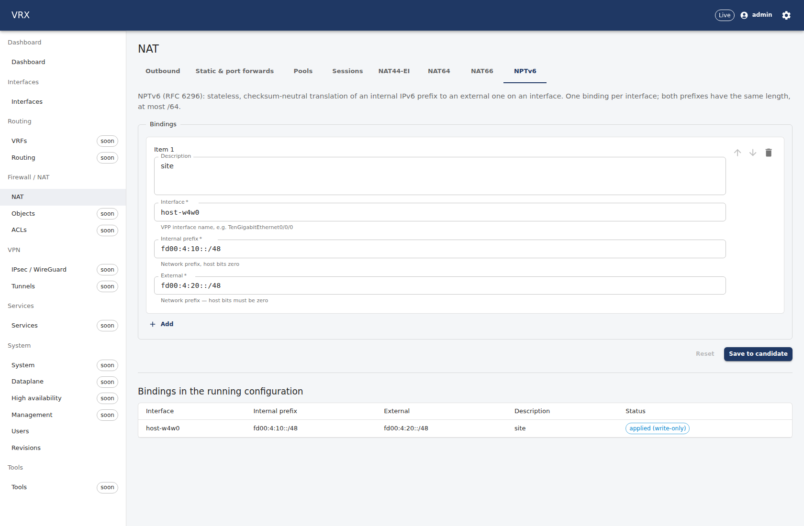
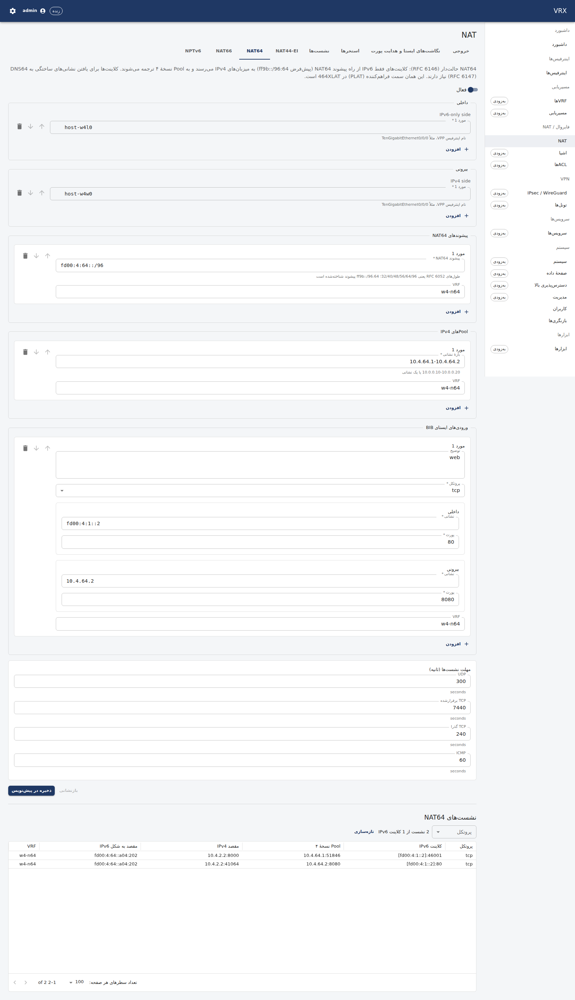
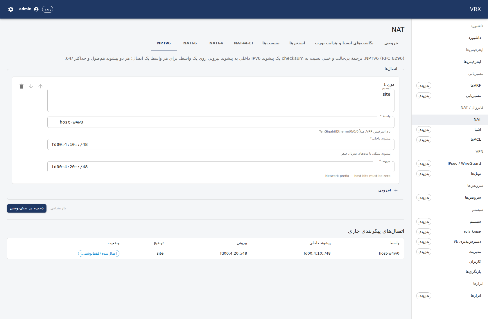

# F-nat44-ei-64-66-nptv6 — NAT44-EI, NAT64, NAT66, NPTv6

Branch `task/F-nat44-ei-64-66-nptv6` (slot 4), base `task/F-nat44-ed-sessions@acc1877` (speculative, D-114); ED's fix
round 1 (`bf093407`) merged in at `d3740a12` (Q3). Questions: `F-nat44-ei-64-66-nptv6-questions.md` (Q1–Q10); contract:
`F-nat44-ei-64-66-nptv6-contract.md`; WIP log: `F-nat44-ei-64-66-nptv6-wip.md`; screenshots:
`F-nat44-ei-64-66-nptv6-screens/`. Host logs: `/root/ngfw-wt/logs/F-nat44-ei-64-66-nptv6-*.log`.

## What

| layer | built |
|---|---|
| contract | `contract(proto): nat session variants` — `enum NatSessionVariant {UNSPECIFIED, ED, EI, NAT64}`, `optional … variant` on `NatSessionsRequest` (5), `NatSessionsResponse` (8), `NatSessionKillAction` (7); no new RPC, no `ActionRequest` member, no `NatConfig` number; proto.md §11 section |
| agent: projection | `internal/desired/nat44ei.go` (`mode: "ei"` → the 9 nat44-ei descriptors; ED-only leaves are errors with pointers, `sessionLimit` a warning, a port forward outside the pools an error — VPP rule found on the host), `nat64.go` (enable, timeouts, interfaces, RFC 6052 prefixes, pools, static BIBs), `nat66.go` (enable, interfaces with side, static mappings), `nptv6.go` (`npt66.binding/<if>/<internal>`, same length ≤ /64, one per interface); assemblers back to `NatConfig` (NPTv6 is write-only: never retrieved); dispatched under this task's anchors in `desired/nat.go` |
| agent: npt66 | new `descriptors/npt66` (write-only, D-063; VPP's add is idempotent, so no D-076 record; depends on `interface/<name>` → deleted before its interface, D-095c) |
| agent: wiring | `subsystems/nat44_ei_64_66_nptv6.go` (persisted `KeyedClaims("nat")`, `WithGlobalsOwner(env.GlobalsOwner)`), `Domains["nat"]` group; coretest models `coretest/{nat44ei,nat64,npt66}.go` (nat64.go also holds nat66) with VPP's quirks (EI reserve-port rule, nat64 st_details defect, npt66 duplicate add) |
| agent: state | `internal/actions/nat44-ei-64-66-nptv6` (EI through ED's pager via an adapter; EI kill by the inside endpoint; NAT64 pager with owner scope, scan cap and the BIB port correction); `internal/agent/rpc_nat44_ei.go`; variant dispatch hunks in `rpc_nat44_ed.go` and `server.go`; EI/NAT64 walks serialised (D-132) |
| API | `features/nat44-ei-64-66-nptv6` (`Nat44Ei6466Nptv6Controller`): `GET /state/nat/ei/sessions`, `POST /actions/nat/ei/sessions/kill` (operator, audited), `GET /state/nat/nat64/sessions`, `GET /state/nat/nptv6` (running bindings, `writeOnly: true`); `fake.ts`; OpenAPI, api-client and the CLI operation table regenerated |
| UI | `domains/firewall/nat44-ei-64-66-nptv6`: tabs NAT44-EI (mode switch + paged EI session browser with kill), NAT64 (schema form + session table), NAT66 (schema form + mappings with a live drift status), NPTv6 (schema form + running bindings marked "configured (not readable)"); 30-s refresh + Refresh button (D-132); en + fa (`nat44-ei-64-66-nptv6.json`, identical key sets) |
| docs | `docs/user/firewall/nat44-ei-64-66-nptv6.md` (EI vs ED, NAT64 + DNS64, 464XLAT PLAT, NAT66, NPTv6 example, REST, CLI, data plane), `docs/agent/descriptors/npt66.md`, `docs/vpp-code-track.md` `### V-new (F-nat44-ei-64-66-nptv6)` (a)–(d) |
| tests | unit: builders, round trips (slot and globals owner), npt66 idempotency through the reconciler, actions, gRPC variants, service on the fake (commit, Retrieve, loss + resyncs, rollback, delete order); API unit + e2e; web (6 tests); host: `TestNpt66OnHost`; topology `test/topology/nat44-ei-64-66-nptv6` (af_packet rig) + the screenshot run; schema example `nat-ei-nat64-nat66-nptv6.json` |

## Acceptance

- [x] **EI** (path: af_packet rig): lan `10.4.1.2:40001` → wan `10.4.2.2:8000`; `tcpdump` in `ns-w4-wan` shows the pool
      address `10.4.2.102`, never `10.4.1.2`; `vppctl show nat44 ei sessions` pasted; the API row and the kill (audited,
      second kill 404) below
- [x] **NAT64** (path: af_packet rig): the v6 client `[fd00:4:1::2]:46001` reaches the IPv4 host `10.4.2.2:8000` via
      the slot /96 `fd00:4:64::/96` in the slot VRF `w4-n64` (4064) — never `64:ff9b::/96` in the default table (that one
      is in the docs, the unit tests and the schema example only); `tcpdump` in `ns-w4-wan` shows the NAT64 pool address
      `10.4.64.1`; the static BIB inbound works; `show nat64 session table all` pasted
- [x] **NPTv6** (path: af_packet rig): `tcpdump` in `ns-w4-wan` shows `fd00:4:20:ffef::2` — the external prefix
      `fd00:4:20::/48` for the internal host `fd00:4:10::2` (RFC 6296 checksum-neutral subnet word) — and the reply is
      translated back; **NAT66** `show nat66 static mappings` pasted
- [x] **Restart simulation** → all four back within 30 s (0.04 s in Retrieve, twice); npt66 binding not duplicated: fake
      (3 resyncs → 1 binding, features enabled once) + host (`TestNpt66OnHost`: 3 adds → 1 line; topology: agent restart
      after the loss and a second restart without loss → exactly one line in `show npt66 bindings`)
- [x] **Rollback** removes interfaces features, pools, prefixes, BIBs, mappings and the binding (Retrieve empty, dumps
      empty, `show npt66 bindings` without the slot's); the plugins stay enabled (D-071; the fixtures restore them)
- [x] `nat.mode: "ei"` with a twice-NAT pool → **400** with pointer `/nat/pools/0/twiceNat` (and an NPTv6 /48→/56 → 400
      at `/nat/nptv6/bindings/0/external`); load-balanced mappings in EI → 400 (API e2e)
- [x] UI screenshots (en + fa/RTL) against the real endpoints
- [ ] `tools/ci.sh --base main`: main's copy stops at the new D-128 trace ban on P08's old `test/topology/interfaces` file inherited from the base (not this task's; the rebase onto main replaces it); the branch's full quick gate is green — see "CI"

## How verified

### Topology: `test/topology/nat44-ei-64-66-nptv6/run.sh -run TestNatEI6466Nptv6` (slot 4, run 9 at 04:02, PASS; log `…-topo-9.log`)
Runs 1–8 found and fixed: an EI port forward outside the pool (VPP NO_SUCH_ENTRY → builder rule), the IPv6 rig torn down
by a subtest Cleanup, tcpdump IPv6 lines filtered, NAT64 outside keys in FIB 0 (tenant VRF on the inside only), the
nat64 st_details port defect (agent correction), a slot-VRF route left by a failed run (now removed in Cleanup), the
slot VRF that VPP cannot delete after NAT64 (nat64 lock leak). NRestarts 1 → 1 in every run.
```
    nat_test.go:158: systemctl show vpp -p NRestarts (before) = 1
    natvpp_test.go:319: fixture: nat44-ei enabled for this test
    nat_test.go:173: nat44-ei running config (fixture, was on=false): inside VRF 0 outside VRF 0 flags 0 forwarding false timeouts {UDP:300 TCPEstablished:7440 TCPTransitory:240 ICMP:60}
    natvpp_test.go:336: fixture: nat64 enabled for this test
    natvpp_test.go:350: fixture: nat66 enabled for this test
=== RUN   TestNatEI6466Nptv6/config
    nat_test.go:235: commit interfaces + VRF w4-n64 (4064) → applied revision 1
    nat_test.go:247: commit {"inside":["host-w4l0"],"mode":"ei","pools":[{"name":"tn","range":"10.4.2.120","twiceNat":true}]} → 400 {"type":"https://vrx.dev/problems/validation","title":"Validation failed","status":400,"tier":"semantic",…,"errors":[{"pointer":"/nat/pools/0/twiceNat","message":"twice-NAT requires mode 'ed' (nat44-ed)"}]}
    nat_test.go:247: commit {"nptv6":{"bindings":[{"external":"fd00:4:20::/56","interface":"host-w4w0","internal":"fd00:4:10::/48"}]}} → 400 {…,"errors":[{"pointer":"/nat/nptv6/bindings/0/external","message":"internal and external prefixes must have the same length (RFC 6296)"}]}
    nat_test.go:268: commit EI + NAT66 + NPTv6 → applied revision 2 results [{"code":"ok","key":"nat44-ei.enable/global",…},{"code":"ok","key":"nat44-ei.interface-feature/host-w4l0/inside",…},{"code":"ok","key":"nat44-ei.interface-feature/host-w4w0/outside",…},{"code":"ok","key":"nat44-ei.address-pool/10.4.2.100-10.4.2.103/0",…},{"code":"ok","key":"nat44-ei.static-mapping/web",…},{"code":"ok","key":"nat66.enable/global",…},{"code":"ok","key":"nat66.interface/loop461",…},{"code":"ok","key":"nat66.interface/loop462",…},{"code":"ok","key":"nat66.static-mapping/fd00:4:66:1::66/0",…},{"code":"ok","key":"npt66.binding/host-w4w0/fd00:4:10::/48",…,"pointer":"/nat/nptv6/bindings/0"}]
    nat_test.go:280: Retrieve(nat) = {"mode":"ei","inside":["host-w4l0"],"outside":["host-w4w0"],"pools":[{"range":"10.4.2.100-10.4.2.103","twiceNat":false}],
        "staticMappings":[{"name":"web","protocol":"tcp","local":{"ip":"10.4.1.2","port":80},"external":{"ip":"10.4.2.103","port":8080},"twiceNat":false,"selfTwiceNat":false,"out2inOnly":false}],
        "nat66":{"enabled":true,"inside":["loop461"],"outside":["loop462"],"staticMappings":[{"local":"fd00:4:66:1::66","external":"fd00:4:66:2::66"}]}}
        (== the canonical desired document, proto.Equal)
    nat_test.go:284: NPTv6 is write-only (npt66 has no dump, D-063): Retrieve never reports it; VPP shows it below
    nat_test.go:287: vppctl show nat44 ei interfaces (ours):
         host-w4l0 in
         host-w4w0 out
    nat_test.go:287: vppctl show nat44 ei addresses (ours):
        10.4.2.100
        10.4.2.101
        10.4.2.102
        10.4.2.103
    nat_test.go:287: vppctl show nat44 ei static mappings (ours):
         tcp local 10.4.1.2:80 external 10.4.2.103:8080 vrf 0
    nat_test.go:287: vppctl show nat66 interfaces (ours):
         loop461 in
         loop462 out
    nat_test.go:287: vppctl show nat66 static mappings (ours):
         local fd00:4:66:1::66 external fd00:4:66:2::66 vrf 0
    nat_test.go:287: vppctl show npt66 bindings (ours):
        [0] internal: fd00:4:10::/48 external: fd00:4:20::/48
    nat_test.go:294: V19 guard: classify_table_by_interface host-w4l0 sw_if_index=9 l2=~0 ip4=~0 ip6=~0   (… ACL, SPD, write-only resets)
    nat_test.go:298: vrx-vpp-preflight: <nil>
=== RUN   TestNatEI6466Nptv6/ei-packets
    nat_test.go:392: tcpdump -i w4w1 (netns ns-w4-wan) tcp port 8000:
        04:02:19.632853 IP 10.4.2.102.58301 > 10.4.2.2.8000: Flags [S], seq 2338314536, win 64240, …, length 0
        04:02:19.632944 IP 10.4.2.2.8000 > 10.4.2.102.58301: Flags [S.], seq 3168604115, ack 2338314537, …, length 0
        04:02:19.634043 IP 10.4.2.102.58301 > 10.4.2.2.8000: Flags [.], ack 1, …, length 0
        04:02:19.640223 IP 10.4.2.2.8000 > 10.4.2.102.58301: Flags [P.], seq 1:12, ack 1, …, length 11
    nat_test.go:408: NAT44-EI outbound PAT: 10.4.1.2:40001 → seen on the wan side as 10.4.2.102:58301 (pool 10.4.2.100-10.4.2.103); the client read "vrx-nat-ok"
    nat_test.go:413: vppctl show nat44 ei sessions detail filter saddr 10.4.1.2:
        -------- thread 0 vpp_main: 2 sessions --------
          10.4.1.2: 2 dynamic translations, 0 static translations
            i2o 10.4.1.2 proto icmp port 31098 fib 0
          o2i 10.4.2.102 proto icmp port 14422 fib 0
            i2o 10.4.1.2 proto tcp port 40001 fib 0
          o2i 10.4.2.102 proto tcp port 58301 fib 0
               total pkts 5, total bytes 287
               dynamic translation
    nat_test.go:418: GET /state/nat/ei/sessions?inside=10.4.1.2&port=40001&protocol=tcp → {"bytes":287,"externalAddress":"0.0.0.0","externalNatAddress":"0.0.0.0","externalNatPort":0,"externalPort":0,"idleSeconds":1,"insideAddress":"10.4.1.2","insidePort":40001,"outsideAddress":"10.4.2.102","outsidePort":58301,"packets":5,"protocol":"tcp","static":false,"tableId":0,"timedOut":false,"twiceNat":false,"vrf":"default"}
    nat_test.go:426: POST /api/v1/actions/nat/ei/sessions/kill {"insideAddress":"10.4.1.2","insidePort":40001,"protocol":"tcp"} → {"deleted":true,"summary":"NAT44-EI session deleted: tcp 10.4.1.2:40001 (table 0)","stats":{"variant":"ei","protocol":"tcp","inside_address":"10.4.1.2","inside_port":"40001","table_id":"0"}}
    nat_test.go:428: vppctl show nat44 ei sessions detail filter saddr 10.4.1.2 (after the kill):
        -------- thread 0 vpp_main: 1 sessions --------
          10.4.1.2: 1 dynamic translations, 0 static translations
            i2o 10.4.1.2 proto icmp port 31098 fib 0          (the TCP session is gone)
    nat_test.go:433: second kill → 404 {"type":"https://vrx.dev/problems/not-found","title":"Not found","status":404,"detail":"agent: no such NAT44-EI session: tcp 10.4.1.2:40001 (table 0)",…}
    nat_test.go:442: audit entry: action=POST /api/v1/actions/nat/ei/sessions/kill resource=nat/ei/sessions/tcp/10.4.1.2:40001/default result=failure status=404 user=admin
    nat_test.go:442: audit entry: action=POST /api/v1/actions/nat/ei/sessions/kill resource=nat/ei/sessions/tcp/10.4.1.2:40001/default result=success status=200 user=admin
=== RUN   TestNatEI6466Nptv6/nptv6-packets
    nat_test.go:462: lan [fd00:4:10::2]:45001 → wan [fd00:4:2::2]:8006: <nil> vrx-nat-ok
    nat_test.go:463: tcpdump -i w4w1 (netns ns-w4-wan) ip6 and tcp port 8006:
        04:02:24.961108 IP6 fd00:4:20:ffef::2.45001 > fd00:4:2::2.8006: Flags [S], seq 1913545451, …, length 0
        04:02:24.961195 IP6 fd00:4:2::2.8006 > fd00:4:20:ffef::2.45001: Flags [S.], seq 3199540446, ack 1913545452, …, length 0
        04:02:24.962023 IP6 fd00:4:20:ffef::2.45001 > fd00:4:2::2.8006: Flags [.], ack 1, …, length 0
        04:02:24.962299 IP6 fd00:4:2::2.8006 > fd00:4:20:ffef::2.45001: Flags [P.], seq 1:12, ack 1, …, length 11
    nat_test.go:483: NPTv6: fd00:4:10::2 → seen on the wan side as fd00:4:20:ffef::2 (external prefix fd00:4:20::/48; the interface id / subnet word carries the RFC 6296 checksum adjustment)
    nat_test.go:487: vppctl show errors (npt66 counters):
                48            npt66-output           packets translated from internal to   info
                41            npt66-input            packets translated from external to   info
=== RUN   TestNatEI6466Nptv6/restart-ei
    nat_test.go:604: simulated loss: npt66_binding_add_del is_add=0 host-w4w0 (sw_if_index 4) → ok
    nat_test.go:604: simulated loss: nat44_ei_add_del_static_mapping is_add=0 tag=w4:web → ok
    nat_test.go:604: simulated loss: nat44_ei_add_del_address_range is_add=0 10.4.2.100 → ok   (… .101, .102, .103)
    nat_test.go:604: simulated loss: nat44_ei_interface_add_del_feature is_add=0 host-w4l0 flags=16 → ok
    nat_test.go:604: simulated loss: nat44_ei_interface_add_del_feature is_add=0 host-w4w0 flags=32 → ok
    nat_test.go:604: simulated loss: nat66_add_del_static_mapping is_add=0 fd00:4:66:1::66 → ok
    nat_test.go:604: simulated loss: nat66_add_del_interface is_add=0 loop461 → ok
    nat_test.go:604: simulated loss: nat66_add_del_interface is_add=0 loop462 → ok
    nat_test.go:609: NAT dumps after the loss: no object of the slot; show npt66 bindings: none of the slot
    nat_test.go:622: agent log: {"time":"2026-09-25T04:02:27.444955067+03:30","level":"INFO","msg":"vrx-agent starting",…,"owner":"w4",…}
    nat_test.go:622: agent log: {"time":"2026-09-25T04:02:27.487795992+03:30","level":"INFO","msg":"reconcile start","owner":"w4","txn_id":"","mode":"resync","domains":["interfaces","vrfs","routing","nat"]}
    nat_test.go:622: agent log: {…"msg":"created",…,"key":"nat44-ei.enable/global"}   (… interface-feature ×2, address-pool, static-mapping, nat66.enable, nat66.interface ×2, nat66.static-mapping)
    nat_test.go:622: agent log: {"time":"2026-09-25T04:02:27.563326549+03:30","level":"INFO","msg":"created","owner":"w4","component":"scheduler","key":"npt66.binding/host-w4w0/fd00:4:10::/48"}
    nat_test.go:622: agent log: {"time":"2026-09-25T04:02:27.590319565+03:30","level":"INFO","msg":"reconcile done",…,"mode":"resync",…,"status":"APPLY_STATUS_APPLIED","summary":"created:10 unchanged:20","reapplied":1,…}
    nat_test.go:625: NAT back in Retrieve 0.04s after the agent start (no config API call; agent up at 2026-09-25T04:02:27.414903274+03:30); npt66 bindings of the slot: [[0] internal: fd00:4:10::/48 external: fd00:4:20::/48]
    nat_test.go:635: second restart (no loss): Retrieve == canonical after 0.07s
    nat_test.go:639: vppctl show npt66 bindings (ours) after the resync re-apply: [[0] internal: fd00:4:10::/48 external: fd00:4:20::/48]
=== RUN   TestNatEI6466Nptv6/nat64
    nat_test.go:512: commit NAT64 (EI removed, lan interface in VRF w4-n64) → applied revision 3 results [{"code":"ok","key":"nat44-ei.static-mapping/web","op":"delete",…},…,{"code":"ok","key":"interface-ip.table/host-w4l0","op":"create",…},…,{"code":"ok","key":"nat64.enable/global","op":"create",…},{"code":"ok","key":"nat64.prefix/fd00:4:64::/96/4064",…},{"code":"ok","key":"nat64.pool/10.4.64.1-10.4.64.2/4064",…},{"code":"ok","key":"nat64.interface/host-w4l0/inside",…},{"code":"ok","key":"nat64.interface/host-w4w0/outside",…},{"code":"ok","key":"nat64.static-bib/tcp/fd00:4:1::2/80/4064",…}]
    nat_test.go:513: fixture: nat44-ei disabled again under the exclusive fixture lock (previous state restored)
    nat_test.go:525: Retrieve(nat) = {"nat64":{"enabled":true,"inside":["host-w4l0"],"outside":["host-w4w0"],"prefixes":[{"prefix":"fd00:4:64::/96","vrf":"w4-n64"}],"pools":[{"range":"10.4.64.1-10.4.64.2","vrf":"w4-n64"}],
        "staticBibs":[{"protocol":"tcp","inside":{"ip":"fd00:4:1::2","port":80},"outside":{"ip":"10.4.64.2","port":8080},"vrf":"w4-n64"}]},
        "nat66":{"enabled":true,"inside":["loop461"],"outside":["loop462"],"staticMappings":[{"local":"fd00:4:66:1::66","external":"fd00:4:66:2::66"}]}}   (== canonical)
    nat_test.go:529: vppctl show nat64 interfaces (ours):
         host-w4l0 in
         host-w4w0 out
    nat_test.go:529: vppctl show nat64 prefix (ours):
         fd00:4:64::/96 tenant-vrf 4064
    nat_test.go:529: vppctl show nat64 pool (ours):
         10.4.64.1 tenant VRF: 4064
         10.4.64.2 tenant VRF: 4064
    nat_test.go:529: vppctl show nat64 bib all (ours, static):
         fd00:4:1::2 80 10.4.64.2 8080 protocol tcp vrf 4064 static 0 sessions
    nat_test.go:550: tcpdump -i w4w1 (netns ns-w4-wan) tcp port 8000:
        04:02:32.063106 IP 10.4.64.1.22324 > 10.4.2.2.8000: Flags [S], seq 1343484484, …, length 0
        04:02:32.063163 IP 10.4.2.2.8000 > 10.4.64.1.22324: Flags [S.], seq 4035045570, ack 1343484485, …, length 0
        04:02:32.064005 IP 10.4.64.1.22324 > 10.4.2.2.8000: Flags [.], ack 1, …, length 0
        04:02:32.064731 IP 10.4.2.2.8000 > 10.4.64.1.22324: Flags [P.], seq 1:12, ack 1, …, length 11
    nat_test.go:560: NAT64: [fd00:4:1::2]:46001 → [fd00:4:64::a04:202]:8000 (slot /96 fd00:4:64::/96) → seen on the IPv4 wan side from 10.4.64.1; the client read "vrx-nat-ok"
    nat_test.go:568: vppctl show nat64 session table all (ours):
         fd00:4:1::2 46001 fd00:4:64::a04:202 8000 10.4.64.1 22324 10.4.2.2 8000 protcol tcp vrf 4064
    nat_test.go:573: GET /state/nat/nat64/sessions?protocol=tcp → {"page":1,"pageSize":100,"total":1,"totalClients":1,"truncated":false,…,"items":[{"client":"fd00:4:1::2","clientPort":46001,"poolAddress":"10.4.64.1","poolPort":22324,"remote":"10.4.2.2","remotePort":8000,"remoteIpv6":"fd00:4:64::a04:202","protocol":"tcp","vrf":"w4-n64","tableId":4064}]}
    nat_test.go:590: static BIB: wan 10.4.2.2:41064 → 10.4.64.2:8080 (→ [fd00:4:1::2]:80): <nil> vrx-nat-ok
    nat_test.go:594: vppctl show nat64 session table all (ours, after the BIB connection):
         fd00:4:1::2 46001 fd00:4:64::a04:202 8000 10.4.64.1 22324 10.4.2.2 8000 protcol tcp vrf 4064
         fd00:4:1::2 80 fd00:4:64::a04:202 41064 10.4.64.2 8080 10.4.2.2 41064 protcol tcp vrf 4064
=== RUN   TestNatEI6466Nptv6/restart-nat64
    nat_test.go:604: simulated loss: npt66_binding_add_del is_add=0 host-w4w0 (sw_if_index 4) → ok
    nat_test.go:604: simulated loss: nat64_add_del_static_bib is_add=0 fd00:4:1::2:80 → ok
    nat_test.go:604: simulated loss: nat64_add_del_pool_addr_range is_add=0 10.4.64.1 vrf 4064 → ok   (… .2)
    nat_test.go:604: simulated loss: nat64_add_del_prefix is_add=0 fd00:4:64::/96 vrf 4064 → ok
    nat_test.go:604: simulated loss: nat64_add_del_interface is_add=0 host-w4l0 flags=32 → ok
    nat_test.go:604: simulated loss: nat64_add_del_interface is_add=0 host-w4w0 flags=16 → ok
    nat_test.go:604: simulated loss: nat66_add_del_static_mapping is_add=0 fd00:4:66:1::66 → ok   (… nat66 interfaces)
    nat_test.go:609: NAT dumps after the loss: no object of the slot; show npt66 bindings: none of the slot
    nat_test.go:622: agent log: {"time":"2026-09-25T04:02:37.130692695+03:30","level":"INFO","msg":"reconcile start","owner":"w4","txn_id":"","mode":"resync",…}
    nat_test.go:622: agent log: {…"msg":"created",…,"key":"nat64.enable/global"}   (… prefix, pool, interfaces ×2, static-bib, nat66 ×4, npt66.binding)
    nat_test.go:622: agent log: {"time":"2026-09-25T04:02:37.247549147+03:30","level":"INFO","msg":"reconcile done",…,"status":"APPLY_STATUS_APPLIED","summary":"created:11 unchanged:22",…}
    nat_test.go:625: NAT back in Retrieve 0.04s after the agent start (no config API call; agent up at 2026-09-25T04:02:37.022057663+03:30); npt66 bindings of the slot: [[0] internal: fd00:4:10::/48 external: fd00:4:20::/48]
    nat_test.go:635: second restart (no loss): Retrieve == canonical after 0.03s
    nat_test.go:639: vppctl show npt66 bindings (ours) after the resync re-apply: [[0] internal: fd00:4:10::/48 external: fd00:4:20::/48]
=== RUN   TestNatEI6466Nptv6/rollback
    nat_test.go:332: POST /config/rollback/1 → {"status":"applied","revision":{"id":4,…,"kind":"rollback"},…}
    nat_test.go:337: Retrieve(nat) after rollback = <nil> (size 0)
    nat_test.go:342: slot objects left in nat44-ei / nat64 / nat66 after rollback: 0 []; npt66 bindings of the slot: []
    nat_test.go:346: plugins after rollback (D-071: a slot never disables them): nat64 fixture held, nat66 fixture held, nat44-ei enabled=false
=== RUN   TestNatEI6466Nptv6/cleanup-through-api
    nat_test.go:359: commit (interfaces deleted) → applied revision 5
    nat_test.go:360: vppctl show ip6 fib table 4064 (the nat64 locks):
        w4:w4-n64, fib_index:4, flow hash:[…] epoch:0 flags:none locks:[API:1, nat64-hi:24, ]
    traffic6_test.go:156: rig IPv6 removed (addresses, routes; IPv6 disabled again on the namespace veths)
    nat_test.go:219: cleanup: ip_route_add_del is_add=0 table 4064 10.4.2.0/24 → ok
    nat_test.go:219: cleanup: ip_table_add_del is_add=0 table 4064 ipv6=false → ok
    nat_test.go:219: cleanup: ip_table_add_del is_add=0 table 4064 ipv6=true → ok
    rig_test.go:130: pg-test drop w4: <nil>
    nat_test.go:188: rig down: <nil>
    natvpp_test.go:313: fixture: nat66 disabled again under the exclusive fixture lock (previous state restored)
    natvpp_test.go:313: fixture: nat64 disabled again under the exclusive fixture lock (previous state restored)
    nat_test.go:161: systemctl show vpp -p NRestarts (after) = 1
--- PASS: TestNatEI6466Nptv6 (37.10s)
    --- PASS: TestNatEI6466Nptv6/config (2.01s)
    --- PASS: TestNatEI6466Nptv6/ei-packets (5.34s)
    --- PASS: TestNatEI6466Nptv6/nptv6-packets (3.72s)
    --- PASS: TestNatEI6466Nptv6/restart-ei (3.70s)
    --- PASS: TestNatEI6466Nptv6/nat64 (5.94s)
    --- PASS: TestNatEI6466Nptv6/restart-nat64 (3.59s)
    --- PASS: TestNatEI6466Nptv6/rollback (0.42s)
    --- PASS: TestNatEI6466Nptv6/cleanup-through-api (0.78s)
```

### npt66 first use on this VPP: `VRX_INTEGRATION=1 go test -run TestNpt66OnHost ./internal/descriptors/npt66/` (23:29, log `…-npt66-host.log`)
```
    npt66_integration_test.go:53: systemctl show vpp -p NRestarts (before) = NRestarts=1
    npt66_integration_test.go:66: binding npt66.binding/loop466/fd00:4:10::/48 on loop466 (sw_if_index 2): fd00:4:10::/48 → fd00:4:20::/48
    npt66_integration_test.go:68: npt66.binding is write-only: Retrieve → ErrRetrieveUnsupported
    npt66_integration_test.go:69: npt66.binding: create re-applied twice without error (idempotent)
    npt66_integration_test.go:75: vppctl show npt66 bindings (ours, after 3 adds):
          [0] internal: fd00:4:10::/48 external: fd00:4:20::/48
    npt66_integration_test.go:87: after the update:
          [0] internal: fd00:4:10::/48 external: fd00:4:21::/48
    npt66_integration_test.go:101: deleted; a second delete is a no-op
    npt66_integration_test.go:56: systemctl show vpp -p NRestarts (after) = NRestarts=1
--- PASS: TestNpt66OnHost (0.13s)
```

### Screenshots: `run.sh -run TestNatEI6466Screenshots` (04:19, production build under `vite preview`, real API + agent + VPP; headless Chrome-for-Testing + playwright-core from the npx cache, nothing installed — Playwright is not on the host)
```
    shots_test.go:147: screenshots:
        nat-ei-en.png  html dir/lang=ltr/en  live="301 sessions from 1 inside hosts"  pageErrors=0
        nat-ei-kill-dialog-en.png  tuple="udp 10.4.1.2:20000 (vrf default)"  pageErrors=0
        nat-nat66-en.png  html dir/lang=ltr/en  live="Local address External VRF Status fd00:4:66:1::66 fd00:4:66:2::66 default applied"  pageErrors=0
        nat-nptv6-en.png  html dir/lang=ltr/en  live="Interface Internal prefix External Description Status host-w4w0 fd00:4:10::/48 fd00:4:20::/48 site applied (write-only)"  pageErrors=0
        nat-ei-fa-rtl.png  html dir/lang=rtl/fa  live="301 نشست از 1 میزبان داخلی"  pageErrors=0
        nat-nat66-fa-rtl.png  html dir/lang=rtl/fa  live="… default اعمال‌شده"  pageErrors=0
        nat-nptv6-fa-rtl.png  html dir/lang=rtl/fa  live="… site اعمال‌شده (فقط‌نوشتنی)"  pageErrors=0
    shots_test.go:147: screenshots:
        nat-nat64-en.png  html dir/lang=ltr/en  live="2 sessions from 1 IPv6 clients"  pageErrors=0
        nat-nat64-fa-rtl.png  html dir/lang=rtl/fa  live="2 نشست از 1 کلاینت IPv6"  pageErrors=0
--- PASS: TestNatEI6466Screenshots (77.29s)
```








### Unit and e2e (04:35, after the last code change)
```
$ go test -count=1 -v ./internal/desired/ ./internal/actions/nat44-ei-64-66-nptv6/ ./internal/descriptors/npt66/   (apps/agent)
--- PASS: TestNat44EIBuilderKeysAndPointers · TestNat44EIBuilderEDOnlyAndWarnings · TestNat44EIRoundTripNonOwner · TestNat44EIRoundTripGlobalsOwner
--- PASS: TestNat64Nat66Nptv6BuilderKeysAndPointers · TestNat64ProductDefaultPrefix · TestNat64Nat66Nptv6BuilderErrors
--- PASS: TestNat64Nat66RoundTripNonOwner · TestNat64Nat66RoundTripGlobalsOwner · TestAssembleV6EmptyAndPureRoundTrip
ok  	ngfw/agent/internal/desired	0.113s
--- PASS: TestListEIPagesLikeED · TestParseKillEI · TestListNat64 · TestListNat64PortWorkaround
ok  	ngfw/agent/internal/actions/nat44-ei-64-66-nptv6	0.024s
--- PASS: TestBindingKeyAndWriteOnly · TestBindingResyncIsIdempotent · TestBindingThroughReconciler · TestBindingValidationAndOwnership
ok  	ngfw/agent/internal/descriptors/npt66	0.037s
$ go test -count=1 -v -run 'TestNatEI|TestNptv6|TestNatSessions|TestNatDomain' ./internal/agent/
--- PASS: TestNatDomainOnFake (0.11s)                      (F-nat44-ed-sessions', unchanged but for the one line of Q2)
--- PASS: TestNatSessionsSummaryKillOverGRPC (0.07s)
--- PASS: TestNatEI6466DomainOnFake (0.14s)
--- PASS: TestNatEIAndNat64SessionsOverGRPC (0.08s)
--- PASS: TestNptv6BindingDeletedBeforeItsInterface (0.02s)   (delete order: npt66.binding/loop703/… → interface.admin-state → interface-ip → interface.loopback)
ok  	ngfw/agent/internal/agent	0.479s
$ npx vitest run src/features                                                   (apps/api)
 ✓ src/features/nat44-ei-64-66-nptv6/nat44-ei-64-66-nptv6.test.ts (4 tests)
 ✓ src/features/nat44-ed-sessions/nat44-ed-sessions.test.ts (4 tests)
$ npx vitest run -c vitest.e2e.config.ts test/e2e/nat44-ei-64-66-nptv6.e2e.test.ts test/e2e/nat44-ed-sessions.e2e.test.ts   (slot 4 database + fake agent)
 ✓ test/e2e/nat44-ei-64-66-nptv6.e2e.test.ts (6 tests)
 ✓ test/e2e/nat44-ed-sessions.e2e.test.ts (5 tests)
 Test Files  2 passed (2) · Tests  11 passed (11) · drop database vrx_w4 · ok nothing named vrx_w4 remains
$ npx vitest run src/domains/firewall                                          (apps/web)
 ✓ src/domains/firewall/nat44-ei-64-66-nptv6/NatV6Tabs.test.tsx (6 tests)
 ✓ src/domains/firewall/nat44-ed-sessions/NatPage.test.tsx (9 tests)
$ npx vitest run src/examples.test.ts src/semantic/nat-objects-acl-examples.test.ts   (packages/schema, incl. nat-ei-nat64-nat66-nptv6.json)
 Test Files  2 passed (2) · Tests  28 passed (28)
```

### CI
`TMPDIR=/tmp/g-w4 tools/ci.sh --base main` with the branch's copy stops at the contract guard (the D-127 SIGPIPE bug, log
`…/ci/F-nat44-ei-64-66-nptv6-ci-1.log`). With main's copy (`git show main:tools/ci.sh > /tmp/g-w4/ci.sh`, D-127) the
contract guard, the generated-output gate and the forbidden patterns pass, and the new D-128 packet-trace ban stops the
gate on **P08's old `test/topology/interfaces/interfaces_test.go`** (`vppctl trace add` / `show trace`, lines 291–302) —
a file this branch inherits from its pre-P08-merge base; main's copy has no trace (0 hits), the D-112 rebase onto main
replaces it. None of this task's files uses a trace:
```
== VRX CI gate: quick ==                          (/tmp/g-w4/ci.sh = main's, --base main; log …/ci/F-nat44-ei-64-66-nptv6-ci-2.log)
== contract guard: HEAD vs main ==
ok — contract commit(s) on the branch:
  (… c8828ae contract(proto): nat session variants — NatSessionsResponse.variant unset on NAT44-ED pages
     651d620 contract(proto): nat session variants, and F-nat44-ed-sessions' / P08's / W-seed's contract commits)
== generate + generated-output gate ==
clean: packages/proto/gen apps/agent/gen packages/schema/dist packages/api-client/src/generated
== forbidden patterns (+ gitleaks) ==
ok: gitleaks — scanned ~1703481 bytes (1.70 MB) in 1.8s no leaks found
== packet-trace ban on the shared VPP (D-128) ==
CI GATE FAILED — PACKET TRACE ON THE SHARED VPP (D-128): …
    test/topology/interfaces/interfaces_test.go:291:		vppctl(t, "trace", "add", "af-packet-input", "20")
```
The whole gate without the guard (the branch's `tools/ci.sh quick`, head `5daae00f`, log
`…/ci/F-nat44-ei-64-66-nptv6-20260925-042602-3500941`):
```
== generate + generated-output gate ==
clean: packages/proto/gen apps/agent/gen packages/schema/dist packages/api-client/src/generated
== lint · typecheck · unit tests · build (turbo) ==
Tasks:    30 successful, 30 total Cached:    4 cached, 30 total Time:    4m6.76s
== apps/agent: make lint test build ==     (0 issues; ok … internal/actions/nat44-ei-64-66-nptv6, internal/agent, internal/descriptors/npt66, …)
== apps/cli: make lint test build ==       (ok … ngfw/cli/internal/api …)
test/topology/nat44-ei-64-66-nptv6: gofmt ok · go vet ok · ok  	ngfw/test/topology/nat44-ei-64-66-nptv6	0.030s;
  mode quick · wall time 8m42s
CI GATE PASSED
```
The commits after that run touch only `docs/status/tasks/F-nat44-ei-64-66-nptv6*` (this file, WIP, questions).

## Shared hunks

| id | file | hunk |
|---|---|---|
| ED builder | `apps/agent/internal/desired/nat.go` | under `// wave-A: F-nat44-ei-64-66-nptv6` in `Nat`: the EI-group `natUnsupported` lines replaced by `nat44EI` / `nat64Build` / `nat66Build` / `nptv6Build`; in `AssembleNat`: `assembleNat44EI`, `assembleNat64`, `assembleNat66`, `assembleNptv6` (the CGNAT group untouched) |
| A1 | `apps/agent/internal/subsystems/subsystems.go` | `nat44EI6466NptDescriptors,` in `Domains["nat"]`; `registerNat44EI6466Nptv6` call under the Register anchor (logic in the new `subsystems/nat44_ei_64_66_nptv6.go`) |
| A2 | `apps/agent/internal/agent/projection.go` | none needed: `desired.Nat` / `desired.AssembleNat` already call my builders |
| A4 | `apps/agent/internal/agent/rpc_nat44_ed.go` | 4 lines at the top of `Service.NatSessions`: the variant dispatch |
| A4 | `apps/agent/internal/agent/server.go` | 4 lines in the `nat_session_kill` case: the variant dispatch |
| A7 | `docs/vpp-code-track.md` | `### V-new (F-nat44-ei-64-66-nptv6)` (a)–(d) appended |
| C4 | `packages/schema/examples/nat-ei-nat64-nat66-nptv6.json` | new file (named `nat-…` so the group-(b) suite owns it; `nat44-ei-*` would fail examples.test's sibling rule) |
| C5 | `packages/proto/vrx/v1/dataplane.proto` | `variant` fields appended to `NatSessionsRequest` (5), `NatSessionsResponse` (8), `NatSessionKillAction` (7); the enum in my section |
| C6 | `docs/contracts/proto.md` | `### F-nat44-ei-64-66-nptv6: NAT session variants` under my anchor |
| C7 | generated | `apps/agent/gen/**`, `packages/proto/gen/ts/**`, `packages/api-client/src/generated/**`, `apps/cli/internal/api/operations_gen.go` (regenerated, never hand-edited) |
| P1 | `apps/api/src/app.module.ts` | import + controllers spread + providers spread under my anchors |
| P4 | `apps/api/src/agent/agent.client.ts` | none: `natSessions` / `natSessionKill` take the new optional `variant` |
| P5 | `apps/api/src/testing/fake-agent.ts` | `...nat44Ei6466Nptv6Fake(this),` under my anchor; **outside the anchor:** one import line (no import anchor) |
| natTabs | `apps/web/src/domains/firewall/nat44-ed-sessions/tabs.ts` | four entries under my anchor |
| W3 | `apps/web/src/i18n.ts` | 2 imports, the namespace, en + fa entries under my anchors |
| — | ED-owned tests (Q2) | `desired/nat_test.go` (one case), `agent/rpc_nat44_ed_test.go` (one line), `agent/service_test.go` (three conditions), `nat44-ed-sessions/NatPage.test.tsx` (two `slice(0, 4)`) |

## Decisions (for the LOG, with the options)

1. **npt66 write-only + V-new, no D-076 record** (Q4). Options: (a) write-only (taken), (b) wait for `npt66_binding_dump`.
   VPP's add is idempotent (fake + host), so the D-076 applied-once record would add state for nothing.
2. **npt66 key `<interface>/<internal>`** (the prompt's), one binding per interface enforced (schema rule + builder);
   an external-prefix change is an in-place Update (VPP overwrites), an internal change a delete+create (deletes run
   first in a transaction). Options: key by interface only (Update for every change) / the prompt's key (taken).
3. **Session variants as `optional` enum fields** on the ED messages (the prompt's "no parallel RPCs"); `optional` keeps
   the generated TS fields optional so ED's code and fake build unchanged. NAT64 reuses `NatSession` with a documented
   field mapping; NAT64 accepts only `filter.protocol`; a NAT64 kill is INVALID_ARGUMENT (VPP has no delete).
4. **EI rows**: `external_nat_*` = 0.0.0.0/0 (as ED rows without twice-NAT); EI kill by the inside endpoint.
5. **`nat64` / `nat66` `enabled: false`** keeps the block and programs nothing (no warning). Options: warn / silent (taken:
   the schema default is false, so every document carries it).
6. **EI port forward outside the pools → error** `nat.ei-port-forward-pool` (VPP NO_SUCH_ENTRY otherwise); skipped with
   `staticMappingOnly` or an interface pool (unverifiable). Options: error (taken) / let VPP fail the apply (422).
7. **NAT64 port correction in the agent** (V-new b): the inside port from the BIB; a row is swapped only when its
   `il_port` differs from the BIB's inside port (fix round 1, review L1; was: every row with `r_port` 0).
8. **D-132**: the EI/NAT64 walks take F-nat44-ed-sessions' per-agent walk slot `s.natWalk(ctx)` (fix round 1, R4; was a
   package mutex of my own); grids and drift poll ≥ 30 s + Refresh.
9. **Test side**: the NAT64 phase moves only the lan interface into the slot VRF (+ a route to the wan subnet) because
   VPP's NAT64 is multi-tenant on the inside only (Q6); the slot VRF stays configured at the end (nat64 FIB lock leak,
   V-new c). Since fix round 1 (R2) the tenant-VRF NAT64 phases are opt-in (`VRX_NAT64_TENANT_VRF_HOST=1`).

## Out of scope / not done

- DET44, MAP, DS-Lite, CNAT, PNAT (F-det44-map-dslite-cnat), NAT HA (F-ha-state-sync), NAT IPFIX (`nat.ipfix` stays a
  warning), DNS64 in Unbound, ALGs.
- NAT44-EI summary / per-pool usage (the prompt asks for users + sessions + kill only); the ED Outbound status line keeps
  showing NAT44-ED's summary in EI mode.
- CLI session commands (apps/cli not in this task).
- `docs/user/firewall/nat44.md` (ED's page) still says the siblings are "not applied"; a one-line link to my page is the
  merger's or ED's edit.

## Cleanup

Every process this task started was stopped by PID inside the tests (agent, API, vite preview, python helpers, tcpdump);
the lab lock is held only during runs (`tools/lab lock shared`); the test database is created and dropped by the tests.
After the last run (04:36):
```
== processes of this task (slot 4 paths, vite 5400, api 3400, metrics 9141)
(none)
(no listener on 3400/5400/9141)
== rig
rig: down
(no ns-w4-*)
== database vrx_w4
0
== NAT of w4
(no 10.4.x nat44-ei address)
(no fd00:4: nat64 prefix)
(no 10.4.x nat64 pool)
show nat66 static mappings: error plugin disabled
(no npt66 binding of w4)
(no w4 interface)
== plugins
nat44-ei, nat64, nat66 disabled — as the fixtures found them before this task's first run (23:29)
== slot VRF: the IPv6 table 4064 (nat64 lock leak, V-new c) is gone since VPP's 04:27 restart (Q8)
slot nat44 lock free
```
`apps/*/dist`, `packages/*/dist` and `apps/agent/bin` are removed after the final commit. **NRestarts moved 1 → 2 at
04:27:21 — not during any run of this task (Q8).**

## Fix round 1 (2026-09-25, review `57d18bbc` APPROVE WITH CHANGES)

ED re-merged first: `task/F-nat44-ed-sessions@4421baec` → merge `3df4b9f1` (clean; `packages/proto/gen.sh` → no diff).
Fix commit `9203615d`. No host runs (af_packet creates blocked until TD-25). Each code fix has a test that fails on
the old code (checked by running it against the old code where noted).

| item | fix | test (fails on the old code) |
|---|---|---|
| R1 (H1) | `desired/nat64.go`: DryRun warning `nat.nat64-tenant-vrf` at `/nat/nat64/prefixes/<i>/vrf` and `/nat/nat64/staticBibs/<i>/vrf` for a non-default VRF — "…this VRF cannot be deleted until VPP restarts (V-new c)…" (pools lock/unlock correctly: no warning). User page: its own paragraph (commit rolled back as a whole, rollback affected, confirmed-commit revert cannot complete → DEGRADED + retries). V-new (c) corrected likewise. Core VRF descriptor untouched (the manager's core row). | `desired/nat64_test.go` `TestNat64TenantVRFWarningAndOnePrefixPerVRF` (old code: no warning); the two v6Doc tests now expect exactly that warning |
| R2 (H2) | topology `nat64` / `restart-nat64` and the NAT64 screenshot behind `VRX_NAT64_TENANT_VRF_HOST=1` (off by default; without it rev 1 has no slot VRF either and the phases `t.Skip` with the reason); `run.sh` header; questions Q10 (any opt-in run quarantines slot 4's table 4064 until a VPP restart) | `go vet` + `go test` of the package (skips without VRX_INTEGRATION); no host run allowed |
| R3 (M1) | ED's `nat44_ei_show_running_config` stub + `nat44_ei` import deleted from `coretest/nat44ed.go`; `coretest/nat44ei.go` header fixed; Q2 items 5–6 | `coretest/nat44ei_test.go` `TestExtensionsModelDisjointMessages` — each extension on a bare model, every registered binapi message claimed by at most one; with the old `nat44ed.go`: `"nat44_ei_show_running_config" is modelled by extensions #0 and #1` (run) |
| R4 (M2) | `natSessionsVariant` takes `release, err := s.natWalk(ctx)` after `natReady`; `natVariantWalk` mutex and the `sync` import removed | `agent/rpc_nat44_ei_test.go` `TestNatVariantWalksShareTheEDWalkSlot`: while an ED walk holds the slot, EI and NAT64 calls with a 30-ms deadline → DeadlineExceeded, a blocked EI call runs after release (old code: separate lock → no DeadlineExceeded) |
| M3 | cost documented at `ListNat64` and `natSessionsVariant`; follow-up in Q10 (tech-debt row is the manager's) | — |
| L1 | NAT64 port fix: inside port always from the BIB, swap only when `il_port` ≠ BIB `in_port`; a row without BIB entry is left as reported | `TestListNat64PortWorkaround`: ICMP row with remote port 0 (old code swapped it) + a row without BIB entry |
| L2 | `nat.ei-port-forward-pool` also for EI identity mappings with a port (address outside every pool, not static-mapping-only, no interface pool) at `/nat/identityMappings/<i>/ip`; user table + V-new (d) | `TestNat44EIBuilderEDOnlyAndWarnings` identity cases (old code: no error) |
| L3 | unknown `NatSessionVariant` (> NAT64) → INVALID_ARGUMENT for sessions and kill (was: ED) | in `TestNatVariantWalksShareTheEDWalkSlot` |
| L4 | subtree-scoped locale keys `fieldIn.<subtree>.<name>.title|help` (en + fa): NAT64 inside/outside "(IPv6)/(IPv4)" + help, NPTv6 external prefix + help; ui-kit's "seconds"/pager "of" are not mine | `NatV6Tabs.test.tsx` "deep localisation" (scoped key wins for nat64, nat66 keeps the shared one) |
| L5 | the stale-binding hazard on `docs/agent/descriptors/npt66.md` and V-new (a) | docs |
| L6 | NPTv6 status chip "configured (not readable)" / fa "پیکربندی‌شده (خواندنی نیست)" (+ user page) | `NatV6Tabs.test.tsx` fa test |
| L7 | noted: the EI tab is always shown with a mode bar (acceptable per review) | — |
| L8 | agent builder: one NAT64 prefix per VRF (`nat.nat64-valid` at the second prefix's `/vrf`, not projected), parity with the schema | `TestNat64TenantVRFWarningAndOnePrefixPerVRF` |
| L9 | `go test -race -count=20 ./internal/agent/` once (09:23–09:28): 20/20 PASS, 256 s — not reproduced (Q10) | — |
| L10 | for the merger: keep the `fake.ts` spread order at the rebase (Q10) | — |

Housekeeping: the reviewer's `apps/api/dist` and `packages/{api-client,proto,schema,ui-kit}/dist` removed before the
work (rebuilt for the web tests and CI, removed again after CI).

CI (head `9203615d`; afterwards only this file changed):
- `TMPDIR=/tmp/g-w4 tools/ci.sh --base main` with the branch's copy: stops at the contract guard (D-127 SIGPIPE, as
  before; the branch carries 12 `contract(…)` commits), log `…/ci/F-nat44-ei-64-66-nptv6-20260925-093435-401807`.
- main's copy (`56200c3e`): contract guard, generated-output gate and forbidden patterns pass; the D-128 trace ban stops
  on P08's inherited `test/topology/interfaces/interfaces_test.go:291-302` (not mine, Q9: the D-112 rebase replaces
  it), log `…/ci/F-nat44-ei-64-66-nptv6-20260925-093458-405315`.
- the branch's `tools/ci.sh quick` (whole gate without the guard): turbo 30/30, `apps/agent` make lint test build,
  `apps/cli`, test/ modules (`test/topology/nat44-ei-64-66-nptv6`: gofmt, vet, ok) → **CI GATE PASSED**, 6m45s, log
  `…/ci/F-nat44-ei-64-66-nptv6-20260925-094625-571965`.
- `go test -race -count=20 ./internal/agent/`: ok, 256 s.
