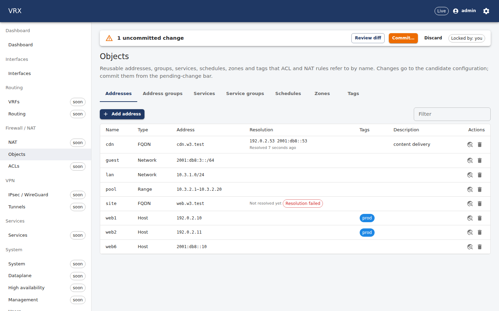
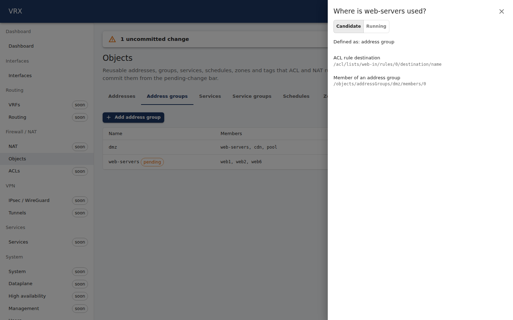
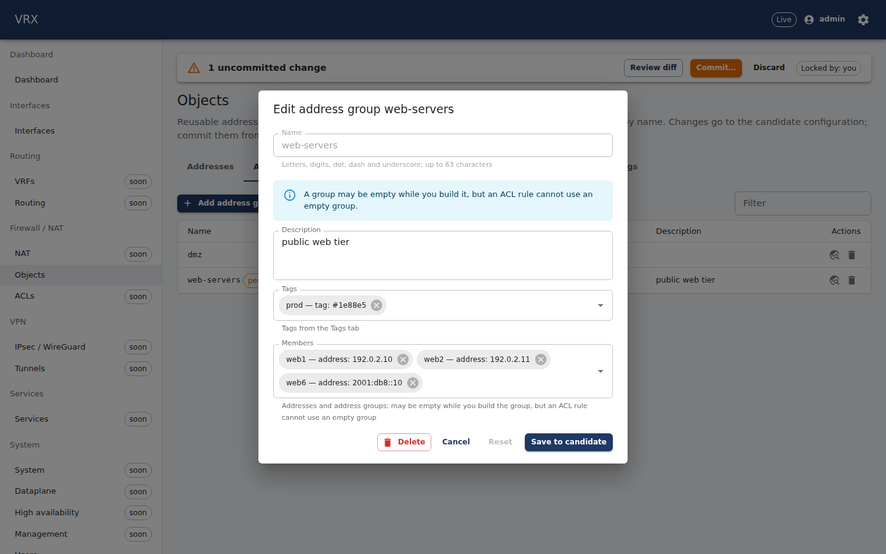

# F-object-model — firewall objects: addresses, groups, FQDN, services, schedules, zones, tags

Branch `task/F-object-model` (slot 3, worktree `/root/ngfw-wt/F-object-model`), base `task/W-seed@8b7558e`, with
`task/W-seed@df67a8e` (TD-5 + P08 fix round 2) merged at `748694c` per the manager's A1 safety note. main is **not** merged
(envelope). Contract: `e94ad5f contract(proto): FqdnObjectState` (+ `F-object-model-contract.md`). Questions and decisions:
`F-object-model-questions.md` (Q1–Q8).

## What
- **Contract (additive):** `rpc FqdnObjectState` + `FqdnObjectState{Request,Response}` / `FqdnObjectState` in the task's proto
  section; `docs/contracts/proto.md` §11. No EventKind, no config field (Q1, Q3).
- **Agent library `internal/objects`** (stable API documented in `docs/agent/objects.md` for F-acl / F-host-acl-nftables):
  `Expand` (host/network/range/fqdn/groups → aggregated, sorted, v4/v6-split prefixes; cycle detection; 10 000-entry cap as
  `*LimitError`; unresolved FQDNs listed, never an error), `ExpandService` / `ExpandServiceSpec` (→ `PortSpec`, the shape of
  `descriptors/acl.Rule`), `Active(schedule, now, loc)` (wall clock of `loc`, DST, `once` windows), `ZoneInterfaces`,
  `CheckLimit`, `RuntimeFor(...).Snapshot/FQDN/FQDNStates/Subscribe` (the in-agent change notification).
- **`objects` is an implemented domain:** agent-local descriptor family `objects.{tag,address,address-group,service,
  service-group,schedule,zone}` over a store persisted in the state dir (`objects-<owner>.json`); value = single-entry
  `ObjectsConfig`; Retrieve reads the store (D-063), so Apply/rollback/confirm-revert/resync/restart work through the
  scheduler with no agent-core edit. DryRun defence in depth: group expansion errors (ERROR) and groups above the cap (WARNING).
- **FQDN resolver:** Go resolver (PreferGo, `/etc/resolv.conf`, no exec), A+AAAA, fixed refresh 60 s clamped [30 s, 1 h]
  (`VRX_OBJECTS_FQDN_REFRESH_SEC`; TTL-capable `Lookup` interface, Q2), last-good kept per family, retry 30 s doubling,
  state persisted (`objects-fqdn-<owner>.json`), restart reloads and spreads due names over 30 s, unreferenced answers stay
  dormant for 1 h (a rollback or a resync after a lost store gets them back without a query). Lifecycle in the owned
  `subsystems/object_model.go` (Q4). Test slots point it at their own responder (`VRX_OBJECTS_DNS_SERVERS`).
- **API:** `ObjectModelController` (`features/object-model`): `GET /api/v1/state/objects/fqdn[?name=]` (agent RPC; 501 from an
  older agent), `GET /api/v1/state/objects/usage?name=&source=running|candidate` (where-used: group members, tags, ACL rule
  source/destination/service/schedule, ACL attachments to zones, zone interfaces; computed from the document). Config goes
  through the generic pointer routes. Fake behaviour in `features/object-model/fake.ts`. api-client + CLI operation table
  regenerated.
- **Web:** `/firewall/objects` — tabs per kind (`?tab=`), pending marks vs running, tag chips in their colours, FQDN resolution
  column (addresses, "resolved … ago", "last good answer kept"/"resolution failed" with the error), where-used drawer
  (candidate/running), schema-driven add/edit dialog through merge patches; **exported `ObjectPicker` / `TagPicker` /
  `objectModelWidgets`** for `<SchemaForm widgets>` (kinds from the field's schema help, `x-vrx-ui.objectKinds` or its name);
  en + fa (`object-model` namespace), RTL.
- **Docs:** `docs/user/firewall/object-model.md` (web servers group, FQDN object, office hours, LAN zone; REST + CLI),
  `docs/agent/objects.md`.
- **Tests:** unit (objects, agent-level on the fake VPP, API where-used, web model + page), API e2e (slot DB + fake agent),
  `test/topology/object-model` (real agent + API + slot DB, in-process DNS responder on 127.0.0.1:0, no VPP object), opt-in
  screenshot run.

## Decisions (options → choice)
| # | decision | options | why |
|---|---|---|---|
| 1 | FQDN refresh = fixed interval (60 s, env, clamped 30 s–1 h) | (a) `dnsmessage` query with TTLs (b) `net.Resolver` + fixed interval | (a) changes `apps/agent/go.mod` (x/net indirect → direct, D4, not mine); the `Lookup` interface already takes a TTL (Q2) |
| 2 | Value of the objects.* descriptors = single-entry `vrx.v1.ObjectsConfig` | (a) new `vrx.model.objects.v1` messages (b) structpb (c) the configuration message itself | no contract change, Retrieve returns the document byte-for-byte, `proto.Equal` diff is exact |
| 3 | FQDN changes are state only (no EventKind 11) | (a) publish via `Wiring.Publish` (b) state RPC only | the A5 sink is not wired in `agent.go`; an event would be dropped (Q1); UI polls every 5 s |
| 4 | Where-used from the document (running or candidate), not the agent | (a) agent RPC (b) API over the document | references are configuration; works without an agent |
| 5 | Unreferenced FQDN answers dormant 1 h | (a) drop at once (b) keep dormant | a resync after a lost store / a rollback would otherwise re-query everything |
| 6 | NXDOMAIN / no records = failure (last-good kept) | (a) empty answer replaces (b) keep last-good | a transient bad answer must not empty a rule |
| 7 | Resolver lifecycle from `subsystems/object_model.go` at registration; stop on re-open / process exit | (a) agent.go hook (A5, read-only) (b) owned file | envelope; `a.wiring.Close()` proposed (Q4) |
| 8 | Picker widget binds through ui-kit's exported `SchemaField` (select / multiselect with enum + labels) | (a) own react-hook-form binding (b) delegate | `react-hook-form` is not a web dependency (D4) and ui-kit is not mine |
| 9 | Schedules: consumer re-projects every 60 s (default) | (a) re-render on transition (b) periodic | prompt default; `Active` is pure, consumers may compute transitions |

## Shared hunks (all directly under `wave-A: F-object-model` anchors unless noted)
| file | hunk |
|---|---|
| `apps/agent/internal/subsystems/subsystems.go` (A1) | `Objects = "objects"` (const) · `Objects: objectModelDescriptors(),` (Domains) · `if err := w.registerObjectModel(r); err != nil { return nil, err }` (end of Register) |
| `apps/agent/internal/agent/projection.go` (A2) | `if in["objects"] { desired.ObjectModel(p, ds.GetObjects()) }` in `project()` · `if in["objects"] { ds.Objects = desired.AssembleObjectModel(kvs) }` in `assemble()` |
| `packages/proto/vrx/v1/dataplane.proto` (C5) | `rpc FqdnObjectState(...)` under the service anchor · 3 messages in `// ----- F-object-model -----` |
| `docs/contracts/proto.md` (C6) | `### F-object-model: FqdnObjectState` |
| `apps/api/src/app.module.ts` (P1) | import · `...objectModelFeature.controllers,` · `...objectModelFeature.providers,` |
| `apps/api/src/agent/agent.client.ts` (P4) | `type FqdnObjectStateResponse,` · `fqdnObjectState(names)` |
| `apps/api/src/testing/fake-agent.ts` (P5) | one handler line (dynamic import of `features/object-model/fake.js`, so the import block is untouched) |
| `apps/web/src/router.tsx` (W1) | lazy route `/firewall/objects` |
| `apps/web/src/nav/nav.ts`, `nav.test.ts` (W2) | `'objects'` in `BUILT_DOMAINS` and in the `available` list |
| `apps/web/src/i18n.ts` (W3) | en+fa imports, `'object-model'` namespace, `en`/`fa` entries |
| **not an anchor:** `apps/agent/internal/agent/service_test.go` | 2 assertions `"interfaces,vrfs,routing"` → `strings.Join(implementedDomains(), ",")` (Q5) |
| generated (C7) | `apps/agent/gen/**`, `packages/proto/gen/ts/**`, `packages/api-client/src/generated/schema.d.ts`, `apps/cli/internal/api/operations_gen.go` |

## How verified (real output)

### Unit — `internal/objects` (nested groups, range→CIDR, v4/v6 split, cap, DST, `once`, resolver)
```
$ go test -count=1 -v ./internal/objects/
expand_test.go:86: Expand(web-servers) v4=[192.0.2.10/31] v6=[2001:db8::10/128] unresolved=[]
expand_test.go:86: Expand(dmz) v4=[10.3.1.0/24 192.0.2.10/31] v6=[2001:db8::10/128] unresolved=[]
expand_test.go:86: Expand(all) v4=[10.3.1.0/24 10.3.2.1/32 10.3.2.2/31 10.3.2.4/30 10.3.2.8/29 10.3.2.16/30 10.3.2.20/32 192.0.2.10/31 198.51.100.7/32] v6=[2001:db8::10/128 2001:db8::53/128 2001:db8:1::/120] unresolved=[ghost]
expand_test.go:111: cycle: objects: group membership cycle: g1 → g2 → g3 → g1
expand_test.go:137: cap exceeded: objects: "big" expands to 10001 entries, more than the limit of 10000
expand_test.go:172: range 10.0.0.1–10.0.0.6 → 10.0.0.1/32 10.0.0.2/31 10.0.0.4/31 10.0.0.6/32
expand_test.go:172: range 192.168.0.255–192.168.2.0 → 192.168.0.255/32 192.168.1.0/24 192.168.2.0/32
expand_test.go:172: range 2001:db8::1–2001:db8::3 → 2001:db8::1/128 2001:db8::2/127
schedule_test.go:73: skipped   01:15 UTC = 03:15 CEST Berlin → active=false      (02:15–02:45 on the spring-forward day)
schedule_test.go:76: repeated  00:20 UTC = 02:20 CEST Berlin → active=true       (fall-back day: active in both 02:xx hours)
schedule_test.go:77: repeated  01:20 UTC = 02:20 CET Berlin → active=true
schedule_test.go:81: spanning  00:30 UTC = 01:30 CET Berlin → active=true        (01:30–03:30 lasts 1 h on 29 Mar …)
schedule_test.go:83: spanning  01:30 UTC = 03:30 CEST Berlin → active=false
schedule_test.go:85: spanning  23:30 UTC = 01:30 CEST Berlin → active=true       (… and 3 h on 25 Oct)
schedule_test.go:87: spanning  02:30 UTC = 03:30 CET Berlin → active=false
--- PASS: TestFamilyApplyRetrieveRollbackRestart · TestFamilyValueShape · TestStoreCorruptFailsClosed · TestRuntimeRegistry
--- PASS: TestExpandNestedGroupsSplitAndDeterministic · TestExpandErrors · TestExpandCapExceeded (0.14s) · TestRangeToPrefixes
--- PASS: TestRangeToPrefixesExact · TestAggregate · TestZoneInterfaces · TestExpandService · TestExpandServiceSpecInvalid
--- PASS: TestFQDNResolveRefreshLastGoodRestart · TestFQDNRestartSpreadsOverdue · TestFQDNSyncAndUnresolved
--- PASS: TestFQDNStateSurvivesLostStore · TestClampRefreshAndRetry
--- PASS: TestActiveRecurring · TestActiveDSTChange · TestActiveOnce · TestActiveInvalid
ok  	ngfw/agent/internal/objects	0.368s
```
Resolver unit run (fake clock, in-process DNS responder on 127.0.0.1:0, `TestFQDNResolveRefreshLastGoodRestart` log):
```
level=INFO msg="fqdn resolved" host=web.w3.test objects="[web web-alias]" addresses="[192.0.2.10 2001:db8::10]" next_refresh=2026-09-24T12:01:00Z
level=INFO msg="fqdn resolved" host=web.w3.test objects="[web web-alias]" addresses="[192.0.2.11 2001:db8::10]" next_refresh=2026-09-24T12:02:00Z
level=WARN msg="fqdn resolution failed; last-good addresses kept" host=web.w3.test objects="[web web-alias]" err="lookup web.w3.test. on 127.0.0.1:45280: read udp …: connection refused" kept="[192.0.2.11 2001:db8::10]" failures=1 retry_at=2026-09-24T12:02:30Z
restart log: level=INFO msg="fqdn state reloaded" … hosts=2 fresh=2 due=0 due_spread_over=30s      (0 queries afterwards)
```

### Agent level (fake VPP) — `rpc_object_model_test.go`
```
--- PASS: TestObjectsDomainOnFake (0.06s)     Apply (pointers /objects/<kind>/<name>, subsystem objects) → Retrieve == desired → empty
                                              re-apply → FqdnObjectState → confirm-timeout revert restores the set → restart
                                              retrieves from the store, empty resync → {} deletes all
--- PASS: TestObjectsDryRunFindings (0.06s)   cycle → ERROR at /objects/addressGroups/{a,b}; 10 212-entry group → WARNING:
    DryRun warning: /objects/addressGroups/big objects.object-model-expansion-limit: objects: "big" expands to 10212 entries, more than the limit of 10000; an ACL rule that uses it is refused
ok  	ngfw/agent/internal/agent	0.166s
```

### API — unit and e2e (slot 3 PostgreSQL + fake agent)
```
 ✓ src/features/object-model/usage.test.ts (4 tests)
 ✓ test/e2e/object-model.e2e.test.ts (4 tests) 3944ms
   ✓ … commits objects and an ACL that uses them; where-used and FQDN state reflect the running config  487ms
   ✓ … deleting an object an ACL rule still uses: 400 problem+json pointing at the rule; nothing is applied
   ✓ … rollback restores the previous object set (running document and where-used)  392ms
   ✓ … validates the query; an agent without the RPC answers 501
 Test Files  1 passed (1) · Tests  4 passed (4)
drop   database vrx_w3 · drop role vrx_w3 · ok nothing named vrx_w3 / vrx_w3 remains
```

### Web
```
 ✓ src/locales/locales.test.ts (12 tests)       en/fa key parity incl. object-model
 ✓ src/nav/nav.test.ts (5 tests)
 ✓ src/domains/firewall/object-model/model.test.ts (5 tests)
 ✓ src/domains/firewall/object-model/ObjectsPage.test.tsx (3 tests)
   ✓ objects screen > lists addresses with tag chips and the FQDN resolution column (last-good kept)
   ✓ objects screen > marks a pending group, opens where-used, and saves an edit as a merge patch of /objects
   ✓ objects screen > renders the page right to left in Persian
 Test Files  4 passed (4) · Tests  25 passed (25)
```

### Topology — `test/topology/object-model/run.sh -run TestObjectModelTopology` (slot 3, real agent + API + DB, no VPP object)
```
objects_test.go:29: systemctl show vpp -p NRestarts (before) = 1
objects_test.go:43: DNS responder 127.0.0.1:37801 serving w3.test
objects_test.go:58: commit: status=partially-applied revision=1 notApplied=[acl] summary=map[created:18 deleted:0 failed:0 reverted:0 unchanged:0 updated:0]
objects_test.go:64: vrx-agentctl retrieve -subsystems objects == running objects (7 kinds, 8 address objects)
objects_test.go:71: /state/drift: subsystems=[interfaces vrfs routing objects] changes=0 (none under /objects)
objects_test.go:84: resolved: {"addresses":["192.0.2.53","2001:db8::53"],"error":"","failures":0,"fqdn":"cdn.w3.test","lastResolved":"2026-09-24T15:37:16.324Z","name":"cdn","nextRefresh":"2026-09-24T15:37:46.324Z"}
objects_test.go:98: refresh observed: lastResolved 2026-09-24T15:37:16.324Z → 2026-09-24T15:37:46.327Z (30.0 s), addresses [192.0.2.54 2001:db8::53]
objects_test.go:116: agent stopped; /run/vrx-test/w3/object-model/agent-state/objects-w3.json deleted (simulated loss of the applied object set); FQDN state kept
objects_test.go:127: objects back after 0.28 s (Retrieve == before the restart)
objects_test.go:136: FQDN state reloaded from the state dir: cdn lastResolved 2026-09-24T15:37:46.327Z unchanged, 0 DNS queries in the first 3.3 s after start
agent: {"time":"2026-09-24T19:07:48.702113013+03:30","level":"INFO","msg":"fqdn state reloaded",…,"hosts":0,"fresh":0,"due":0,"dormant":2,"due_spread_over":"30s"}
agent: {"time":"2026-09-24T19:07:48.774233074+03:30","level":"INFO","msg":"reconcile done",…,"mode":"resync","domains":["interfaces","vrfs","routing","objects"],"status":"APPLY_STATUS_APPLIED","summary":"created:18",…}
objects_test.go:156: resolver down: {"addresses":["192.0.2.54","2001:db8::53"],"error":"lookup cdn.w3.test. on 127.0.0.1:37801: read udp …: connection refused","failures":1,…,"lastResolved":"2026-09-24T15:37:46.327Z",…}
agent: {"time":"2026-09-24T19:08:16.330639501+03:30","level":"WARN","msg":"fqdn resolution failed; last-good addresses kept",…,"host":"cdn.w3.test","kept":["192.0.2.54","2001:db8::53"],"failures":1,"retry_at":"2026-09-24T15:38:46Z"}
objects_test.go:171: validate after deleting web-servers: 400 {"type":"https://vrx.dev/problems/validation",…,"errors":[{"pointer":"/acl/lists/web-in/rules/0/destination/name","message":"'web-servers' is not an entry of objects.addresses or objects.addressGroups"},{"pointer":"/objects/addressGroups/dmz/members/0",…}]}
objects_test.go:182: commit: 400 type=https://vrx.dev/problems/validation
objects_test.go:205: rollback to revision 1: status=partially-applied revision=3
objects_test.go:214: after rollback: Retrieve has web2 again (map[address:192.0.2.11 tags:[prod] type:host]), where-used web-servers = [{…"kind":"acl-rule-destination","pointer":"/acl/lists/web-in/rules/0/destination/name"},{…"kind":"address-group-member","pointer":"/objects/addressGroups/dmz/members/0"}]
objects_test.go:228: cleanup: objects and acl deleted; Retrieve empty; no FQDN state
objects_test.go:32: systemctl show vpp -p NRestarts (after) = 1
--- PASS: TestObjectModelTopology (72.31s)   commit-retrieve-drift · fqdn-resolve-and-refresh (29.92s) · agent-restart-and-simulated-loss
                                             · resolver-down-last-good · delete-referenced-object-refused · rollback-restores-object-set · cleanup
ok  	ngfw/test/topology/object-model	72.346s
```
`partially-applied` / `notApplied=[acl]`: the ACL list in the document is F-acl's; this agent build reports it as
`agent.unimplemented-domain` and applies everything else. No `vppctl show` applies: this domain creates no VPP object
(the proof is the agent's own Retrieve and the drift route). `NRestarts` 1 before and after: the 18:41 VPP crash (Q6)
happened before this task's first real agent (18:56).

### Screenshots — `TestObjectModelScreenshots` (production build under `vite preview`, real API + agent + resolver)
Headless Chrome-for-Testing 153 + playwright-core 1.63 from the npx cache (nothing installed; the script is not committed;
P07a/P07b/P08 approach). Every tab en + fa/RTL, where-used drawer, edit dialog with the object picker, FQDN column
(one resolved, one failed name), a pending (uncommitted) change:
```
object-model-addresses-en.png  html dir/lang=ltr/en  rows=["cdn","guest","lan","pool","site","web1","web2","web6"]  pageErrors=0
object-model-addressGroups-en.png  html dir/lang=ltr/en  rows=["dmz","web-servers"]  pageErrors=0
object-model-services-en.png  html dir/lang=ltr/en  rows=["dns","https","ping"]  pageErrors=0
object-model-serviceGroups-en.png  html dir/lang=ltr/en  rows=["web"]  pageErrors=0
object-model-schedules-en.png  html dir/lang=ltr/en  rows=["maintenance","office-hours"]  pageErrors=0
object-model-zones-en.png  html dir/lang=ltr/en  rows=["lan"]  pageErrors=0
object-model-tags-en.png  html dir/lang=ltr/en  rows=["prod"]  pageErrors=0
object-model-usage-en.png  html dir/lang=ltr/en  rows=["dmz","web-servers"]  pageErrors=0
object-model-dialog-en.png  html dir/lang=ltr/en  rows=["dmz","web-servers"]  pageErrors=0
object-model-addresses-fa-rtl.png  html dir/lang=rtl/fa  … (the same nine screens in Persian)  pageErrors=0
--- PASS: TestObjectModelScreenshots (62.21s)
```
Files: `docs/status/tasks/F-object-model-screens/*.png` (18), four of them in `docs/user/firewall/img/`.

| | |
|---|---|
|  addresses, FQDN column |  where-used drawer |
|  edit dialog, object/tag pickers |  Persian, RTL |

### CI — `TMPDIR=/tmp/g-w3 tools/ci.sh --base main` (HEAD 48962f2; the next commit only fills this block and the cleanup)
The contract guard is racy (Q8: `pipefail` + `grep -q`, 173/200 failures of the bare pipeline on this branch); the run was
repeated until the guard was not hit — attempts 1–4 stopped at the guard after 1 s, attempt 5 ran the whole gate:
```
== VRX CI gate: quick ==
branch    task/F-object-model @ 48962f2   (base: main)
== contract guard: HEAD vs main ==
contract files changed in HEAD since main: (dataplane.proto, generated Go/TS, api-client schema.d.ts; the schema files are W-seed's anchors)
ok — contract commit(s) on the branch: … e94ad5f contract(proto): FqdnObjectState …
== generate + generated-output gate ==
clean: packages/proto/gen apps/agent/gen packages/schema/dist packages/api-client/src/generated      (apps/agent/go.mod untouched)
== test/ Go modules, unit mode (test/integration/smoke test/topology/interfaces test/topology/object-model) ==
test/topology/object-model: gofmt ok · go vet ok · ok  	ngfw/test/topology/object-model	0.023s;
== summary (quick) ==
  contract guard: HEAD vs main                       0m00s
  tools (golangci-lint, gitleaks)                    0m03s
  install (pnpm --frozen-lockfile --prefer-offline)   0m01s
  generate + generated-output gate                   1m46s
  forbidden patterns (+ gitleaks)                    0m05s
  lint · typecheck · unit tests · build (turbo)   3m27s
  apps/agent: make lint test build                   0m46s
  apps/cli: make lint test build                     0m09s
  test/ Go modules, unit mode (test/integration/smoke test/topology/interfaces test/topology/object-model)   0m07s
  warnings:
    - commit subject(s) not in Conventional Commits form (type(scope): subject):
      review(W-seed): verify
  mode quick · wall time 6m25s · logs /root/ngfw-wt/logs/ci/F-object-model-20260924-193354-2727608

CI GATE PASSED
```
(The earlier commit dbe7d4f passed the same gate: attempt 7, wall time 7m45s.) The warning is W-seed's commit.

## Acceptance
- [x] Unit tests: nested groups, range→CIDR, v4/v6 split, cap exceeded, schedule edges (DST change, `once` window) — above
- [x] FQDN: object for a name served by the in-process responder (127.0.0.1:0) resolves; refresh observed (fixed interval,
      30 s in the run: 30.0 s between resolutions); resolver down → last-good kept (log)
- [x] Agent restart → FQDN state reloaded from the state dir without a query (0 queries, `fresh`/`dormant` log); after a
      simulated loss of the store the objects are back in 0.28 s (< 30 s)
- [x] Deleting an object an ACL rule still uses → 400 problem+json, pointer `/acl/lists/web-in/rules/0/destination/name`
      (`acl.rule-references`, no new rule needed) — e2e and topology
- [x] Rollback restores the previous object set (agent Retrieve + where-used) — e2e and topology
- [x] UI screenshot of the Objects page against the real endpoint (en + fa)
- [x] `tools/ci.sh --base main` green (below; the contract guard is racy — Q8)

## Out of scope (not built)
ACL rules/attachments/rendering (F-acl), host lists/nftables (F-host-acl-nftables), NAT use of objects, Unbound
configuration, zone policy beyond "set of interfaces", GeoIP/threat feeds, VDOM scoping, a CLI `show objects …` command (Q7).

## Cleanup
Every process started by the tests (agent, API, vite preview, the in-process DNS responder) was stopped by PID (logged);
`vrx_w3` dropped by every run ("ok nothing named vrx_w3 / vrx_w3 remains"); the slot's agent state dir
(`/run/vrx-test/w3/object-model`) removed by the test cleanup; the lab lock is taken only by `run.sh` for the run;
`apps/{web,api}/dist`, `packages/*/dist` and `apps/agent/bin` removed; nothing listens on 3300/5300/9131.
No test of this task runs `vppctl` (no `show trace`/`trace add`, D-128) or touches classify bindings (D-126).
