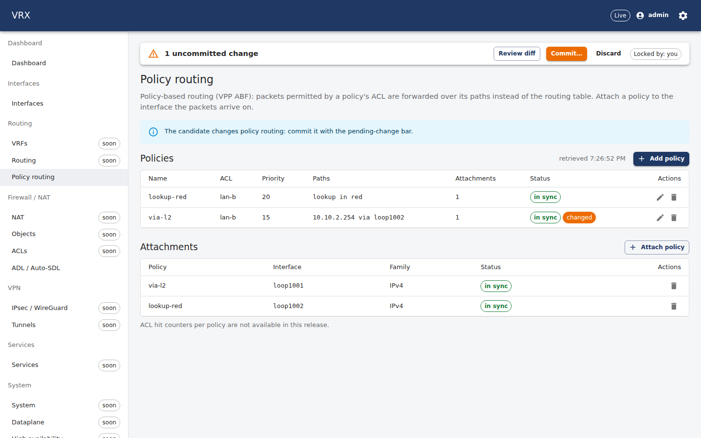
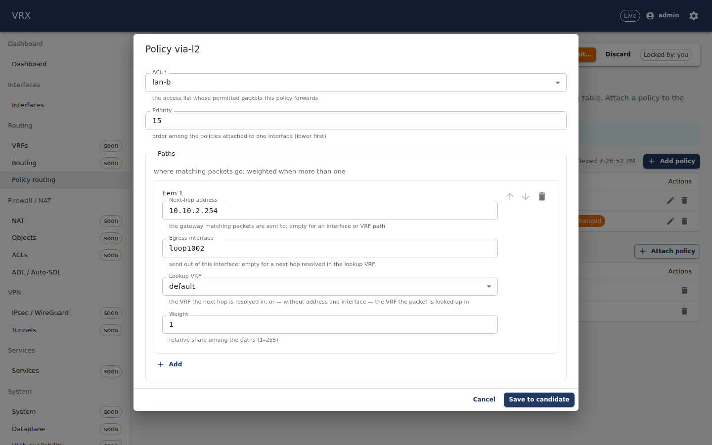
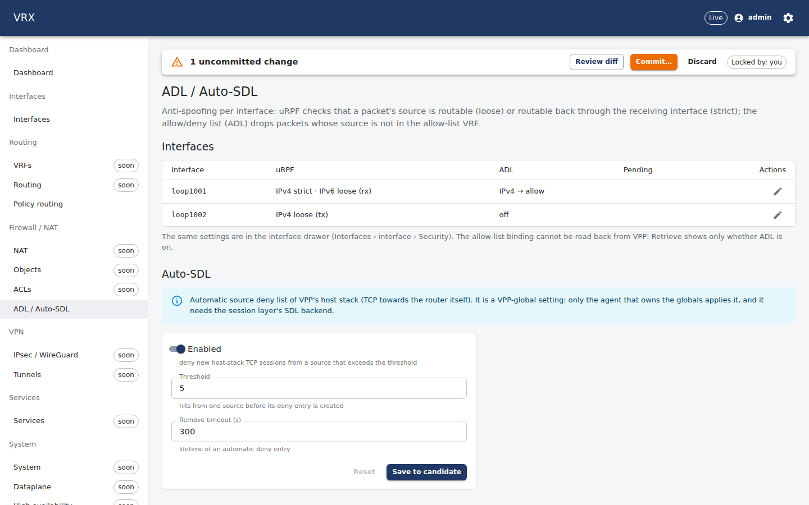
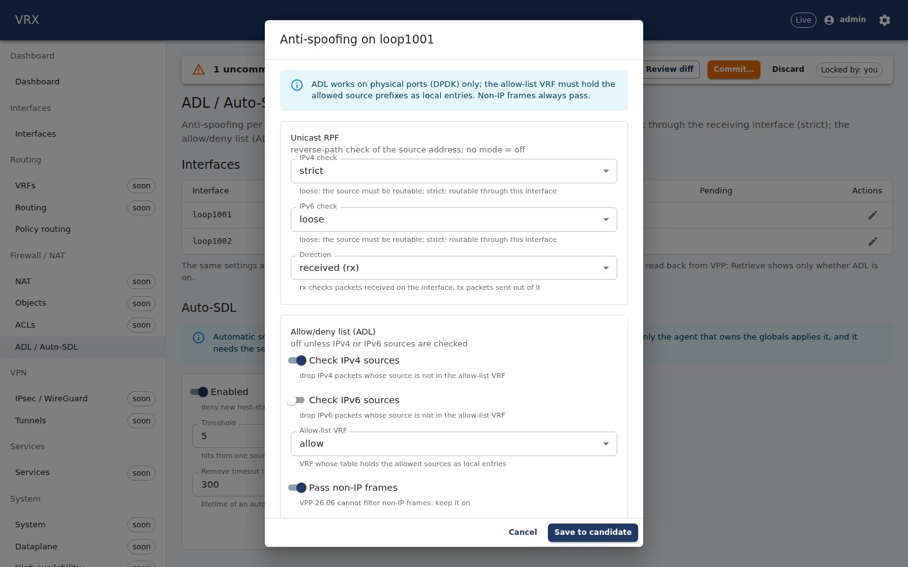
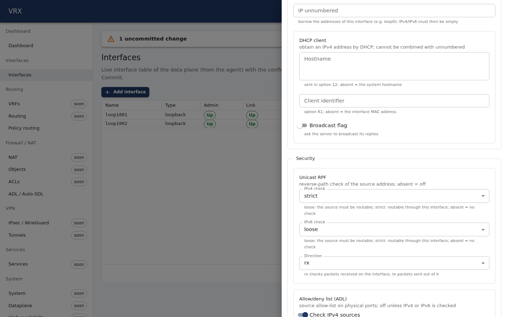
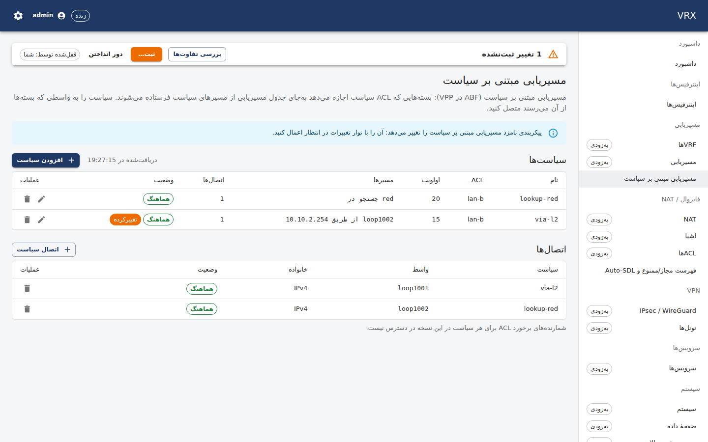
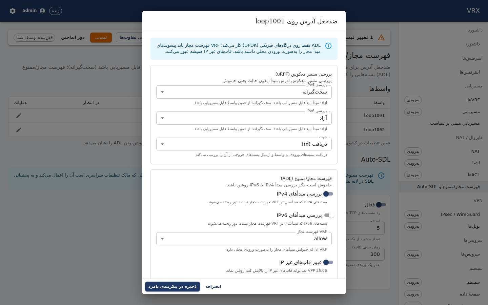
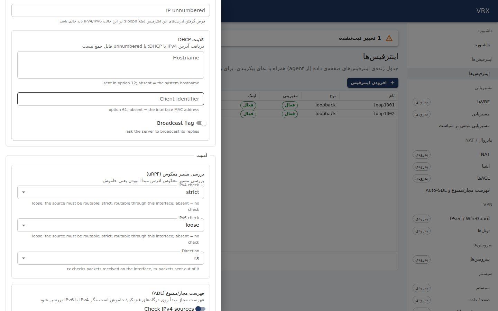

# F-rpf-adl-pbr — uRPF, ADL (+ Auto-SDL), ABF policy-based routing

Branch `task/F-rpf-adl-pbr` (slot 10, `w10`), base `task/W-seed` (speculative, D-114/D-120; `task/W-seed@df67a8e` merged
as instructed — TD-3/TD-5/P08 fix round 2 in the base). Main is **not** merged. Contract commit: `b7439d4`
`contract(schema): urpf, adl, pbr, autoSdl` — it carries the schema **and** the proto change; `63be7be contract(proto): …`
only reformats a JSON fixture (misleading subject, review L6; for the squash). Details: `F-rpf-adl-pbr-contract.md`.
Questions and decisions: `F-rpf-adl-pbr-questions.md` (Q1–Q9).

## What was built
| layer | what |
|---|---|
| schema | `packages/schema/src/domains/ext/rpf-adl-pbr.ts`: `interfaces.<if>.urpf`, `interfaces.<if>.adl`, `routing.pbr`, `services.autoSdl` (absent = off; defaults are "off"); semantic rules `routing.rpf-adl-pbr-{acl-exists,path-refs,path-family,attachment-refs,attachment-unique}`, `interfaces.rpf-adl-pbr-adl-vrf-exists` |
| proto | Interface 18 `urpf`, 19 `adl`; RoutingConfig 11 `pbr`; ServicesConfig 8 `auto_sdl`; messages in the `F-rpf-adl-pbr` section (wave-A-hotspots §2 numbers) |
| agent: projection | `internal/desired/rpf_adl_pbr.go`: builder (uRPF per family/direction with the interface's table; ADL = allow-list + adl-input; PBR policies → `abf.policy/<id>` + `pbr.policy/<name>`, attachments → `abf.attach` with the policy's priority; Auto-SDL only for the globals owner) and assembler (Retrieve → document); DryRun notes: `agent.write-only` (ADL allow-list leaves), strict-uRPF-on-ECMP warning, `defaultAllow: false` refused, non-autoSdl `services.*` unsupported |
| agent: descriptors | **V23 (a) fixed** in `adl.interface` Retrieve (control query of device-input's end node + local0 probe); `adl.allowlist` rewritten to VPP-safe two-call sequences with a D-076 applied-once record (V-new: the naive call wipes unconfigured families → crash vector); new `descriptors/auto_sdl` (write-only global, globals owner only, disable+enable once per VPP instance) |
| agent: wiring | `subsystems/rpf_adl_pbr.go`: urpf/adl/abf with the persisted `KeyedClaims("acl")`, allow-list + Auto-SDL with `Wiring.BootStore()`, ABF ids in `SlotIDRange()`; agent-local `pbr.policy` name store (`<state dir>/pbr-<owner>.json`); observe-only `pbr.acl-ref` bridge for `acl.acl/<name>` until F-acl (Q2); `Domains["services"]` (first implementer) |
| API | `apps/api/src/features/rpf-adl-pbr`: `RpfAdlPbrController` — `GET /api/v1/state/pbr` (running vs Retrieve per policy/attachment: in-sync / drift / missing / unmanaged; attachments paged; counters not available, Q4); configuration through the generic pointer routes; OpenAPI + api-client + CLI table regenerated |
| UI | *Routing → Policy routing* (`/routing/pbr`: policies with ACL/VRF/interface pickers and path editor, live status, attachments), *Firewall → ADL / Auto-SDL* (`/firewall/adl`: uRPF/ADL per interface, Auto-SDL form), uRPF/ADL in the interface drawer's **Security** group (P08 SchemaForm, `x-vrx-ui` group `rpf-adl-pbr`); en + fa |
| docs | `docs/user/routing/rpf-adl-pbr.md` (second-uplink example, strict uRPF on WAN, REST + CLI), `docs/agent/descriptors/{auto_sdl (new),adl,abf}.md`, V23 row + V-new in `docs/vpp-code-track.md` |

## Acceptance

### `vppctl` reflects the commit; Retrieve == desired (host VPP, slot 10, loopbacks only, no packets)
`VRX_INTEGRATION=1 VRX_RPF_VPPCTL=1 go test -run 'TestRpfAdlPbrOnHost|TestADLRetrieveV23OnHost' ./internal/subsystems/`
under `flock -s` (the agent service with the product registry + DF-4's acl.acl as F-acl will register it; ACL
`w10:lan-b` created through binapi). NRestarts 0 → 0.
```
apply: { "created": 21 } in 17.776373002s
  APPLY_OPERATION_CREATE urpf.interface/loop1001/ipv4/rx OBJECT_RESULT_CODE_OK
  APPLY_OPERATION_CREATE urpf.interface/loop1001/ipv6/rx OBJECT_RESULT_CODE_OK
  APPLY_OPERATION_CREATE urpf.interface/loop1002/ipv4/tx OBJECT_RESULT_CODE_OK
  APPLY_OPERATION_CREATE adl.allowlist/loop1001 OBJECT_RESULT_CODE_OK
  APPLY_OPERATION_CREATE adl.interface/loop1001 OBJECT_RESULT_CODE_OK
  APPLY_OPERATION_CREATE abf.policy/10097 OBJECT_RESULT_CODE_OK
  APPLY_OPERATION_CREATE abf.policy/10296 OBJECT_RESULT_CODE_OK
  APPLY_OPERATION_CREATE abf.attach/10097/loop1002/ipv4 OBJECT_RESULT_CODE_OK
  APPLY_OPERATION_CREATE abf.attach/10296/loop1001/ipv4 OBJECT_RESULT_CODE_OK
  APPLY_OPERATION_CREATE pbr.policy/lookup-red OBJECT_RESULT_CODE_OK
  APPLY_OPERATION_CREATE pbr.policy/via-l2 OBJECT_RESULT_CODE_OK
Retrieve == desired (canonical): routing.pbr={ policies: lookup-red {acl lan-b, priority 20, paths [{vrf red, weight 1}]},
  via-l2 {acl lan-b, priority 10, paths [{address 10.10.2.254, interface loop1002, vrf default, weight 1}]},
  attachments: [lookup-red loop1002 ipv4, via-l2 loop1001 ipv4] }
Retrieve interfaces.loop1001.urpf={ "ipv4": "strict", "ipv6": "loose", "direction": "rx" } adl={} (allow-list binding write-only)
idempotent apply: { "unchanged": 21 }   (no write sent; adl_allowlist_enable_disable calls unchanged)
```
```
$ vppctl show abf policy
abf:[0]: policy:10097 acl:2
     path-list:[98] locks:1 flags:shared,no-uRPF, uRPF-list: None
      path:[116] pl-index:98 ip4 weight=1 pref=0 deag:  oper-flags:resolved,
         fib-index:1
abf:[1]: policy:10296 acl:2
     path-list:[95] locks:1 flags:shared,no-uRPF, uRPF-list: None
      path:[115] pl-index:95 ip4 weight=1 pref=0 attached-nexthop:
        10.10.2.254 loop1002
      [@0]: arp-ipv4: via 10.10.2.254 loop1002
$ vppctl show abf attach loop1001
ipv4:
 abf-interface-attach: policy:10296 priority:10
$ vppctl show abf attach loop1002
ipv4:
 abf-interface-attach: policy:10097 priority:20
  [@4]: dst-address,unicast lookup in w10:red
$ vppctl show interface features loop1001        (excerpt)
ip6-unicast:
  ip6-rx-urpf-loose
ip4-unicast:
  ip4-rx-urpf-strict
  abf-input-ip4
device-input:
  adl-input
$ vppctl show interface features loop1002        (excerpt)
ip4-output:
  ip4-tx-urpf-loose
ip4-unicast:
  abf-input-ip4
```

### Agent-restart simulation → back within 30 s; write-only re-applied once
Agent (service) stopped, 8 objects deleted behind its back through binapi (ABF attachments first, then policies, uRPF
checks, adl-input; D-095 c), agent restarted on the same state dir:
```
simulated loss: 8 objects deleted via binapi (ABF attachments, policies, uRPF checks, adl-input)
$ vppctl show abf policy            (empty)
restart: converged in 452.330767ms ({ "created": 9, "updated": 2, "unchanged": 12 }); allow-list re-applied by the reconciler,
  adl_allowlist_enable_disable calls sent: 0 (applied-once record, same VPP instance)
agent log: msg="reconcile start" txn_id="" mode=resync domains="[interfaces vrfs routing]"
agent log: msg=created component=scheduler key=urpf.interface/loop1001/ipv4/rx
agent log: msg=created component=scheduler key=urpf.interface/loop1001/ipv6/rx
agent log: msg=created component=scheduler key=urpf.interface/loop1002/ipv4/tx
agent log: msg=created component=scheduler key=adl.allowlist/loop1001
agent log: msg=created component=scheduler key=adl.interface/loop1001
agent log: msg=created component=scheduler key=abf.policy/10097
agent log: msg=created component=scheduler key=pbr.policy/lookup-red
agent log: msg=created component=scheduler key=abf.policy/10296
agent log: msg=created component=scheduler key=pbr.policy/via-l2
agent log: msg=created component=scheduler key=abf.attach/10097/loop1002/ipv4
agent log: msg=created component=scheduler key=abf.attach/10296/loop1001/ipv4
agent log: msg="reconcile done" txn_id="" mode=resync domains="[interfaces vrfs routing]" status=APPLY_STATUS_APPLIED
```
The write-only `adl.allowlist` is re-applied exactly once by the reconciler (one `created` line per resync); its record
says VPP (same instance) still has it, so nothing is sent — sending again would stack a third instance (D-076). The
VPP-restart case (new boot identity → exactly one add sequence, then nothing on further resyncs) is proven on the model:
`TestRpfAdlPbrOnFake` ("after a VPP restart the allow-list add sequence ran … want exactly one sequence (2)").

### Rollback removes attachments before policies, clears uRPF/ADL
Apply of the same document without urpf/adl/pbr:
```
rollback APPLY_OPERATION_DELETE pbr.policy/via-l2 OBJECT_RESULT_CODE_OK
rollback APPLY_OPERATION_DELETE pbr.policy/lookup-red OBJECT_RESULT_CODE_OK
rollback APPLY_OPERATION_DELETE abf.attach/10296/loop1001/ipv4 OBJECT_RESULT_CODE_OK
rollback APPLY_OPERATION_DELETE abf.attach/10097/loop1002/ipv4 OBJECT_RESULT_CODE_OK
rollback APPLY_OPERATION_DELETE abf.policy/10296 OBJECT_RESULT_CODE_OK
rollback APPLY_OPERATION_DELETE abf.policy/10097 OBJECT_RESULT_CODE_OK
rollback APPLY_OPERATION_DELETE adl.interface/loop1001 OBJECT_RESULT_CODE_OK
rollback APPLY_OPERATION_DELETE adl.allowlist/loop1001 OBJECT_RESULT_CODE_OK
rollback APPLY_OPERATION_DELETE urpf.interface/loop1002/ipv4/tx OBJECT_RESULT_CODE_OK
rollback APPLY_OPERATION_DELETE urpf.interface/loop1001/ipv6/rx OBJECT_RESULT_CODE_OK
rollback APPLY_OPERATION_DELETE urpf.interface/loop1001/ipv4/rx OBJECT_RESULT_CODE_OK
rollback: Retrieve has no urpf/adl/pbr, the binapi dumps find nothing of the slot; allow-list remove sequence sent 2 calls
$ vppctl show abf policy            (empty)
$ vppctl show abf attach loop1001   (empty)
$ vppctl show interface features loop1001   (ip4-unicast/ip6-unicast/device-input: none configured)
```
(adl-input goes off before the allow-list is removed — the order the VPP bug requires, V-new.)

### V23 (a) on the host
```
fresh loop1003 (sw_if_index 5): raw feature_is_enabled adl-input=false, control ethernet-input=false, unknown feature=true
adl.interface Retrieve: fresh → absent, enabled → present, disabled → absent
```
("unknown feature=true" is VPP's error-as-true on this host; the out-of-range case did not occur on this reused index —
it is covered by `TestInterfaceRetrieveV23` on the model.)

### PBR policy naming an unknown ACL → 400 problem+json with a pointer
API e2e with the fake agent (`apps/api/test/e2e/rpf-adl-pbr.e2e.test.ts`, slot DB):
```
 ✓ test/e2e/rpf-adl-pbr.e2e.test.ts (3 tests) 3027ms
   ✓ a PBR policy naming an unknown ACL is a 400 problem+json with the pointer
       errors ⊇ {pointer: /routing/pbr/policies/via-l2/acl, message: "ACL 'lan-b' does not exist"},
                {pointer: /routing/pbr/attachments/1/policy, message: "PBR policy 'ghost' does not exist"}
   ✓ schema and semantic errors of uRPF/ADL carry pointers at edit and commit time
   ✓ commit → GET /api/v1/state/pbr shows the policies and attachments in sync
```

### UI screenshots against the real endpoint
Real stack on the host (scratch script, not committed; the P07a/P08 approach): the `vrx-agent` binary of this tree
(owner `w10`, not globals owner, product registry — the `pbr.acl-ref` bridge resolved the ACL), `vrx-api` (dist) on port
4000 with a throwaway `vrx_w10` database, `vite preview` of the production web build on port 6000, Chrome-for-Testing
headless shell + playwright-core from the npx cache (nothing installed). Configured through the API, committed
(`partially-applied`: acl/nat/management are not implemented by this build), then one pending edit (priority 15) for the
pending marks. NRestarts 1 → 1 (the 18:41 crash was before, Q1).
```
GET /api/v1/state/pbr → policies lookup-red, via-l2: status in-sync; attachments via-l2@loop1001, lookup-red@loop1002: in-sync;
  counters {available: false}
pbr-list-en.png  /routing/pbr  html dir/lang=ltr/en  h2="Policy routing"  pageErrors=0
pbr-editor-en.png  /routing/pbr  html dir/lang=ltr/en  h2="Policy routing"  pageErrors=0
adl-page-en.png  /firewall/adl  html dir/lang=ltr/en  h2="ADL / Auto-SDL"  pageErrors=0
adl-dialog-en.png  /firewall/adl  html dir/lang=ltr/en  h2="ADL / Auto-SDL"  pageErrors=0
drawer-security-en.png  /interfaces  html dir/lang=ltr/en  h2="Interfaces"  pageErrors=0
pbr-list-fa-rtl.png  /routing/pbr  html dir/lang=rtl/fa  h2="مسیریابی مبتنی بر سیاست"  pageErrors=0
pbr-editor-fa-rtl.png  /routing/pbr  html dir/lang=rtl/fa  h2="مسیریابی مبتنی بر سیاست"  pageErrors=0
adl-page-fa-rtl.png  /firewall/adl  html dir/lang=rtl/fa  h2="فهرست مجاز/ممنوع و Auto-SDL"  pageErrors=0
adl-dialog-fa-rtl.png  /firewall/adl  html dir/lang=rtl/fa  h2="فهرست مجاز/ممنوع و Auto-SDL"  pageErrors=0
drawer-security-fa-rtl.png  /interfaces  html dir/lang=rtl/fa  h2="اینترفیس‌ها"  pageErrors=0
cleanup: commit of an empty feature config → applied; ACL deleted; vrx_w10 dropped; left in VPP: nothing (loop100x, abf, w10 ACL)
```

| | |
|---|---|
|  policies + attachments, live status, pending mark |  policy editor (ACL/VRF pickers, path editor) |
|  ADL / Auto-SDL |  uRPF + ADL of one interface |
|  interface drawer, Security group |  Persian, RTL |
|  Persian dialog |  Persian drawer (nested labels English: P08 drawer, Q8) |

### Auto-SDL on the host
```
=== RUN   TestAutoSdlOnHost          (VRX_AUTOSDL_GLOBALS unset)
    auto_sdl_config changes a getter-less VPP-global; set VRX_AUTOSDL_GLOBALS=1 in a manager window (D-071/D-082)
--- SKIP
=== RUN   TestAutoSdlOnHost          (VRX_AUTOSDL_GLOBALS=1, flock -x globals lock)
    plugin auto_sdl loaded: 2 message(s) compatible
    skip-unless-supported: auto_sdl_config: auto_sdl needs the session layer's SDL backend (startup.conf session { rt-backend sdl }) (VPPApiError: Feature disabled by configuration (-30))
--- SKIP
```
(`vppctl show session`: "session layer is not enabled" — FEATURE_DISABLED changes nothing, so running it was safe.)

### CI
`TMPDIR=/tmp/g-w10 tools/ci.sh --base main` at `456fd40` (code identical to the final commit; only this file and the WIP log
changed after). The worktree's own `tools/ci.sh` (base `task/W-seed`) failed twice at the contract guard although the branch
carries `contract(schema)`/`contract(proto)` commits: the `git log | grep -q` SIGPIPE flake fixed on main in `7edac8c`
(D-127). The passing run used a scratch copy of this tree's ci.sh with exactly that 3-line fix (tools/ci.sh is not mine
to edit):
```
== contract guard: HEAD vs main ==
ok — contract commit(s) on the branch:
  63be7be contract(proto): prettier-format the rpf-adl-pbr fixture
  b7439d4 contract(schema): urpf, adl, pbr, autoSdl
== summary (quick) ==
  contract guard: HEAD vs main                       0m01s
  tools (golangci-lint, gitleaks)                    0m01s
  install (pnpm --frozen-lockfile --prefer-offline)   0m01s
  generate + generated-output gate                   2m16s
  forbidden patterns (+ gitleaks)                    0m04s
  lint · typecheck · unit tests · build (turbo)   3m16s
  apps/agent: make lint test build                   1m18s
  apps/cli: make lint test build                     0m21s
  test/ Go modules, unit mode (test/integration/smoke test/topology/interfaces)   0m07s
  warnings:
    - commit subject(s) not in Conventional Commits form (type(scope): subject):
      review(W-seed): verify
  mode quick · wall time 7m26s · logs /root/ngfw-wt/logs/ci/F-rpf-adl-pbr-20260924-192749-2610272

CI GATE PASSED
```
(The warning is a W-seed commit, not this task's.)

## Unit tests (fakes model VPP incl. duplicate adds)
- `descriptors/adl`: `TestInterfaceRetrieveV23` (error-as-true, out-of-range index, unknown plugin), `TestAllowlist`
  (two-call sequences, no stacking on re-apply/restart, changed value removed then added, VPP restart → once more, Delete
  back to nothing, nothing wiped), `TestAllowlistNaiveSequenceWouldCrash` (the old single call wipes ip6/default),
  `TestAllowlistClaimsAndSkip`.
- `descriptors/auto_sdl`: FEATURE_DISABLED, the no-op second enable, flush on disable, applied-once, VPP restart.
- `desired`: `TestPolicyIDs`, `TestRpfAdlPbrProjection` (every key, values, pointers, write-only notes, ECMP warning,
  services notes, non-owner Auto-SDL), `TestRpfAdlPbrProjectionErrors` (13 error pointers), `TestRpfAdlPbrAssemble`.
- `subsystems` (whole service on the coretest model): `TestRpfAdlPbrOnFake` (apply, Retrieve == desired, idempotent, DryRun
  write-only notes, restart after loss, VPP restart → allow-list once, validation pointers, rollback order),
  `TestRpfAdlPbrPolicyNamesPersist`, `TestRpfAdlPbrWithoutFAcl` (the bridge; missing ACL → `agent.dependency-missing` at
  the policy's pointer).
- schema `semantic/rpf-adl-pbr.test.ts` (10), API `pbr-state.test.ts` (3), web `rpf-adl-pbr.test.tsx` (8), proto fixture
  `rpf-adl-pbr-full.json` through the drift guard (`TestSchemaProtoDrift`: 895 leaves, 0 findings) and the TS round trip.

## Shared hunks (append-only, under this task's anchors unless noted)
| file | hunk |
|---|---|
| `packages/schema/src/domains/interfaces.ts` | import line (after the last import); `urpf: urpfField,` `adl: adlField,` under the InterfaceSchema anchor |
| `packages/schema/src/domains/routing.ts` | import line; `pbr: pbrField,` |
| `packages/schema/src/domains/services.ts` | import line; `autoSdl: autoSdlField,` |
| `packages/schema/src/index.ts` | `export * from './domains/ext/rpf-adl-pbr.js';` |
| `packages/schema/src/semantic/index.ts` | import; `...rpfAdlPbrValidators,` |
| `packages/proto/vrx/v1/dataplane.proto` | Interface 18/19, RoutingConfig 11, ServicesConfig 8 under the anchors; messages in `// ----- F-rpf-adl-pbr -----` |
| `apps/agent/internal/subsystems/subsystems.go` | `Services = "services"`; 3 names in `Interfaces`, 3 in `Routing`; `Services: {rpfAdlPbrAutoSdl},`; `registerRpfAdlPbr` call |
| `apps/agent/internal/agent/projection.go` | `desired.RpfAdlPbr(…)` in project(); `desired.RpfAdlPbrAssemble(…)` in assemble() |
| `apps/api/src/app.module.ts` | import; `...rpfAdlPbrFeature.controllers,`; `...rpfAdlPbrFeature.providers,` |
| `apps/web/src/router.tsx` | 2 route lines (`routing/pbr`, `firewall/adl`) — nothing else (fix round 1 undid the whole-file reformat, L5) |
| `apps/web/src/nav/nav.ts`, `nav.test.ts` | 2 NavItems (routing: Policy routing; firewall: ADL / Auto-SDL); `'pbr'`, `'adl'` in the expected list — nothing else (L5) |
| `apps/web/src/i18n.ts` | drawer-i18n side-effect import + en/fa imports; `'rpf-adl-pbr'` in NAMESPACES, en, fa |
| **outside anchors (Q7)** `apps/agent/internal/descriptors/core/coretest/fakevpp.go` | `var extensions []func(*VPP)` + a 4-line loop after the sanitizer model (A6 seam) |
| **outside anchors (Q7)** `apps/agent/internal/agent/service_test.go` | implemented-domain list from `implementedDomains()`; `feature_is_enabled` allowed as a read-only getter (2 loops) |
| **outside anchors (fix round 1)** `apps/agent/internal/agent/service_test.go`, `agent_integration_test.go` | canonical Retrieve documents gain `"services": {}` (services is an implemented domain, reported present) |
| **manager-approved line (fix round 1, M3)** `apps/api/src/state/state.controller.ts` | `COVERAGE_RULES` += `'agent.write-only'` (prettier wraps the Set over 5 lines); test in `features/rpf-adl-pbr/drift.test.ts` |
| `docs/vpp-code-track.md` | V23 row: "(a) done for adl.interface …"; `### V-new (F-rpf-adl-pbr)` appended |
| generated | `apps/agent/gen/**`, `packages/proto/gen/ts/**`, `packages/api-client/src/generated/schema.d.ts`, `apps/cli/internal/api/operations_gen.go` |

## Out of scope (not built)
ACL lists/rules/attachments (F-acl), host ACL, static routes/VRFs (the ADL allow-list VRF's *local* entries, Q9), QoS,
schema/API/UI for classify tables and ip-session-redirect, NAT session redirect, session-layer tuning, enabling the session
layer, sub-interface uRPF/ADL, per-policy ACL hit counters (Q4), `show pbr` in the CLI (apps/cli; the generic
`vrx configure set/merge` and `vrx show drift` work).

## Cleanup
Every process started (agent, API, vite preview, headless Chrome) stopped by PID; lab lock held only during runs; `vrx_w10`
dropped; no `w10` uRPF/ADL/ABF/ACL objects left (`vppctl show abf policy` empty, no `loop100x`, no `w10:` ACL);
`apps/web/dist`, `apps/api/dist` removed at the end; no global changed.

## Fix round 1 (review `9da6a2f`: APPROVE WITH CHANGES)
Unit tests only (no host runs, no `show trace`, D-128); main not merged (the merger rebases). Commits `8984ff3`, `443dc5f`,
and this report.

| finding | what changed | proof |
|---|---|---|
| **M2** harness panics once F-acl registers `acl.acl` | `rpfService` registers DF-4's `acl.acl` only while the name is free (`reg.Get(acl.NameACL)`); the product skips the `pbr.acl-ref` bridge when `acl.acl` is registered first (`registerACLBridge`); a registry without lookup keeps the bridge and logs a warning (L1 fail-open) | `TestACLBridgeRegistration/acl.acl_first` (no bridge, no panic, harness does not register twice), `/acl.acl_after` (bridge inert: Retrieve nil, no aliases, 0 `acl_dump`) |
| **M3** write-only leaves are permanent drift; `/services` hidden by a domain-level note | manager-approved line: `COVERAGE_RULES` += `'agent.write-only'` (`apps/api/src/state/state.controller.ts`); the domain-level `/services` note is gone — `services.autoSdl` gets a field-level `agent.write-only` note (globals owner) or `agent.unsupported-field` (others), every other non-empty member `agent.unsupported-field` unless listed in the append-only `desired.ServicesMembers` (`func init() { ServicesMembers["autoSdl"] = true }`); Retrieve reports `services` as a present, empty domain (so the drift diff walks members and skips them by their notes) — P08's canonical test documents gain `"services": {}` | `features/rpf-adl-pbr/drift.test.ts` (write-only leaves skipped, real drift kept, ADL switched off in VPP still drift, error severity never a coverage note); `TestRpfAdlPbrProjection` (`W /services/autoSdl agent.write-only`, no domain note); `TestRpfAdlPbrAssemble` |
| **L2** policy ids not sticky | `PolicyIDs(names, range, recorded)`: recorded ids from the `pbr.policy` store (`RpfAdlPbrEnv().RecordedIDs`) are kept; only new names are probed | `TestPolicyIDs` (an earlier-sorting colliding name takes the id without records, keeps off it with records; out-of-range records re-probed); `TestRpfAdlPbrPolicyNamesPersist` (recorded ids after an agent restart) |
| **L1** docs | user page: until F-acl merges, a commit with a PBR policy fails with `agent.dependency-missing` (ACL lists are not applied yet) | `docs/user/routing/rpf-adl-pbr.md` |
| **L3** remove+add with adl-input on | documented (two paths, one call gap, no `~0` path) | `docs/agent/descriptors/adl.md` |
| **L4** allow-list instances survive interface delete | V23 row text corrected, V-new extended | `docs/vpp-code-track.md` |
| **L5** reformatting outside anchors | `router.tsx`, `nav.ts`, `nav.test.ts` restored to the base and only the anchor lines re-added (2 lines each) | `git diff df67a8e -- apps/web/src/{router.tsx,nav/nav.ts,nav/nav.test.ts}`: 2 + 2 + 2 lines |
| **L6** misleading contract subject | noted here and in `F-rpf-adl-pbr-contract.md`: the proto change is in `b7439d4`; `63be7be` only reformats a fixture (no history rewrite) | — |
| **M1** coretest handler collisions (manager, at merge) | Q10 in the questions file: my `feature_is_enabled` / `adl_interface_enable_disable` / `acl_dump` handlers vs F-bridge-l2's mactime model and F-acl's ACL model; keep one `extensions` seam | — |
| Q2 follow-up | removal of `pbr.acl-ref` + `TestRpfAdlPbrWithoutFAcl` proposed for F-acl's envelope | questions file |

Status line (L1): **PBR in the product agent needs F-acl** — until then no owner ACL exists in VPP and a commit with a PBR
policy fails with `agent.dependency-missing` at the policy's pointer; the bridge only makes it work when an ACL already
exists (tests, screenshots).

```
=== RUN   TestACLBridgeRegistration
    --- PASS: TestACLBridgeRegistration/acl.acl_first (0.00s)
    --- PASS: TestACLBridgeRegistration/acl.acl_after (0.00s)
--- PASS: TestRpfAdlPbrPolicyNamesPersist (0.07s)
--- PASS: TestPolicyIDs (0.00s)
--- PASS: TestRpfAdlPbrProjection (0.03s)
ok  	ngfw/agent/internal/agent	7.720s
ok  	ngfw/agent/internal/subsystems	0.263s
ok  	ngfw/agent/internal/desired	0.070s
 ✓ src/features/rpf-adl-pbr/pbr-state.test.ts (3 tests)
 ✓ src/features/rpf-adl-pbr/drift.test.ts (3 tests)
apps/web: vitest src/nav src/domains/routing src/App.test.tsx → Tests 21 passed (21)
```

### CI (main's `tools/ci.sh`, `git show main:tools/ci.sh > /tmp/g-w10/ci.sh; TMPDIR=/tmp/g-w10 bash /tmp/g-w10/ci.sh --base main`)
Run 1 failed only in main's new `deploy/vpp` step: shard 1 of the apply-startup fake-host harness died in scenario 26
(`test-apply-startup.sh: line 525: /run-pid: No such file or directory`, 303 passed; host load ~30). This branch changes
nothing under `deploy/` or `tools/`. The script tests main's `deploy/vpp/*.sh` against this tree's older copies from the
W-seed base, so the step goes away at the rebase. Run 2, same tree, code identical to the final commit (only this file was
uncommitted):
```
== contract guard: HEAD vs main ==
ok — contract commit(s) on the branch:
  63be7be contract(proto): prettier-format the rpf-adl-pbr fixture
  b7439d4 contract(schema): urpf, adl, pbr, autoSdl
  …
== summary (quick) ==
  contract guard: HEAD vs main                       0m00s
  tools (golangci-lint, gitleaks)                    0m02s
  install (pnpm --frozen-lockfile --prefer-offline)   0m01s
  generate + generated-output gate                   2m01s
  forbidden patterns (+ gitleaks)                    0m04s
  lint · typecheck · unit tests · build (turbo)   1m56s
  apps/agent: make lint test build                   0m39s
  apps/cli: make lint test build                     0m08s
  test/ Go modules, unit mode (test/integration/smoke test/topology/interfaces)   0m05s
  deploy/vpp: shellcheck + apply-startup fake-host harness   8m49s
  mode quick · wall time 13m47s · logs /root/ngfw-wt/logs/ci/F-rpf-adl-pbr-20260924-231420-189966

CI GATE PASSED
```

