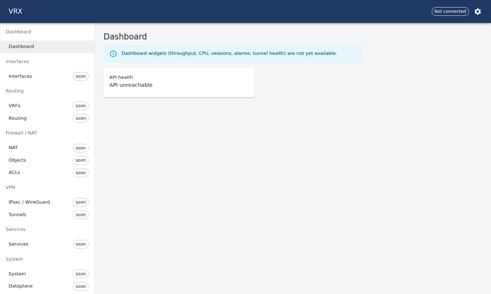
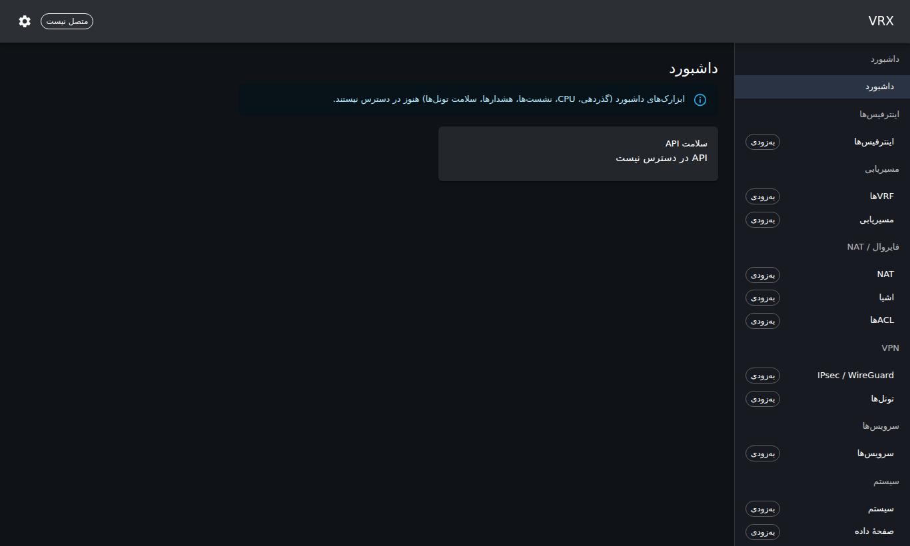
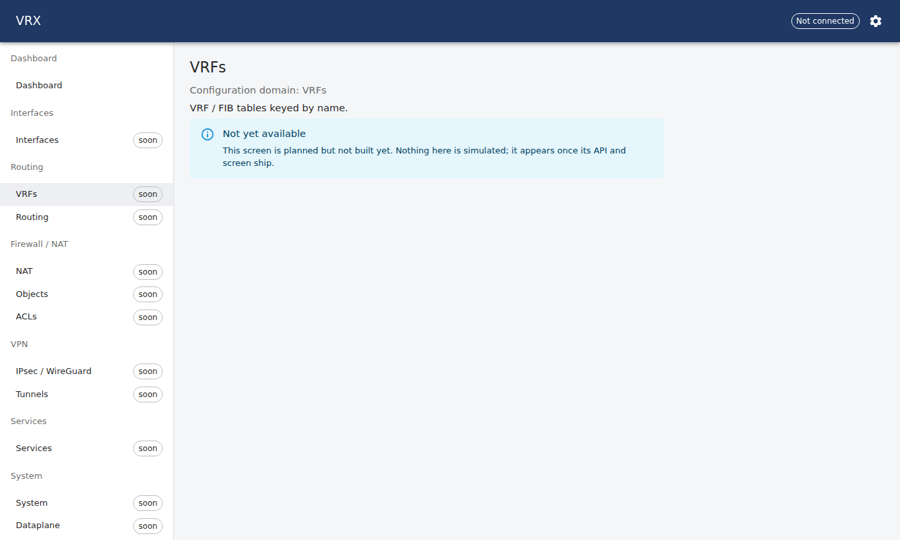
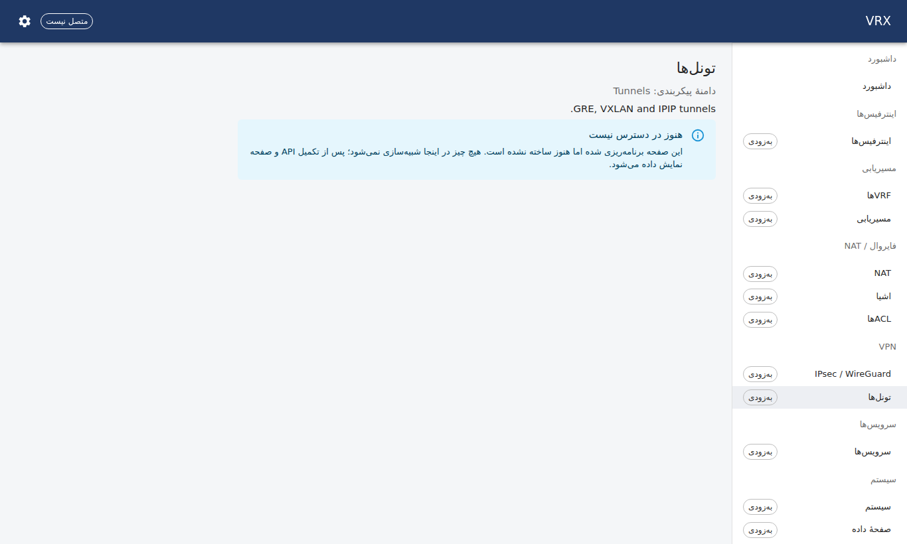
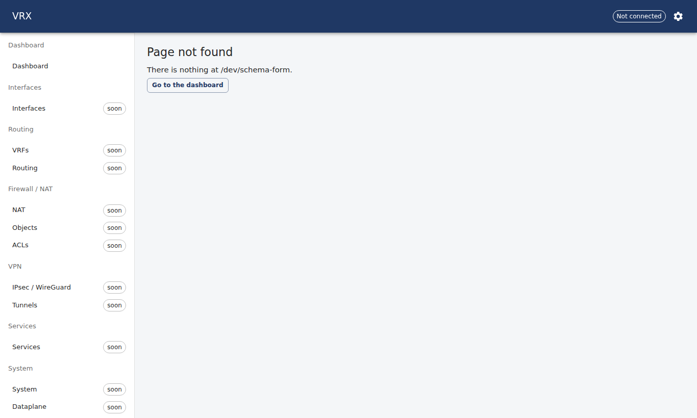
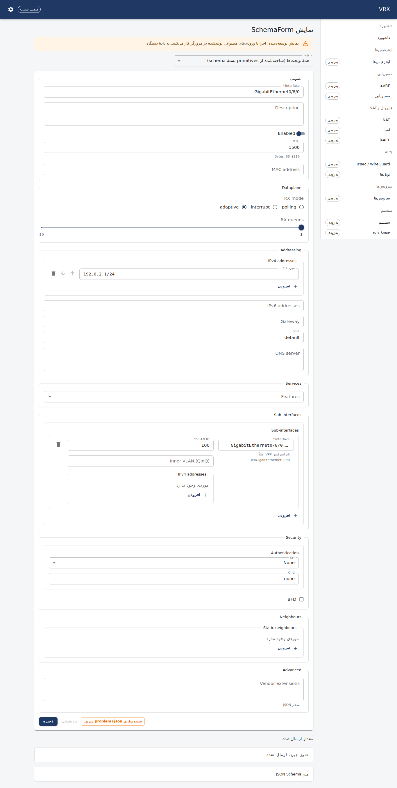
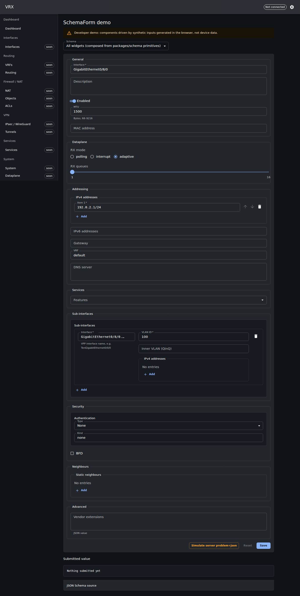

# P07a — UI shell: theme/RTL, i18n, SchemaForm, ServerDataGrid, WS hook, frame skeleton — done 2026-09-23

Branch `task/P07a`, worktree `/root/ngfw-wt/P07a`, base `main@2de6c2f`, slot 8 (`w8`, ports 3800/5800). Files touched:
`apps/web/**`, `packages/ui-kit/**`, `pnpm-lock.yaml` (two web deps: `@ngfw/schema`, `zod`), `docs/status/tasks/P07a*.md`.
Predecessor's recovered work (`232c951`: theme, formatters, WS client skeleton) was kept and finished; nothing was restarted.

## What was built

### `packages/ui-kit` (entry points: `.`, `./schema-form`, `./data-grid`, `./ws`)
- **Theme** — `createVrxTheme(mode, dir, { dense })`: light/dark, 8 px grid, dense controls/tables by default, semantic
  status tokens `theme.vrx.status.{up,down,degraded,adminDown}` (WCAG AA ≥ 4.5:1 on paper in both modes — tested),
  `theme.vrx.denseRowHeight`, `theme.vrx.monoFontFamily`, visible `:focus-visible` ring. `<VrxThemeProvider mode lang dir dense>`
  = Emotion cache (`stylis-plugin-rtl` for rtl) + ThemeProvider + CssBaseline, and keeps `<html dir lang>` + `color-scheme` in sync.
  `<StatusChip status>`; `contrastRatio()` helper.
- **i18n** — `UI_KIT_NS` ('ui-kit') resources `en` + `fa` (key parity + interpolation-variable parity tested), `directionFor(lang)`,
  `createFormatters()/useFormatters()` over `Intl` only: numbers, rates (bit/s, pkt/s), percent, dates (Persian calendar for fa),
  relative time, **Persian digits option** (`nu-arabext` + `digits()`), `<FormatterSettingsProvider>`.
- **`<SchemaForm>`** — renders MUI fields from JSON Schema 2020-12 (`string/number/integer/boolean/enum/const/array/object/
  record(additionalProperties)/oneOf/anyOf/allOf/$ref`) + `x-vrx-ui` hints: `widget` (text, textarea, password, select, radio, number,
  slider, switch, checkbox, cidr, ip, mac, interface-picker, chips, multiselect, list, json, hidden, custom registry), `group`
  (fieldsets), `order`, `help` (literal or i18n key), `dependsOn` (sibling or absolute `/path`, `value`/`values`/truthy).
  Validation: react-hook-form + a resolver built from the **same JSON Schema** via Zod 4 `z.fromJSONSchema` (+ Zod regex injection
  for `cidrv4/cidrv6` formats), all messages via `t('validation.*')`. Records keyed by names containing `/` and `.`
  (`TenGigabitEthernet0/0/0.100`) are edited as entry arrays and converted back on submit; empty/duplicate keys are flagged.
  **RFC 9457** `problem.pointer` / `problem.errors[].pointer` (RFC 6901, `~1`/`~0` unescaped) are mapped onto fields through the
  live form layout; unmappable pointers are listed in a form-level alert. `onSubmit` receives the parsed JSON with defaults applied.
- **`<ServerDataGrid>`** — MUI X DataGrid (MIT, v9) with `paginationMode/sortingMode/filterMode="server"`, bound to TanStack Query
  (`queryKey: [...base, request]`, `keepPreviousData`, optional `refetchInterval`), typed `GridColDef<R>`, dense rows from the theme,
  `faIR`/`enUS` grid locale by language, empty/loading/error(+Retry) overlays; `fetchPage(request, signal)` contract:
  `{ page, pageSize, sort[], filter[], filterLogic, quickFilter[] } → { rows, total }`. Rows are virtualised by the grid.
- **WS client** — `VrxWsClient`: one multiplexed connection, lazy connect on first subscriber, ref-counted topics,
  `{subscribe|unsubscribe: string[]}` frames, re-subscribe after reconnect, exponential backoff with jitter (500 ms → 30 s),
  per-topic buffering flushed at 1 Hz, close-when-idle. `<WsProvider options|client>` (only closes clients it created),
  `useTopic(topic, { onBatch, enabled })`, `useWsStatus()`, `defaultStreamUrl()`. Handles runtimes that fire `error` without `close`.

### `apps/web`
- Providers: TanStack Query → `UiSettingsProvider` (theme mode light/dark/system, language, Persian digits, density; persisted in
  `localStorage` `vrx.ui.settings`; drives `VrxThemeProvider` + `FormatterSettingsProvider` + `i18n.changeLanguage`) → single
  `WsProvider` → router.
- **App frame** — fixed AppBar (title, live-stream status chip, settings popover), grouped left nav (permanent ≥ md, temporary drawer
  below), skip-link, `<main id="main">`, `Suspense` fallback. **Navigation entries come from the schema's root keys**
  (`z.toJSONSchema(RootConfig)`; `x-vrx-ui.order`) placed into the docs/05 groups by `DOMAIN_GROUP` (vdom.md guardrail 4), plus
  Dashboard, System › Users, System › Revisions, Tools, Developer. Unbuilt screens render **"Not yet available"** with the schema's
  title/description (no fake data); the Dashboard shows the P01 health card and an honest "widgets not yet available" note.
- Routes: `/`, one per domain (`/interfaces`, `/routing/vrfs`, `/firewall/acl`, …), `/system/users`, `/system/revisions`, `/tools`,
  code-split `/dev/schema-form` (every widget: a demo schema composed from `packages/schema` primitives + `withUi()`, plus the
  generated root/domain schemas as-is, a submit echo, a simulated problem+json to show pointer mapping), `/dev/data-grid`
  (20 000 synthetic rows, labelled), `/dev/stream` (real connection state, no simulated data), `*` not-found.
- i18n: `react-i18next`, namespaces `common`, `nav`, `dev`, `ui-kit`; `en` + `fa` complete; `<html dir lang>` follow the language.
- Guards: `eslint-plugin-i18next` `no-literal-string` (jsx-only + attribute allowlist) in `apps/web/eslint.config.js` and
  `packages/ui-kit/eslint.config.js`; `scripts/check-logical-css.mjs` (fails on `margin-left`/`ml:`/`left:`… in web + ui-kit sources);
  `scripts/bundle-budget.mjs` (initial gzipped JS+CSS < 600 kB and at least one lazy chunk, run by `pnpm build`).
- Vite dev/preview ports and API proxy come from `VRX_WEB_PORT` / `VRX_HTTP_PORT` (slot 8: 5800/3800; defaults 5173/3000 only for
  the integrated build).

## How it was verified (real output, host `ngfw`, worktree `/root/ngfw-wt/P07a`, 2026-09-23)

### Full gate — `tools/ci.sh --base main` (log `/root/ngfw-wt/logs/P07a-ci.log`)

```
== install (frozen lockfile) ==
== generated output must be clean ==
$ turbo run gen
• turbo 2.11.2
== contract guard vs main ==
== forbidden patterns ==
== typecheck ==
$ turbo run typecheck
• turbo 2.11.2
== lint ==
$ turbo run lint
• turbo 2.11.2
== test ==
$ turbo run test
• turbo 2.11.2
== build ==
$ turbo run build
• turbo 2.11.2
== agent ==
CI GATE PASSED
EXIT=0
```

### Unit tests (jsdom; WS client tested against a real `ws` server on an ephemeral loopback port)

```
$ ui-kit: pnpm test
 RUN  v3.2.7 /root/ngfw-wt/P07a/packages/ui-kit
 ✓ src/ws/client.test.ts (3 tests) 460ms
 ✓ src/ws/backoff.test.ts (1 test) 13ms
 ✓ src/ws/useTopic.test.tsx (2 tests) 122ms
 ✓ src/i18n/formatters.test.ts (3 tests) 113ms
 ✓ src/i18n/locales.test.ts (1 test) 64ms
 ✓ src/theme/createVrxTheme.test.ts (3 tests) 38ms
 ✓ src/schema-form/form-value.test.ts (7 tests) 76ms
 ✓ src/index.test.ts (1 test) 22ms
 ✓ src/data-grid/ServerDataGrid.test.tsx (3 tests) 2241ms
 ✓ src/schema-form/SchemaForm.test.tsx (9 tests) 63019ms
 Test Files  10 passed (10)
      Tests  33 passed (33)
   Duration  69.12s (transform 2.11s, setup 5.52s, collect 9.37s, tests 66.17s, environment 13.60s, prepare 4.27s)
```

```
$ web: pnpm test
 RUN  v3.2.7 /root/ngfw-wt/P07a/apps/web
 ✓ src/nav/nav.test.ts (3 tests) 28ms
 ✓ src/App.test.tsx (5 tests) 12330ms
 Test Files  2 passed (2)
      Tests  8 passed (8)
   Duration  18.84s (transform 1.71s, setup 1.23s, collect 4.15s, tests 12.36s, environment 2.73s, prepare 563ms)
```

Test coverage of the acceptance list: every SchemaForm widget renders (`SchemaForm.test.tsx` "renders a control for every widget"),
translated validation on blur/submit, RFC 9457 pointer → field mapping with escaped record keys and an unmappable pointer,
`dependsOn`, oneOf variant switching, record/list add-remove, fa/RTL rendering, read-only; DataGrid server paging request shape,
error+retry and empty overlays; WS multiplexing, 1 Hz buffering (5 samples → 1 delivery), unsubscribe/idle close, reconnect with
backoff + re-subscribe, unreachable server; `useTopic` mount/unmount and shared socket; theme contrast; locale parity; formatters;
navigation built from the schema root keys; placeholders; language switch flips `<html dir lang>`; lazy dev route.

### Lint gates

```
$ web: pnpm lint
$ eslint src && node scripts/check-logical-css.mjs
check-logical-css: OK (71 files, no physical left/right CSS)
```

```
$ ui-kit: pnpm lint
$ eslint src
```

The i18n rule really fails on a hard-coded JSX string (probe file, deleted afterwards):

```
$ i18n rule sanity: a literal JSX string must fail
  1:33  error  disallow literal string: <p>Hard coded</p>  i18next/no-literal-string
✖ 1 problem (1 error, 0 warnings)
```

### Bundle budget and code splitting (`pnpm build` in `apps/web`)

```
$ web: pnpm build (tsc + vite build + bundle budget)
$ tsc -p tsconfig.json --noEmit && vite build && node scripts/bundle-budget.mjs
vite v7.3.6 building client environment for production...
✓ 1554 modules transformed.
dist/index.html                               0.38 kB │ gzip:   0.25 kB
dist/assets/StreamDemoPage-B5sLfTEF.js        1.70 kB │ gzip:   0.92 kB │ map:     6.04 kB
dist/assets/InputAdornment-DMs1qVm8.js       52.07 kB │ gzip:  18.50 kB │ map:   300.16 kB
dist/assets/SchemaFormDemoPage-CYUrxZno.js  126.31 kB │ gzip:  41.65 kB │ map:   595.86 kB
dist/assets/DataGridDemoPage-GRost6X-.js    469.35 kB │ gzip: 141.80 kB │ map: 2,420.62 kB
dist/assets/index-B3z1GTKo.js               842.85 kB │ gzip: 262.57 kB │ map: 4,108.43 kB
✓ built in 24.29s
bundle-budget: gzipped sizes (I = loaded on first paint, L = lazy route/vendor chunk)
bundle-budget: initial   256.0 kB gzipped of   600.0 kB budget; 4 lazy chunk(s)
bundle-budget: OK
```

Initial load = one 256 kB gzipped chunk (React, MUI core, router, i18n, TanStack Query, Zod + `@ngfw/schema`); the SchemaForm
(react-hook-form + widgets), the DataGrid (MUI X) and the demo pages are lazy chunks loaded on their routes only.

### "No component opens its own WebSocket" / "no physical CSS"

```
$ grep: WebSocket constructions (only the ui-kit client may open one)

```

(no matches: the only socket is created by `VrxWsClient` through an injectable factory that defaults to `globalThis.WebSocket`)

```
$ grep: physical CSS
none
```

### Built app checked in a browser (vite preview on slot port 5800 through an SSH tunnel; server and tunnel killed by PID afterwards)

- `/` — frame, grouped navigation from the 13 schema root keys with "soon" markers, dashboard with the honest "widgets not yet
  available" note and the P01 health card showing **"API unreachable"** (no API on port 3800 — nothing simulated).
- Keyboard: the first Tab focuses the skip link (`document.activeElement` = `<a href="#main">`, visible at top), further Tabs walk
  settings → nav items with the theme's focus ring; the settings popover is fully keyboard-operable (Select + ArrowDown/Enter).
- Language → فارسی: `<html dir="rtl" lang="fa">`, drawer moves to the inline-start side, all shell strings in Persian, DataGrid shows
  Persian-calendar dates (`1 مهر 1405، 15:30:00`) and the `faIR` grid locale; setting persisted in `localStorage`.
- `/dev/schema-form` — every group (General, Dataplane, Addressing, Services, Sub-interfaces, Security, Neighbours, Advanced) renders
  with text, textarea, switch, number+help, MAC, radio, slider, cidr list (add/remove/move), chips, ip, hostname, multiselect, record
  with interface-picker keys, oneOf picker with const, checkbox + `dependsOn`, object list, JSON editor; 0 `.Mui-error` at load.
- `/dev/data-grid` — 20 000 synthetic rows paged 50 at a time, coloured `StatusChip`s from `theme.vrx.status`, formatted rates/dates,
  toolbar filter/sort round-trip through the local `fetchPage`.
- Console: only the expected 500s from the proxied `/api/v1/health` poll (no API running); no React/MUI errors.

## Out of scope / left undone (by design of the P07a/P07b split)

- Login page, protected routes, cookie session (P07b, needs P06).
- Pending-change bar, commit dialog with diff/comment/auto-revert countdown, revisions page, users CRUD (P07b).
- Playwright E2E and Lighthouse run (P07b; the frame has skip-link, focus ring, AA status colours, `<main>` landmark, labelled
  controls — keyboard path verified manually above).
- Real Interfaces list (P08) — `/interfaces` is a "not yet available" page.
- Translation of schema titles/descriptions (hook provided: `translateLabel`, `nav:domains.*`; owner TBD — question 5).
- Charts, CLI terminal, packet capture UI (later tasks).
- The generated domain schemas are `{}` placeholders on `main` (P02a/b/c unmerged); the renderer was verified against a schema
  composed from the real primitives and against the widget test schema. Re-run `/dev/schema-form` once P02a merges.

## Open questions

See `docs/status/tasks/P07a-questions.md` (WS wire protocol and RFC 9457 shape for P06, `dependsOn` in `UiHints`, `generateSchemas`
export, schema-title i18n, shared root ESLint config, peer-dependency warning). None blocked the work.

## Decisions taken (to be copied to docs/decisions/LOG.md by the manager)

| date | id | decision | options considered | why | reversal cost | tasks |
|---|---|---|---|---|---|---|
| 2026-09-23 | D-P07a-1 | SchemaForm validation = react-hook-form resolver built from the JSON Schema with Zod 4 `z.fromJSONSchema` | (a) AJV resolver (b) hand-written JSON Schema→Zod converter (c) `z.fromJSONSchema` | one validator family (same as packages/schema), no new dependency, issue codes map 1:1 to `validation.*` keys | low (resolver is one file) | P07a, P07b, P08+ |
| 2026-09-23 | D-P07a-2 | Records (`additionalProperties` objects keyed by names such as `Gig0/0/0.100`) are edited as ordered `{key,value}[]` in form state and converted on submit; pointers map keys → indexes | (a) RHF paths containing the key (breaks on `.`) (b) custom form state engine (c) entry-array transform | keeps react-hook-form, handles `/` and `.` in VPP names, duplicate/empty keys become field errors | low | P07a, feature screens |
| 2026-09-23 | D-P07a-3 | The web app derives JSON Schemas at start-up from `@ngfw/schema` (`z.toJSONSchema`, same options as `pnpm gen`) | (a) copy `dist/json-schema/*.json` at build (b) `GET /api/v1/schema` (c) generate in the browser | zero drift from the contract, no build plumbing, works without the API; ~20 kB gz of Zod already needed by the resolver | trivial (one module) | P07a, P07b, P06 (optional endpoint later) |
| 2026-09-23 | D-P07a-4 | Non-standard formats (`cidrv4`, `cidrv6`, …) without a `pattern` get Zod's own regex injected in `compile()`; `pattern → format` remembered for messages | (a) require schema owners to always emit `pattern` (b) inject in the renderer | Zod's `toJSONSchema` already emits patterns, so production schemas need nothing; hand-written schemas stay safe | trivial | P07a, P02a |
| 2026-09-23 | D-P07a-5 | i18n lint (`eslint-plugin-i18next/no-literal-string`, jsx-only + attribute allowlist) lives in per-package `eslint.config.js` files that extend the root config | (a) edit the shared root config (b) per-package configs | root config is not P07a-owned; ESLint 9 resolves the nearest config per package cwd (how turbo runs lint) | trivial | P07a, P09 (CI) |
| 2026-09-23 | D-P07a-6 | Navigation groups are the docs/05 list; entries inside them are the schema's root keys placed by `DOMAIN_GROUP` (unmapped keys fall into System, guarded by `nav.test.ts`) | (a) hard-coded item list (b) groups from schema `x-vrx-ui.group` on domains (c) mapping table | satisfies vdom.md guardrail 4 with today's schema (domains carry `order` only) | trivial | P07a, P07b |
| 2026-09-23 | D-P07a-7 | **Superseded by review M1 (see Review fixes)** — `/dev/*` demo routes ship as lazy chunks with a "developer demo, synthetic inputs" banner instead of being stripped from production builds | (a) `import.meta.env.DEV` only (b) always available, code-split, labelled | manager/QA can exercise widgets on any build; 0 kB cost on first paint; clearly not device data | trivial | P07a |
| 2026-09-23 | D-P07a-8 | `WsProvider` closes only clients it created; an injected `client` belongs to its creator | (a) always close on unmount (b) ownership follows creation | React 19 runs parent cleanups before children, which made injected clients close before subscribers unsubscribed | trivial | P07a |
| 2026-09-23 | D-P07a-9 | Vite dev/preview port and API proxy target come from `VRX_WEB_PORT` / `VRX_HTTP_PORT` (defaults 5173/3000 only for the integrated main build) | (a) hard-code slot ports (b) env-driven | one config for every worker slot (shared-host-rules §1) | trivial | all UI tasks |


## Review fixes (2026-09-24, fix round for `P07a-review.md` @ `eebff13`)

`main` was merged first (`e1042b4`, clean). Every finding below maps to a commit. Output is pasted from real runs in
`/root/ngfw-wt/P07a` with the slot-8 env (`eval "$(tools/lab env 8)"`).

| finding | status | commit(s) | what changed |
|---|---|---|---|
| **M1** dev routes in prod | fixed | `9a401f8` | `/dev/*` routes, the Developer nav group and the `dev` i18n namespace sit behind the build-time literal `__VRX_DEV_ROUTES__` (`vite.config.ts` `define`: true for vite dev/test, false for `vite build` unless `VITE_VRX_DEV_ROUTES=1`). Production output contains no demo chunks, route paths or dev nav strings. `scripts/check-no-dev-routes.mjs` is now part of `pnpm build` and fails the build on a leak. Dashboard and domain placeholders are now lazy routes, so the "routes code-split" budget check still has real lazy chunks. D-P07a-7 is marked superseded. The three demos are kept but dev-gated, not dropped: `/dev/schema-form` is the one the prompt asked for, and the grid and stream demos are the only in-browser exercise of ServerDataGrid and the WS client until P08. Deleting them is a one-line change if the manager prefers that. |
| **M2** no screenshots | fixed | `19a6d58` | 7 real screenshots, taken with headless Chromium, in `docs/status/tasks/P07a-screens/` (see below). |
| **M3** hidden fields validated/submitted | fixed | `73b6922`, `19a6d58` | `fromFormValue(…, formRoot)` and `findRecordKeyIssues` drop properties whose `dependsOn` (sibling or absolute `/path`) is not met. The rule is the same one `DependsOnGate` uses, so hidden values are neither validated nor submitted. Tests cover the UI path (invalid VRF → hide → Save succeeds, payload has no `vrf`) and the unit and resolver paths. |
| **M4** compile failure silently accepts | fixed | `73b6922` | `compile()` now fails closed. It records the `z.fromJSONSchema` error, logs `console.error` and returns `z.never()`. `compileError()` is exported. The resolver refuses every submit with `form.validationUnavailable` (en and fa), and `<SchemaForm>` shows that alert up front and disables Save. New web test `schema/registry.test.ts`: the root schema and all 13 domain schemas must compile. This guards P02a/b/c merges. |
| L1 compile cache misses | fixed (partly) | `e4284e2` | `resolveRef`/`mergeAllOf` are memoised per `(root, schema)` in WeakMaps, so `compile()` hits its identity cache. I CPU-profiled the slow "oneOf variants" test: the time goes to jsdom (`HTMLLabelElement.control` lookups from `getByLabelText`) and module loading, not to schema compilation. The suite speed is a test-harness cost. The new review tests use `fireEvent` to stay well under the 30 s timeout. |
| L2 i18n lint blind spots | fixed; one residual | `95e4b29` | Both `eslint.config.js` files now check **every** JSX attribute except an exclude-list of non-text ones, and all-caps words are no longer exempt. New `apps/web/src/locales/locales.test.ts` checks en/fa key and interpolation parity for every namespace. **Residual (not fixed):** string literals outside JSX, such as `GridColDef.headerName` in column arrays and `.ts` files. Reason: `mode: 'all'` flags every route, query key and enum literal, and the result would be mostly noise. Column headers are expected to go through `t()` in P08 review. |
| L3 placeholder titles static | fixed | `9a401f8` (fix), `0cb6b1f` (test) | `NotAvailableByKey` uses `useTranslation()`. I confirmed the test fails with the old `i18n.t` version. |
| L4 two current nav items | fixed | `0cb6b1f` | `currentNavPath()` picks the longest matching nav path. NavLink is `end` everywhere, so exactly one item is `selected`/`aria-current` (see the `aria-current` column in the screenshot log). |
| L5 grid overlay flash / silent refetch error | fixed | `403df42` | `loading = isPending \|\| (isFetching && isPlaceholderData)`. When a refetch fails while stale rows are shown, an inline warning `Alert` with Retry appears (`grid.staleError`, en and fa). |
| L6 WS edge cases | fixed | `44570a9` | (a) `maxBufferPerTopic` (default 600, keeps the newest samples). (b) `subscribe()` during backoff no longer connects early. (c) `idleCloseDelayMs` grace (default 2 s). (d) `useTopic` resets its state when the topic changes. Covered by `ws/client-edge.test.tsx` with fake timers. |
| L7 technical inputs RTL | fixed | `95e4b29` | `dir="ltr"` on ip/cidr/mac/interface-picker/mono inputs and the JSON editor. Free text still follows the page direction (tested in fa; visible in screenshot 06: `192.0.2.1/24`). |
| L8 reset on identity change | fixed | `e4284e2` | The form resets only when `JSON.stringify(value)` changes. Tested: an equal inline literal keeps edits, and changed content resets the form. |
| Info: Vazirmatn not loaded | not changed | — | Still in the font stack. It is used if installed, otherwise the system font is used, as the fa screenshots show. Bundling a webfont is polish (FAST MODE) and a new asset dependency, so it is left for the manager. |

### M1 evidence

Production build (the normal `pnpm build`):
```
$ tsc -p tsconfig.json --noEmit && vite build && node scripts/bundle-budget.mjs && node scripts/check-no-dev-routes.mjs
dist/index.html                                  0.38 kB │ gzip:   0.25 kB
dist/assets/DomainPlaceholderPage-BiABGmIg.js    0.38 kB │ gzip:   0.28 kB │ map:     1.33 kB
dist/assets/DashboardPage-CGH7LL2b.js           16.13 kB │ gzip:   6.02 kB │ map:    81.57 kB
dist/assets/index-B9Ria0yw.js                  778.85 kB │ gzip: 243.04 kB │ map: 3,959.22 kB
bundle-budget: gzipped sizes (I = loaded on first paint, L = lazy route/vendor chunk)
  I    237.0 kB  (raw   760.6 kB)  assets/index-B9Ria0yw.js
  L      5.9 kB  (raw    15.8 kB)  assets/DashboardPage-CGH7LL2b.js
  L      0.3 kB  (raw     0.4 kB)  assets/DomainPlaceholderPage-BiABGmIg.js
bundle-budget: initial   237.0 kB gzipped of   600.0 kB budget; 2 lazy chunk(s)
bundle-budget: OK
check-no-dev-routes: OK (4 files, no /dev routes, dev nav or demo chunks)
```
The guard really fails when demos leak (same script run against a `VITE_VRX_DEV_ROUTES=1` build output):
```
$ node scripts/check-no-dev-routes.mjs <scratch>/devdist ; echo EXIT=$?
check-no-dev-routes: FAIL — developer demo routes leaked into the production build
  assets/DataGridDemoPage-DlvMWSnx.js: demo chunk emitted
  assets/DataGridDemoPage-DlvMWSnx.js: contains "DataGridDemoPage"
  assets/SchemaFormDemoPage-DAP1MnV3.js: demo chunk emitted
  assets/SchemaFormDemoPage-DAP1MnV3.js: contains "SchemaFormDemoPage"
  assets/StreamDemoPage-CjTU_I5a.js: demo chunk emitted
  assets/StreamDemoPage-CjTU_I5a.js: contains "StreamDemoPage"
  assets/index-ClVXP5xP.js: contains "dev/schema-form"
  assets/index-ClVXP5xP.js: contains "dev/data-grid"
  assets/index-ClVXP5xP.js: contains "dev/stream"
  assets/index-ClVXP5xP.js: contains "dev:nav."
  assets/index-ClVXP5xP.js: contains "SchemaFormDemoPage"
  assets/index-ClVXP5xP.js: contains "DataGridDemoPage"
  assets/index-ClVXP5xP.js: contains "StreamDemoPage"
  assets/index-ClVXP5xP.js: contains "Developer demo"
EXIT=1
```

### M2 screenshots (headless Chromium; real built app)

Neither Playwright browsers nor Chromium were on the host, and `cdn.playwright.dev` / `storage.googleapis.com` answer 403
("not available in your location"). I did **not install any system package**. Instead I downloaded Chrome-for-Testing
`chrome-headless-shell` 153.0.8010.12 from the npmmirror binary mirror into the session scratch directory. Its missing
shared libraries (`libatk`, `libgbm`, `libxkbcommon`, `libdrm`, …) came from `apt-get download` and were unpacked with `dpkg-deb -x`
into scratch and loaded via `LD_LIBRARY_PATH`. Nothing was installed system-wide. Playwright-core 1.63 came from the existing npx cache, and the
script was not committed. `vite preview` of each build ran on slot port 5800 and was stopped by PID. No API was running, so the
health card honestly shows "API unreachable".

```
01-dashboard-en-light.png  /  html dir/lang=ltr/en  h2="Dashboard"  devNavGroup=0  aria-current=["Dashboard"]  pageErrors=0
02-dashboard-fa-dark-rtl.png  /  html dir/lang=rtl/fa  h2="داشبورد"  devNavGroup=0  aria-current=["داشبورد"]  pageErrors=0
03-placeholder-vrfs-en-light.png  /routing/vrfs  html dir/lang=ltr/en  h2="VRFs"  devNavGroup=0  aria-current=["VRFs\nsoon"]  pageErrors=0
04-placeholder-tunnels-fa-light-rtl.png  /vpn/tunnels  html dir/lang=rtl/fa  h2="تونل‌ها"  devNavGroup=0  aria-current=["تونل‌ها\nبه‌زودی"]  pageErrors=0
05-prod-dev-route-is-404-en.png  /dev/schema-form  html dir/lang=ltr/en  h2="Page not found"  devNavGroup=0  aria-current=[]  pageErrors=0
06-dev-schema-form-fa-light-rtl.png  /dev/schema-form  html dir/lang=rtl/fa  h2="نمایش SchemaForm"  devNavGroup=1  aria-current=["نمایش SchemaForm"]  pageErrors=0
07-dev-schema-form-en-dark.png  /dev/schema-form  html dir/lang=ltr/en  h2="SchemaForm demo"  devNavGroup=1  aria-current=["SchemaForm demo"]  pageErrors=0
preview prod/dev stopped by PID; port 5800 free afterwards
```

| | |
|---|---|
|  `/` en, light (prod build, no Developer group) |  `/` fa, dark, RTL: nav on the inline-start (right) side |
|  placeholder domain page `/routing/vrfs` |  `/vpn/tunnels` fa: only "Tunnels" is current (L4) |
|  prod build: `/dev/schema-form` → Page not found (M1) |  dev build: `/dev/schema-form` in fa, with IP/CIDR inputs LTR (L7) |
|  dev build: `/dev/schema-form` en, dark | |

### L2 evidence: the widened rule catches the reviewer's probes (temporary file, deleted)
```

apps/web/src/zz-i18n-probe.tsx
  4:18  error  disallow literal string: tooltip="Click to save"      i18next/no-literal-string
  4:46  error  disallow literal string: description="A description"  i18next/no-literal-string
  4:70  error  disallow literal string: message="Saved"              i18next/no-literal-string
  4:93  error  disallow literal string: aria-valuetext="half"        i18next/no-literal-string
  5:10  error  disallow literal string: <p>MTU</p>                   i18next/no-literal-string
  6:10  error  disallow literal string: <p>OK</p>                    i18next/no-literal-string

✖ 6 problems (6 errors, 0 warnings)
```

### Tests
```
$ apps/web: npx vitest run
 ✓ src/locales/locales.test.ts (4 tests) 48ms
 ✓ src/nav/nav.test.ts (5 tests) 30ms
 ✓ src/schema/registry.test.ts (14 tests) 44ms
 ✓ src/App.test.tsx (8 tests) 15267ms
   ✓ App frame > renders the shell with navigation groups built from the schema root keys  3235ms
   ✓ App frame > shows "not yet available" for unbuilt domain screens, with the schema title and no data  386ms
   ✓ App frame > switches to Persian: RTL direction, lang attribute and translated labels  1769ms
   ✓ App frame > code-splits the developer routes and renders the SchemaForm demo  5107ms
   ✓ App frame > has no /dev routes and no Developer nav group when dev routes are off (production builds, review M1)  3037ms
   ✓ App frame > marks exactly one navigation item as the current page on nested domain paths (review L4)  563ms
   ✓ App frame > placeholder titles follow a language switch without navigating (review L3)  705ms
   ✓ App frame > renders a not-found page for unknown paths  460ms
 Test Files  4 passed (4)
      Tests  31 passed (31)
```
```
$ packages/ui-kit: npx vitest run   (before 19a6d58 switched the M3/L8 tests to fireEvent: now 4.3 s / 2.4 s)
 ✓ src/ws/client.test.ts (3 tests) 470ms
 ✓ src/ws/backoff.test.ts (1 test) 11ms
 ✓ src/i18n/locales.test.ts (1 test) 39ms
 ✓ src/ws/client-edge.test.tsx (4 tests) 169ms
 ✓ src/ws/useTopic.test.tsx (2 tests) 149ms
 ✓ src/i18n/formatters.test.ts (3 tests) 114ms
 ✓ src/theme/createVrxTheme.test.ts (3 tests) 40ms
 ✓ src/schema-form/form-value.test.ts (11 tests) 77ms
 ✓ src/index.test.ts (1 test) 25ms
 ✓ src/data-grid/ServerDataGrid.test.tsx (4 tests) 4080ms
   ✓ <ServerDataGrid> > does not flash the loading overlay on background polls, and flags a failed refetch over stale rows (review L5)  1223ms
 ✓ src/schema-form/SchemaForm.test.tsx (12 tests) 95731ms
   ✓ <SchemaForm> > neither validates nor submits a field hidden by dependsOn (review M3)  12614ms
   ✓ <SchemaForm> > fails closed when the schema cannot be compiled (review M4)  410ms
   ✓ <SchemaForm> > keeps edits when the parent re-renders with an equal inline value, resets when the content changes (review L8)  27323ms
 Test Files  11 passed (11)
      Tests  45 passed (45)
```

### CI gate — `tools/ci.sh --base main` (log `/root/ngfw-wt/logs/P07a-ci-final.log`)
CI_FINAL_PLACEHOLDER

### Open questions from this round
- M1: should the dev-gated `/dev/data-grid` and `/dev/stream` be deleted outright instead? They cost nothing in production.
- L2 residual: do we want an `object-properties` rule for `headerName` in column arrays (P08 grids)?
