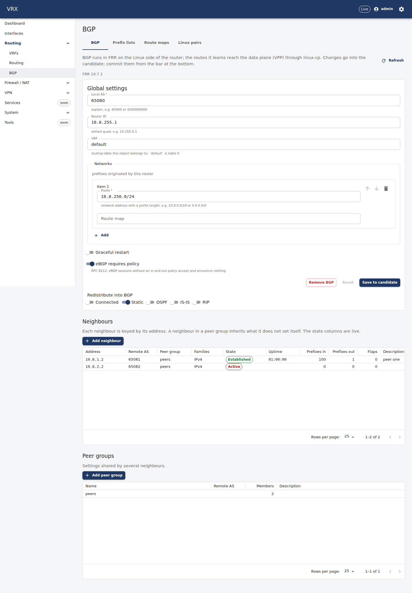
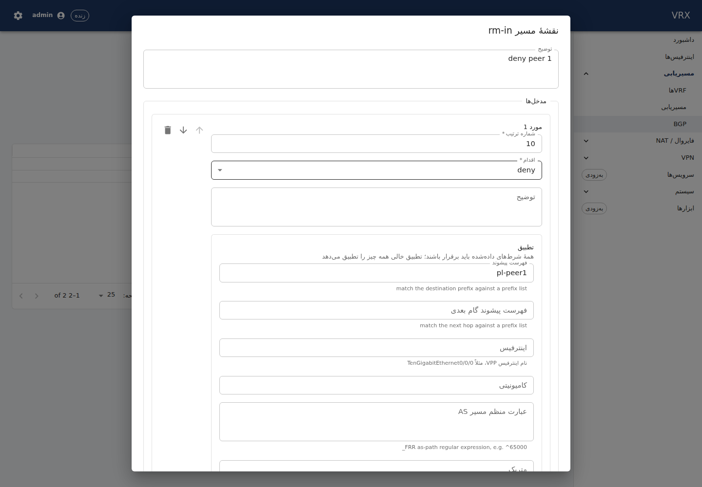

# P12 — FRR + linux-cp: BGP, route maps / prefix lists, FRR → VPP route sync (linux-nl)

Branch `task/P12` (worktree `/root/ngfw-wt/P12`, slot 8 = `w8`, tables 8000–8999, rig 10.8.{1,2}.0/24, daemon-owner frr:
slot instances only). Base: the manager's `task/P12` (main + TD-8 + F-vrf-static-ecmp), `merge main` twice (TD-8 squash,
TD-11b/TD-4). Started 2026-09-24 23:16; usage-limit stop 00:15–03:40.

## What was built

| layer | what |
|---|---|
| contract (schema) | `interfaces.<n>.lcp{hostIfName?, hostIfType = tap, netns?}` (`domains/ext/frr-linuxcp.ts`, key line under `wave-A: P12`), `routing.static[].tag`; rules `routing.bgp-lcp-host-name`, `-lcp-host-name-unique`, `-interface-has-lcp`, `-static-tag-via-frr` (`semantic/bgp.ts`) |
| contract (proto) | `Interface.lcp` **22** (`InterfaceLcp`), `StaticRoute.tag` **8**, `EVENT_KIND_ROUTING_CHANGED` **14**, `EVENT_KIND_BGP_NEIGHBOR_CHANGED` **15**, `rpc RoutingState` + `RoutingState*`, `BgpInstanceState`, `BgpNeighbor*State`, `RoutingLcpPair`, `RoutingRib*` (P12 section); contracts §11 `P12: RoutingState` |
| agent: FRR sections | `renderers/frr/bgp` (router bgp, peer groups, neighbours, AF blocks, networks, redistribute, timers, `passwordRef` via `rc.Secret`; `bgpSummary` reader; `bgp-neighbors` 1 Hz poller; summary parser), `renderers/frr/policy` (prefix lists, route maps, generated community / as-path lists) |
| agent: framework (gap-only) | S2 `frr.RegisterInterfaceLines` (+ `WithInterfaceLines`), `StaticRoute.tag` from the proto, frrtest `Options.Instance` (+ `frr.TestInstancePaths`) |
| agent: linux-cp | `internal/lcpmap` (VPP → Linux names for `frr.WithInterfaceMapper`; S2 producer `lcp-addresses`), `desired/lcp.go` (builder/assembler of `lcp.itf-pair`), DF-8's descriptor registered behind a tap gate (`subsystems/frr.go`) |
| agent: FRR stage | `frr.config/vrx` singleton descriptor (render → `vtysh -C` → `frr-reload.py --reload` + convergence; Retrieve via `--test`; applied/drift/unreachable/unknown), `desired/bgp.go` (FRRDoc, builder with render check and `passwordRef` refusal, assembler), events via TD-8 `Wiring.Publish`, `RoutingState` (`agent/rpc_routing.go`) |
| agent: projection | S3: the routing warning is a table (`routingLeaves`, bgp/policy handled, `wave-BC` anchors for F-ospf, F-isis-rip, F-bfd-redistribution); P12 builder/assembler lines under the A2 anchors |
| API | `features/bgp`: `GET /api/v1/state/bgp` (`BgpController`), FRR annotation + `proto` filter of `/state/routes` (`routes.ts`, one shared hunk in F-vrf's controller), fake (`RoutingState`, FRR routes in `ListRoutes`), `routing.events` topic + relay cases, `AgentClient.routingState` |
| UI | `/routing/bgp` (NavItem in the routing group): BGP global + redistribution switches, neighbours with live state (state, uptime, prefixes in/out, flaps; 30 s + Refresh + `routing.events`), peer groups, prefix lists, route maps (SchemaForm array widgets), Linux pairs; `bgp` namespace en + fa |
| docs | `docs/user/routing/bgp.md`, `docs/agent/renderers/frr-bgp.md`, `frr.md` (P12 additions), `docs/agent/descriptors/lcp.md` (P12 wiring, L3 decided), `test/topology/bgp/README.md` |
| tests | see "Tests" |

## Acceptance — evidence

All host runs: vrx-a, slot 8 (`w8`), shared lab lock, `NRestarts` read before/after every run. The only restart during
P12's work (1 → 2, 04:27:21) was a SIGSEGV in `dns_plugin.so` via an API message of another client (Q13; manager
confirmed, not P12); every run after it: 2 → 2.

### 1. BGP through linux-cp: pairs, taps, sessions, 200 routes — `test/topology/bgp/run.sh` (run 6, 04:48, PASS 69.99 s)

The agent (in-process, owner `w8`, `VRX_FRR_PATHSPACE=w8`) created `host-w8l0`/`host-w8w0` on the rig and one linux-cp
pair each (taps in `ns-w8-frr`, where the slot's FRR runs); FRR put the VPP addresses on the taps (S2) and both eBGP
sessions came up **through the linux-cp punt path**; two FRR peers (frrtest instances `p1`/`p2` in `ns-w8-lan/wan`) announce
100 prefixes each:

```
p12_topology_integration_test.go:448: systemctl show vpp -p NRestarts (before) = 2
p12_topology_integration_test.go:470: vrx-vpp-preflight: <nil>
p12_topology_integration_test.go:534: apply commit: { "created": 11 }
p12_topology_integration_test.go:539: both sessions Established after 3.5s: 10.8.1.2 Established rx=0; 10.8.2.2 Established rx=0
p12_topology_integration_test.go:540: 200 routes after commit: FRR RIB bgp=200, … neighbours=10.8.1.2 Established rx=100; 10.8.2.2 Established rx=100
p12_topology_integration_test.go:541: [after commit] vppctl show lcp:
        itf-pair: [0] host-w8w0 tap4097 w8-w0 3 type tap netns ns-w8-frr
        itf-pair: [1] host-w8l0 tap4096 w8-l0 2 type tap netns ns-w8-frr
p12_topology_integration_test.go:541: [after commit] ip -n ns-w8-frr -br addr show:
        w8-l0            UNKNOWN        10.8.1.1/24 fe80::fe:5ff:feee:c5b5/64
        w8-w0            UNKNOWN        10.8.2.1/24 fe80::fe:88ff:fe85:bef6/64
p12_topology_integration_test.go:541: [after commit] vtysh --vty_socket /run/vrx-test/w8/frr/run -N w8 -c "show bgp summary":
        BGP router identifier 10.8.1.1, local AS number 65080 VRF default vrf-id 0
        RIB entries 200, using 31 KiB of memory
        Neighbor        V         AS   MsgRcvd   MsgSent   TblVer  InQ OutQ  Up/Down State/PfxRcd   PfxSnt Desc
        10.8.1.2        4      65081         5         5      200    0    0 00:00:01          100      200 peer one
        10.8.2.2        4      65082         5         5      200    0    0 00:00:01          100      200 peer two
p12_topology_integration_test.go:557: apply idempotent: { "unchanged": 11 }
```

Zebra installed them in FRR's kernel table (`ip -n ns-w8-frr route | wc -l` → 202 = 200 `proto bgp` + 2 connected, run 3).
Retrieve == desired for `routing.bgp`, `routing.policy`, `interfaces.<n>.lcp` (asserted by the test; the second apply is an
empty plan).

### 2. Route map denying half → 100 remain; `frr-reload.py`, FRR never restarted

```
p12_topology_integration_test.go:564: apply deny-half: { "updated": 1, "unchanged": 10 }
p12_topology_integration_test.go:565: route map denies half: FRR RIB bgp=100, … 10.8.1.2 Established rx=50; 10.8.2.2 Established rx=50 after 300ms
```
The test compares the FRR daemon PIDs before and after the edit (equal). Every Apply runs the framework's convergence check.

### 3. Withdraw on a peer → gone within 5 s

```
p12_topology_integration_test.go:572: peer 1 withdrew: FRR RIB bgp=50, … 10.8.1.2 Established rx=0; 10.8.2.2 Established rx=50 after 300ms
p12_topology_integration_test.go:576: peer 1 announces again: FRR RIB bgp=100 … after 300ms
```

### 4. Agent restart with the pairs deleted behind its back → pairs + sessions + routes back without the API

```
p12_topology_integration_test.go:588: simulated loss: lcp_itf_pair_add_del_v3 del host-w8l0 (sw_if_index 2) with the agent stopped
p12_topology_integration_test.go:588: simulated loss: lcp_itf_pair_add_del_v3 del host-w8w0 (sw_if_index 5) with the agent stopped
p12_topology_integration_test.go:592: both sessions Established after 300ms
p12_topology_integration_test.go:593: after agent restart + pair loss: FRR RIB bgp=100, … rx=50; … rx=50 after 800ms
p12_topology_integration_test.go:594: recovered 3s after the agent restart
```
(The agent's resync recreated both pairs; zebra re-applied the tap addresses; FRR's configuration was re-verified — an empty
frr-reload diff.) `kill -9 vpp` is the manager's after handover (not run: handover pending).

### 5. Link down on a VPP interface → Linux pair and BGP within 1 s

```
p12_topology_integration_test.go:598: apply lan-down: { … }        (interfaces.host-w8l0.enabled = false)
p12_topology_integration_test.go:608: link down on host-w8l0: BGP noticed after 300ms (state Idle); tap: carrier down after 300ms
p12_topology_integration_test.go:614: both sessions Established after 300ms  (after lan-up)
```

### 6. Rollback of the whole BGP config → sessions torn down, no BGP route; the pairs keep their addresses

```
p12_topology_integration_test.go:617: apply rollback: { "updated": 1, "unchanged": 10 }
p12_topology_integration_test.go:618: after rollback: FRR RIB bgp=0, …, neighbours= after 300ms
[after rollback] ip -n ns-w8-frr -br addr show:   w8-l0 UP 10.8.1.1/24 … · w8-w0 UNKNOWN 10.8.2.1/24 …
[after rollback] vtysh … -c "show bgp summary":   % BGP instance not found
p12_topology_integration_test.go:520: cleanup apply: <nil>
p12_topology_integration_test.go:451: systemctl show vpp -p NRestarts (after) = 2
--- PASS: TestP12TopologyOnHost (69.99s)
```
Afterwards: `vppctl show interface | grep -c w8` → 0, no `w8` netns, no FRR process, `/run/frr` empty. Full log:
`/root/ngfw-wt/logs/P12-topology-run6.log`.

### 7. Routes present in the VPP FIB (linux-nl) — **pending a manager window (Q1)**

linux_nl's socket lives in the netns that was the lcp default netns when the first pair of the whole VPP was created — the
root netns on this host — so FRR's routes in `ns-w8-frr` do not reach VPP in the default run (`VPP lcp-rt-dynamic=-1` =
not checked). `VRX_P12_LINUXNL=1 test/topology/bgp/run.sh` runs the same steps with the VPP counts (ListRoutes
`source=lcp-rt-dynamic`, 10.8.0.0/16: 200 → 100 → 50 → 100 → 0) after setting the lcp default netns for the first pair
under the exclusive globals lock; it is written and compiled, not run (D-071: a manager window). The API side of the proof
is in place: `/state/routes?proto=bgp` (e2e below).

### 8. BGP rendering against FRR 10.7 (slot instances, no VPP) — `internal/renderers/frr/bgp/integration_test.go`

```
integration_test.go:121: vrx ns-w8-frr (pathspace w8), peer ns-w8-p1 (pathspace w8p1), veth w8v0 10.8.9.1 ↔ w8v1 10.8.9.2
integration_test.go:189: session Established with 100 prefixes after 4.4s ({… State:Established … PrefixesReceived:100 …})
integration_test.go:197: vrx show running-config (redacted): … neighbor 10.8.9.2 password <redacted> …   (full golden-equivalent config)
integration_test.go:221: 50 prefixes after the deny entry after 4.3s (pfxRcd=50)  (apply+converge 5.8s)
integration_test.go:232: 0 prefixes after the peer withdrew after 100ms (pfxRcd=0)
integration_test.go:240: bgp-neighbors event for the peer after 400ms (bgp-neighbors default|10.8.9.2: Established -> Idle)
--- PASS: TestBGPLive (50.84s)
```
Every rendered form (peer groups, timers, ebgp-multihop, shutdown, AF blocks v4/v6, prefix lists with ge/le, route maps
with every match/set, generated community / as-path lists, networks, redistribute) converged in FRR 10.7.1 (the
framework's `--test` diff after each reload was empty); `testdata/full.golden` is the same set.

### 9. API + UI

`apps/api/test/e2e/bgp.e2e.test.ts` (PostgreSQL + fake agent, slot 8): 4/4 — commit of pairs/filters/BGP (the agent
receives `lcp`, route maps, AF settings), rollback removes BGP; 400 problem+json with pointers
`/routing/bgp/neighbors/10.1.113.2/updateSource`, `/routing/static/0/tag`, `/interfaces/TenGigabitEthernet0~11~10/lcp/hostIfName`;
`GET /state/bgp` (neighbours, prefixes, uptime, pairs); `/state/routes?proto=bgp` → `origin: frr`, `proto: bgp`,
`protoFiltered`, pushes `source=lcp-rt-dynamic`, 400 for pageSize > 100 / a conflicting `source` / an unknown proto.
F-vrf-static-ecmp's e2e still 5/5 with the shared hunk.

Screenshots (production build under `vite preview`, the real API on the slot port with the in-process **fake agent**
serving RoutingState — the real-stack run above is agent-level; nothing in the screen is stubbed: every panel calls
`/api/v1/config/**` or `/api/v1/state/bgp`): `docs/status/tasks/P12-screens/` — `bgp-neighbors`, `bgp-routemap`,
`bgp-pairs`, en and fa/RTL (`html dir/lang=rtl/fa pageErrors=0`).




## Tests

| suite | result |
|---|---|
| `packages/schema` vitest | 1234 passed (incl. `semantic/bgp.test.ts` 8) |
| `packages/proto` vitest | 72 passed (fixture `frr-linuxcp-bgp.json` round-trips) · `buf breaking` vs main: exit 0 · drift guard `contracttest` ok |
| `apps/agent` `internal/renderers/frr/...`, `lcpmap`, `subsystems`, `agent` (P12 tests), `desired` | ok (with the local svs overlay of Q15; without it every `subsystems.Register` test fails on F-vrf's svs descriptors) · golangci-lint 0 issues |
| `TestBGPLive` (VRX_INTEGRATION) | PASS 50.8 s |
| `TestP12TopologyOnHost` (`run.sh`) | PASS 69.99 s (run 6), PASS 68.9 s (run 5), PASS 71.8 s (run 4) |
| `apps/api` unit / e2e | 96 passed · `bgp.e2e` 4/4, `vrf-static-ecmp.e2e` 5/5 |
| `apps/web` | 108 passed (incl. `bgp/model.test.ts`, nav) · lint 0 · typecheck ok · build: bundle budget OK, no dev routes |


## Obligations (envelope) — how each is met

| obligation | evidence |
|---|---|
| D-072 one programmer per static route | the FRR stage renders exactly `frr.StaticOwnedByFRR` routes (`desired.FRRDoc` selector), the core projection skips them (unchanged); P12 never calls `frr.RegisterStaticSelector` (F-vrf-static-ecmp Q15) |
| FRR secrets only through `rc.Secret`, redacted | `bgp.peerLines` → `rc.Secret`; `bgp/integration_test.go`: running-config through the renderer shows `password <redacted>`, Retrieve and DryRun hold no password; product: no resolver → `routing.bgp-password-unavailable` at the pointer (PENDING-secret-channel, Q4) |
| D-045/D-070 routing layout | prefix lists / route maps rendered as the objects P02a defined (`{description, family, rules}` / `{description, entries}`), confirmed — no reshape |
| D-056 LDP/PIM stay with F-mpls-srmpls/F-igmp-mfib | no ldp/pim section |
| D-071 no `lcp default netns` change from a slot | default path never touches it; the FIB proof (T2) is opt-in `VRX_P12_LINUXNL=1`, globals lock exclusive, refuses with any pair present, restores at once — manager window only (Q1) |
| DF-8 L3: host tap untagged | decided: VPP's end of the pair is created/deleted with the pair; `docs/agent/descriptors/lcp.md` |
| RF-1 review M3: RIB-size-safe readers | `show bgp vrf all summary json`, RIB **summary** counts, per-prefix lookups (≤ 100); `/state/routes` stays F-vrf's streamed ListRoutes |
| D-060 linux-nl facts | Q1 (source-verified: socket opens with the first pair in the default netns of that moment, closes with the last) |
| V19/V24 safety | `vrx-vpp-preflight` before the rig carries traffic; every af_packet delete with its veth down (`peers(false)` before the agent's cleanup and the rig handover); NRestarts before/after in every run |
| one host test package at a time (D-087), lab lock shared for the run only (D-094) | `test/topology/bgp/run.sh` → `tools/lab lock shared go test -run TestP12TopologyOnHost ./internal/agent/` |
| TD-8 seams | events via `Wiring.Publish`; no dynamic desired source (linux-nl does the sync, Q6) |
| TD-11b | `frr.config` RecordsNoOwnership, lcp.itf-pair wrapper CheckPersistent |
| D-132 | the BGP screen polls `/state/bgp` at 30 s, Refresh button, WS invalidation |

## Shared hunks (append-only, under the P12 anchors)

`subsystems.go` (Domains[interfaces] `lcpItfPairName`, Domains[routing] `frrConfigName`, `registerP12(r, w)`) ·
`projection.go` (S3 table replacing the routing warning; `desired.Lcp`/`desired.FRR` in project, `AssembleLcp`/`AssembleFRR`
in assemble) · `dataplane.proto` (service rpc, EventKind 14/15, Interface 22, StaticRoute 8, P12 section) · `interfaces.ts`
/ `routing.ts` key lines · `schema/src/index.ts`, `semantic/index.ts` · `docs/contracts/proto.md` · `app.module.ts` (import +
controllers/providers spreads) · `agent.client.ts` (types + `routingState`) · `fake-agent.ts` (`...bgpFake(this)`) ·
`infra/bus.ts` (`routing.events`) · `relay.service.ts` (2 cases) · `router.tsx` · `nav.ts` + `nav.test.ts` · `i18n.ts` ·
F-vrf-static-ecmp's `vrf-static-ecmp.controller.ts` (P2: `proto` query, `proto`/`protoFiltered` fields, `protoSource`,
`annotateFrr`) · `coretest/fakevpp.go` (the `extensions` seam, F-nat44-ed-sessions' shape) · framework files (gap-only,
envelope-owned): `renderers/frr/{interfacelines.go (new), model.go, renderer.go, paths.go, templates/framework.tmpl,
render_test.go}`, `frrtest/harness.go`.

## Decisions taken (options in P12-questions.md)

Q1 linux-nl test plan (T1 always, T2 opt-in manager window) · Q2 LCP leaf on the interface (22) · Q3 renderer stage =
singleton `frr.config/vrx` · Q4 passwordRef refused until the secret channel · Q5 tap addresses by FRR (S2) — and a paired
interface alone keeps the FRR stage (tap addresses must not vanish under linux-nl) · Q6 no agent-side route sync · Q7 BGP VRF
rendered, kernel VRF device a follow-up · Q8 `proto` filter via `lcp-rt-dynamic` + per-page RIB lookup · Q10 frrtest
instances · Q11 S2/S3.

## Out of scope

OSPF, IS-IS, RIP, BFD (F-tasks; S2/S3 are ready for them), full-table performance, VPNv4, BGP over IPsec, `lcp default
netns` / `lcp_itf_pair_replace_*` on the shared host, the kernel VRF device for a non-default BGP VRF (Q7), the CLI's
`show bgp summary` wiring (Q14), real-stack screenshots with live FRR state (the stack test drives the agent in-process).

## Open questions

Q1 (manager window for the T2 FIB proof) · Q13 (the VPP crash was dns_plugin, resolved) · Q14 (CLI) · Q15 (TD-11b vs the svs
descriptors of F-vrf's branch: CI red for that reason only) · Q16 (gitleaks false positive in history, fixed forward) ·
TD-11c (lcp.itf-pair creator rule when TD-11c lands).
