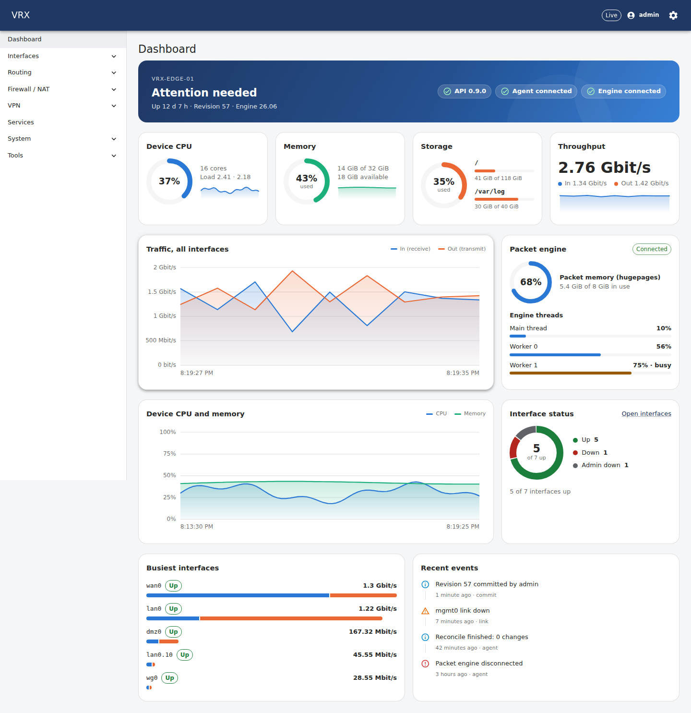
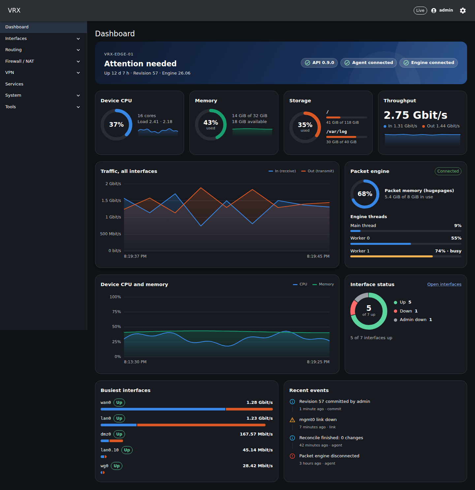
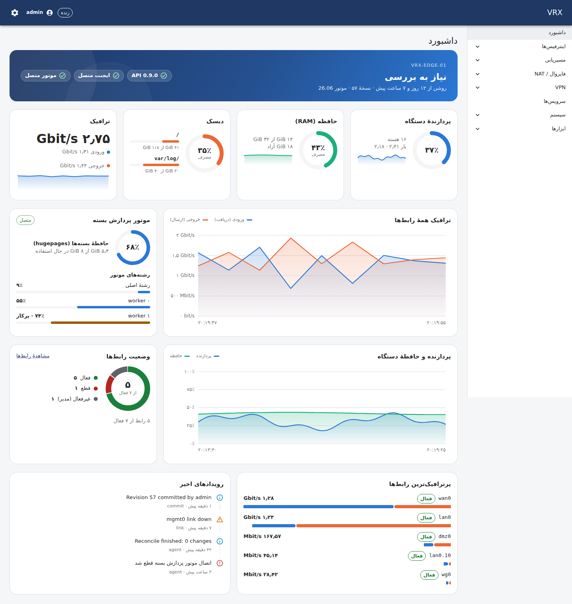

# Dashboard

The landing page (`/`) summarises the router at a glance. Everything on it is live: the tiles poll the state API every
5–10 s and the charts follow the `iface.counters` / `worker.cpu` WebSocket topics (one update per second).

| Card | Source | Notes |
|---|---|---|
| Status banner | `/state/system`, `/state/host`, `/state/interfaces` | "All systems operational" only when API, agent and engine are up and no interface is down; host name, uptime, running revision, engine version; a pill for each of API, agent, engine, plus sync state and a pending confirmed commit when present |
| Device CPU | `GET /api/v1/state/host` | all cores over the last 5 s, core count, 1/5-minute load, 6-minute trend |
| Memory | `/state/host` | used of total (the kernel's *MemAvailable*), available, trend |
| Storage | `/state/host` | `/`, `/var`, `/var/log` (one entry per filesystem) |
| Throughput | `iface.counters` topic | total in/out bit rate of every interface, with a trend |
| Traffic, all interfaces | `iface.counters` topic | receive and transmit over the last ~2 minutes; hover for exact values |
| Packet engine | `/state/system`, `/state/host`, `worker.cpu` topic | connection, packet memory (hugepages) in use, one meter per engine thread; "busy" from 70 %, "overloaded" from 90 % |
| Device CPU and memory | `/state/host` | the last 6 minutes, one sample every 5 s (the API keeps the history, so the chart is full on first load) |
| Interface status | `GET /api/v1/state/interfaces` | donut of up · down · admin down, with counts in text |
| Busiest interfaces | `iface.counters` + interface state | top five by in + out, split into receive / transmit |
| Recent events | `GET /api/v1/state/events?limit=6` | commits, link changes, engine connection; known event codes are translated |

Host figures (`GET /api/v1/state/host`) are read by ngfw-api from the kernel of the appliance it runs on (`/proc/meminfo`,
CPU times, `statfs`): no shell, and nothing from the engine (D-154).

The user interface calls the packet-processing data plane "the engine" everywhere (D-155).

Nothing is invented while data is missing: a card says "waiting", "not connected" or "no events" instead.
Features add cards (alarms, tunnels, IPsec, HA) through `apps/web/src/domains/dashboard/overview/cards.ts`.

Chart colours: receive / CPU blue, transmit / disk orange, memory green, checked for colour-blind separation and contrast on the light and dark
surfaces; every colour is paired with a legend or text.

## Screenshots

Taken on 2026-09-26 against a **scripted stand-in of the API and the WebSocket stream** (sample values, cloud container
without VPP) — layout evidence, not a measurement of a real router.

| English, light | English, dark | Persian (RTL) |
|---|---|---|
|  |  |  |
