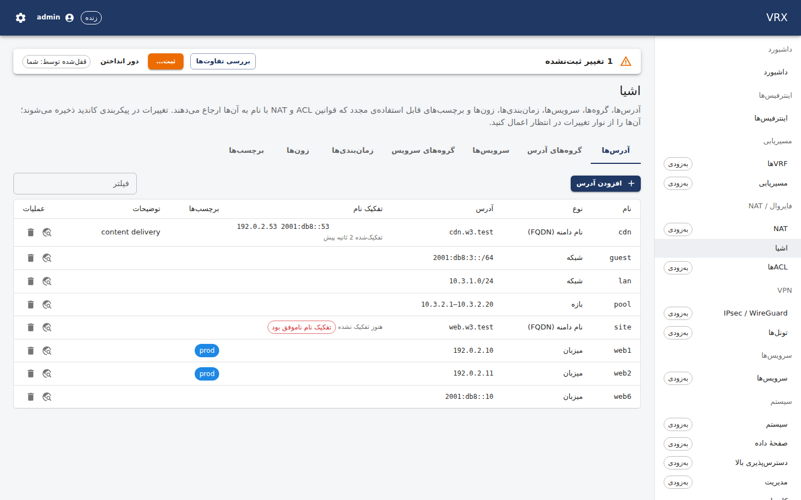

# Firewall objects — addresses, groups, FQDNs, services, schedules, zones, tags

**Screen:** *Firewall → Objects* (`/firewall/objects`, one tab per kind: `?tab=addresses|addressGroups|services|
serviceGroups|schedules|zones|tags`). **REST:** the generic configuration routes under `/api/v1/config/objects/<kind>/<name>`,
plus `GET /api/v1/state/objects/fqdn` (FQDN resolution) and `GET /api/v1/state/objects/usage?name=` (where-used).
**CLI:** `vrx set|merge|delete objects …`, `vrx show configuration objects` (`docs/user/cli/reference.md`).

Objects are named, reusable building blocks that ACL rules (and later NAT policies) refer to **by name**, so a change to
one object changes every rule that uses it at the next commit.

| kind | what it is | example |
|---|---|---|
| addresses | `host` (one address), `network` (a prefix), `range` (first–last address) or `fqdn` (a DNS name the box resolves); IPv4 or IPv6 | `web1` = host 192.0.2.10 |
| address groups | addresses and other address groups; nested groups are fine, loops are not | `web-servers` = web1, web2 |
| services | `tcp`, `udp`, `tcp-udp`, `sctp` with destination/source ports (`443`, `8000-8080`; empty = any), optional TCP flags; `icmp`/`icmp6` with type/code; `any`; `other` (IP protocol number) | `https` = tcp/443 |
| service groups | services and other service groups | `web` = http, https |
| schedules | `recurring` (weekdays + a daily window `HH:MM`–`HH:MM` on the box's time zone) or `once` (start and end with offset) | `office-hours` = Mon–Fri 08:00–18:00 |
| zones | a set of interfaces; an ACL can be attached to a zone instead of one interface | `lan` = host-w3l0, host-w3l0.100 |
| tags | a label with an optional colour; every other object (and ACL list) can carry tags | `prod` #1e88e5 |

Names are letters, digits, `.`, `_`, `-` (up to 63). A name is unique within its kind; addresses and address groups
share one namespace (a rule says just `web-servers`), and so do services and service groups.


## Working with the screen

- **Add / edit:** *Add address* (etc.) opens a form generated from the configuration schema. Group members, tags and
  zones are picked from the existing objects (the picker shows each candidate with its kind and value). **Save to
  candidate** sends only what you changed (a merge patch); nothing reaches the data plane until you **Commit** in the bar
  at the top. Rows with an uncommitted change are marked *pending*.
- **Where used** (the magnifier icon) lists every reference to the name: group memberships, tags, ACL rule sources,
  destinations, services and schedules, ACL attachments to a zone, and the zones an interface belongs to — in the
  candidate or in the running configuration.
- **Delete** removes the object from the candidate. If a rule still uses it, *Validate* and *Commit* refuse the
  candidate with a validation problem that points at the rule (for example
  `/acl/lists/web-in/rules/0/destination/name: 'web-servers' is not an entry of objects.addresses or objects.addressGroups`);
  remove the reference first, or discard.
- **Groups may be empty** while you build them, but an ACL rule cannot use an empty group (it would silently match nothing).


The screen is fully available in Persian (right-to-left):



## FQDN objects

The agent on the box resolves every `fqdn` address itself (A and AAAA, through the box's resolver configuration) and
uses the answers wherever the object is referenced:

- It refreshes each name every **60 s** (the service setting `VRX_OBJECTS_FQDN_REFRESH_SEC`, 30 s – 1 h).
- If a refresh fails (resolver unreachable, NXDOMAIN), the **last good answers stay in use**; the *Resolution* column
  shows *Last good answer kept* with the error, and the agent retries after 30 s, then less often.
- A name that has **never** resolved matches nothing (a rule using it matches no traffic) — a warning, not an error.
- The answers survive an agent restart: the agent reloads them and only re-queries what is due, spread over 30 s.

```sh
curl -s -H "authorization: Bearer $T" http://127.0.0.1:3000/api/v1/state/objects/fqdn
# {"retrievedAt":"…","items":[{"name":"cdn","fqdn":"cdn.example.com","addresses":["192.0.2.53","2001:db8::53"],
#   "lastResolved":"…","nextRefresh":"…","error":"","failures":0}]}
```

## Examples

Four objects of the task's examples — a web server group, an FQDN object, office hours and the LAN zone — and a tag:

```json
{
  "tags": { "prod": { "color": "#1e88e5", "description": "production" } },
  "addresses": {
    "web1": { "type": "host", "address": "192.0.2.10", "tags": ["prod"] },
    "web2": { "type": "host", "address": "192.0.2.11", "tags": ["prod"] },
    "cdn":  { "type": "fqdn", "fqdn": "cdn.example.com", "description": "content delivery" },
    "lan-net": { "type": "network", "prefix": "10.3.1.0/24" }
  },
  "addressGroups": { "web-servers": { "members": ["web1", "web2"], "tags": ["prod"] } },
  "services": { "https": { "protocol": "tcp", "destinationPorts": ["443"] } },
  "schedules": {
    "office-hours": { "type": "recurring", "days": ["mon", "tue", "wed", "thu", "fri"], "start": "08:00", "end": "18:00" }
  },
  "zones": { "lan": { "interfaces": ["host-w3l0"], "description": "LAN side" } }
}
```

### The same with REST

All calls need `Authorization: Bearer <access token>` (or an API key).

```sh
B=http://127.0.0.1:3000/api/v1
# the whole block above as one merge patch of the candidate's objects
curl -s -X PATCH -H "authorization: Bearer $T" -H 'content-type: application/merge-patch+json' $B/config/objects -d @objects.json
# one object
curl -s -X PUT -H "authorization: Bearer $T" -H 'content-type: application/json' \
  $B/config/objects/addressGroups/web-servers -d '{"members":["web1","web2"],"tags":["prod"]}'
# add a member (a merge patch replaces the list)
curl -s -X PATCH -H "authorization: Bearer $T" -H 'content-type: application/merge-patch+json' \
  $B/config/objects/addressGroups/web-servers -d '{"members":["web1","web2","web3"]}'
curl -s -X DELETE -H "authorization: Bearer $T" $B/config/objects/addresses/web3
curl -s -X POST -H "authorization: Bearer $T" "$B/config/commit?comment=objects"
# where is web-servers used (running configuration; &source=candidate for the candidate)
curl -s -H "authorization: Bearer $T" "$B/state/objects/usage?name=web-servers"
# {"name":"web-servers","source":"running","definedAs":["addressGroups"],"usedBy":[{"pointer":"/acl/lists/web-in/rules/0/destination/name",
#   "container":"/acl/lists/web-in/rules/0","domain":"acl","kind":"acl-rule-destination"}]}
curl -s -X POST -H "authorization: Bearer $T" "$B/config/rollback/1?comment=undo"   # back to an earlier object set
```

### The same with the CLI

```
vrx merge objects '{"addresses":{"web1":{"type":"host","address":"192.0.2.10"},"web2":{"type":"host","address":"192.0.2.11"}}}'
vrx merge objects addressGroups '{"web-servers":{"members":["web1","web2"]}}'
vrx set objects addressGroups web-servers members web3        # appends to the member list
vrx merge objects schedules '{"office-hours":{"type":"recurring","days":["mon","tue","wed","thu","fri"],"start":"08:00","end":"18:00"}}'
vrx merge objects zones '{"lan":{"interfaces":["host-w3l0"]}}'
vrx delete objects addressGroups web-servers members web3
vrx show configuration objects
vrx commit comment "objects"
```

The CLI has no dedicated command for FQDN state and where-used yet; use the REST calls above (`vrx --json` output of
the configuration commands is the API's answer).

## What happens on the box

Objects are not VPP objects: on commit the agent stores the applied object set in its state directory (and reports it
back in `GET /api/v1/state/drift` like any other domain), resolves the FQDN objects, and gives the consumers — the ACL
feature, the host firewall, later NAT — the expanded addresses (ranges become the smallest set of prefixes, groups are
flattened, IPv4 and IPv6 are split) and port ranges. A rule whose expansion exceeds 10 000 entries is refused at
validation by the feature that renders it, at the rule's pointer; a group that alone expands to more than that is flagged
with a warning when you validate or commit. A rollback restores the earlier object set like any other configuration.

Not in this release: GeoIP and threat-feed objects, zone-based policy beyond "a zone is a set of interfaces", objects
per tenant (VDOM).
