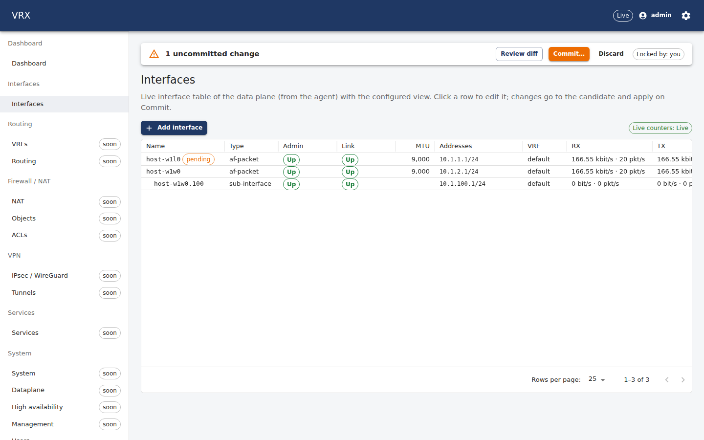
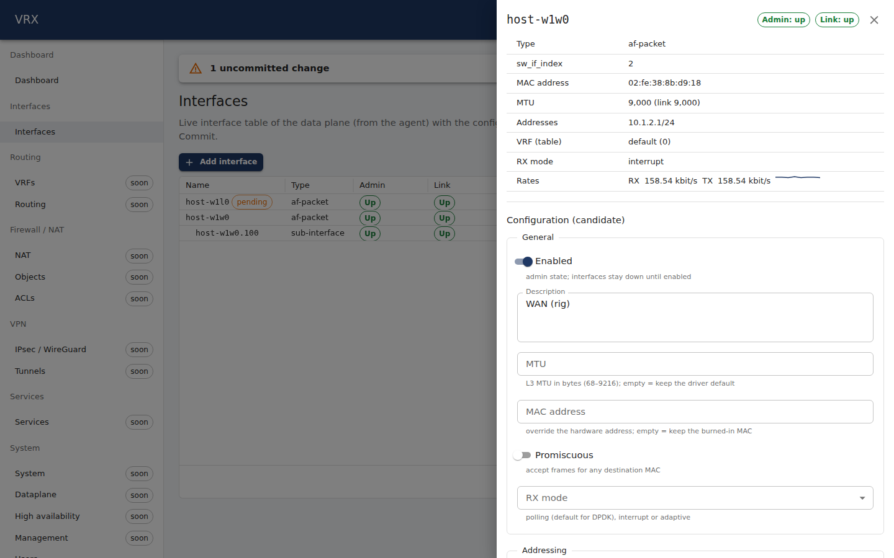
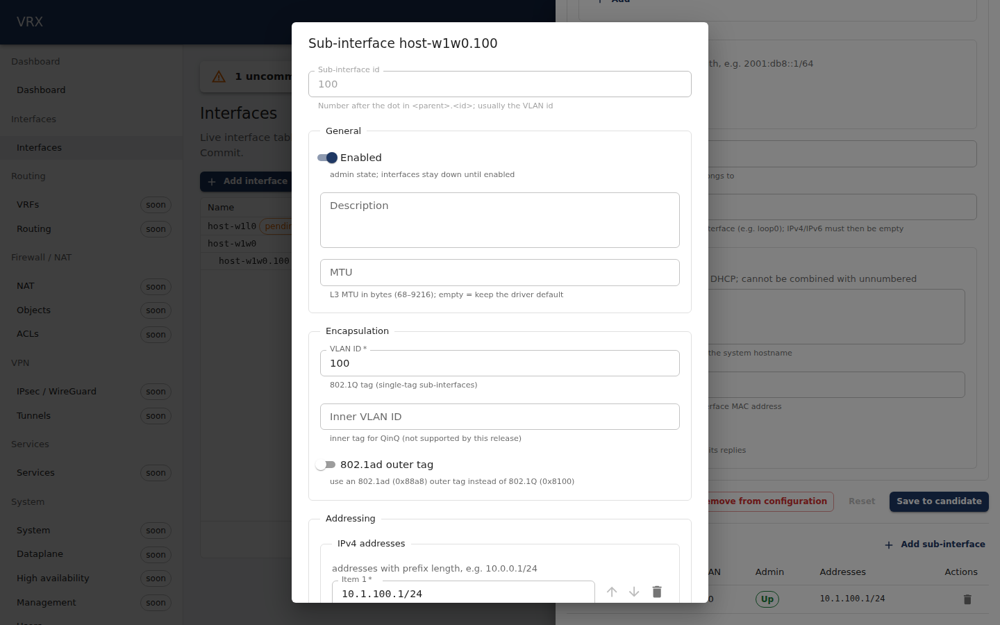
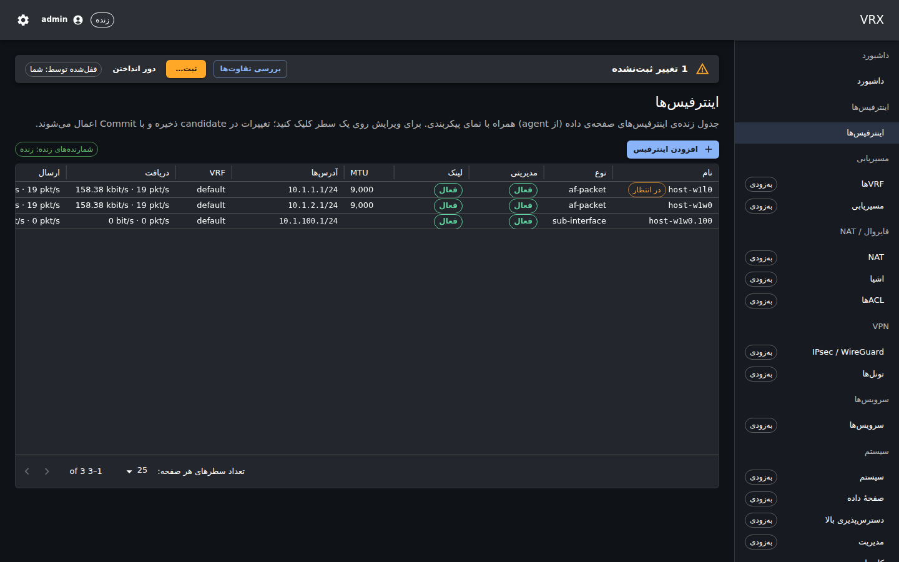
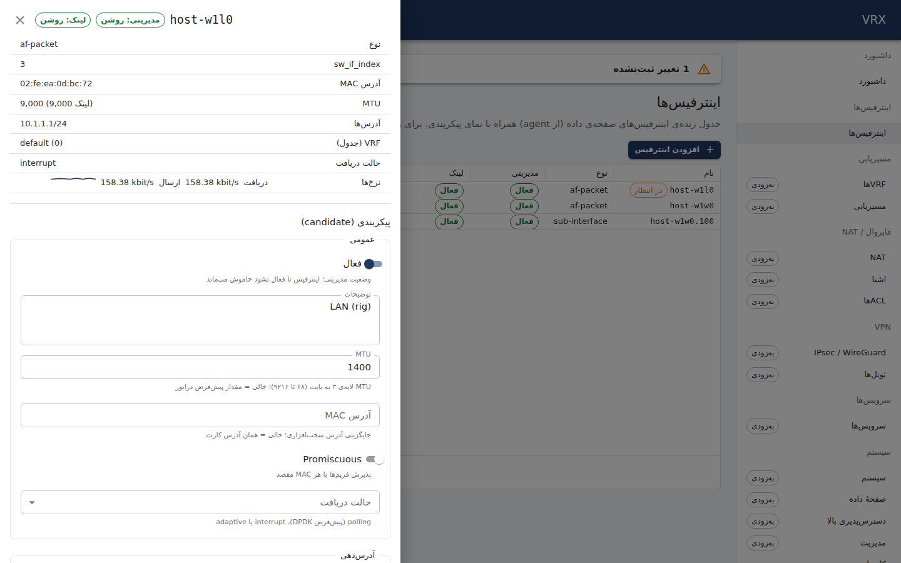

# Interfaces — basics

**Screen:** *Interfaces → Interfaces* (`/interfaces`). **REST:** `/api/v1/state/interfaces` (live) and the generic
configuration routes under `/api/v1/config/interfaces`. **CLI:** `vrx show interfaces`, `vrx set interfaces …`
(`docs/user/cli/reference.md`).

The screen shows the **live interface table of the data plane**, as the agent reads it from VPP (not the configuration):
name, type, admin and link state, MTU, addresses, VRF, receive/transmit rates with a packet-rate trend, and errors
(receive/transmit errors plus drops). Each row also says whether the candidate changes it (*pending*). Rates come from
the live counter stream (`WS /api/v1/stream`, topic `iface.counters`, about one sample per second). The table polls every
3 s, so the admin/link state follows within a few seconds.



Status chips use the semantic status colours: **Up** (green), **Down** (red; administratively up but no link),
**Admin down** (grey; switched off in the configuration — this is not a fault).

## Editing an interface

Click a row to open the detail drawer:

- **Live state:** type, `sw_if_index`, MAC, MTU (and the link MTU), addresses, VRF with its table id, RX mode, rates.
- **Configuration (candidate):** the form is generated from the configuration schema (`interfaces.<name>`): enabled,
  description, MTU, MAC, promiscuous, RX mode, IPv4/IPv6 addresses, VRF, IP unnumbered, DHCP client. **Save to candidate**
  sends only the fields you changed (a merge patch). Nothing reaches the data plane until you **Commit** in the bar at the
  top (review the diff there; the default commit auto-reverts unless you confirm it).
- **Sub-interfaces (802.1Q):** add, edit and remove single-tag VLAN sub-interfaces (`<parent>.<id>`, usually id = VLAN).
  QinQ (802.1ad / 802.1Q-in-802.1Q) sub-interfaces: [vlan-qinq.md](vlan-qinq.md).
- **Remove from configuration** deletes the interface from the candidate. The agent deletes interfaces it created (`host-…`,
  `loop…`) on commit; physical NICs stay and only lose their configuration.




Validation errors from the server appear on the matching field (RFC 9457 problem pointers), e.g. an MTU outside
68–9216 or an address that is not a prefix.

The screen is fully available in Persian (right-to-left); the drawer opens from the reading end:




## Interface names

| name | what the agent does |
|---|---|
| `host-<netdev>` | creates an af_packet interface on the Linux netdev `<netdev>` (lab/test path; `host-w1l0` on `w1l0`). Only a **veth** is accepted: naming an existing netdev of any other kind (the management NIC `ens192`, a bridge, …) fails validation (400 validation problem) at `/interfaces/host-<netdev>` (rule `interfaces.af-packet-veth`), and the agent checks again right before it creates the interface |
| `loop<N>` | creates loopback instance N |
| anything else (`GigabitEthernet0/8/0`, `TenGigabitEthernet…`) | an existing NIC; it is configured, never created or deleted |
| `<parent>.<id>` | an 802.1Q sub-interface (exact-match, routed), configured under `subinterfaces.<id>` of the parent |

## The same with REST

All calls need `Authorization: Bearer <access token>` (or an API key). Examples use the lab rig names.

```sh
# live table, one item per (sub-)interface: state (live, from VPP), config (what the agent retrieved from VPP),
# running (the committed configuration), counters, hasPendingChange (the candidate changes this interface)
curl -s -H "authorization: Bearer $T" http://127.0.0.1:3000/api/v1/state/interfaces
# counters of one interface (absolute; 64-bit counters are decimal strings)
curl -s -H "authorization: Bearer $T" http://127.0.0.1:3000/api/v1/state/interfaces/host-w1l0/counters

# configure two interfaces in the candidate (RFC 7386 merge patch on the interfaces node)
curl -s -X PATCH -H "authorization: Bearer $T" -H 'content-type: application/merge-patch+json' \
  http://127.0.0.1:3000/api/v1/config/interfaces \
  -d '{"host-w1l0":{"enabled":true,"ipv4":["10.1.1.1/24"]},"host-w1w0":{"enabled":true,"ipv4":["10.1.2.1/24"]}}'
# one field; a NIC name with "/" is one path segment written with ~1 (GigabitEthernet0~18~10)
curl -s -X PATCH -H "authorization: Bearer $T" -H 'content-type: application/merge-patch+json' \
  http://127.0.0.1:3000/api/v1/config/interfaces/host-w1w0 -d '{"mtu":1400}'
# a VLAN sub-interface
curl -s -X PUT -H "authorization: Bearer $T" -H 'content-type: application/json' \
  http://127.0.0.1:3000/api/v1/config/interfaces/host-w1w0/subinterfaces/100 -d '{"vlanId":100,"enabled":true,"ipv4":["10.1.100.1/24"]}'

curl -s -H "authorization: Bearer $T" http://127.0.0.1:3000/api/v1/config/diff          # review
curl -s -X POST -H "authorization: Bearer $T" 'http://127.0.0.1:3000/api/v1/config/commit?comment=interfaces'
curl -s -X POST -H "authorization: Bearer $T" 'http://127.0.0.1:3000/api/v1/config/rollback/1?comment=undo'
```

## The same with the CLI

```
vrx show interfaces
vrx show interfaces host-w1l0
vrx set interfaces host-w1l0 enabled true
vrx set interfaces host-w1l0 ipv4 10.1.1.1/24          # appends to the address list
vrx set interfaces host-w1w0 mtu 1400
vrx merge interfaces host-w1w0 subinterfaces '{"100":{"vlanId":100,"enabled":true,"ipv4":["10.1.100.1/24"]}}'
vrx show configuration diff
vrx commit confirm 120 comment "interfaces"
vrx confirm
vrx rollback 1
```

## What happens on the data plane

After a commit the agent converges VPP to the configuration and verifies it (Retrieve). It also restores the interfaces by
itself: if the agent restarts, or objects disappear from VPP behind its back, the next reconcile recreates them without
any API call (the P08 restart-safety test measured 0.33 s from agent start to a converged data plane and a working ping
1.7 s after start). A rollback applies an older revision as a new one and removes what that revision does not contain
(for example an MTU or an address added later).

Not in this release: bonding, bridge domains, QinQ, LACP, LLDP (planned features), per-interface description in VPP
(the description is kept by the agent and shown from there).

See also: [Bond interfaces (link aggregation, LACP)](bonding.md).

See also: [Bridging](bridge-l2.md) — bridge domains, cross-connects, VLAN tag rewrite on L2 ports and the time-range MAC filter (`interfaces.<if>.l2`, `routing.l2`).
