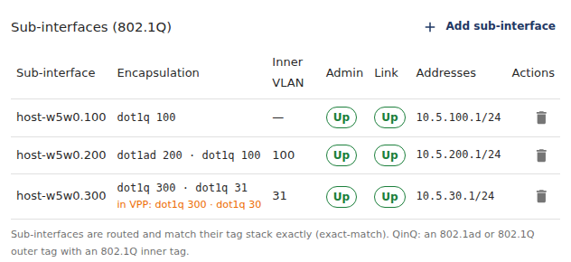
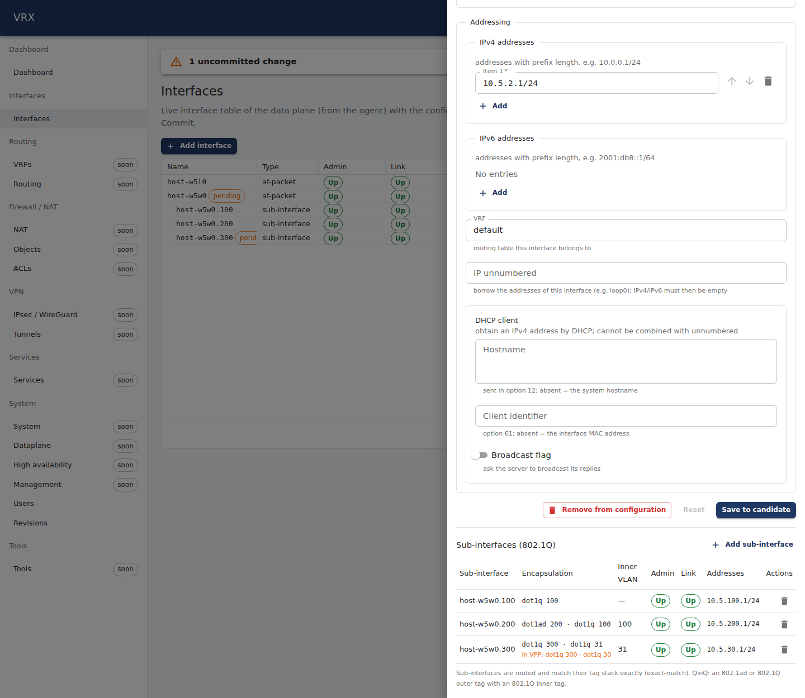
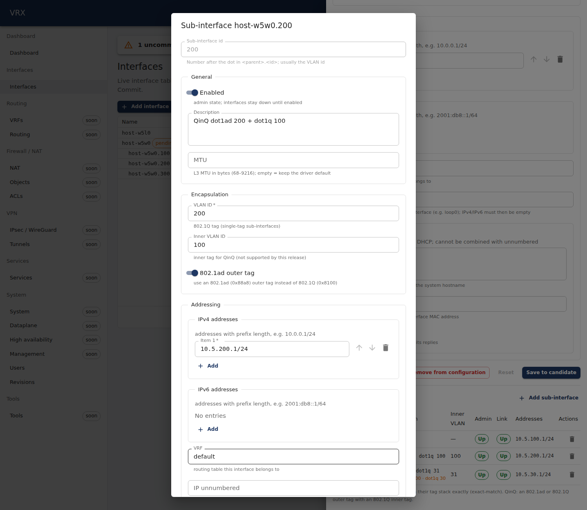
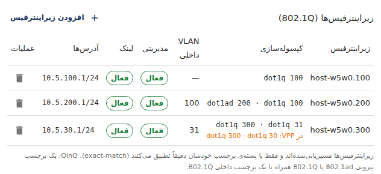
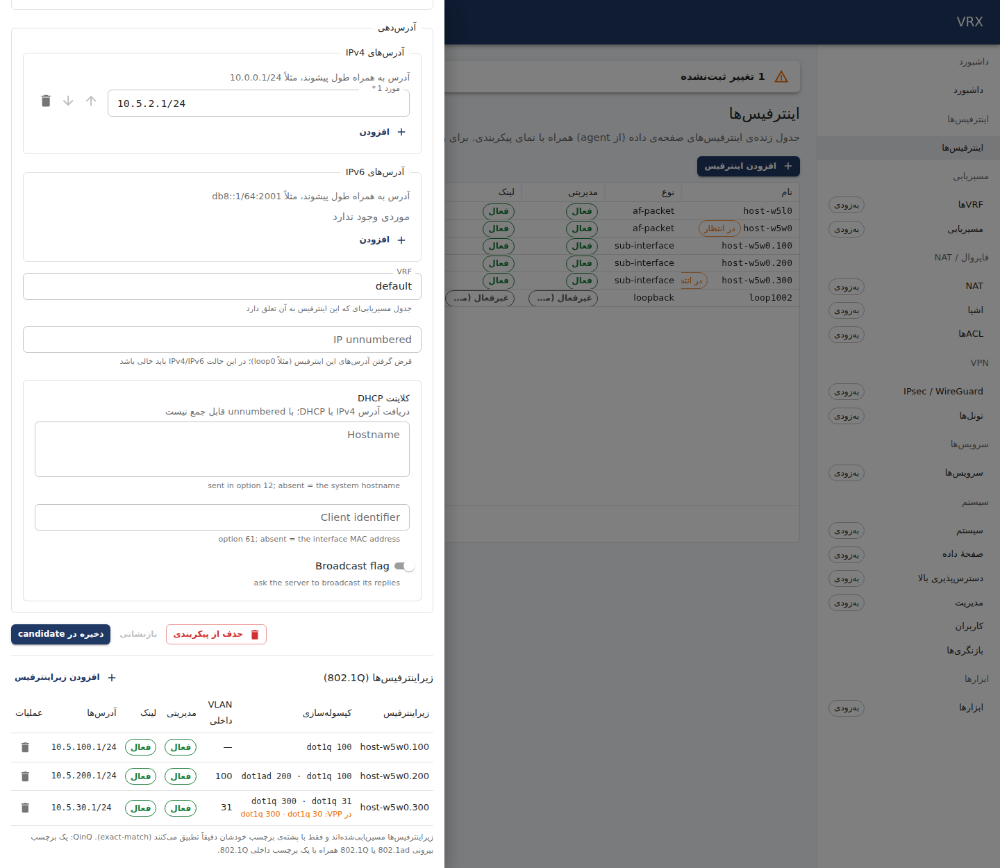

# VLAN sub-interfaces: 802.1Q and QinQ (802.1ad)

**Screen:** *Interfaces → Interfaces* (`/interfaces`) → click the parent interface → **Sub-interfaces** in the drawer.
**REST:** the generic configuration routes under `/api/v1/config/interfaces/<parent>/subinterfaces/<id>` and the live table
`/api/v1/state/interfaces`. **CLI:** `vrx set|merge interfaces <parent> subinterfaces …`, `vrx show interfaces <parent>.<id>`.
Basics of the screen: [basics.md](basics.md).

A sub-interface is a routed interface `<parent>.<id>` on top of an Ethernet interface. It takes the frames that carry its
**tag stack** and nothing else (*exact match*), and it has its own addresses, VRF, MTU and admin state. VRX supports:

| stack | configuration | VPP (`create_subif` flags) | encapsulation shown |
|---|---|---|---|
| one 802.1Q tag | `vlanId` | `ONE_TAG · EXACT_MATCH` | `dot1q 100` |
| QinQ: 802.1ad outer + 802.1Q inner | `vlanId`, `innerVlanId`, `dot1ad: true` | `TWO_TAGS · DOT1AD · EXACT_MATCH` | `dot1ad 200 · dot1q 100` |
| 802.1Q-in-802.1Q (two 802.1Q tags) | `vlanId`, `innerVlanId` | `TWO_TAGS · EXACT_MATCH` | `dot1q 300 · dot1q 30` |
| one 802.1ad tag | `vlanId`, `dot1ad: true` | `ONE_TAG · DOT1AD · EXACT_MATCH` | `dot1ad 201` |

## The configuration

`interfaces.<parent>.subinterfaces.<id>`:

| field | meaning |
|---|---|
| key `<id>` | the number after the dot in `<parent>.<id>` (0 … 4294967295, no leading zeros). It names the sub-interface and is independent of the tags; usually the outer VLAN id |
| `vlanId` | **required.** Outer tag, 1–4094 |
| `innerVlanId` | inner tag, 1–4094. Present = a two-tag (QinQ) sub-interface; the inner tag is always 802.1Q |
| `dot1ad` | the outer tag is 802.1ad (TPID 0x88a8) instead of 802.1Q (0x8100). Default `false` |
| `enabled`, `description`, `mtu`, `ipv4`, `ipv6`, `vrf`, `dhcpClient` | as on any interface ([basics.md](basics.md)); `mtu` must not exceed the parent's MTU |

Validation (the commit is refused with `400 application/problem+json`, the pointer names the field):

- the same tag stack twice on one parent (`dot1ad`, `vlanId`, `innerVlanId` all equal) — the pointer is the `vlanId` of the
  **second** entry (entries in ascending id order). The same numbers as 802.1Q and as 802.1ad are two different stacks, and
  so are `dot1q 100` and `dot1q 100 · dot1q 5`; the same stack on two different parents is fine;
- `innerVlanId` without `vlanId`, or any tag outside 1–4094 (already when the candidate is edited);
- a sub-interface MTU above the parent's MTU.

```json
{
  "type": "https://vrx.dev/problems/validation", "title": "Validation failed", "status": 400, "tier": "semantic",
  "errors": [{ "pointer": "/interfaces/host-w5w0/subinterfaces/201/vlanId",
               "message": "VLAN dot1ad 200.100 is already used by sub-interface host-w5w0.200" }]
}
```

**Exact match only.** Every sub-interface is routed and matches its stack exactly: a frame with more tags than the stack
(e.g. `dot1q 100 · dot1q 7` arriving on a `dot1q 100` sub-interface) is not taken. Non-exact-match, default, untagged and
"any" sub-interfaces, VLAN tag rewrite and bridging of sub-interfaces are not part of this release (L2 sub-interfaces come
with the bridging feature).

**Changing a tag is a re-create.** VPP cannot change the tags of an existing sub-interface, so a commit that changes
`vlanId`, `innerVlanId` or `dot1ad` deletes the sub-interface and creates it again (new `sw_if_index`); its addresses,
admin state, MTU and VRF follow automatically. Traffic on that sub-interface stops for the moment of the commit.

## The screen

The drawer of the parent lists its sub-interfaces from the candidate. **Encapsulation** shows the tag stack outer tag
first (hover: the tag types with their TPIDs), **Inner VLAN** the inner tag (`—` for a single tag), **Admin** and **Link**
the live state from the data plane, **Addresses** the configured addresses. When the data plane still has another stack
than the candidate (a tag change that is not committed yet), the stack VPP has is shown under it (*in VPP: …*). Click a
row to edit it (the form is generated from the configuration schema: *Encapsulation* holds VLAN ID, Inner VLAN ID and
802.1ad outer tag); the bin removes it from the candidate. Nothing reaches the data plane before **Commit**.





In Persian the table reads right to left; tag stacks and names stay left to right:




## The same with REST

All calls need `Authorization: Bearer <access token>` (or an API key). Examples use the slot-5 rig parent `host-w5w0`.

```sh
# dot1q 100 and QinQ dot1ad 200 + dot1q 100 in the candidate
curl -s -X PUT -H "authorization: Bearer $T" -H 'content-type: application/json' \
  http://127.0.0.1:3000/api/v1/config/interfaces/host-w5w0/subinterfaces/100 \
  -d '{"vlanId":100,"enabled":true,"ipv4":["10.5.100.1/24"]}'
curl -s -X PUT -H "authorization: Bearer $T" -H 'content-type: application/json' \
  http://127.0.0.1:3000/api/v1/config/interfaces/host-w5w0/subinterfaces/200 \
  -d '{"vlanId":200,"innerVlanId":100,"dot1ad":true,"enabled":true,"ipv4":["10.5.200.1/24"]}'
curl -s -H "authorization: Bearer $T" http://127.0.0.1:3000/api/v1/config/diff
curl -s -X POST -H "authorization: Bearer $T" 'http://127.0.0.1:3000/api/v1/config/commit?comment=qinq'

# live table: one item per sub-interface with parent, state.vlanId / state.innerVlanId (live) and the tag stack the
# agent retrieved from VPP in config (vlanId, innerVlanId, dot1ad)
curl -s -H "authorization: Bearer $T" http://127.0.0.1:3000/api/v1/state/interfaces

# change the inner tag (re-creates host-w5w0.200 on commit) or remove the sub-interface
curl -s -X PATCH -H "authorization: Bearer $T" -H 'content-type: application/merge-patch+json' \
  http://127.0.0.1:3000/api/v1/config/interfaces/host-w5w0/subinterfaces/200 -d '{"innerVlanId":101}'
curl -s -X DELETE -H "authorization: Bearer $T" http://127.0.0.1:3000/api/v1/config/interfaces/host-w5w0/subinterfaces/200
```

## The same with the CLI

```
# a new sub-interface: the whole object at its path (PUT), or a merge patch on the parent's sub-interfaces
vrx set interfaces host-w5w0 subinterfaces 100 '{"vlanId":100,"enabled":true,"ipv4":["10.5.100.1/24"]}'
vrx merge interfaces host-w5w0 subinterfaces '{"200":{"vlanId":200,"innerVlanId":100,"dot1ad":true,"enabled":true,"ipv4":["10.5.200.1/24"]}}'
vrx show configuration diff
vrx commit comment "qinq"
# change one tag of an existing sub-interface (re-created on commit), remove one
vrx set interfaces host-w5w0 subinterfaces 200 innerVlanId 101
vrx delete interfaces host-w5w0 subinterfaces 200
```

Real output from the topology test (`test/topology/vlan-qinq`, slot 5, 2026-09-24):

```
$ vrx configure show interfaces host-w5w0 subinterfaces set
set interfaces host-w5w0 subinterfaces 200 description "QinQ dot1ad 200 + dot1q 100"
set interfaces host-w5w0 subinterfaces 200 dot1ad true
set interfaces host-w5w0 subinterfaces 200 enabled true
set interfaces host-w5w0 subinterfaces 200 innerVlanId 100
set interfaces host-w5w0 subinterfaces 200 ipv4 10.5.200.1/24
set interfaces host-w5w0 subinterfaces 200 ipv6 []
set interfaces host-w5w0 subinterfaces 200 vlanId 200
set interfaces host-w5w0 subinterfaces 200 vrf default
…
$ vrx show interfaces host-w5w0.200
Interface host-w5w0.200 (retrieved 2026-09-24T15:11:05.412Z)
  description "QinQ dot1ad 200 + dot1q 100";
  dot1ad true;
  enabled true;
  innerVlanId 100;
  ipv4 [ 10.5.200.1/24 ];
  vlanId 200;
  vrf default;
```

## What happens on the data plane

The agent creates each sub-interface with VPP's `create_subif` (exact match, the flags in the first table), tags it with
its owner and applies addresses, admin state, MTU and VRF on it. `vppctl` does not print tag stacks; the VPP API dump does
(`sw_interface_dump`: `sub_number_of_tags`, `sub_outer_vlan_id`, `sub_inner_vlan_id`, `sub_if_flags`). The equivalent VPP
CLI of the QinQ example is `create sub-interfaces host-w5w0 200 dot1ad 200 inner-dot1q 100 exact-match`.

```
sw_interface_dump host-w5w0.200: sub_id=200 sub_number_of_tags=2 sub_outer_vlan_id=200 sub_inner_vlan_id=100 sub_if_flags=TWO_TAGS|DOT1AD|EXACT_MATCH tag="w5:host-w5w0.200"
$ vppctl show interface address host-w5w0.200
host-w5w0.200 (up):
  L3 10.5.200.1/24
```

If sub-interfaces disappear from VPP behind the agent's back, or the agent restarts, it recreates them with their addresses
without any API call (measured: all three sub-interfaces of the test back 1.46 s after the agent started). A rollback to a
revision without them deletes each sub-interface's addresses and admin state first, then the sub-interface.

**Lab note (af_packet only):** on the veth/af_packet lab path VPP's af_packet input re-inserts a received 802.1ad tag as
802.1Q, so a `dot1ad` sub-interface never receives frames there (VPP issue, `docs/vpp-code-track.md`). The configuration is
still applied and verified; `dot1q` and `dot1q-in-dot1q` sub-interfaces answer on that path. Data-plane NICs (DPDK) are not
affected.
