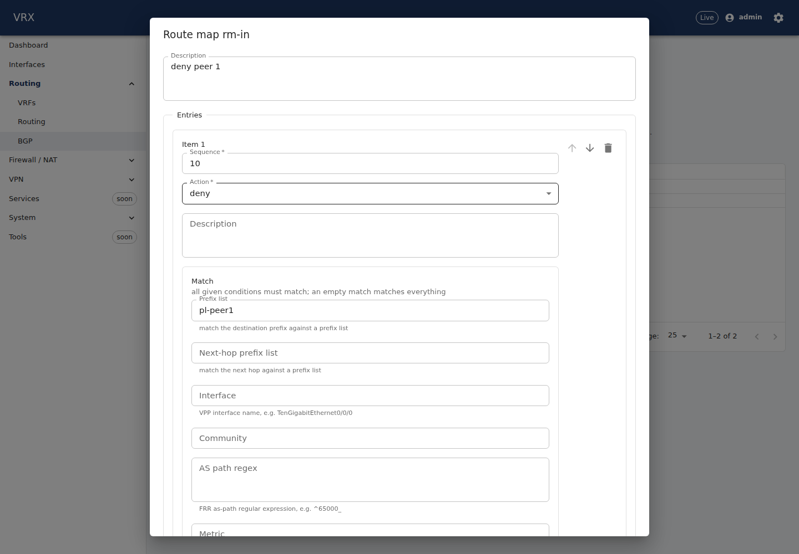

# Routing — BGP, prefix lists, route maps, Linux pairs

**Screen:** *Routing → BGP* (`/routing/bgp`, tabs *BGP*, *Prefix lists*, *Route maps*, *Linux pairs*). **REST:** the
generic configuration routes under `/api/v1/config/routing` (`bgp`, `policy`) and `/api/v1/config/interfaces`
(`<name>.lcp`), the live state `GET /api/v1/state/bgp`, the FIB browser `GET /api/v1/state/routes?proto=bgp`, the
WebSocket topic `routing.events`. **CLI:** `vrx set routing bgp …`, `vrx set routing policy …`,
`vrx set interfaces <name> lcp …` (the generic configuration commands, `docs/user/cli/reference.md`); `vrx show bgp
summary` will read `GET /api/v1/state/bgp` once the CLI maps it (P12-questions Q14).

## How it works

BGP runs in **FRR** on the Linux side of the router. For FRR to reach the network, each VPP interface it uses gets a
**Linux pair** (VPP's linux-cp plugin): a Linux interface that mirrors the VPP interface. Packets for the router's own
addresses reach FRR through it; the routes FRR learns are installed in Linux and copied into VPP's forwarding table by
linux-nl (visible in the FIB browser with origin `frr`). Nothing restarts when you change the configuration: the agent
renders FRR's configuration and applies only the difference (`frr-reload.py`).

## Linux pairs

*Linux pairs* lists the interfaces that have one (`interfaces.<name>.lcp`) and whether the pair exists in VPP right now.
**Linux interface name** defaults to the VPP name when that is a valid Linux name (at most 15 letters, digits, `_ . -`);
otherwise set it (`TenGigabitEthernet0/0/0` → e.g. `te0`). **Type** is `tap` (Ethernet, the default) or `tun`.
**Namespace** is where the Linux interface lives (default: the linux-cp default namespace, where FRR runs). The
interface's addresses are put on the Linux side by FRR. An interface that BGP uses as *update source*, a route map
matches with *match interface*, or an FRR static route leaves by, needs a pair (`routing.bgp-interface-has-lcp`).

## BGP

**Global settings:** local AS, router ID, VRF, the networks this router announces, graceful restart, and *eBGP
requires policy* (RFC 8212, on by default: an eBGP neighbour without an inbound and an outbound route map or prefix list
exchanges no routes). The **Redistribute into BGP** switches announce connected, static, OSPF, IS-IS or RIP routes.

**Neighbours** are keyed by address. Each row shows the configuration and — live — the session state (*Established* is
up; *Idle (Admin)* is shut down), uptime, prefixes received and sent, and flaps (sessions dropped since FRR started). The
table refreshes every 30 seconds, at once when a session changes (`routing.events`), and with **Refresh**. A neighbour in
a **peer group** inherits what it does not set itself. **Address families**: a family is active for a neighbour only when
it is listed (IPv4 unicast, IPv6 unicast), with its route maps / prefix lists in and out, next-hop-self,
soft-reconfiguration, maximum prefixes and default-originate. **MD5 password** takes a secret reference
(`password/<name>`); until the secret channel between API and agent exists, a neighbour with a password is refused at
commit (`routing.bgp-password-unavailable`).

## Prefix lists and route maps

A **prefix list** (`routing.policy.prefixLists.<name>`) is an ordered list of *permit/deny prefix [ge G] [le L]* rules for
one address family. A **route map** (`routing.policy.routeMaps.<name>`) is an ordered list of entries; an entry matches
when all its conditions match (prefix list, next-hop prefix list, interface, community, AS-path regex, metric, tag — none
= everything) and then permits or denies the route and sets attributes (local preference, MED, weight, next hop,
communities, AS-path prepend, tag). The grids show where each object is used. Route-map sequence numbers are 1–65535.

## Commit, validation, rollback

Every change goes into the candidate; the bar at the bottom commits it (with an optional confirm timeout) or discards
it. A rollback to an earlier revision removes BGP and the filters from FRR (sessions close, BGP routes leave VPP). What
FRR would refuse is reported at commit with the pointer of the field (for example an update-source interface without a
Linux pair, a route tag on a route not programmed via FRR, a Linux name that is not valid).

## FIB browser

`GET /api/v1/state/routes?vrf=default&proto=bgp` lists the routes FRR installed (VPP source `lcp-rt-dynamic`) whose FRR
protocol is BGP; every such route shows `origin: frr` and its `proto`. With `proto`, pages are at most 100 routes and
`total` counts every FRR route of the VRF.
