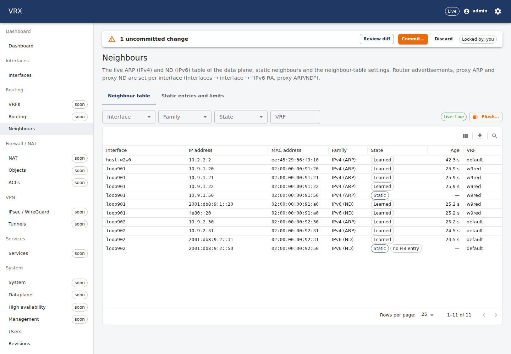
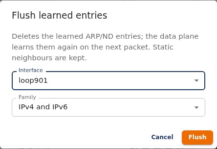
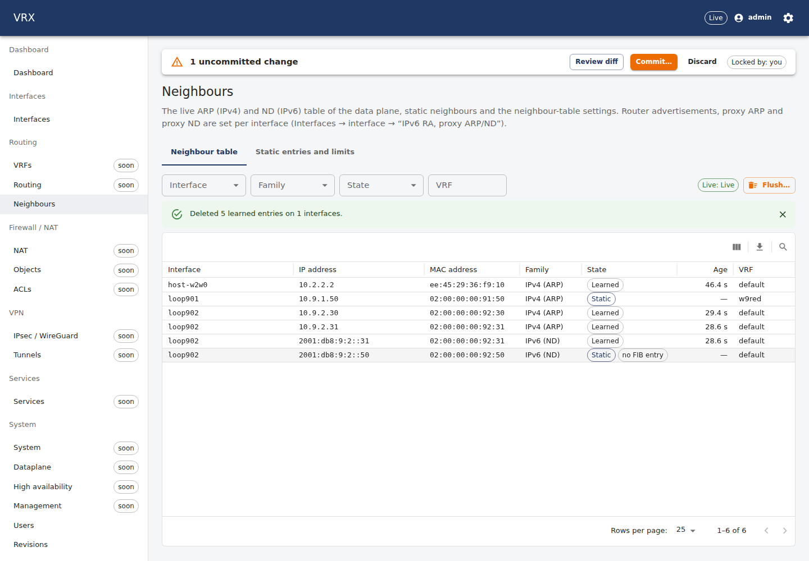
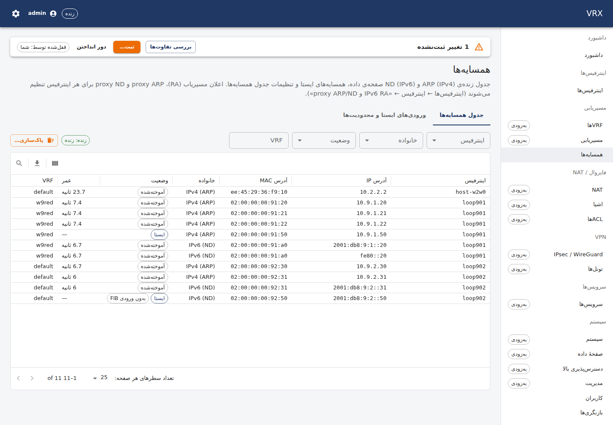
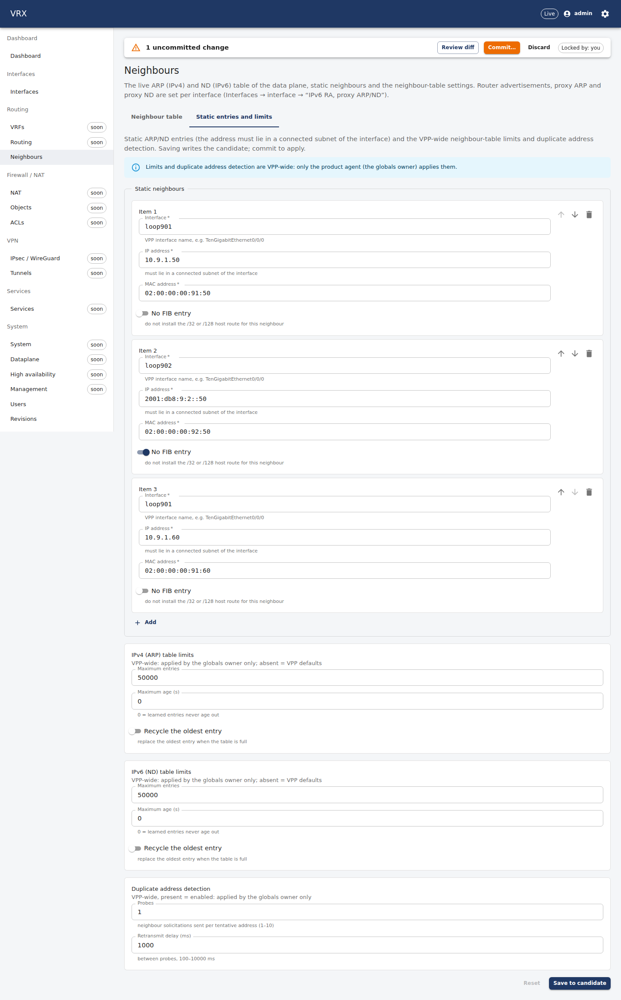
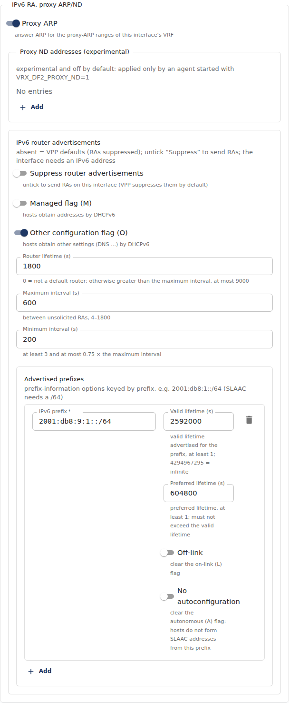
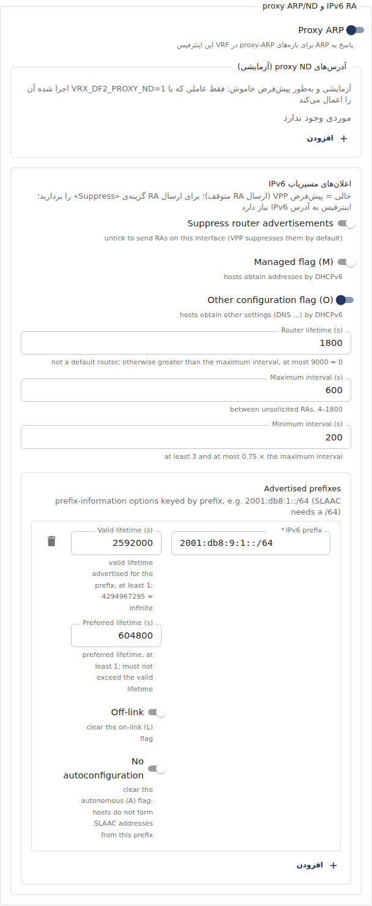

# Neighbours, router advertisements, proxy ARP/ND

**Screen:** *Routing → Neighbours* (`/routing/neighbors`) and the per-interface group *IPv6 RA, proxy ARP/ND* in the
interface drawer (*Interfaces → interface*). **REST:** `GET /api/v1/state/neighbors` (live table),
`POST /api/v1/actions/arp-flush` (flush), and the generic configuration routes for `interfaces.<if>.{ipv6Ra, proxyArp,
proxyNd}`, `vrfs.<name>.proxyArpRanges` and `routing.neighbors`. **CLI:** see *The same with the CLI* below.

## The live neighbour table

The *Neighbour table* tab shows the ARP (IPv4) and ND (IPv6) table of the data plane as the agent reads it from VPP —
learned entries and static neighbours — for every interface the device manages. Filter by interface, family, state
(static / learned) or VRF; the grid's search box matches IP, MAC or interface; sorting and paging happen on the device,
so large tables stay fast (up to 1000 rows per page). The table refreshes every 5 s; live change events (topic
`neighbor.events`, at most one per interface per second) make it refresh immediately once the agent publishes them.



**Flush…** deletes learned entries — of one interface, or of every configured interface — for IPv4, IPv6 or both. The
data plane learns them again with the next packet. **Static neighbours are never flushed** (they are configuration).
Operators and admins may flush; read-only users see the table only. Every flush is written to the audit log.




The screen is fully available in Persian (right-to-left):



## Static neighbours, table limits, duplicate address detection

The *Static entries and limits* tab edits `routing.neighbors` of the candidate (schema-driven form; **Save to candidate**,
then commit in the pending-change bar):

- **Static neighbours** — interface, IP, MAC (unicast), *No FIB entry* (do not install the /32 or /128 host route). The
  address must lie in a connected subnet of the interface (or of its unnumbered source; IPv6 link-local is accepted
  when the interface has IPv6) and must not be the interface's own address; otherwise the commit fails with a
  `400 validation` problem pointing at `/routing/neighbors/static/<i>/ip`.
- **IPv4 / IPv6 table limits** (maximum entries, maximum age of learned entries, recycle the oldest) and **duplicate
  address detection** (probes 1–10, retransmit delay 100–10000 ms; present = enabled) are **VPP-wide settings**. Only the
  product agent — the *globals owner* — applies them; any other agent reports them as not applied (a warning at commit),
  and never changes them.



## Per interface: router advertisements, proxy ARP, proxy ND

In the interface drawer, the group *IPv6 RA, proxy ARP/ND* holds three fields (also on sub-interfaces):

- **IPv6 router advertisements** (`ipv6Ra`). Absent, or holding only its defaults, means VPP's own state: **RAs
  suppressed**. Untick *Suppress* to send RAs. *Managed (M)* / *Other (O)* flags tell hosts to use DHCPv6 for addresses /
  other settings. *Router lifetime* is 0 (not a default router) or greater than the maximum interval (≤ 9000 s);
  *Maximum interval* 4–1800 s; *Minimum interval* 3 s … 0.75 × maximum. *Advertised prefixes* (keyed by prefix): valid and
  preferred lifetime (≥ 1 s, preferred ≤ valid), *Off-link* (clear L), *No autoconfiguration* (clear A). A prefix used for
  SLAAC (A set) must be a /64. The interface needs an IPv6 address.
- **Proxy ARP** (`proxyArp`): the interface answers ARP for the proxy-ARP ranges of its VRF. The ranges are set per VRF in
  `vrfs.<name>.proxyArpRanges` (`[{low, high}]`, IPv4, low ≤ high).
- **Proxy ND addresses** (`proxyNd`) — **experimental, off by default**: only an agent started with `VRX_DF2_PROXY_ND=1`
  applies them (the shared VPP 26.06 aborted after the first `ip6nd_proxy_add_del`, docs/vpp-code-track.md V12); any
  other agent reports them as not applied.




## Examples

Static ARP entry, RA with a SLAAC prefix, proxy ARP for 10.1.3.10–20 on `lan` (in VRF `blue`):

```json
{
  "vrfs": { "blue": { "id": 10, "proxyArpRanges": [{ "low": "10.1.3.10", "high": "10.1.3.20" }] } },
  "interfaces": {
    "lan": {
      "enabled": true, "vrf": "blue",
      "ipv4": ["10.1.1.1/24"], "ipv6": ["2001:db8:1::1/64"],
      "proxyArp": true,
      "ipv6Ra": { "suppress": false, "other": true, "prefixes": { "2001:db8:1::/64": {} } }
    }
  },
  "routing": {
    "neighbors": {
      "static": [{ "interface": "lan", "ip": "10.1.1.50", "mac": "02:00:00:00:01:50" }]
    }
  }
}
```

## The same with REST

All calls need `Authorization: Bearer <access token>` (or an API key).

```sh
# live table: filters vrf, interface, family=ipv4|ipv6, state=static|dynamic, search; sort=interface|ip|mac|age|vrf|state,
# dir=asc|desc; page (1-based), pageSize (≤ 1000)
curl -s -H "authorization: Bearer $T" 'http://127.0.0.1:3000/api/v1/state/neighbors?interface=lan&state=dynamic&sort=age&dir=desc'
# flush learned entries of one interface (IPv4 only); {} = every configured interface, both families
curl -s -X POST -H "authorization: Bearer $T" -H 'content-type: application/json' \
  http://127.0.0.1:3000/api/v1/actions/arp-flush -d '{"interface":"lan","family":"ipv4"}'
# → {"deleted":3,"interfaces":1,"summary":"deleted 3 learned entries on 1 interfaces","lines":[…]}

# configuration (candidate → commit), e.g. a static neighbour and RA on lan
curl -s -X PATCH -H "authorization: Bearer $T" -H 'content-type: application/merge-patch+json' \
  http://127.0.0.1:3000/api/v1/config/routing \
  -d '{"neighbors":{"static":[{"interface":"lan","ip":"10.1.1.50","mac":"02:00:00:00:01:50"}]}}'
curl -s -X PATCH -H "authorization: Bearer $T" -H 'content-type: application/merge-patch+json' \
  http://127.0.0.1:3000/api/v1/config/interfaces/lan -d '{"ipv6Ra":{"suppress":false,"prefixes":{"2001:db8:1::/64":{}}}}'
curl -s -X POST -H "authorization: Bearer $T" 'http://127.0.0.1:3000/api/v1/config/commit?comment=neighbours'
```

## The same with the CLI

Configuration uses the generic path commands (`docs/user/cli/reference.md`):

```text
vrx merge routing '{"neighbors":{"static":[{"interface":"lan","ip":"10.1.1.50","mac":"02:00:00:00:01:50"}]}}'
vrx merge interfaces lan ipv6Ra '{"suppress":false,"prefixes":{"2001:db8:1::/64":{}}}'
vrx set interfaces lan proxyArp true
vrx merge vrfs blue '{"proxyArpRanges":[{"low":"10.1.3.10","high":"10.1.3.20"}]}'
vrx show configuration diff
vrx commit comment "neighbours"
```

The live table and the flush have REST operations (`NeighborsRa_neighbors`, `NeighborsRa_arpFlush` in the CLI's generated
operation table) but no `vrx` command in this release; use REST, the screen, or on the device itself the VPP CLI
equivalents:

```text
vppctl show ip neighbors                 # the ARP/ND table (S = static, N = no FIB entry, D = learned)
vppctl show ip6 interface lan            # RA settings and "Advertised Prefixes"
vppctl show arp proxy                    # proxy-ARP ranges (by FIB index)
vppctl show interface features lan       # "arp-proxy" on the arp arc = proxy ARP enabled
vppctl show ip neighbor-config           # table limits;   vppctl show ip6 dad   # duplicate address detection
```

## Notes and limits

- The agent reads and flushes the neighbour table one interface at a time and subscribes to neighbour events one
  interface at a time; it never touches interfaces owned by another agent.
- Proxy ND is experimental (see above). DAD auto-remove (`ip6_dad_autoremove` plugin) is not part of this release.
- VPP 26.06 cannot tell "off-link" from "no on-link" in its prefix dump; only *Off-link* is offered.
