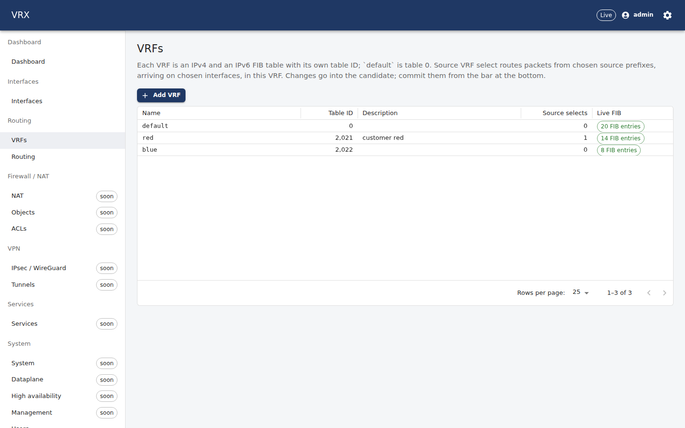
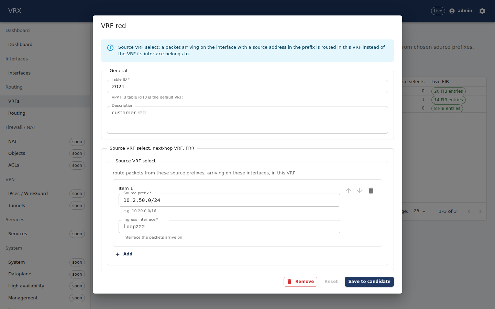
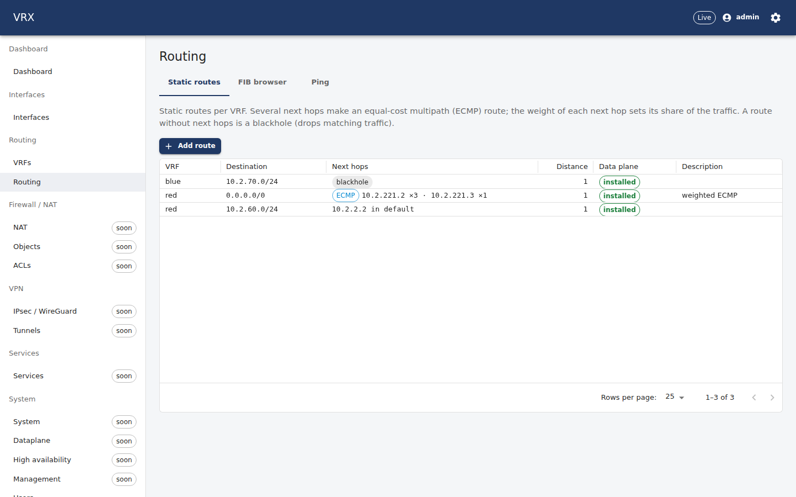
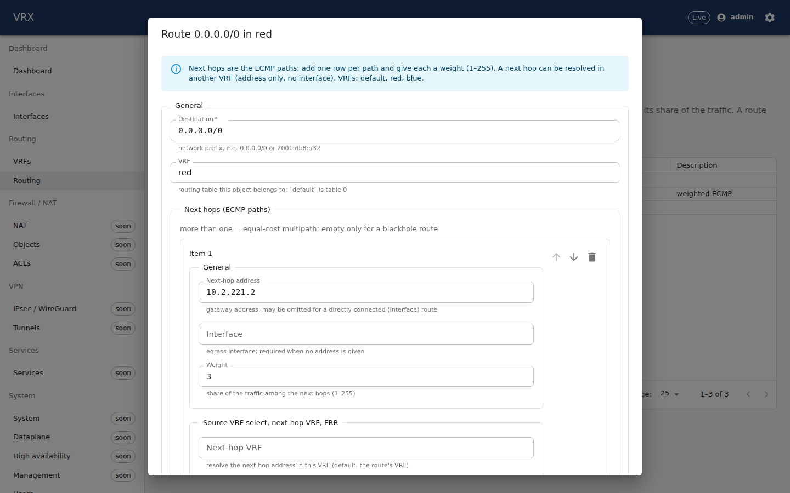
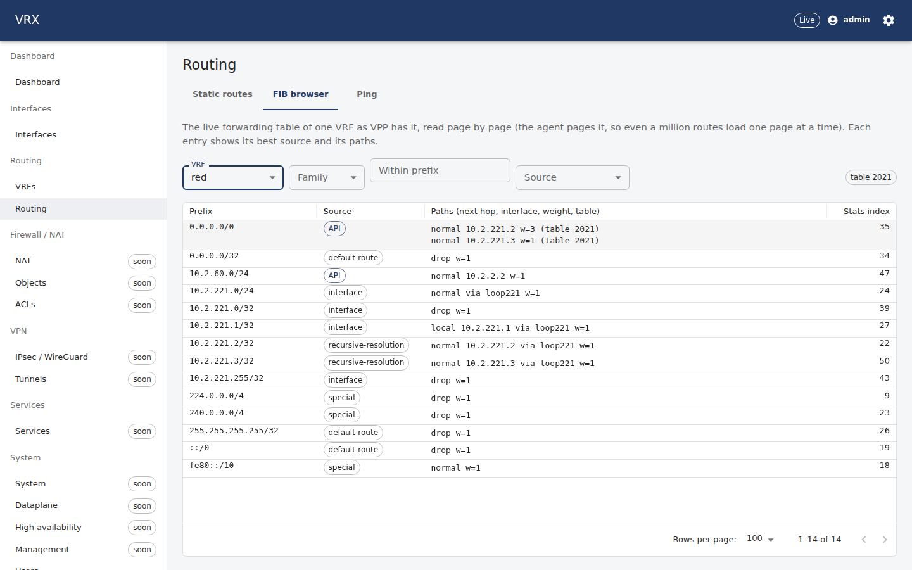
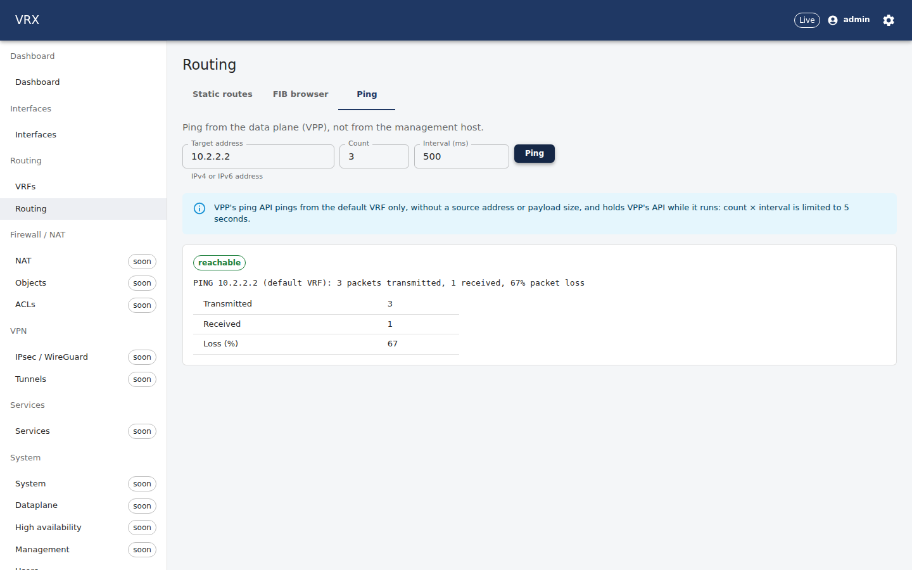
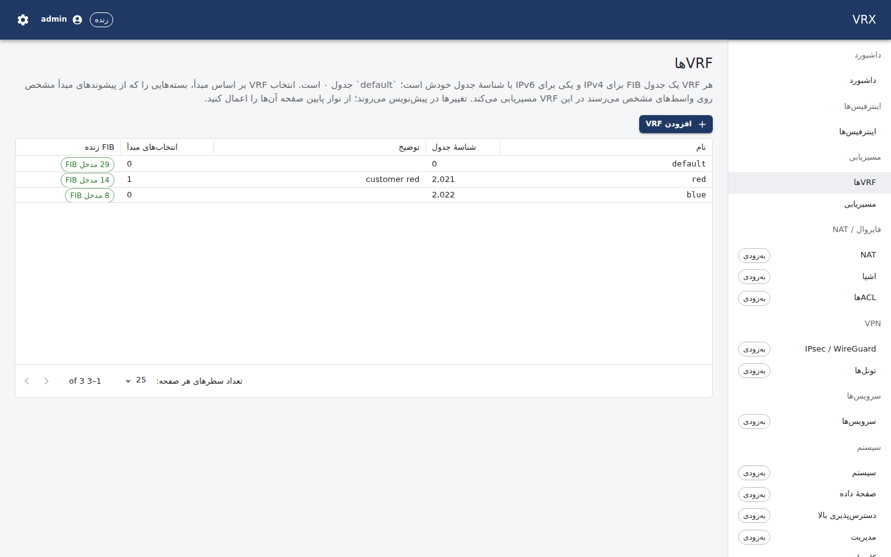
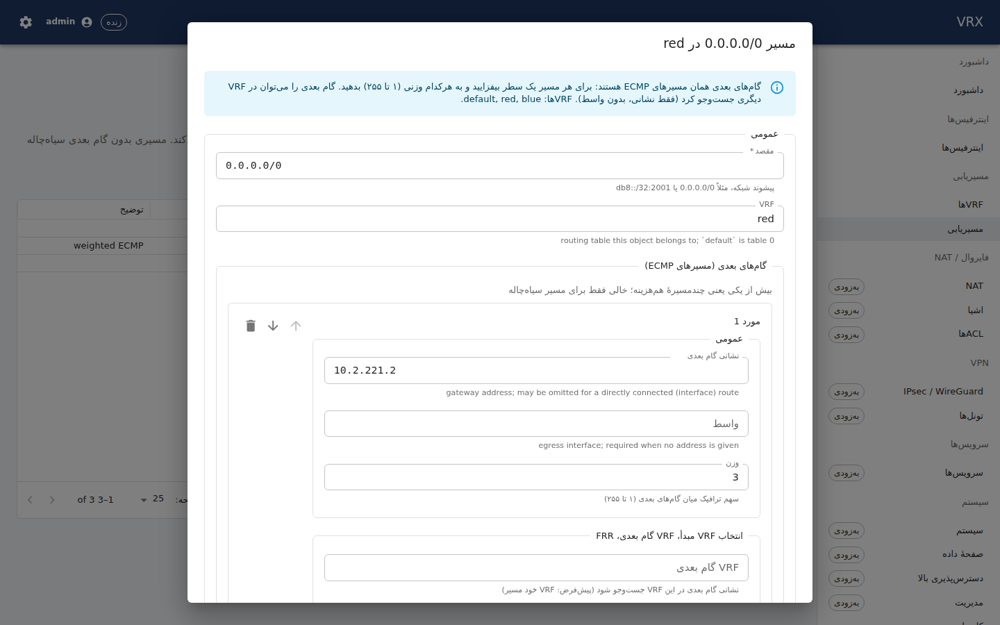
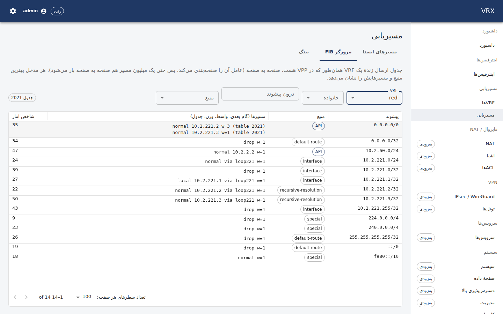
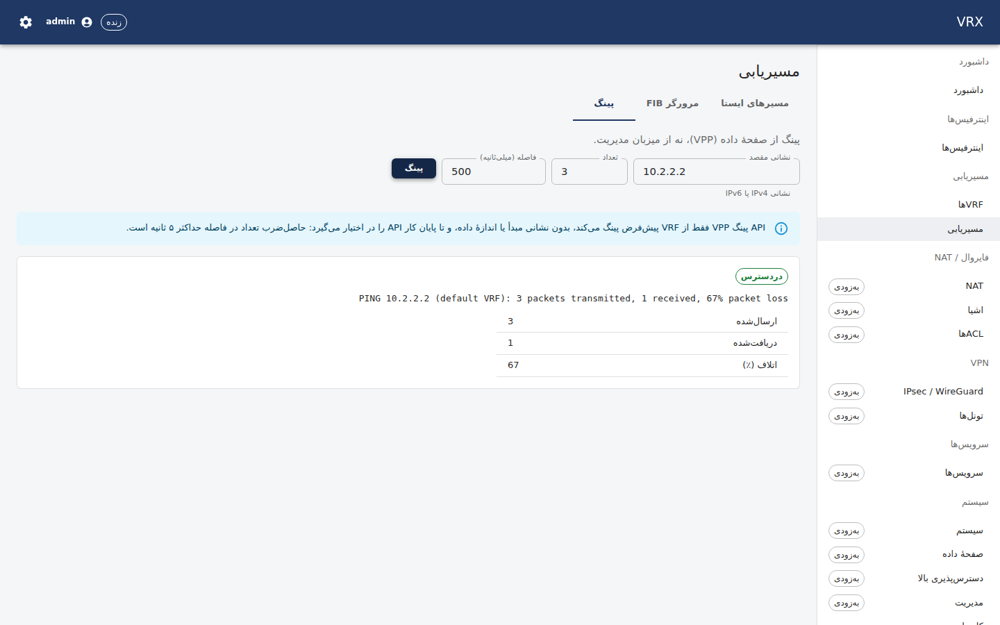

# Routing — VRFs, static routes, ECMP, FIB browser, ping

**Screens:** *Routing → VRFs* (`/routing/vrfs`) and *Routing → Routing* (`/routing`, tabs *Static routes*, *FIB browser*,
*Ping*). **REST:** the generic configuration routes under `/api/v1/config/vrfs` and `/api/v1/config/routing`, the live FIB
`GET /api/v1/state/routes` and `POST /api/v1/actions/ping`. **CLI:** `vrx show ip route [<vrf>]`, `vrx set vrfs …`,
`vrx set routing …` (`docs/user/cli/reference.md`).

## VRFs

A VRF is a routing table: VPP creates an IPv4 and an IPv6 FIB table with the VRF's **table ID**. `default` is table 0 and
always exists; every other VRF needs a unique table ID (`vrfs.id-unique`). Interfaces join a VRF with their `vrf` field
(*Interfaces* screen); routes name their VRF.

The list shows each VRF with its table ID, description, number of source selects and — live — how many entries its FIB
table has in the data plane. Click a VRF to edit it; **Save to candidate** writes a merge patch, **Commit** in the bar at
the top applies it.



### Source VRF select

*Source VRF select* (`vrfs.<vrf>.sourceSelect[]`) routes packets **by their source address** into this VRF: a packet that
arrives on `interface` with a source address inside `prefix` is looked up in this VRF instead of the VRF its interface
belongs to (VPP's `svs` plugin). One (interface, source prefix) selects one VRF (`vrfs.vrf-static-ecmp-source-select-unique`);
`/0` is not accepted (that is the interface's own VRF). The agent keeps one svs table per ingress interface; its table ID
comes from the top of the table-ID space (4294967040–4294967294 on a product box), skipping every declared VRF ID.



## Static routes and ECMP

`routing.static[]` holds the static routes of every VRF: destination prefix, VRF, next hops, administrative distance,
description. More than one next hop makes an **equal-cost multipath (ECMP)** route; each next hop's **weight** (1–255)
sets its share of the traffic (3 and 1 → 75 % / 25 % of the flows). A weight other than 1 on a route with one next hop is
refused (`routing.vrf-static-ecmp-single-path-weight`). A **blackhole** route has no next hop and drops what matches.
A next hop may be **resolved in another VRF** (`nextHops[].vrf`, e.g. a route in `red` towards a gateway of `default`) —
only for a next hop given by address, without an egress interface. **Program via FRR** (`viaFrr`) hands the route to FRR
(staticd) instead (D-072: one programmer per route; the agent then does not program it, FRR rendering arrives with P12).

The grid shows each route, its paths with weights, and whether the route is **installed** in its VRF's FIB right now. Click
a route to edit it: the next-hop list is the ECMP path editor (one row per path, with its weight and optional VRF).




Validation errors appear on the field (RFC 9457 problem pointers), e.g. a next hop in an undeclared VRF answers
`400` at `/routing/static/<i>/nextHops/<j>/vrf` ("VRF 'nope' does not exist"). The agent writes routes in the canonical
order (VRF, then prefix); keep that order when you write the list yourself, then the drift view stays empty.

## FIB browser

The *FIB browser* tab shows one VRF's **live** forwarding table as VPP has it: every entry with its best source (`API` =
static routes of the agent, `interface` = connected, `recursive-resolution`, `default-route`, `special`, `svs`, …) and its
paths — type (`normal`, `drop`, `local`, …), next hop, interface, weight and the table a next hop is resolved in when it is
another VRF. Filters: family, *within prefix* (the prefix and everything more specific; applied on Enter) and source —
the entries whose **best** source is that one (a static route shadowed by a better source for the same prefix is not
listed under `API`). Paging happens in the agent: VPP's table is read once per page and only the page travels.
Reading a table costs a full walk in VPP under its worker barrier (forwarding pauses on every worker for the walk;
100 000 routes: about 1–2 s per page on the lab host; `docs/vpp-code-track.md` V-new (d)). So the view is read **on
demand** — the refresh button reads it again, nothing polls it — the agent runs one walk at a time (another request
answers `503` "a FIB read is in progress" after 3 s), and a listing reaches at most 100 000 entries deep
(`page × pageSize ≤ 100 000`, else `400` at `/page`): narrow a bigger table with *within prefix*, family or source. The
VRF list's FIB counts are read once and on its refresh button; the static-routes status once a minute.



## Ping

*Ping* sends ICMP echo requests **from the data plane** (VPP's ping plugin), not from the management host. VPP's ping API
pings from the `default` VRF only, without a source address or payload size, and holds VPP's API while it runs, so
count × interval is limited to 5 s. A VRF other than `default`, a source or a size answer `400` with the field's pointer.
On a VPP with **worker threads** the ping is refused (`409`): VPP's ping API is not mp-safe, so it would hold the worker
barrier — no forwarding on any worker — for the whole ping (V-new (b)); use VPP's own CLI `ping` on the host there.
The result is the transmitted / received count VPP reports; on a busy data plane VPP's API under-counts replies (V-new in
`docs/vpp-code-track.md`). Traceroute is not available (`501`): VPP has none.



## Example: a VRF with a weighted ECMP default route, then ping

```sh
T=<access token>   # POST /api/v1/auth/login
H=(-H "authorization: Bearer $T" -H 'content-type: application/merge-patch+json')
curl -s "${H[@]}" -X PATCH http://127.0.0.1:3000/api/v1/config/vrfs -d '{"red": {"id": 21, "description": "customer red"}}'
curl -s "${H[@]}" -X PATCH http://127.0.0.1:3000/api/v1/config/interfaces -d '{"loop21": {"enabled": true, "vrf": "red", "ipv4": ["10.21.0.1/24"]}}'
curl -s "${H[@]}" -X PATCH http://127.0.0.1:3000/api/v1/config/routing -d '{"static": [
  {"prefix": "0.0.0.0/0", "vrf": "red", "nextHops": [{"address": "10.21.0.2", "weight": 3}, {"address": "10.21.0.3", "weight": 1}]},
  {"prefix": "10.99.0.0/16", "vrf": "red", "nextHops": [{"address": "192.0.2.1", "vrf": "default"}]},
  {"prefix": "203.0.113.0/24", "vrf": "red", "blackhole": true}]}'
curl -s -H "authorization: Bearer $T" -X POST http://127.0.0.1:3000/api/v1/config/commit
# the live FIB of red, one page (the agent pages it)
curl -s -H "authorization: Bearer $T" 'http://127.0.0.1:3000/api/v1/state/routes?vrf=red&page=1&pageSize=100'
# ping from the data plane (default VRF)
curl -s -H "authorization: Bearer $T" -H 'content-type: application/json' -X POST \
  http://127.0.0.1:3000/api/v1/actions/ping -d '{"target": "192.0.2.1", "count": 3, "intervalMs": 500}'
```

On the box, `vppctl show ip fib table 21 0.0.0.0/0` shows the two paths with `weight=3` and `weight=1`; `vppctl show svs`
lists the interfaces with source VRF select.

**CLI equivalent** (`docs/user/cli/reference.md`: one word per JSON-pointer segment, `merge` = RFC 7386):

```sh
vrx set vrfs red id 21
vrx set interfaces loop21 vrf red
vrx merge routing '{"static": [{"prefix": "0.0.0.0/0", "vrf": "red", "nextHops": [{"address": "10.21.0.2", "weight": 3}, {"address": "10.21.0.3", "weight": 1}]}]}'
vrx commit
vrx show ip route red          # the FIB pages of red (GET /api/v1/state/routes)
vrx ping 192.0.2.1             # POST /api/v1/actions/ping (see F-vrf-static-ecmp-questions Q9: the CLI must send the target)
```

## Persian (RTL)

Every screen is available in Persian:





