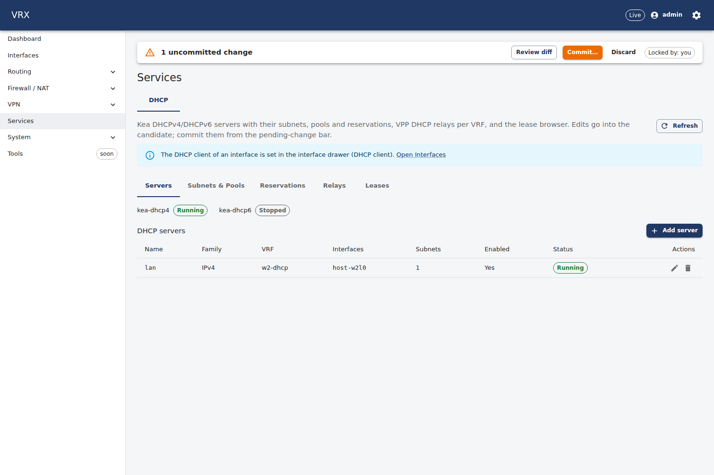
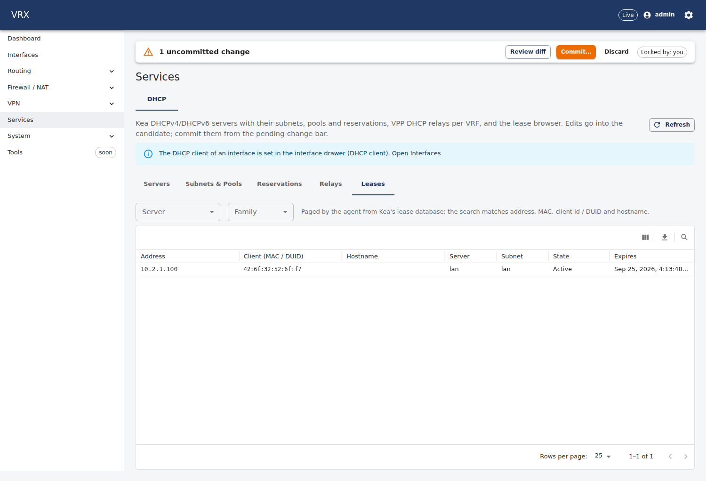
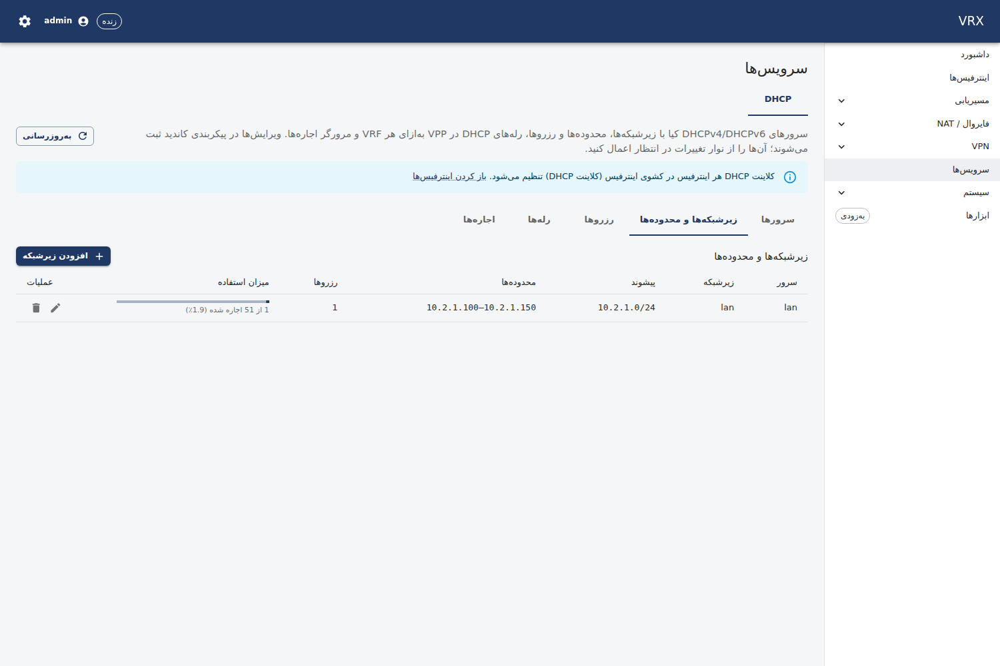

# DHCP — Kea server, relay, client

**Screen:** *Services → DHCP* (`/services?tab=dhcp`), with the tabs *Servers*, *Subnets & pools*, *Reservations*,
*Relays* and *Leases*. The DHCP **client** of an interface is configured in the interface drawer (*Interfaces*, field
*DHCP client*). **REST:** configuration through the generic routes under `/api/v1/config/services/dhcp` and
`/api/v1/config/interfaces/<name>/dhcpClient`; state under `/api/v1/state/dhcp/leases`, `/api/v1/state/dhcp/relays`
and `/api/v1/state/interfaces/<name>/dhcp-client`. **CLI:** `vrx set|merge|delete services dhcp …`, `vrx commit`,
`vrx show configuration services dhcp`, `vrx show drift` (a dedicated `show dhcp leases` command is not in this release —
use the REST route; its operation ids `KeaDhcpRelay_leases`, `KeaDhcpRelay_relays`, `KeaDhcpRelay_client` are in the
CLI's generated operation table).



Three independent pieces:

| piece | where it runs | configuration |
|---|---|---|
| **DHCP server** | Kea (`kea-dhcp4` / `kea-dhcp6`), one process per address family, driven by the agent over the daemon's own unix control socket (no `kea-ctrl-agent`) | `services.dhcp.servers.<name>` |
| **DHCP relay** | VPP's DHCP proxy: requests arriving in a *client VRF* are forwarded to one or more servers | `services.dhcp.relays.<name>` |
| **DHCP client** | VPP's DHCPv4 client on one interface (the lease is status, never written back into `ipv4`) | `interfaces.<name>.dhcpClient` |

## Example 1 — a LAN DHCP server

One IPv4 server for the LAN interface, one subnet with a pool, the default gateway and DNS server handed out, a printer
with a fixed address (reservations must lie **outside** the pools):

```json
{
  "services": { "dhcp": { "servers": { "lan": {
    "vrf": "default",
    "interfaces": ["GigabitEthernet0/8/0"],
    "leaseTimeSec": 3600,
    "subnets": { "lan": {
      "subnet": "192.168.10.0/24",
      "pools": [{ "start": "192.168.10.100", "end": "192.168.10.199" }],
      "gateway": "192.168.10.1",
      "dnsServers": ["192.168.10.1"],
      "domainName": "lan.example",
      "reservations": { "printer": { "mac": "aa:bb:cc:dd:ee:01", "ip": "192.168.10.20", "hostname": "printer" } }
    } }
  } } } }
}
```

```sh
curl -s -X PATCH -H "authorization: Bearer $T" -H 'content-type: application/merge-patch+json' \
  http://127.0.0.1:3000/api/v1/config/services -d @lan-dhcp.json
curl -s -X POST -H "authorization: Bearer $T" 'http://127.0.0.1:3000/api/v1/config/commit?comment=lan-dhcp'
```

```
vrx merge services dhcp servers '{"lan":{"vrf":"default","interfaces":["GigabitEthernet0/8/0"],"subnets":{"lan":{"subnet":"192.168.10.0/24","pools":[{"start":"192.168.10.100","end":"192.168.10.199"}],"gateway":"192.168.10.1"}}}}'
vrx set services dhcp servers lan leaseTimeSec 3600
vrx show configuration diff
vrx commit comment lan-dhcp
```

Rules checked before anything is applied (a violation is a 400 `application/problem+json` whose `errors[].pointer`
names the field; the screen shows it on that field):

- pools lie inside their subnet, are ordered, of the subnet's family and do not overlap; a reservation lies inside the
  subnet, **outside every pool**, and an address, a MAC or a DUID is reserved once;
- subnets do not overlap between servers of one VRF and lie within a prefix configured on one of the server's interfaces;
- **all enabled servers of one family share one VRF** (one Kea process per family serves all of them);
- an interface with a DHCP client has no static IPv4 address.

```
$ curl … -X PATCH …/config/services -d '{"dhcp":{"servers":{"bad":{…"pools":[{"start":"10.99.0.10","end":"10.99.0.20"}]…}}}}'
400 {"type":"https://vrx.dev/problems/validation","title":"Validation failed","status":400,
     "errors":[{"pointer":"/services/dhcp/servers/bad/subnets/lan/pools/0/start","message":"10.99.0.10 is outside 10.2.1.0/24"},…]}
```

**Kea not running.** The agent writes the configuration file even when the daemon is stopped, and the *Servers* tab
(and `GET /api/v1/state/dhcp/leases`, `servers[].actionRequired = "start"`) says that the daemon must be started. The
request stays visible until the daemon runs; after `systemctl start kea-dhcp4-server` the daemon loads the file and the
agent verifies it (`config-get`). A commit never fails only because Kea is stopped.

**Interfaces.** Kea binds Linux interfaces. On a VPP box they are the linux-cp mirrors of the VPP interfaces; until the
linux-cp mapping is available in this release, a server interface is refused by the agent ("no VPP→Linux interface
mapper configured"). The lab uses an explicit mapping (below).

## Example 2 — relay to a central DHCP server

Clients in VRF `branch` (all interfaces of that VRF — VPP relays per VRF, not per interface) are relayed to two central
servers reached in VRF `core`; the relay's source address (the `giaddr`) must be configured on an interface in the server
VRF:

```json
{ "services": { "dhcp": { "relays": { "to-core": {
  "vrf": "branch",
  "serverVrf": "core",
  "interfaces": ["GigabitEthernet0/9/0"],
  "servers": ["10.0.0.10", "10.0.0.11"],
  "sourceAddress": "10.0.5.1",
  "description": "branch LAN → central DHCP"
} } } } }
```

```
vrx merge services dhcp relays '{"to-core":{"vrf":"branch","serverVrf":"core","interfaces":["GigabitEthernet0/9/0"],"servers":["10.0.0.10","10.0.0.11"],"sourceAddress":"10.0.5.1"}}'
vrx commit comment relay
```

VPP keeps **one source address per client VRF and family**: two relays of one client VRF must use the same
`sourceAddress` and must not list the same server twice. VPP inserts option 82 (circuit id = the client interface,
link-selection = the client interface's address), so the server can pick the subnet of the client's link. The *Relays*
tab (and `GET /api/v1/state/dhcp/relays`) shows each relay with what the agent retrieves from VPP: *applied*, *drift*,
*missing* (not on the data plane), *disabled* or *unmanaged* (on the data plane, not configured). `vppctl show dhcp proxy`
lists the same relays.

## Example 3 — a WAN interface as DHCP client

```
vrx merge interfaces GigabitEthernet0/a/0 '{"enabled":true,"dhcpClient":{"hostname":"vrx-edge"}}'
vrx commit comment wan-dhcp
```

The state (DISCOVER / REQUEST / BOUND, leased address, router, DNS servers) is on
`GET /api/v1/state/interfaces/GigabitEthernet0~1a~10/dhcp-client` (`vppctl show dhcp client`). The DHCPv6 client (IA_NA /
prefix delegation) has no configuration leaf in this release.

## Leases and pool usage




The *Leases* tab pages through the leases of all servers (or one server) with a text filter (address, MAC, client id /
DUID, hostname); the agent reads them from Kea page by page (`lease4-get-page`, never the whole lease file) and returns
only the requested page. *Subnets & pools* shows the pool usage (assigned / total addresses) per subnet.

```sh
curl -s -H "authorization: Bearer $T" 'http://127.0.0.1:3000/api/v1/state/dhcp/leases?server=lan&page=1&pageSize=50&filter=aa:bb'
```

## What happens on the data plane

After a commit the agent renders `kea-dhcp4.conf` / `kea-dhcp6.conf`, checks them with `kea-dhcp4 -t` /
`kea-dhcp6 -t` and loads them into the running daemons with `config-set` (no restart; leases survive). It proves that the
daemon runs exactly the rendered configuration (`config-get`, normalised comparison), so a configuration changed behind
its back is re-applied by the next reconcile. The relay and the client are VPP objects the agent recreates the same way.
If the agent restarts or the objects disappear, the next reconcile restores them without any API call (lab test: relay,
client and the Kea configuration back 0.2–0.4 s after the agent started). A rollback removes servers, relays and clients
that the older revision does not contain; the Kea daemon goes back to an idle configuration.

## Lab (test slots)

The topology test (`test/topology/kea-dhcp-relay`, `run.sh`) runs a slot-local `kea-dhcp4` in `ns-<p>-wan`
(`/run/vrx-test/<p>/kea`, its own unix socket) and the agent with `VRX_KEA_MODE=test`, `VRX_KEA_NETNS=ns-<p>-wan`,
`VRX_KEA_IFMAP=host-<p>l0=<p>w1` — the server configured for the LAN interface `host-<p>l0` is Kea on `<p>w1`, reached
through VPP's relay; `dhclient` in `ns-<p>-lan` gets its lease through that path.

Not in this release: DHCP failover / HA, DDNS, client classes, shared networks, SQL lease back ends, option-82 policy
(remote-id / VSS configuration), per-VRF Kea instances, the DHCPv6 client configuration.
