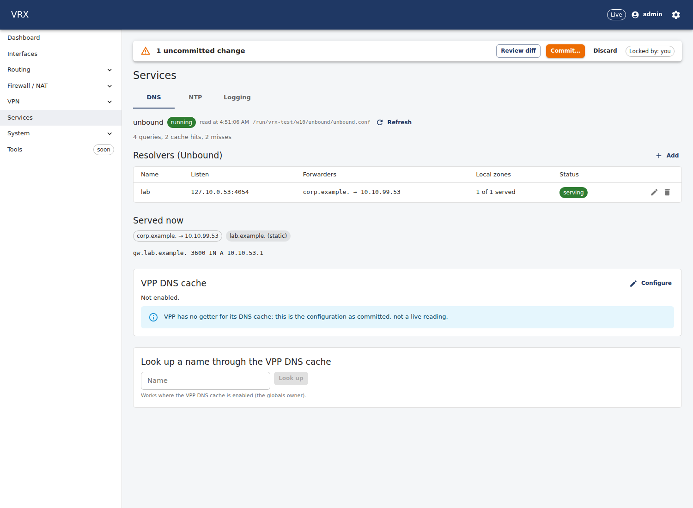
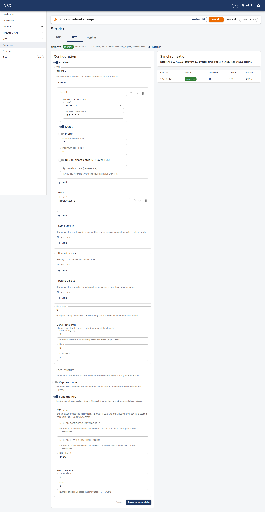
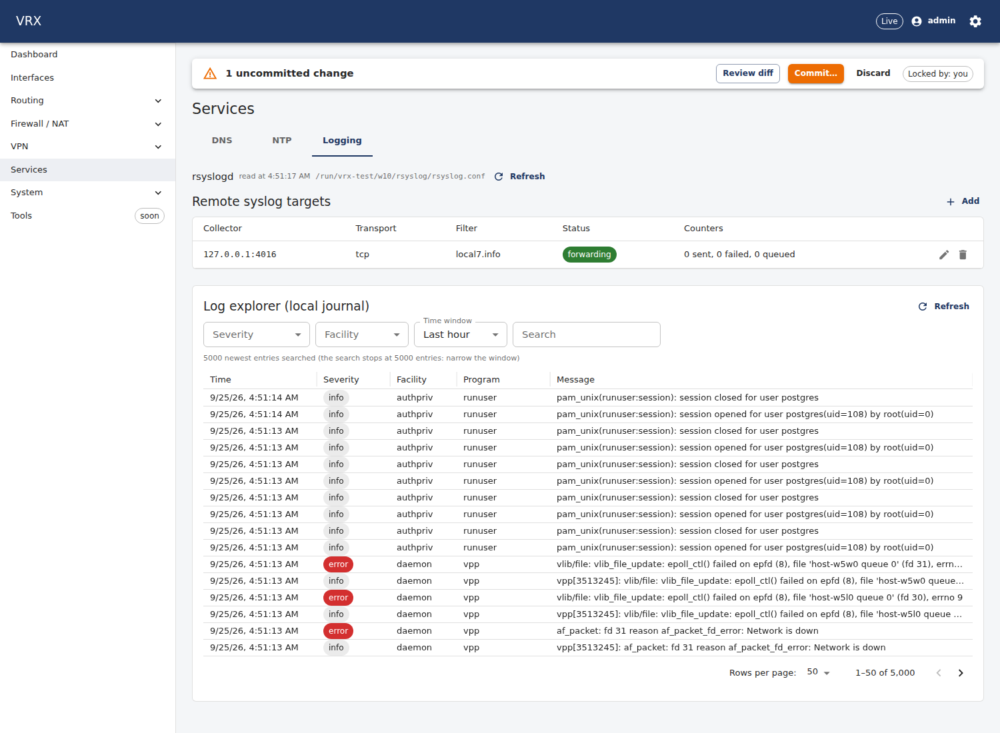
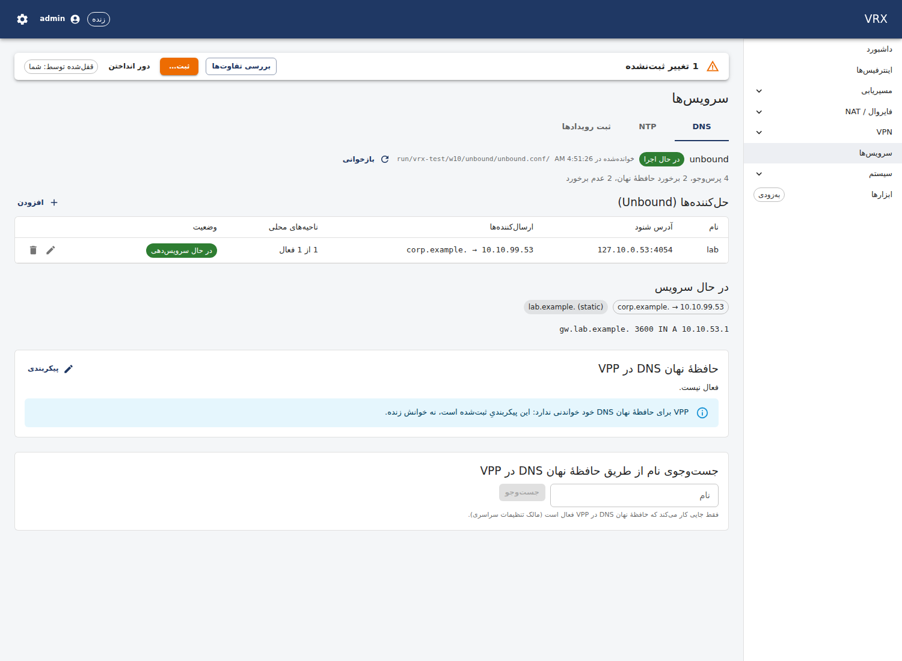
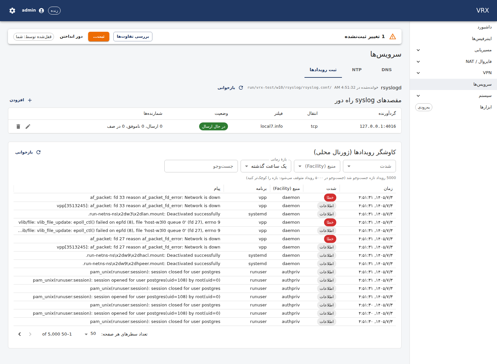

# Services — DNS resolver, NTP and remote syslog

**Screen:** *Services* (`/services`), tabs **DNS**, **NTP** and **Logging**. **REST:** configuration through the generic
routes (`/api/v1/config/services` → `dns`, `ntp`; `/api/v1/config/management` → `syslog`), live state
`GET /api/v1/state/dns`, `/state/ntp`, `/state/syslog`, the log explorer `GET /api/v1/state/logs`, and
`POST /api/v1/actions/dns-lookup`. **CLI:** `merge` / `set` / `show configuration` on the same paths (below); the CLI
has no `show dns|ntp|logs` command yet — `vrx --json` users call the state routes through the API.

VRX runs three host daemons as separate processes, configured from the one configuration document:

| section | daemon | what VRX renders | how a change is applied |
|---|---|---|---|
| `services.dns.resolvers` | Unbound 1.24 | one `unbound.conf` for every resolver | `unbound-control reload_keep_cache` + a convergence check; a change of listen address/port/views needs a **restart** |
| `services.dns.vppCache` | VPP's `dns` plugin | name servers + the enable switch (a VPP-global) | binary API, by the globals owner only |
| `services.ntp` | chrony 4.8 | `chrony.conf`, `sources.d/vrx.sources`, `chrony.keys` | `chronyc reload sources` / `rekey`; any other change needs a **restart** |
| `management.syslog` | rsyslog 8 | one export file (`omfwd` per target) | a restart of rsyslog (it cannot reload), skipped when nothing changed |

A change the daemon applies only when it starts is shown as a **Daemon action pending** banner (e.g. "unbound needs a
restart (unit unbound) — listen addresses … changed"). The files are already written; the request stays until the daemon
has restarted, also across a restart of the agent.

## DNS: a caching resolver with DNSSEC



The table lists the resolvers of the candidate with their listen sockets, forwarders, how many of their local zones the
running Unbound serves, and a live status; **Served now** shows the forward zones and local records Unbound answers
right now (`list_forwards`, `list_local_zones`, `list_local_data`). **Add** / the pencil open the form generated from
the schema (`services.dns.resolvers.<name>`); **Save to candidate** changes only the candidate — commit it in the bar at
the top.

Example — a LAN resolver with DNSSEC validation (the default), a local zone and a forward zone:

```sh
vrx configure
merge services '{"dns":{"resolvers":{"lan":{"listen":[{"address":"192.168.10.1"}],
  "accessControl":[{"prefix":"192.168.10.0/24","action":"allow"}],
  "forwarders":[{"address":"9.9.9.9","port":853,"tls":true,"tlsServerName":"dns.quad9.net"}],
  "forwardZones":[{"zone":"corp.example.","forwarders":[{"address":"10.99.0.53"}]}],
  "localZones":[{"zone":"lab.example.","records":[{"name":"gw.lab.example.","type":"A","data":"192.168.10.1"}]}],
  "dnssec":{"enabled":true,"trustAnchorAuto":true}}}}}'
commit
show configuration services dns
```

Rules the commit checks (each answers `400` problem+json with the pointer of the field):

- a forwarder must not be one of the resolver's own listen addresses (`/services/dns/resolvers/lan/forwarders/0`), nor
  any listen socket of another resolver or a forward zone's (one Unbound instance serves all resolvers: the query would
  loop);
- the VPP DNS cache and an Unbound resolver cannot both use port 53: once `vppCache.enabled` is set, VPP answers UDP 53
  on its addresses, so a resolver listening on port 53 is refused (`/services/dns/resolvers/<name>/listen/<i>`);
- listen addresses must be configured on an interface of the resolver's VRF.

**VPP DNS cache.** `services.dns.vppCache` enables VPP's own caching resolver. It is a VPP-wide setting: only the product
agent of the box (the *globals owner*) programs it; VPP has no read-back, so the panel shows it *as committed*.
**Look up** asks VPP's cache for a name (`POST /api/v1/actions/dns-lookup {"name":"gw.lab.example"}` →
`{"ok":true,"addresses":[{"type":"A","address":"…"}]}`). The agent refuses the lookup (`409`) unless it enabled the cache
itself with at least one upstream: VPP 26.06 crashes on a lookup while its resolver has no name server.

## NTP: client and LAN server



The form edits `services.ntp` (NTP lives only here). The right-hand side shows chrony's synchronisation (`tracking`:
reference, stratum, system-time offset, leap status) and every source with its state (*selected*, *combined*, …),
stratum, reachability register and offset.

Example — a client of two servers that also serves time to the LAN, falling back to local stratum 10:

```sh
merge services '{"ntp":{"enabled":true,"servers":[{"address":"ntp1.example.net","prefer":true},{"address":"192.0.2.123","nts":true}],
  "pools":["pool.ntp.org"],"allow":["192.168.10.0/24"],"listen":["192.168.10.1"],"localStratum":10}}'
commit
```

Symmetric keys (`servers[].keyRef`) and the NTS server (`ntsServer`) are refused at commit time in this release: keys need
the API→agent secret channel, which is not available yet.

## Logging: remote syslog targets and the log explorer



**Remote targets** (`management.syslog`, at most 8): collector, port, transport (`udp`, `tcp`, `tls`), minimum
severity, and the facilities, wire format (`rfc5424` default, octet-counted over TCP; or `rfc3164`) and queue size.
Each row shows live counters from rsyslog (`impstats`): sent, failed, queued — a collector that stops accepting shows up
as a *backlog*.

Example — forward `auth`/`authpriv` notices and above over TCP:

```sh
merge management '{"syslog":[{"address":"192.0.2.10","port":514,"protocol":"tcp","severity":"notice",
  "facilities":["auth","authpriv"],"format":"rfc5424","queueSize":50000}]}'
commit
```

TLS targets (`protocol: tls` with `tls.caRef` …) pass the schema (a TLS target needs a CA reference) but are refused
at commit time in this release, for the same reason as the NTP keys.

**Log explorer** reads the box's local journal: newest first, filtered by minimum severity, facility, time window
(1 h … 7 days) and a plain text search (not a pattern), 25–100 rows per page. One query scans at most the 5000 newest
entries of the window (the page says when it stopped there: narrow the window). It is read-only; nothing is executed
with your input (`GET /api/v1/state/logs?severity=warning&facility=daemon&q=unbound&page=1&pageSize=50`).

In Persian the screens are right-to-left:




## Limits of this release

- One Unbound instance serves every resolver; resolvers must share one VRF and the instance settings (threads, cache,
  DNSSEC, …). Views are rendered only for per-resolver local zones.
- The daemons run in the host's default network namespace: syslog export ignores a non-default `vrf` (noted at
  commit), and resolver/NTP addresses must be addresses of that namespace.
- rsyslog's TLS driver (`rsyslog-openssl`) is not installed on the current image; TLS export waits for it and for the
  secret channel.
