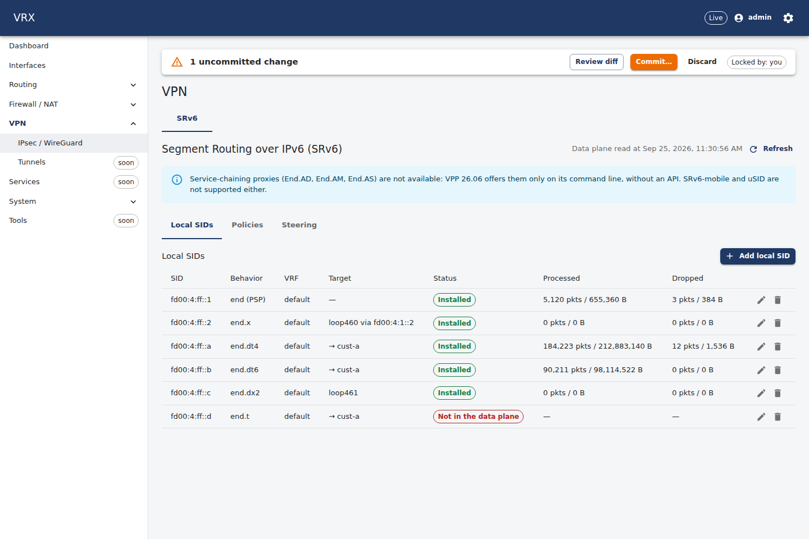
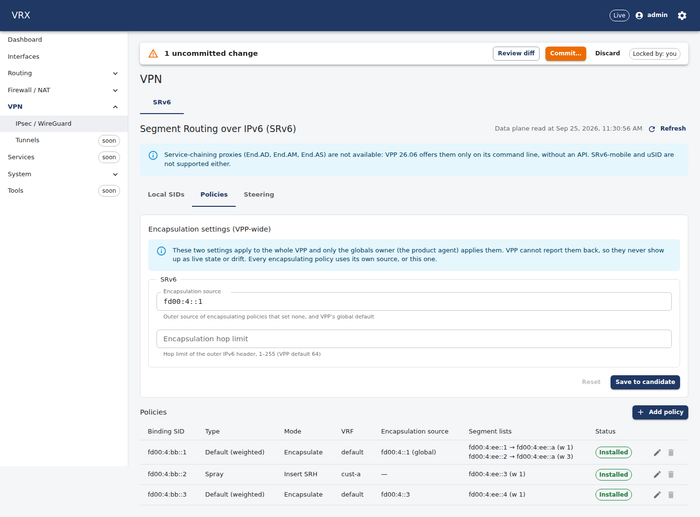
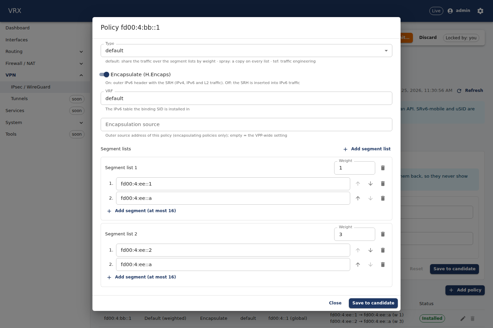
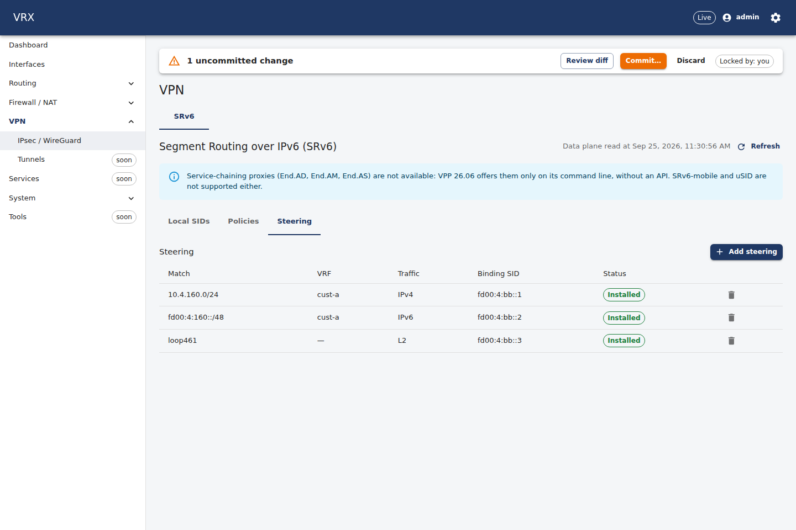
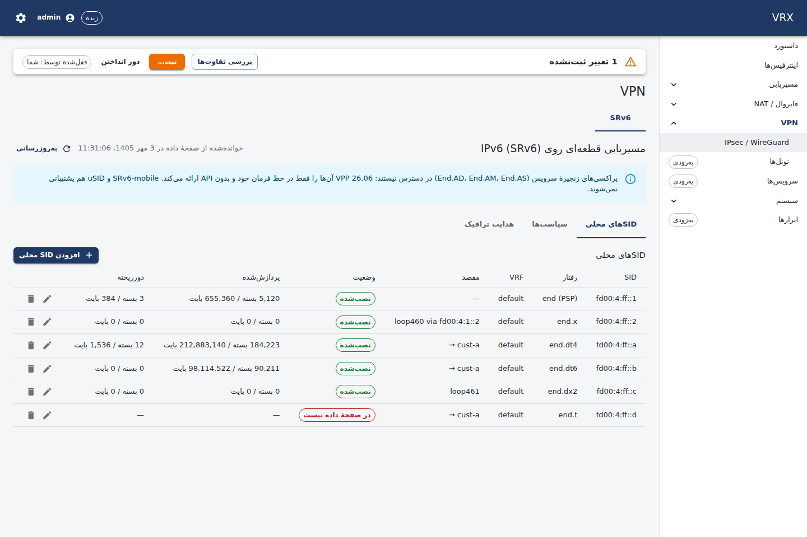
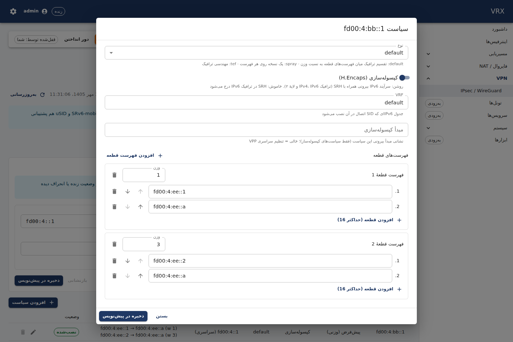

# SRv6 (Segment Routing over IPv6)

**Where:** VPN → **SRv6** tab (sub-tabs **Local SIDs**, **Policies**, **Steering**). **REST:** configuration through the
generic routes under `/api/v1/config/routing` (`routing.srv6`), live state `GET /api/v1/state/srv6`.
**CLI:** `vrx set routing srv6 …` / `vrx show configuration routing srv6` (see the end of this page).

VRX programs SRv6 in the VPP data plane (VPP 26.06 core `sr`): the agent creates the local SIDs, SR policies and
steering entries of `routing.srv6` on commit, removes them on rollback and re-creates them after an agent or VPP
restart. Only objects this router created are touched; objects someone else created in VPP are never adopted, changed
or deleted.

## The model

| part | what it is | VPP |
|---|---|---|
| `localSids.<sid>` | **Network programming**: what this router does with a packet whose active segment is `<sid>` | `sr localsid` |
| `policies.<bsid>` | An **SR policy**: one or more segment lists, reached through its **binding SID** (BSID) | `sr policy` |
| `steering[]` | Traffic sent into a policy: a **prefix of a VRF** (`l3`) or **everything received on an interface** (`l2`) | `sr steer` |
| `encapSource`, `encapHopLimit` | VPP-wide encapsulation settings (see [Globals](#globals-encapsource-and-encaphoplimit)) | `sr encaps source`, `sr encaps hop-limit` |

### Local SIDs

A SID is an IPv6 address (written in canonical form, e.g. `2001:db8:2:ff::a`). Behaviours:

| behavior | does | needs |
|---|---|---|
| `end` | endpoint: next segment | — (`psp` optional) |
| `end.x` | endpoint, then forward to a neighbour (L3 cross-connect) | `interface`, IPv6 `nextHop` (`psp` optional) |
| `end.t` | endpoint, then look up in an IPv6 table | `lookupVrf` (`psp` optional) |
| `end.dx2` | decapsulate, send the inner Ethernet frame out of an interface (L2VPN / VPWS) | `interface` |
| `end.dx4` / `end.dx6` | decapsulate, forward the inner IPv4 / IPv6 packet to a next hop | `interface`, IPv4 / IPv6 `nextHop` |
| `end.dt4` / `end.dt6` | decapsulate, look the inner IPv4 / IPv6 packet up in a VRF (L3VPN) | `lookupVrf` |

`vrf` is the IPv6 table the SID itself is installed in (default `default`). **PSP** (penultimate segment pop) is only
offered for `end`, `end.x` and `end.t`.

### Policies

- **Type**: `default` shares the traffic over the segment lists by **weight** (weighted ECMP); `spray` sends a copy on
  every list; `tef` is VPP's traffic-engineering type.
- **Encapsulate** (`encap`, default on) = H.Encaps: an outer IPv6 header with the SRH is added (works for IPv4, IPv6 and
  L2 traffic). Off = H.Insert: the SRH is inserted into IPv6 traffic (IPv6 only).
- **Encapsulation source**: every encapsulating policy carries its own outer source address — the policy's
  `encapSource`, else `routing.srv6.encapSource`. A commit with an encapsulating policy and neither is refused with a
  400 at `/routing/srv6/policies/<bsid>/encapSource` (VPP's own default cannot be read back, decision D-074). An
  insert policy has no outer header and takes no `encapSource`.
- **Segment lists**: 1–16 SIDs each, first visited first; at least one list per policy. In the policy dialog the
  **segment list editor** adds, removes and reorders SIDs (↑/↓) and sets each list's weight.
- `vrf`: the IPv6 table of the binding SID (default `default`).

### Steering

- `l3`: `{ "type": "l3", "prefix": "10.20.0.0/16", "vrf": "cust-a", "bsid": "…" }` — the prefix in that VRF is routed
  into the policy. IPv4 prefixes need an encapsulating policy.
- `l2`: `{ "type": "l2", "interface": "…", "bsid": "…" }` — every frame received on the interface is encapsulated into
  the policy. VPP switches the interface to **L2 cross-connect mode**, so it must not carry IP addresses; the policy
  must encapsulate. The same interface as the `end.dx2` target of a local SID is the usual L2VPN (VPWS) pair.

Each prefix (per VRF) and each interface can be steered once. The screen saves the list in the order the data plane
reports it (L3 by VRF and prefix, then L2 by interface), so the running configuration and the data plane compare equal.

### Globals: encapSource and encapHopLimit

Both are **VPP-wide**: they are applied only by the *globals owner* (the product agent on a real box; test agents on a
shared lab VPP never set them) and VPP cannot report them back. They therefore never appear in the live state or in
`show drift`. On an agent that is not the globals owner a commit that sets them fails with a clear message; give each
encapsulating policy its own `encapSource` there instead.

### Canonical form

Addresses and prefixes are written as the data plane reports them: lower case, shortest `::` form (`2001:db8::1`, not
`2001:DB8:0::1`). The screen converts what you type; through REST or the CLI a non-canonical spelling is refused with
`routing.srv6-canonical` and the canonical text in the message.

## What the tab shows

- **Local SIDs**: SID, behaviour (PSP), VRF, target (interface, next hop, lookup VRF), status and two counter columns:
  **Processed** (packets / bytes the SID handled) and **Dropped** (packets / bytes it discarded) — VPP's per-SID
  counters.
- **Policies**: the VPP-wide encapsulation settings card, then BSID, type, mode (encapsulate / insert SRH), VRF, the
  encapsulation source in effect (`(global)` when inherited) and the segment lists (`sid → sid (w <weight>)`). A
  policy that steering entries point at cannot be deleted before them.
- **Steering**: match (prefix or interface), VRF, traffic (IPv4, IPv6, L2), BSID and status.









 

(Screenshots of the production web build against the real vrx-api; the agent behind it was the API's test agent while
host runs were closed, so the counters are sample values.)

The lists show the configuration being edited (the candidate) joined with the data plane. Status: **Installed**
(configured and in the data plane), **Not in the data plane** (configured, not created yet — e.g. before the commit),
**Not configured** (in the data plane under this agent's ownership but not in the candidate — e.g. deleted and not
committed yet). The state is read from VPP every 30 s and on **Refresh** — reading it walks VPP, so the screen never
polls faster (decision D-132).

## Example: L3VPN over SRv6

Customer VRF `cust-a` on two provider edges; PE1 (`2001:db8:1::/48`) sends the customer's traffic for site B
(`10.20.0.0/16`) to PE2 (`2001:db8:2::/48`), which decapsulates it into its own `cust-a`. The SID blocks must be
routable between the PEs in the default IPv6 table (static routes or an IGP).

**PE2 (egress)** — an `end.dt4` SID that looks the inner packet up in `cust-a`:

```json
{
  "vrfs": { "cust-a": { "id": 100 } },
  "routing": {
    "srv6": {
      "localSids": {
        "2001:db8:2:ff::a": { "behavior": "end.dt4", "lookupVrf": "cust-a" }
      }
    }
  }
}
```

**PE1 (ingress)** — an encapsulating policy towards PE2's SID and the customer prefix steered into it:

```json
{
  "vrfs": { "cust-a": { "id": 100 } },
  "routing": {
    "srv6": {
      "encapSource": "2001:db8:1::1",
      "policies": {
        "2001:db8:1:bb::1": {
          "type": "default",
          "encap": true,
          "sidLists": [{ "sids": ["2001:db8:2:ff::a"], "weight": 1 }]
        }
      },
      "steering": [
        { "type": "l3", "prefix": "10.20.0.0/16", "vrf": "cust-a", "bsid": "2001:db8:1:bb::1" }
      ]
    }
  }
}
```

The reverse direction is the mirror image (an `end.dt4` SID on PE1, a policy and steering on PE2). For an L2VPN
(VPWS), use `end.dx2` towards the customer port on the egress PE and `l2` steering of the customer port on the ingress PE.

## The same with the CLI and REST

PE1:

```
vrx configure
set vrfs cust-a id 100
set routing srv6 encapSource 2001:db8:1::1
merge routing srv6 policies '{"2001:db8:1:bb::1":{"encap":true,"sidLists":[{"sids":["2001:db8:2:ff::a"],"weight":1}]}}'
set routing srv6 steering '[{"type":"l3","prefix":"10.20.0.0/16","vrf":"cust-a","bsid":"2001:db8:1:bb::1"}]'
show configuration diff
commit confirm 120 comment "srv6 l3vpn cust-a"
confirm
```

PE2:

```
vrx configure
set vrfs cust-a id 100
merge routing srv6 localSids '{"2001:db8:2:ff::a":{"behavior":"end.dt4","lookupVrf":"cust-a"}}'
commit comment "srv6 end.dt4 cust-a"
```

`vrx show configuration routing srv6` shows the running SRv6 configuration and `vrx show drift` compares it with the
data plane. The live state has no dedicated CLI command in this release; call the REST operation (`Srv6_state`):

```
curl -H "Authorization: Bearer $TOKEN" https://<router>/api/v1/state/srv6
```

For comparison, what an administrator sees in VPP itself: `vppctl show sr localsids`, `vppctl show sr policies`,
`vppctl show sr steering-policies`.

## Validation

Besides the schema (behaviour names, IPv6 addresses, 1–16 SIDs per list, weights 1–65535, hop limit 1–255), the commit
checks (problem+json pointers):

- `routing.srv6-canonical`: canonical spelling of every address and prefix;
- `routing.srv6-sid-address`: SIDs, BSIDs, segments and sources are unicast IPv6 (not `::`, `::1`, multicast);
- `routing.srv6-sid-unique`: an address is either a local SID or a binding SID;
- `routing.srv6-behavior-fields`: the fields each behaviour needs (table above) and no others;
- `routing.srv6-vrf-exists`, `routing.srv6-interface-exists`: referenced VRFs and interfaces are configured;
- `routing.srv6-encap-source`: an encapsulating policy has a source, an insert policy none;
- `routing.srv6-steering-bsid`, `routing.srv6-steering-encap`, `routing.srv6-steering-unique`: steering points at a
  configured policy, L2 and IPv4 steering use an encapsulating policy, one entry per prefix/VRF and per interface;
- `routing.srv6-l2-interface`: an L2-steered interface has no IP addresses.

## Limits in this release

- **No service-chaining proxies (End.AD, End.AM, End.AS).** VPP 26.06 ships them as plugins that are configured only
  through its command line; they have no binary API, so VRX cannot program them (tracked in `docs/vpp-code-track.md`,
  V-new F-srv6). The behaviour list refuses them.
- **No SRv6-mobile** (GTP4/GTP6 behaviours), **no uSID** (micro-SIDs / locators), **no path tracing**.
- SRv6 signalling by BGP or IS-IS is not part of this feature.
- `encapSource` and `encapHopLimit` are applied by the globals owner only and are never read back (see above).
