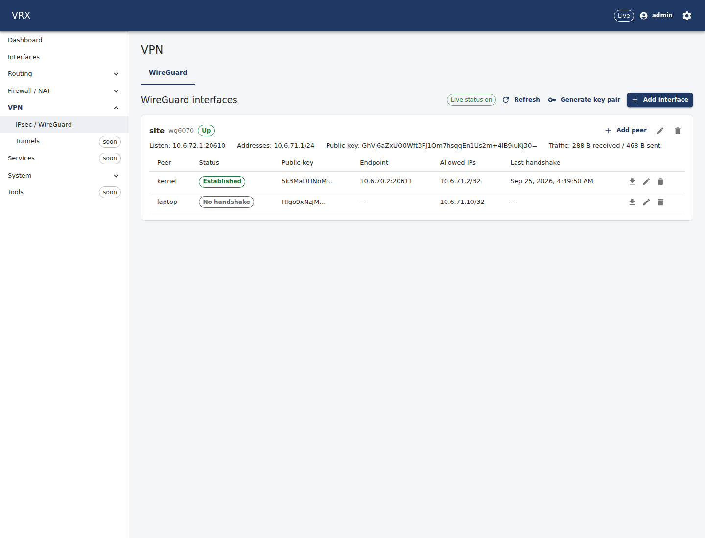
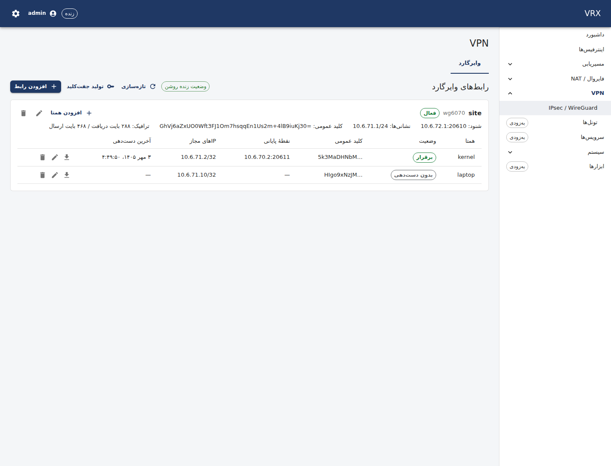
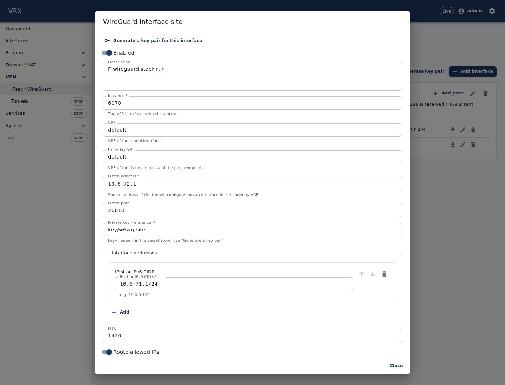
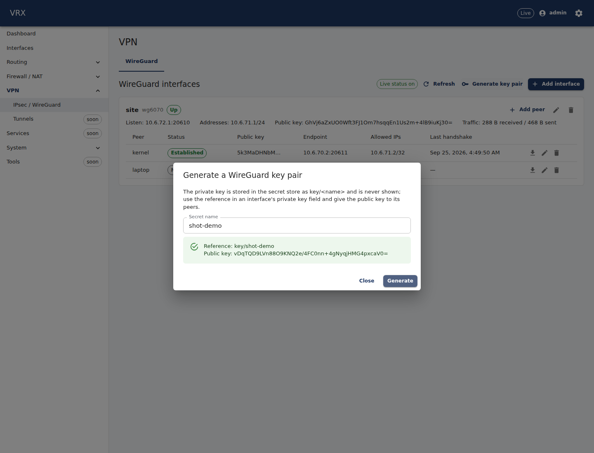

# WireGuard

**Where:** VPN → **WireGuard** tab. **REST:** configuration through the generic routes under `/api/v1/config/vpn`
(`vpn.wireguard.interfaces.<name>`), live state `GET /api/v1/state/vpn/wireguard`, key pairs
`POST /api/v1/actions/vpn/wireguard/keypair`, live peer status on the WebSocket topic `wireguard.events`.
**CLI:** `vrx set vpn wireguard …` / `vrx show configuration vpn` (see the end of this page).

VRX runs WireGuard in the VPP data plane (plugin `wireguard`, VPP 26.06). Each configured interface becomes the VPP
interface `wg<instance>`; its peers, addresses, MTU, VRF and (optionally) the routes of the peers' allowed IPs are
programmed by the agent on commit and rebuilt after a restart.

## What the tab shows

One card per configured interface: its name and VPP name (`wg<instance>`), state (**Up**, **Disabled**, or **Not in the
data plane** while a commit has not created it yet), listen address and port, addresses, the interface's **public key**
(give it to the peers) and the interface's traffic counters. Below it, the peers:

| column | meaning |
|---|---|
| Status | **Established** (handshake completed), **No answer** (VPP gave up: no handshake reply), **No handshake** (no session yet) |
| Endpoint | the address VPP currently sends to — learnt from the peer's last packet (a roaming client shows its current address) |
| Allowed IPs | cryptokey routing: prefixes accepted from and routed to the peer |
| Last handshake | when VRX last saw the peer become established (VPP itself reports no handshake time) |

Status changes arrive live (a peer event from VPP, relayed by the agent and the API). The table itself is read from the
data plane every 30 s and on **Refresh** — reading it walks VPP, so the screen never polls faster (decision D-132).
VPP 26.06 has no per-peer byte counters: the counters shown are the interface's.





## Keys

WireGuard keys are never part of the configuration document; it holds references into the secret store (D-051):

- **Interface private key** (`privateKeyRef`, `key/<name>`): **Generate key pair** (admins) creates a key pair on the
  server, stores the private key as the secret `key/<name>` and shows only the reference and the public key. In the
  interface dialog, **Generate a key pair for this interface** does the same and fills `privateKeyRef` (secret name
  `wg-<interface>`). The private key is never shown or returned by any route.
- **Peer public key** (`publicKey`): the peer's own public key (`wg pubkey < private.key` on a Linux peer).
- **Pre-shared key** (optional, `presharedKeyRef`, `psk/<name>`): store it with `POST /api/v1/secrets`
  (`{"kind":"psk","name":"…","value":"<wg genpsk output>"}`) and give the same value to the peer.
- **Road-warrior clients:** in the peer dialog, **Generate client keys** makes a key pair in your browser (WebCrypto
  X25519) and fills the peer's public key; the client's private key stays in this browser tab only. **Export client
  configuration** then downloads the client's `.conf` with that private key — after you leave the page it is gone (the
  export then contains a placeholder). VRX never stores a client's private key.



Setting or changing a secret reference is an **admin** action (operators get 403).

> **Release note (PENDING-secret-channel):** this build of the agent has no channel yet through which the API hands key
> material to the data plane. A commit that contains a WireGuard interface is validated, and then fails at the WireGuard
> object with "no secret material in the agent … PENDING-secret-channel" (nothing is left half-applied). The screens, the
> key helpers and the configuration are complete; the data-plane step works as soon as the channel is released.

## Routing through a WireGuard interface

VPP treats `wg<N>` as a point-to-multipoint (NBMA) interface: a route through it needs a **next hop inside a peer's
allowed IPs** — that is how VPP picks the peer. The connected subnet of the interface address alone does not reach
anything. Either:

- enable **Route allowed IPs** (`routeAllowedIps: true`, default off — TNSR does not do it either): the agent installs,
  in the interface's VRF, a route for every allowed IP of every peer with the prefix's first address as next hop
  (`10.0.9.0/24 via 10.0.9.0 wg0`; `0.0.0.0/0 via 0.0.0.1 wg0`). These routes belong to the WireGuard interface; they do
  not appear in `routing.static`.
- or add static routes yourself with a next hop inside the peer's allowed IPs, e.g.
  `{"prefix": "192.168.20.0/24", "nextHops": [{"address": "10.200.0.2", "interface": "wg0"}]}` for a peer with
  allowed IP `10.200.0.2/32` and `192.168.20.0/24`.

## Example: site to site

Router A (this box), listening on 198.51.100.2:51820, tunnel 10.200.0.1/30, branch LAN 192.168.20.0/24 behind router B:

```json
{
  "vpn": { "wireguard": { "interfaces": {
    "to-branch": {
      "instance": 0, "listenAddress": "198.51.100.2", "listenPort": 51820,
      "privateKeyRef": "key/wg-to-branch", "address": ["10.200.0.1/30"], "routeAllowedIps": true,
      "peers": {
        "branch": {
          "publicKey": "<router B's public key>", "presharedKeyRef": "psk/branch",
          "endpoint": { "address": "203.0.113.20", "port": 51820 },
          "allowedIps": ["10.200.0.2/32", "192.168.20.0/24"], "persistentKeepaliveSec": 25
        }
      }
    }
  } } }
}
```

`listenAddress` must be configured on an interface of the underlay VRF (`underlayVrf`, default `default`). Router B (a
Linux box) mirrors it:

```
[Interface]
PrivateKey = <router B's private key>
Address = 10.200.0.2/30
ListenPort = 51820
[Peer]
PublicKey = <router A's public key, shown on the tab>
PresharedKey = <the psk/branch value>
Endpoint = 198.51.100.2:51820
AllowedIPs = 10.200.0.1/32, 10.10.0.0/16
PersistentKeepalive = 25
```

## Example: road warrior

A server interface `rw` (10.99.0.1/24, `routeAllowedIps: true`) and one peer per client with a single `/32`:

1. **Add interface** → name `rw`, instance `1`, listen address and port, **Generate a key pair for this interface**,
   address `10.99.0.1/24`, **Route allowed IPs** on → Save.
2. **Add peer** on `rw` → name `laptop-anna`, **Generate client keys**, allowed IPs `10.99.0.10/32`,
   keepalive 25 → Save.
3. **Commit** in the bar at the top.
4. **Export client configuration** on the peer row → import the `.conf` in the WireGuard app (it lists the tunnel
   networks of `rw` as `AllowedIPs`; use `0.0.0.0/0, ::/0` there for a full tunnel).

## Validation

Besides the schema, the commit checks (problem+json pointers):

- `vpn.wireguard-unique`: instance, listen socket, peer key and identical allowed prefix per interface;
- `vpn.wireguard-public-key-unique`: a peer public key on **two interfaces** (VPP keys peers VPP-wide) — reported at the
  second peer, e.g. `/vpn/wireguard/interfaces/b/peers/dup/publicKey`;
- `vpn.wireguard-allowed-ips`: allowed IPs are network prefixes (no host bits) and do not overlap between peers of one
  interface;
- `vpn.wireguard-endpoint-family`: an IP endpoint has the listen address's family;
- `vpn.wireguard-address-overlap`, `vpn.local-address-configured`, `vpn.vrf-exists`, `secrets.ref-exists`.

Peer endpoints must be IP addresses in this release (the schema accepts hostnames; the agent does not resolve them and
reports `agent.unsupported-value`).

## The same with the CLI and REST

```
vrx configure
set vpn wireguard interfaces rw instance 1
set vpn wireguard interfaces rw listenAddress 198.51.100.2
set vpn wireguard interfaces rw listenPort 51820
set vpn wireguard interfaces rw privateKeyRef key/wg-rw
set vpn wireguard interfaces rw address 10.99.0.1/24
set vpn wireguard interfaces rw routeAllowedIps true
merge vpn wireguard interfaces rw peers '{"laptop-anna":{"publicKey":"<client public key>","allowedIps":["10.99.0.10/32"],"persistentKeepaliveSec":25}}'
show configuration diff
commit confirm 120 comment "wireguard rw"
confirm
```

The live state and the key-pair action have no dedicated CLI command in this release; call the REST operations
(`Wireguard_state`, `Wireguard_keypair`):

```
curl -H "Authorization: Bearer $TOKEN" https://<router>/api/v1/state/vpn/wireguard
curl -H "Authorization: Bearer $TOKEN" -H 'content-type: application/json' \
     -d '{"name":"wg-rw"}' https://<router>/api/v1/actions/vpn/wireguard/keypair
```
